# 水果分类的迁移学习

> 原文：<https://towardsdatascience.com/transfer-learning-with-fruit-classification-a7a38e3f93b4?source=collection_archive---------23----------------------->

## 迁移学习的简要概述，以及如何利用预训练模型通过 InceptionV3 进行深度学习的示例。


来自 Freerange 的 Jack Moreh 的“一个假想的人工智能大脑的图像”

或者你们当中不知道什么是深度学习的人，它是机器学习中的一种类型，属于*人工智能的范畴。这种类型的技术不是我[，机器人](https://en.wikipedia.org/wiki/I,_Robot_(film))人工智能，我们作为一个物种，离真正开发这样的东西还很远。然而，当我们谈论像人类一样行动的可编程计算机时，深度学习和许多其他类型的机器学习方法非常接近。*

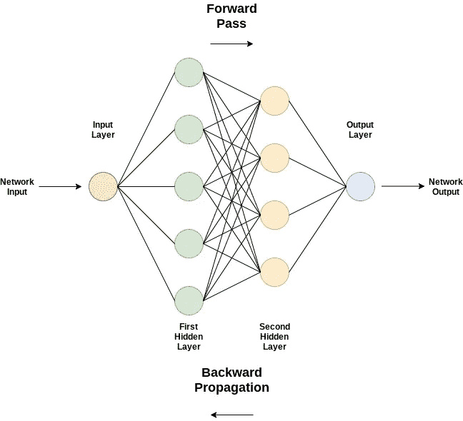

“神经网络图”

## 深度学习

简而言之，深度学习是一种机器学习方法，它超越了可能只需要一两层学习的更小的学习方法，这可能被称为*浅层学习。*但是，深度学习是一层层的学习。代表这些层的模型被称为*神经网络*，其名称源于对*神经生物学*的研究，但不要混淆，因为它实际上不是一个模拟大脑功能的网络。神经网络有许多不同的形式，但我们将只关注我们的迁移学习中的一种，即*卷积神经网络。*

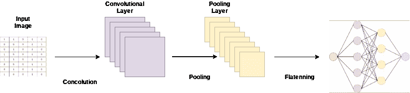

“卷积过程”

> 那么什么是卷积神经网络呢？

卷积神经网络只是训练网络(模型)以给出精确分类的另一种方法。在所有其他神经网络中，卷积神经网络在计算机视觉学习方面表现出色。CNN 或 covnets 的惊人之处在于，它们从图像中学习的模式是平移不变的，这意味着如果它们在图像的角落中找到一个模式，它们就会在任何不同的图像角落中识别出相同的模式，而常规网络必须一次又一次地重新学习它。Covnet 还能够学习模式的空间层次，这意味着 cov net 的每一层都将学习不同的东西。第一层可以学习小模式，下一层可以学习作为第一层特征的较大模式。这些特征是如何通过*卷积函数获得的。*

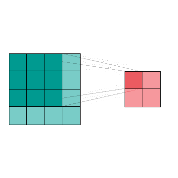

“卷积运动的 gif 图”，Narges Khatami，来自[维基共享资源](https://commons.wikimedia.org/wiki/File:Valid-padding-convolution.gif)

## 卷积

卷积函数用于获得卷积层的特征图(特征矩阵)。在基线上，covnets 已经配置了由一个*内核*组成的权重。核用于从输入图像(输入层)中获得独特的特征，就像它可以用于收集输入图像的锐度、边缘或收集关于如何检测边缘的信息一样。这个函数可以表示为 n*n，这是一个包含许多唯一值的矩阵。内核*在输入图像的顶部进行*(滑动和相乘)，假设输入图像是(10，10)，内核是(3，3)。第一张幻灯片(stride)将在输入图像的左上角乘以 9 个像素，以在称为特征图的新矩阵的左上角产生单个像素的输出。

更新:第二次乘法应该是 4 * 2 = 8，用 8 代替 1 的乘积，得到所有乘积的和。

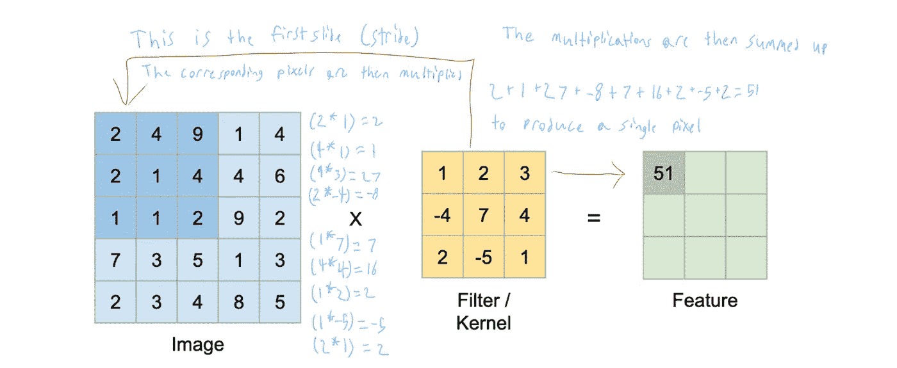

由 [Krut Patel](/convolution-neural-networks-a-beginners-guide-implementing-a-mnist-hand-written-digit-8aa60330d022) 从[走向数据科学](https://towardsdatascience.com/)2019；詹姆斯·纳尔逊注释，2020 年。

当内核像这样滑过输入图像时，这种乘法继续进行。

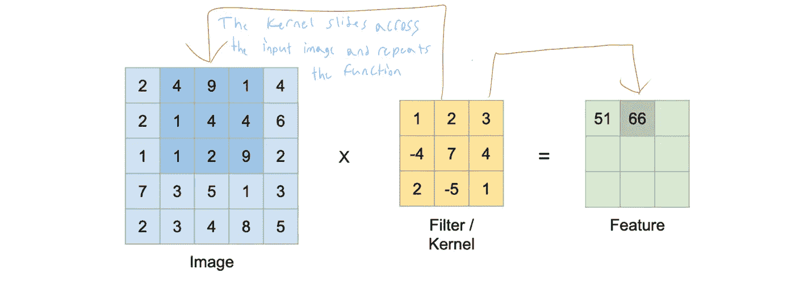

由 [Krut Patel](/convolution-neural-networks-a-beginners-guide-implementing-a-mnist-hand-written-digit-8aa60330d022) 从[走向数据科学](https://towardsdatascience.com/)2019；詹姆斯·纳尔逊注释，2020 年。

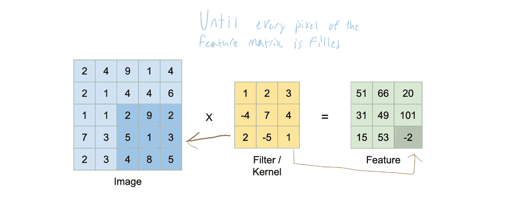

由 [Krut Patel](/convolution-neural-networks-a-beginners-guide-implementing-a-mnist-hand-written-digit-8aa60330d022) 从[走向数据科学](https://towardsdatascience.com/)2019；詹姆斯·纳尔逊注释，2020 年。

这个*连续的*过程不会停止，直到整个特征矩阵已经被这些卷积值填充，并且一旦特征矩阵完成，它就被堆叠在卷积层内。如果网络被设计成这样，则另一个内核将产生具有相同输入图像的另一个特征矩阵，以将下一个特征矩阵存储在相同的卷积层中。

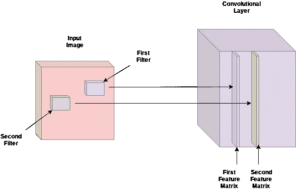

“制作特征矩阵时会发生什么”

> 简而言之，卷积神经网络的训练是关于定位每个核的所有正确值，以便当输入图像通过各层时，它将激活最后一个输出层上的不同神经元，以预测和准确分类图像。

## 什么是迁移学习，它有什么帮助？

迁移学习让每个人的生活变得更轻松、更美好。尽管从头开始创建卷积神经网络很有趣，但它们可能有点贵并且耗费大量*计算*能力。因此，为了减少网络所需的功率量，我们使用转移学习，这是已经在另一个图像上经过训练的*预训练*权重，以便提高我们网络的性能。使用预训练模型是一个最佳选择，因为它们已经在数以百万计的其他图像上进行配置和训练，这些图像由数千个类别组成，每次持续多天，以提供我们所需的高性能预训练权重，以便轻松训练我们自己的网络(Aditya Ananthram，2018)。

# 实际应用

现在，为了展示迁移学习能力的实际应用，我将介绍所使用的数据、选择的预训练模型、模型架构，然后是代码。


“意大利的一个农贸市场替身”，作者是散养农场的梅里泽

## 数据的描述

[数据集](https://www.kaggle.com/moltean/fruits)包含 81，104 张不同水果和蔬菜的图像，由每张水果和蔬菜图像的 120 个唯一分类组成。图像的总数被分成训练和测试数据集。训练数据集包含 60，486 幅图像，测试数据集是 20，618 幅图像。

所有图像的大小都是 100x100 像素，是用罗技 C920 相机收集的，该相机用于拍摄水果/蔬菜(Mihai Oltean，2019)。所有的水果和蔬菜都被种植在一个装有低速马达的轴内，在那里它们被记录下来，每一个持续时间为 20 秒。水果和蔬菜测试图像是用 5X 智能手机拍摄的。

## 模型


“一个‘图腾’旋转的图像。你还在做梦吗？”照片由[现代灵感的灰烬](https://unsplash.com/@modernafflatusphotography?utm_source=unsplash&utm_medium=referral&utm_content=creditCopyText)在 [Unsplash](https://unsplash.com/@modernafflatusphotography?utm_source=unsplash&utm_medium=referral&utm_content=creditCopyText) 上拍摄

选择的迁移学习模型叫做 [InceptionV3](https://www.mathworks.com/help/deeplearning/ref/inceptionv3.html) 。该模型是一个卷积神经网络，在架构上设计为 48 层深度，对 299×299 的图像形状进行训练。最初的 Inception 架构网络被称为“GoogLeNet”，这是一个 27 层深度卷积神经网络，早在 2014 年就已建立(Shaikh，2018)。该模型的名称来自克里斯托弗·诺兰导演的电影“盗梦空间”，基于深入梦境的概念“梦中的梦”，转化为卷积神经网络中的卷积神经网络。

GoogLeNet 设计背后的想法是消除在处理更深层次的神经网络时经常发现的过度拟合问题。当数据集太小并且正在大型神经网络中进行训练时，通常会发生过度拟合，过度拟合带来的问题是对模型的验证准确性(测试准确性)的错误陈述。测试准确性是衡量训练好的网络准确预测它没有看到的图像的精确度。设计一个巨大的网络来产生这种准确性的解决方案是创建一个稀疏连接的神经网络来代替完全连接的神经网络(Shaikh，2018)，这就是为什么 GoogLeNet 模型在 2014 年以 80%以上的预测准确性赢得了 ImageNet 视觉识别挑战。

## 模型架构

InceptionV3 模型连接到底部的两个完全连接的层，但在此连接之前，其维度从 3D 减少到 1D，具有[全球平均池 2D](https://tensorspace.org/html/docs/layerGlobalPooling2d.html) 。汇集还将为每个特征矩阵输出一个响应。在汇集之后，架构的下一层是具有 512 个单元(神经元)的第一密集隐藏层，其将连接到具有 10 个神经元的最终输出层，以匹配水果和蔬菜类的数量。这就是 InceptionV3 架构的样子。

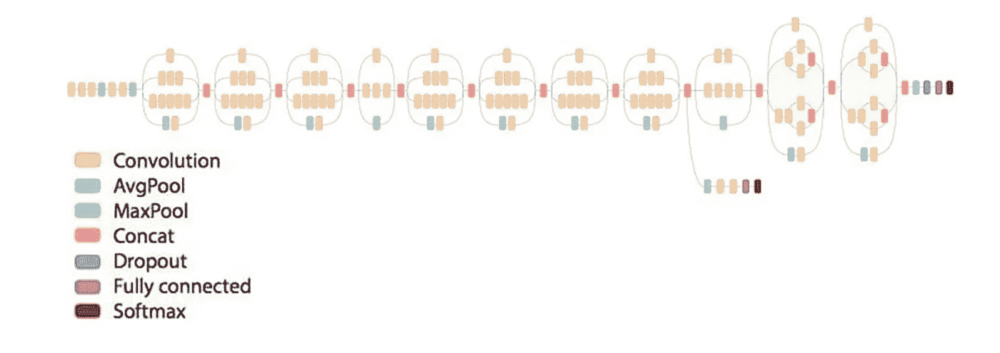

英特尔[的](https://www.intel.com/content/www/us/en/homepage.html) [Milton-Barker Adam](https://software.intel.com/en-us/articles/inception-v3-deep-convolutional-architecture-for-classifying-acute-myeloidlymphoblastic) 的“预训练 InceptionV3 模型的架构设计”

这是连接到架构的底层全连接层的样子。

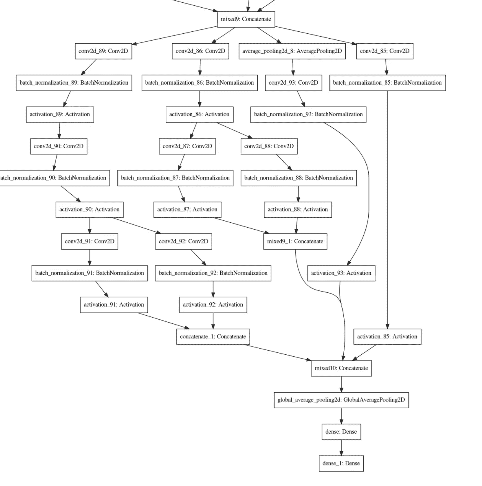

“附加到完全连接的层的 InceptionV3 模型的底层架构布局”

还值得一提的是，微调这些预先训练的模型以及与它们相关联的权重。我可以从模型中选择我想要使用的权重，它可以是上半部分、下半部分、中间部分，或者我可以冻结所有权重。这样做意味着我冻结的预训练模型的任何部分都不会是可以为我正在制作的模型更新的可训练权重。我还可以选择模型被训练的图像的权重，但是在这个例子中，通过反复试验，我选择不冻结权重。我对 InceptionV3 的实现将使用在 [ImageNet](http://www.image-net.org/) 上预先训练的权重。“ImageNet 是一个根据 [WordNet](http://wordnet.princeton.edu/) 层次结构(目前只有名词)组织的图像数据库，其中层次结构的每个节点都由成百上千的图像描述。目前，我们平均每个节点有超过 500 张图像。”(《影像网》，2017 年)

# 最后是代码

现在，您已经对数据集的外观和模型架构有了一个概念，是时候执行了。

## 准备数据和训练网络

**加载库。**

先做最重要的事情；我们必须加载必要的库。加载库时，确保导入所有必需的模块，以便我们可以准备数据和训练模型。

```
*# read in libraries*
import tensorflow as tf
from tensorflow.keras import backend, models, layers, optimizers
import numpy as np
from tensorflow.keras.layers import GlobalAveragePooling2D
from tensorflow.keras.callbacks import EarlyStopping
from sklearn.model_selection import train_test_split
from tensorflow.keras.utils import plot_model
from IPython.display import display
from PIL import Image
from tensorflow.keras.preprocessing.image import ImageDataGenerator
import os, shutil
from tensorflow.keras.models import Model
np.random.seed(42)
```

**加载数据并准备好。**

接下来，为了准备数据，我们需要用 ImageDataGenerator 设置一个 train_datagen 和 test_datagen。然后，使用这些生成器调整训练数据和测试数据的图像大小，以匹配预训练模型的像素图像输入。以确保神经网络不会学习不相关的模式，并反过来提高整体性能。

```
*# Specify the base directory where images are located.*
base_dir = '/kaggle/input/fruits/fruits-360/' *# Specify the traning, validation, and test dirrectories.* 
train_dir = os.path.join(base_dir, 'Training')
test_dir = os.path.join(base_dir, 'Test')*# Normalize the pixels in the train data images, resize and augment the data.*
train_datagen = ImageDataGenerator(
    rescale=1./255,*# The image augmentaion function in Keras*
    shear_range=0.2,
    zoom_range=0.2, *# Zoom in on image by 20%*
    horizontal_flip=True) *# Flip image horizontally* *# Normalize the test data imagees, resize them but don't augment them*
test_datagen = ImageDataGenerator(rescale=1./255) train_generator = train_datagen.flow_from_directory(
    train_dir,
    target_size=(299, 299),
    batch_size=16,
    class_mode='categorical')test_generator = test_datagen.flow_from_directory(
    test_dir,
    target_size=(299, 299),
    batch_size=16,
    class_mode='categorical')
```

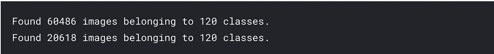

**准备 InceptionV3 模型**

既然已经准备好了图像，现在是时候导入并设置迁移学习的预训练 InceptionV3 模型了。

```
*# Load InceptionV3 library*
from tensorflow.keras.applications.inception_v3 import InceptionV3*# Always clear the backend before training a model*
backend.clear_session()*# InceptionV3 model and use the weights from imagenet*
conv_base = InceptionV3(weights = 'imagenet', *#Useing the inception_v3 CNN that was trained on ImageNet data.* 
                  include_top = False)
```

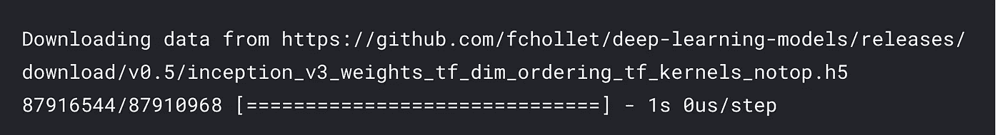

**创建一个功能 API 模型。**

现在，让我们将预训练的 InceptionV3 模型权重与密集层(完全连接的层)相结合，并减少两者之间的模型维度。

```
*# Connect the InceptionV3 output to the fully connected layers*
InceptionV3_model = conv_base.output
pool = GlobalAveragePooling2D()(InceptionV3_model)
dense_1 = layers.Dense(512, activation = 'relu')(pool)
output = layers.Dense(120, activation = 'softmax')(dense_1)
```

**显示功能 API 模型。**

为了了解模型架构，我们可以将功能 API 模型作为一个整体来显示，以直观地看到网络的深度。

```
*# Create an example of the Archictecture to plot on a graph*
model_example = models.Model(inputs=conv_base.input, outputs=output)
*# plot graph*
plot_model(model_example)
```

(模型太大，无法在介质上显示，请点击此[链接](https://www.kaggleusercontent.com/kf/33118903/eyJhbGciOiJkaXIiLCJlbmMiOiJBMTI4Q0JDLUhTMjU2In0..mgX558CwYG9r4t0UjFitlg.esQoE_Dfd7XoiQf77hP6ehN4l09q32dN7OKxnBEwLgFp3oTzbZFBOFgaIg-tcaEQpmmNM2ohDUmULXanHFDntIvPpj4tVjfL5YN1Njj2RqGmMEnORKhAKuRxci7hU73jdjzqmXW7Tcbclf4ML3NgZLCxrj84LNNP-ss8-vHiK-ZW018mzpughC89AdIuv2l8gd2_KisAAvsscU5EAb31E9v73Sm634BfyHmoc88k6DGJieDR4POQ0iODF-GISqnnayFbnKqv6Ph_DJa9_8Ck6Ky4KBYjCiCHNV_pdn6oIz35VCxNbvZgZjFlGQvqAEUffKxeuUslcSfQIwOtbw1OqMidPv6mWxSYe1E82aHIwdItGHdbkN_ITV891orlGhS0g4wkbaY4wqP7IxZyNXhGZz_59Mzh9-F3f3XoDmrGBQVQ-0JV1b_HM_S4TMmGqkpga-LGF8P2tfG1uZUdgl8Fei2spvlpNVTr4F4-HHfBFPO_dX3BDdA0JAGhmXF91jmYOorvdQG89JgqwoW-5bwCOjGU-XiBogu0B2qhmBup_v-aP76ob_NQBy4fWwcl39YnG_nPgOuvmLZVJBPmmvQFSyB0y06rbl4lZkT0B9E2lKAEaX_wgf7V9k1i19EM8ndPrHaHfSoljCpEEhqf9fwztvqg5VprUrCOG7YVHrAqie8.nNrlLJTieo9wt9JBoUHMog/__results___files/__results___15_0.png)查看)

**定义模型并编译它。**

为了让我们训练模型，我们需要定义函数式 API 模型，并使用类别交叉熵作为损失函数以及具有学习速率和动量参数的随机梯度下降来编译该模型。

```
*# Define/Create the model for training*
model_InceptionV3 = models.Model(inputs=conv_base.input, outputs=output)*# Compile the model with categorical crossentropy for the loss function and SGD for the optimizer with the learning*
*# rate at 1e-4 and momentum at 0.9*
model_InceptionV3.compile(loss='categorical_crossentropy',
              optimizer=optimizers.SGD(lr=1e-4, momentum=0.9),
              metrics=['accuracy'])
```

**查看 GPU 要使用的设备列表。**

现在我建议使用 GPU 来训练这个模型，因为 InceptionV3 模型有超过 2100 万个参数，在 CPU 上训练可能需要几天才能完成。如果你有一个 GPU，你可以使用你自己的，但我使用了 Kaggle 的 GPU 提供给他们的笔记本电脑，这花了我大约 20-25 分钟来完成培训。找到可用的 GPU 设备，以便加快训练过程。

```
*# Import from tensorflow the module to read the GPU device and then print*from tensorflow.python.client import device_lib
print(device_lib.list_local_devices())
```

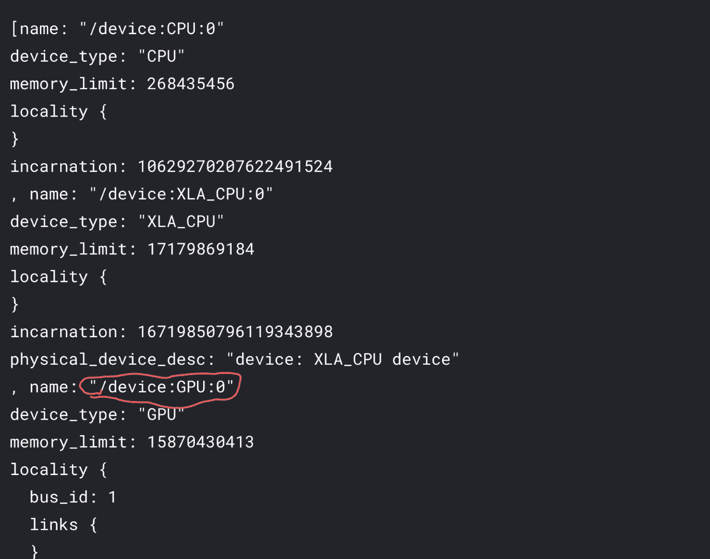

**训练模型。**

在找到要使用的 GPU 后，我们将把它合并到我们的代码中，最终使用 train_generator 为训练数据训练模型，并将 validation_data 参数设置为 test_generator。

```
*# Execute the model with fit_generator within the while loop utilizing the discovered GPU*
import tensorflow as tf
with tf.device("/device:GPU:0"):
    history = model_InceptionV3.fit_generator(
        train_generator,
        epochs=5,
        validation_data=test_generator,
        verbose = 1,
        callbacks=[EarlyStopping(monitor='val_accuracy', patience = 5, restore_best_weights = True)])
```

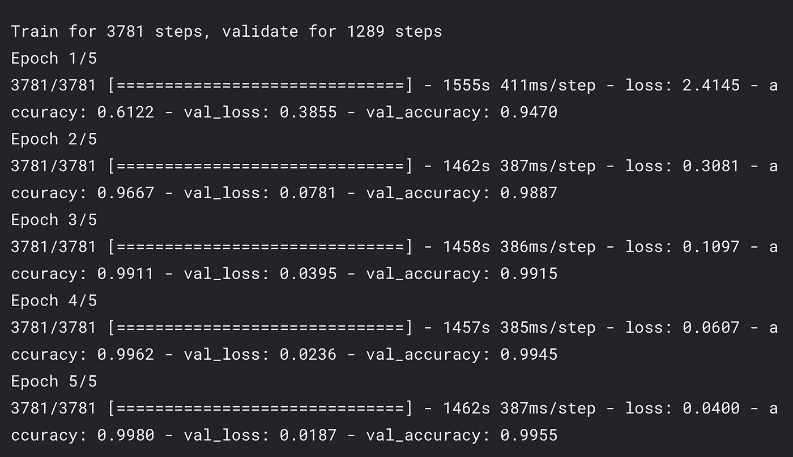

99%的验证准确性和 0.0187 的损失是非常好的。

**显示模型的测试精度和测试损失值**

现在，让我们通过绘制各个时期的训练精度/验证精度和训练损失/验证损失来看看我们的模型是什么样子，然后打印最终的测试精度和测试损失。

```
*# Create a dictionary of the model history* 
import matplotlib.pyplot as plt
history_dict = history.history
loss_values = history_dict['loss']
val_loss_values = history_dict['val_loss']
acc_values = history_dict['accuracy']
val_acc_values = history_dict['val_accuracy']
epochs = range(1, len(history_dict['accuracy']) + 1)*# Plot the training/validation loss*
plt.plot(epochs, loss_values, 'bo', label = 'Training loss')
plt.plot(epochs, val_loss_values, 'b', label = 'Validation loss')
plt.title('Training and validation loss')
plt.xlabel('Epochs')
plt.ylabel('Loss')
plt.legend()
plt.show()*# Plot the training/validation accuracy*
plt.plot(epochs, acc_values, 'bo', label = 'Training accuracy')
plt.plot(epochs, val_acc_values, 'b', label = 'Validation accuracy')
plt.title('Training and validation accuracy')
plt.xlabel('Epochs')
plt.ylabel('Accuracy')
plt.legend()
plt.show() *# Evaluate the test accuracy and test loss of the model*
test_loss, test_acc = model_InceptionV3.evaluate_generator(test_generator)print('Model testing accuracy/testing loss:', test_acc, " ", test_loss)
```

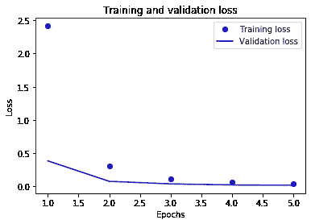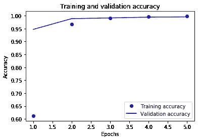

## 结果分析

对 120 类果蔬图像的准确预测结果表明，测试准确率为 99%，损失值为 1.8%。损失价值是衡量我们的产出与我们的期望之间的距离。训练分 5 个阶段进行，每个阶段大约需要 20-25 分钟，在 ka ggle GPU 的帮助下可以达到这一精度，从而加快了整个过程。训练数据是一个 3781 步的过程(迭代)，每 16 个样本取一批数据，向前和向后传播给我们一遍。一遍等于一次迭代。

## 结论

总之，迁移学习是训练数据集识别和分类图像的一种非常有效的方法。它允许快速设置，而无需从头开始详细设计卷积神经网络架构，并且它利用预训练模型的先前训练来提供高精度。你可以去我项目的 Kaggle [笔记本](https://www.kaggle.com/jnelson790612/fruit-360-transfer-learning)了解更多信息。

# 参考

阿迪蒂亚·阿南瑟拉姆。(2018 年 10 月 17 日)。Keras 中使用迁移学习的初学者深度学习。2020 年 4 月 24 日检索，来自 Medium 网站:[https://towards data science . com/keras-transfer-learning-for-初学者-6c9b8b7143e](/keras-transfer-learning-for-beginners-6c9b8b7143e)

f .谢赫(2018 . 10 . 18)。从头开始理解 Inception 网络(带 Python 代码)。2020 年 5 月 7 日检索，来自 Analytics Vidhya 网站:[https://www . Analytics vid hya . com/blog/2018/10/understanding-inception-network-from-scratch/](https://www.analyticsvidhya.com/blog/2018/10/understanding-inception-network-from-scratch/)

f . chollet(2018)。*用 Python 进行深度学习*。庇护岛(纽约，州联合):曼宁，警察。

文件:Valid-padding-convolution.gif —维基共享。(2018 年 7 月 6 日)。2020 年 5 月 6 日检索，来自 wikimedia.org 网站:[https://commons . wikimedia . org/wiki/File:Valid-padding-convolution . gif](https://commons.wikimedia.org/wiki/File:Valid-padding-convolution.gif)

获取蓝色背景的人脑智能概念的免费库存照片在线|下载最新免费图片和免费插图。(2020).2020 年 5 月 9 日检索，来自 freerangestock.com 网站:[https://freerangestock . com/photos/65677/concept-of-intelligence-with-human-brain-on-blue-background . html](https://freerangestock.com/photos/65677/concept-of-intelligence-with-human-brain-on-blue-background.html)

在线获取意大利水果和蔬菜供应商的免费图片|下载最新免费图片和免费插图。(2020).检索于 2020 年 5 月 9 日，来自 freerangestock.com 网站:[https://freerangestock . com/photos/37652/fruit-and-vegetables-vendor-Italy . html](https://freerangestock.com/photos/37652/fruit-and-vegetables-vendor-italy.html)

https://github.com/syt123450,的 syt123450。(2020).图层 GlobalPooling2d。2020 年 5 月 6 日检索，来自 Tensorspace.org 网站:【https://tensorspace.org/html/docs/layerGlobalPooling2d.html 

ImageNet。(2017).2020 年 5 月 7 日检索，来自 Image-net.org 网站:【http://www.image-net.org/ 

克鲁特·帕特尔。(2019 年 9 月 8 日)。卷积神经网络-数据科学初学者指南。2020 年 4 月 24 日检索，来自 Medium 网站:[https://towards data science . com/convolution-neural-networks-a-beginners-guide-implementing-a-m NIST-hand-written-digit-8aa 60330d 022](/convolution-neural-networks-a-beginners-guide-implementing-a-mnist-hand-written-digit-8aa60330d022)

米哈伊·奥尔特安。(2020).水果 360。检索于 2020 年 5 月 6 日，来自 Kaggle.com 网站:[https://www.kaggle.com/moltean/fruits](https://www.kaggle.com/moltean/fruits)

米尔顿-巴克，A. (2019 年 2 月 17 日)。用于急性髓细胞/淋巴细胞白血病分类的 Inception V3 深度卷积架构。2020 年 5 月 6 日检索，来自 intel.com 网站:[https://software . Intel . com/en-us/articles/inception-v3-deep-convolutional-architecture-for-classification-acute-myeloid-lymphoblastic](https://software.intel.com/en-us/articles/inception-v3-deep-convolutional-architecture-for-classifying-acute-myeloidlymphoblastic)

普拉哈尔·甘尼什。(2019 年 10 月 18 日)。卷积核的类型:简化—面向数据科学。2020 年 4 月 24 日检索，来自 Medium 网站:[https://towardsdatascience . com/types-of-convolution-kernels-simplified-f 040 CB 307 c 37](/types-of-convolution-kernels-simplified-f040cb307c37)

Unsplash。(2020).现代灵感的灰烬。检索于 2020 年 5 月 9 日，来自 Unsplash.com 网站:[https://unsplash.com/@modernafflatusphotography](https://unsplash.com/@modernafflatusphotography)

可视面包屑。(2016).2020 年 4 月 27 日检索，来自 mathworks.com 网站:[https://www . mathworks . com/help/deep learning/ref/inceptionv3 . html](https://www.mathworks.com/help/deeplearning/ref/inceptionv3.html)

维基百科贡献者。(2020 年 5 月 2 日)。我，机器人(电影)。2020 年 5 月 5 日检索，来自维基百科网站:[https://en . Wikipedia . org/wiki/I，_Robot_(film)](https://en.wikipedia.org/wiki/I,_Robot_(film))