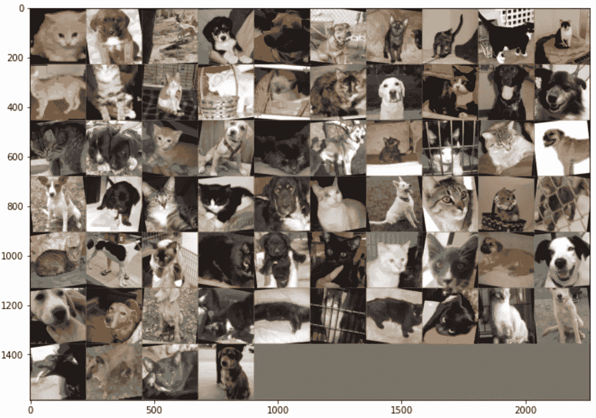
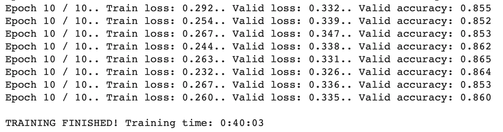
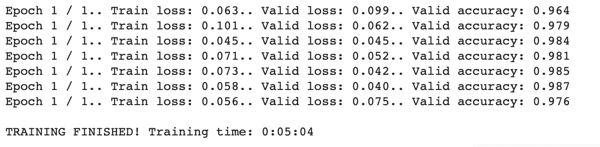

# 用 PyTorch 迁移学习

> 原文：<https://towardsdatascience.com/transfer-learning-with-pytorch-95dd5dca82a?source=collection_archive---------41----------------------->

## 以及为什么您不应该从头开始编写 CNN 架构

如今，训练深度学习模型，尤其是与图像识别相关的模型，是一项非常简单的任务。有很多原因可以解释为什么你不应该过分强调架构，主要是有人已经为你做了这一步。至于其他的，你得继续读下去。


由 [Unsplash](https://unsplash.com?utm_source=medium&utm_medium=referral) 上的 [drmakete 实验室](https://unsplash.com/@drmakete?utm_source=medium&utm_medium=referral)拍摄的照片

**源代码:** [Colab 笔记本](https://colab.research.google.com/drive/1ItUWnucWWg4Enxz6Xjz4Eb52Kpj1f3HA?usp=sharing)

如今，作为一名工程师，你唯一应该关注的是**数据准备**——在深度学习的世界中，这个术语概括了数据收集、加载、规范化和扩充的过程。

今天的议程很简单——解释什么是迁移学习以及如何使用它，然后是模型培训的实际示例，包括有无预培训架构。

听起来很简单，所以让我们直入主题吧！

# 数据集下载和基本准备

先说进口。这里我们有常见的嫌疑人，如 *Numpy* 、 *Pandas* 和 *Matplotlib* ，但也有我们最喜欢的深度学习库——*py torch*——以及它所提供的一切。

```
import os
import numpy as np
import pandas as pd
import matplotlib.pyplot as plt
from datetime import datetimeimport torch
import torch.nn as nn
import torch.nn.functional as F
from torch.utils.data import DataLoader
from torchvision.utils import make_grid
from torchvision import models, transforms, datasets
```

我们正在用 **Colab** 或者更准确地说是 Colab Pro 编写这段代码，所以我们将利用 GPU 的能力进行训练。如果您不知道 Colab 是什么，或者想知道升级到 Pro 版本是否值得，请随时查看这些文章:

[](/google-colab-how-does-it-compare-to-a-gpu-enabled-laptop-851c1e0a2ca9) [## Google Colab:它与支持 GPU 的笔记本电脑相比如何？

### Colab 简介、运行时、性能比较…以及疑难解答

towardsdatascience.com](/google-colab-how-does-it-compare-to-a-gpu-enabled-laptop-851c1e0a2ca9) [](/colab-pro-is-it-worth-the-money-32a1744f42a8) [## Colab Pro:物有所值吗？

### 10 美元有多大作用？我们做了测试。你做阅读。

towardsdatascience.com](/colab-pro-is-it-worth-the-money-32a1744f42a8) 

因为我们是在 GPU 上训练，而这可能不适合你，所以我们需要一个健壮的方法来处理这个问题。这里有一个标准方法:

```
device = torch.device(‘cuda:0’ if torch.cuda.is_available() else ‘cpu’)
device**>>> device(type=’cuda’, index=0)**
```

如果你正在进行 cpu 方面的培训，它应该会显示类似于 **type='cpu'** 的内容，但是因为 Colab 是免费的，所以没有必要这样做。

现在进入**数据集**。为此，我们将使用[狗或猫](http://files.fast.ai/data/dogscats.zip)数据集。它有大量不同大小的图像，我们将在后面处理。现在我们需要下载并解压它。方法如下:

```
%mkdir data
%cd /content/data/
!wget [http://files.fast.ai/data/dogscats.zip](http://files.fast.ai/data/dogscats.zip)!unzip dogscats.zip
```

大约一分钟后，根据你的网速，数据集就可以使用了。现在，我们可以将它声明为一个数据目录——这不是必需的，但会节省我们一点时间。

```
DIR_DATA = ‘/content/data/dogscats/’
```

## 数据准备

第一部分的第一部分现在完成了。接下来，我们必须对训练和验证子集应用一些转换，然后用 **DataLoaders** 加载转换后的数据。以下是我们应用的转换:

*   随机旋转
*   随机水平翻转
*   调整到 224x224 大小—预训练体系结构需要
*   转换为张量
*   正常化

代码如下:

```
train_transforms = transforms.Compose([
    transforms.RandomRotation(10),
    transforms.RandomHorizontalFlip(p=0.5),
    transforms.Resize(224),
    transforms.CenterCrop((224, 224)),
    transforms.ToTensor(), 
    transforms.Normalize(
        mean=[0.485, 0.456, 0.406],
        std=[0.229, 0.224, 0.225]
    )
])valid_transforms = transforms.Compose([
    transforms.Resize(224),
    transforms.CenterCrop((224, 224)),
    transforms.ToTensor(),
    transforms.Normalize(
        mean=[0.485, 0.456, 0.406],
        std=[0.229, 0.224, 0.225]
    )
])
```

现在我们用数据加载器加载数据。这一步也很简单，您可能很熟悉:

```
train_data = datasets.ImageFolder(os.path.join(DIR_DATA, ‘train’), transform=train_transforms)
valid_data = datasets.ImageFolder(os.path.join(DIR_DATA, ‘valid’), transform=valid_transforms)torch.manual_seed(42)
train_loader = DataLoader(train_data, batch_size=64, shuffle=True)
valid_loader = DataLoader(valid_data, batch_size=64, shuffle=False)class_names = train_data.classes
class_names**>>> ['cats', 'dogs']**
```

如果我们现在对单个批次进行逆归一化并将其可视化，我们会得到这样的结果:



快速看一下上面的图像，就可以看出我们的转换工作符合预期。

数据准备部分现在已经完成，在下一部分，我们将声明一个定制的 CNN 架构，训练它，并评估性能。

# 定制建筑 CNN

对于这一部分，我们想做一些非常简单的事情——3 个卷积层，每个卷积层后面是 max-pooling 和 ReLU，然后是一个完全连接的层和一个输出层。

这是这个架构的代码:

```
class CustomCNN(nn.Module):
    def __init__(self):
        super().__init__()
        self.conv1 = nn.Conv2d(in_channels=3, out_channels=32, kernel_size=3, stride=1)
        self.conv2 = nn.Conv2d(in_channels=32, out_channels=64, kernel_size=3, stride=1)
        self.conv3 = nn.Conv2d(in_channels=64, out_channels=64, kernel_size=3, stride=1)
        self.fc1 = nn.Linear(in_features=26*26*64, out_features=128)
        self.out = nn.Linear(in_features=128, out_features=2) def forward(self, x):
        x = F.relu(self.conv1(x))
        x = F.max_pool2d(x, kernel_size=2, stride=2)
        x = F.relu(self.conv2(x))
        x = F.max_pool2d(x, kernel_size=2, stride=2)
        x = F.relu(self.conv3(x))
        x = F.max_pool2d(x, kernel_size=2, stride=2)
        x = x.view(-1, 26*26*64)
        x = F.relu(self.fc1(x))
        x = F.dropout(x, p=0.2)
        x = self.out(x)
        return F.log_softmax(x, dim=1)torch.manual_seed(42)
model = CustomCNN()
model.to(device)
```

在这里，我们可以定义一个优化器和标准，并准备好进行培训:

```
custom_criterion = nn.CrossEntropyLoss()
custom_optimizer = torch.optim.Adam(model.parameters(), lr=0.001)
```

因为你可以访问[源代码、](https://colab.research.google.com/drive/1ItUWnucWWg4Enxz6Xjz4Eb52Kpj1f3HA?usp=sharing)和 **train_model** 函数太长了，我们决定不把它放在这里。因此，如果您继续学习，请参考源代码。我们将为 10 个时期训练模型:

```
custom_model_trained = train_model(
    train_loader=train_loader,
    test_loader=valid_loader,
    model=model,
    criterion=custom_criterion,
    optimizer=custom_optimizer,
    epochs=10
)
```

一段时间后，获得的结果如下:



无论如何，结果并不可怕，但我们如何才能做得更好？转学为救。

# 迁移学习法

你可以很容易地在网上找到正式的定义。对我们来说，迁移学习意味着下载一个预制的架构，它是在 1M 以上的图像上训练的，并调整输出层，以便它可以根据你的需要分类许多类别。

因为我们这里只有猫和狗，所以我们需要将这个数字修改为 2。

现在，我们将下载预训练版本的 [ResNet101](https://en.wikipedia.org/wiki/Residual_neural_network) 架构，并使其参数不可训练——因为网络已经训练好了:

```
pretrained_model = models.resnet101(pretrained=True)for param in pretrained_model.parameters():
    param.requires_grad = False
```

太好了！让我们看看输出图层是什么样子的:

```
pretrained_model.fc**>>> Linear(in_features=2048, out_features=1000, bias=True)**
```

所以这个架构默认有 1000 个可能的类，但是我们只需要两个——一个用于猫，一个用于狗。以下是调整方法:

```
pretrained_model.fc = nn.Sequential(
    nn.Linear(2048, 1000),
    nn.ReLU(),
    nn.Dropout(0.5),
    nn.Linear(1000, 2),
    nn.LogSoftmax(dim=1)
)pretrained_model.to(device)
```

这就是我们要做的。

我们仍然需要定义一个优化器和一个标准，但是你知道怎么做:

```
pretrained_criterion = nn.CrossEntropyLoss()
pretrained_optimizer = torch.optim.Adam(pretrained_model.fc.parameters(), lr=0.001)
```

训练过程与定制架构相同，但是我们不需要这么多的纪元，因为我们已经知道权重和偏差的正确值。

```
pretrained_model_trained = train_model(
    train_loader=train_loader,
    test_loader=valid_loader,
    model=pretrained_model,
    criterion=pretrained_criterion,
    optimizer=pretrained_optimizer,
    epochs=1
)
```

一段时间后，获得的结果如下:



多神奇啊？不仅准确度提高了，而且我们还通过不训练太多纪元节省了大量时间。

现在你知道迁移学习能做什么，以及如何和为什么使用它。让我们在下一部分总结一下。

# 结论

这就是 PyTorch 最简单的迁移学习指南。当然，如果网络更深，定制模型的结果可能会更好，但这不是重点。重点是，没有必要强调多少层是足够的，以及最佳超参数值是多少。至少在大多数情况下是这样。

请务必尝试不同的架构，并随时在下面的评论部分告诉我们结果。

感谢阅读。

*喜欢这篇文章吗？成为* [*中等会员*](https://medium.com/@radecicdario/membership) *继续无限制学习。如果你使用下面的链接，我会收到你的一部分会员费，不需要你额外付费。*

[](https://medium.com/@radecicdario/membership) [## 通过我的推荐链接加入 Medium-Dario rade ci

### 作为一个媒体会员，你的会员费的一部分会给你阅读的作家，你可以完全接触到每一个故事…

medium.com](https://medium.com/@radecicdario/membership)