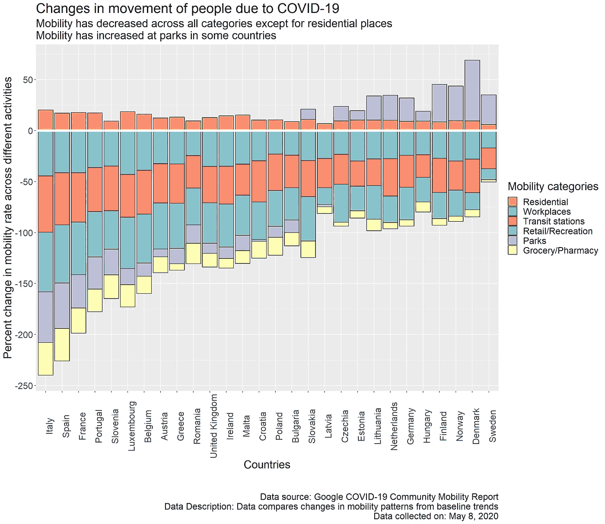
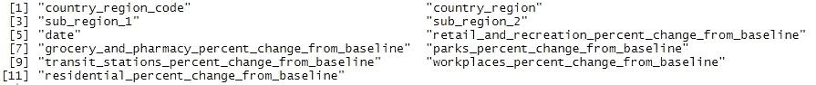
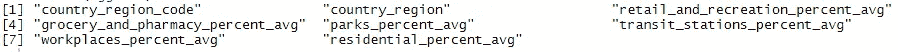
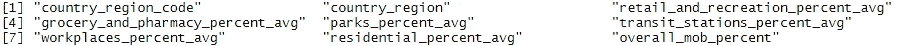
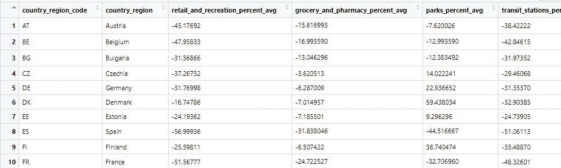
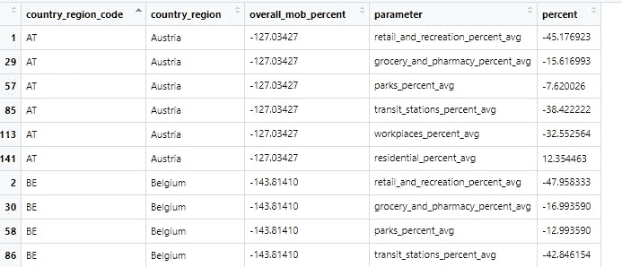
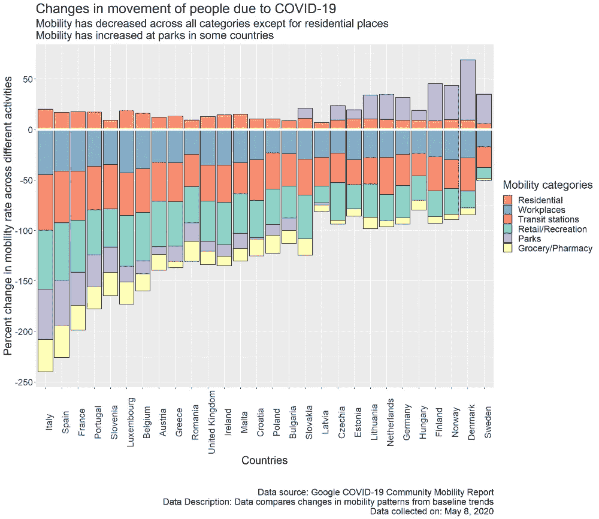
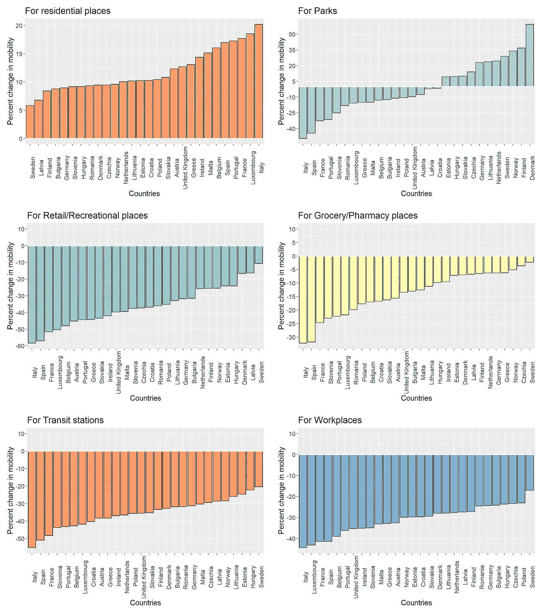

# 使用 ggplot2 转换数据并创建美丽的可视化效果

> 原文：<https://towardsdatascience.com/transform-data-and-create-stacked-bar-chart-using-ggplot2-6f2b3c3d12d6?source=collection_archive---------36----------------------->

创建可视化的目的是探索数据，发现隐藏的趋势和交流趋势。为了创造任何观想，我们需要一个我们希望探索的问题，我们需要可以帮助我们回答这个问题的数据。我们要探讨的问题是“新冠肺炎事件如何改变了人们的流动模式？”我们将使用的数据比较了因新冠肺炎而在不同地方发生的基线移动趋势的变化，这些数据由 Google [在这里](https://www.google.com/covid19/mobility/)提供。

遵循本教程将帮助您理解如何转换 R 中的数据并绘制堆积条形图。以下是最终结果:



新冠肺炎事件导致欧洲国家人口流动模式的变化

感兴趣的列的描述:

国家代码— "country_region_code"
国家名称— "country_region"
零售/娱乐空间变更—" Retail _ and _ Recreation _ percent _ avg "
杂货店/药房空间变更—"杂货店 _ and _ 药房 _percent_avg"
停车位变更— "parks_percent_avg"
公交站空间变更—" Transit _ stations _ percent _ avg "
工作场所空间变更— "workplaces_percent_avg "

如果您仅对 ggplot2 定制感兴趣，请跳至步骤 3。

我们的数据探索之旅开始了:

# **步骤 0:导入库**

```
# Importing librarieslibrary("dplyr")
library("magrittr")
library("plotly")
library("ggplot2")
library("tidyr")
library("cowplot")
```

# **第一步:读取数据**

```
# Reading downloaded csv
data <- read.csv(file = 'Global_Mobility_Report.csv')# Print column names in dataframe
colnames(data)
```



数据中的列

# **步骤 2:转换数据**

我们将为欧洲国家创建可视化，因此我们将不得不过滤掉其他国家。

```
# Required country codes
country_region_code <- c("GB","SK","SI","SE","RO","PT","PL","NO","NL","MT","LV","LU","LT","IT","IE","HU","HR","GR","FR","FI","ES","EE","DK","DE","CZ","BG","BE","AT")# Creating a subset using required country codes
subset = data[data$country_region_code %in% country_region_code ,]# Check countries in subset
unique(subset$country_region)
```


将包含在可视化中的国家

在我们的数据中，我们列出了每天的移动趋势变化，但我们希望绘制整个期间的变化，因此我们必须汇总数据。为此，我们将使用`country_region_code`进行分组，并为每个移动类别计算`mean`。

```
# Aggregating data to get average percent change
aggdata <- subset %>%group_by(country_region_code, country_region) %>%

  summarize(retail_and_recreation_percent_avg = mean(retail_and_recreation_percent_change_from_baseline, na.rm = TRUE),

            grocery_and_pharmacy_percent_avg = mean(grocery_and_pharmacy_percent_change_from_baseline, na.rm = TRUE),

            parks_percent_avg = mean(parks_percent_change_from_baseline, na.rm = TRUE),

            transit_stations_percent_avg = mean(transit_stations_percent_change_from_baseline, na.rm = TRUE),

            workplaces_percent_avg = mean(workplaces_percent_change_from_baseline, na.rm = TRUE),

            residential_percent_avg = mean(residential_percent_change_from_baseline, na.rm = TRUE))colnames(aggdata)
```



聚合数据中的列

我们将添加另一列`overall_mob_percent`,它将显示流动性百分比的总体变化，以便我们可以将受流动性变化影响最大的国家的数据排序为最小。

```
# Adding additional average change column
aggdata <- transform(aggdata, overall_mob_percent=(retail_and_recreation_percent_avg+grocery_and_pharmacy_percent_avg+      parks_percent_avg+transit_stations_percent_avg+    workplaces_percent_avg+residential_percent_avg))colnames(aggdata)
```



新列`总体百分比'

目前，我们的数据以宽格式存储，其中每一类流动性变化都有单独的列。



列形式的类别

在使用`gather`绘图之前，我们必须将数据转换成长格式。

```
# Gathering data
aggdata_tsfm <- gather(aggdata, key = "parameter", value = "percent", -country_region_code, -country_region, -overall_mob_percent)colnames(aggdata_tsfm)
```



列“参数”有类别,“百分比”有相关值

订购数据。

```
# Sort based on overall_mob_percent
aggdata_tsfm <- aggdata_tsfm[order(aggdata_tsfm$overall_mob_percent),]
```

将`country_region`转换为因子，以便在我们的绘图中保留顺序。

```
# Converting to factor for preserving sequence in our visualisation
aggdata_tsfm$country_region <- factor(aggdata_tsfm$country_region, 
 levels = unique(aggdata_tsfm$country_region))
```

# **第三步:创建堆积条形图**

这里，`aggdata_tsfm`是我们的数据框架，`x`轴是国家，`y`轴是移动值的百分比变化，我们将`fill`用不同的地点类别堆积条形图。我们已经将`position`设置为`stack`来创建一个堆叠条形图。您可以将`position`设置为`dodge`来创建并排条形图。为了给我们的条形块一个黑色轮廓，我们将`color`设置为黑色。

```
# Creating the plot
mainplot <- ggplot(aggdata_tsfm, aes(width = 0.9, fill=parameter, y=percent, x=country_region)) +
  geom_bar(position="stack", stat="identity", color="black")
```

添加水平线以区分-ve、+ve y 轴，因为我们的数据在 y 轴上有正值也有负值。

```
# Adding line to differentiate -ve and +ve y axis
mainplot <- mainplot + geom_hline(yintercept=0, color = “white”, size=2)
```

添加 y 刻度，因为默认情况下刻度数非常少。我们的刻度将从-250 增加到 100，增加 50。

```
# Adding y ticks
mainplot <- mainplot + scale_y_continuous(breaks = round(seq(-250, max(100), by = 50),1))
```

我们将定制我们的地块的图例，以改变颜色，标签和顺序。

您可以使用 [ColorBrewer](https://colorbrewer2.org/#type=sequential&scheme=BuGn&n=3) 为定性和定量数据提供漂亮的调色板，并为色盲人士进行了优化，而不必纠结于使用哪种调色板。

一旦我们选择了颜色，我们就可以通过设置`values`参数来使用它们。要更改图例中的标签名称，我们可以设置`labels`。为了改变标签的顺序，我们使用`breaks`来指定所需的顺序。

```
# Changes to legend
mainplot <- mainplot + scale_fill_manual(name="Mobility categories",values = c("retail_and_recreation_percent_avg" = "#8dd3c7", 
 "grocery_and_pharmacy_percent_avg" = "#ffffb3", 
 "parks_percent_avg" = "#bebada", 
 "transit_stations_percent_avg" = "#fb8072", 
 "workplaces_percent_avg" = "#80b1d3", 
 "residential_percent_avg" = "#fdb462"),

 labels=c("retail_and_recreation_percent_avg" = "Retail/Recreation", 
 "grocery_and_pharmacy_percent_avg" = "Grocery/Pharmacy", 
 "parks_percent_avg" = "Parks", 
 "transit_stations_percent_avg" = "Transit stations", 
 "workplaces_percent_avg" = "Workplaces", 
 "residential_percent_avg" = "Residential"),

 breaks=c("residential_percent_avg", "workplaces_percent_avg", 
 "transit_stations_percent_avg", 
 "retail_and_recreation_percent_avg", "parks_percent_avg", 
 "grocery_and_pharmacy_percent_avg"))
```

改变我们的标题。

```
# plot title
mainplot <- mainplot + ggtitle(“Changes in movement of people due to COVID-19”)
```

设置我们的情节的副标题和标题。

```
# plot subtitle, caption
mainplot <- mainplot + ggtitle(“Changes in movement of people due to COVID-19”)
```

设置 x 和 y 标签。

```
# Setting x and y labels
mainplot <- mainplot + xlab(“Countries”) + ylab(“Percent change in mobility rate across different activities”)
```

由于 x 轴有国家名称，我们将旋转文本以避免文本重叠。

```
# x axis markings rotated
mainplot <- mainplot + theme(axis.text.x = element_text(angle = 90))
```

更改文本大小以提高可读性。

```
# change text size
mainplot <- mainplot + theme(text = element_text(size=20))
```

现在我们可以画出我们开始时展示的图表。

```
# Plotting
mainplot
```



看着可视化，更容易从数据中得到推论，比如人们在住宅区的活动增加了。负流动性最小的地方是杂货店和药店，这表明这些地方的客流量仍在增加，但不像过去那样了。

如果您希望在一个网格中绘制多个图表，您可以使用`cowplot`的`plot_grid`轻松完成。图`resplo`、`parplot`、`recplot`、`groplot`、`traplot`和`worplot`是使用与上述步骤 3 中演示的相同方法创建的每个类别的不同图，我们将它们绘制在网格中。

```
# Plotting a grid of plots
plot_grid(resplot, parplot, recplot, groplot, traplot, worplot,
 ncol = 2, nrow = 3)
```



新冠肺炎事件导致欧洲国家人口流动模式的变化

我们已经看到了使用 ggplot2 创建强大的可视化是多么容易，以及如此多的定制你的情节的方法。我们几乎没有探索 ggplot2，它提供了如此多的东西。我强烈推荐探索 ggplot2 提供的其他图表和功能。

感谢阅读。