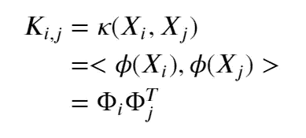
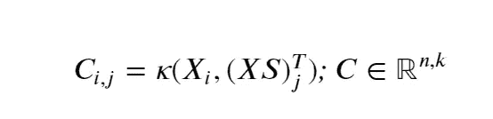
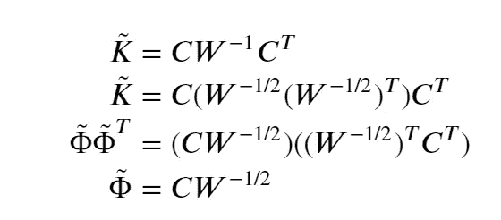

# 使用 Nyströ方法将数据转换到高维核空间

> 原文：<https://towardsdatascience.com/transform-data-to-high-dimensional-kernel-space-87d62b670e0f?source=collection_archive---------28----------------------->

## Nyströ方法将作为一种使核空间显式地可用于解决非线性问题的方法来介绍。

约书亚·索蒂诺在 [Unsplash](https://unsplash.com?utm_source=medium&utm_medium=referral) 上拍摄的照片

# 介绍

在机器学习领域，有许多算法，监督的(SVM，岭回归)和非监督的(k-means，PCA)，它们可以被内核化以将问题映射到更高维的内核空间。这有助于解决更复杂的问题，但也带来了对核矩阵的依赖性，这种依赖性与给定样本的数量成平方关系。对于具有大量样本的问题，这可能会非常耗费成本和内存，因此很难应用。

本文将介绍 Nyströ方法，这是一种通过计算低秩核近似来有效存储和计算核矩阵的方法。此外，本文将说明 Nyströ方法可用于将任何样本从特征空间映射到近似的核空间。将给出一个示例来演示内核映射的潜在应用和由此产生的优势。

本文的目的是展示使用 Nyströ方法的优势和机会，无论是作为后续分类的预处理步骤，还是作为提高基于内核的算法性能的一个选项。

# 内核基础知识的简短回顾

核函数使得能够在高维核空间中操作，而不需要显式地将特征空间𝑋X 映射到核空间φφ。这是一个优点，因为对于一些映射函数(𝜙(𝑥)ϕ(x ),内核空间中的最终维数可能变得无限大，因此，映射过程非常耗费成本，甚至根本不可能计算。

基于核的算法利用了某些函数可以在另一个空间中被表示为内积的事实，而不是使用函数𝜙(𝑥对样本进行显式映射。

或者反过来:对于某些函数𝜙(𝑥)，有函数𝜅(𝑥,𝑦)，这样𝜅(𝑥,𝑦)= 。因此，使用核给仅使用给定特征空间的内积/距离操作的算法带来了优势。

常见的内核函数𝜅(𝑥,𝑦有:

*   径向基函数核
*   多项式核
*   Sigmoid 内核

将核应用于给定的特征空间𝑋意味着必须计算包含𝜅(𝑥,𝑦结果的𝑛×𝑛核矩阵𝐾，使得

很明显，随着𝑛n.数量的增加，𝐾K 的大小呈二次方增加。因此，对于较大的数据集，计算可能会占用大量内存和时间。

# Nyströ方法简介

假设𝜅(𝑥,𝑦)是导致核空间的函数，其中核维数𝑑大于样本数𝑛n，那么𝐾的最大秩必定是𝑚𝑖𝑛(𝑛,𝑑)=𝑛.所以，对于φ中的𝑛独立样本，k 是满秩的。现在让我们考虑，并非所有的𝑑d 维度都是必需的，使用具有𝑘

使用 nyströ方法计算低秩核矩阵𝐾̃can:从 x 中随机抽取𝑘样本。设 XS 是 x 的子集，仅包含这些样本，因此

设(𝑘×𝑘)矩阵𝑊是在 k 中转置的 c 和 c 的重叠，则近似核可以表示为

这个公式的推导和更详细的描述可以在[1][2]中看到。

因此，可以使用(𝑛×𝑘)和(𝑘×𝑘)矩阵来保存整个近似核。因为𝑘通常选择得比𝑛小得多，这在内存效率方面带来了巨大的优势。此外，核函数只需应用𝑛×𝑘次数，这可以大大减少计算时间。

# 定义参数 k

选择𝑘的值总是在近似质量和计算时间之间进行权衡。在内核近似的整个领域中有许多最近的研究，以及关于如何最佳地估计𝑘或者如何最有效地采样𝑘值来计算 c 的一些想法[3][4][5]。这些方法要么试图保证特定的运行时间与最坏情况下的近似质量保证相结合，要么保证近似内核的某些统计性能。

在这里讨论这些方法超出了范围。考虑这一主题的论文，可以在参考文献中找到。

一般来说，应该选择𝑘，这样𝑑≤𝑘

# 将样本映射到近似核空间

出于某些原因，比如数据的可视化或者不能直接使用内核的模型的应用，显式地访问φ可能是有用的。为了这个目的，我们可以修改 nyströ公式，以具有从核矩阵内积到显式近似核空间φ̃.的有效映射过程

可以看出，仅使用一次矩阵乘法就可以实现到低秩核空间的映射。𝑊的必要分解可以使用 Cholesky 分解、奇异值分解或特征分解来完成。

关于这一点，通过在内存中保存𝑋𝑆，任何任意采样𝑥都可以映射到内核空间:

1.  计算𝑐，使𝑐[i]包含𝜅(𝑥,𝑋𝑆[i 的结果]))
2.  计算𝜙̃ (𝑥)=𝑐𝑊^(−1/2)

# 实验——解决核空间中的非线性问题

以下示例演示了如何使用 Nyströ方法将非线性问题映射到近似核空间。因此，RGB 内核将被近似，并且所获得的内核部分 c 和𝑊将被用于将给定的特征空间变换到内核空间。

首先，让我们创建一个非线性问题:为了可视化的目的，数据具有包括 75 个样本的二维特征空间。在给定的空间中，有两类以不可线性分离的方式排列。在下面的图中，这两个类以不同的颜色显示。

然后，我们来定义核函数，也就是 RBF 核。这个内核有一个参数是γ，通常设置为 1/(2𝜎，𝜎是𝑋.的方差

现在，nyströ映射应用于𝑋和𝑘=100.结果是φ̃与𝑘维度。

出于可视化的目的，我们使用 PCA 来提取 3 个最相关的特征(具有最高方差的维度)。得到的 3 个维度在散点图中可视化。

散点图显示，来自第三维(PCA)的附加信息是决定性的，使得给定的问题可以线性分离。

为了证实这个视觉结果，我们将对这个问题应用线性回归，首先在特征空间，其次在核空间。此外，我们将比较两个模型的准确度训练分数(定义为(𝑇𝑃+𝑇𝑁)/(𝑇𝑃+𝑇𝑁+𝐹𝑃+𝐹𝑁))。因为问题是非线性的，而回归只能解决线性问题，所以在特征空间中应用的模型肯定是不合适的，从而导致较低的准确度分数。这意味着，如果第二个模型实现了非常高的训练精度，则问题必须在核空间中是线性可解的。

特征空间中的线性回归模型仅达到约 10%的训练精度。不出所料，这个问题是由于它的非线性太复杂，无法通过简单的线性回归来解决，而且该模型非常不适合。相比之下，在更高维度空间中应用的相同模型导致 100%的准确度，这意味着每个单个样本都可以被模型正确识别。

# 摘要

Nyströ方法可用于以非常有效的方式计算和保存核矩阵。此外，由于 Nyströ方法带来的高效映射过程，它使所有分类器都可以使用内核的全部功能。因此，如果与基于 Nyströ的特征映射相结合，线性回归等简单易懂的分类器可用于解决复杂的非线性问题。

# 参考

[1][https://en . Wikipedia . org/wiki/Low-rank _ matrix _ approximations](https://en.wikipedia.org/wiki/Low-rank_matrix_approximations)

[2] Williams，C.K.I .和 Seeger，m .使用 Nystroem 方法加速内核机器。神经信息处理系统进展，2001

[3]亚历克斯·吉滕斯和迈克尔·马奥尼。重新审视 Nyströ方法以改进大规模机器学习。《第 30 届机器学习国际会议论文集》，第 567–575 页，2013 年。

[4]弗朗西斯·巴赫。低秩核矩阵近似的精确分析。《第 26 届学习理论会议论文集》，第 185-209 页，2013 年。

[5]艾哈迈德·阿拉维，迈克尔·马奥尼。具有统计保证的快速随机化核方法。arXiv:1411.0306，2015。