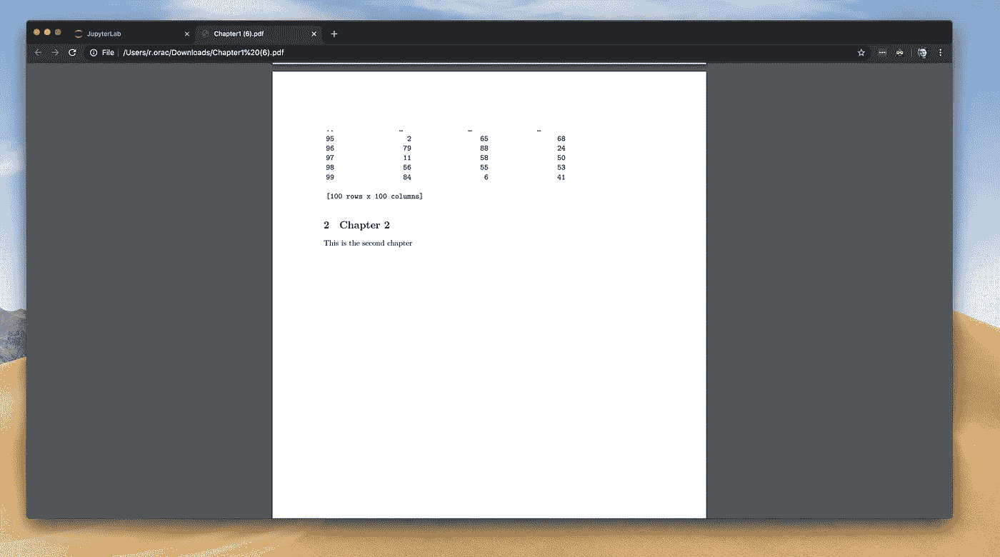
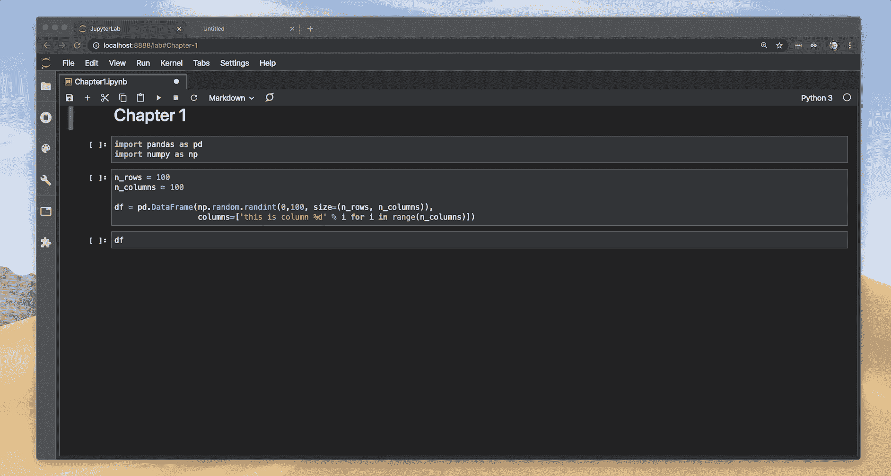
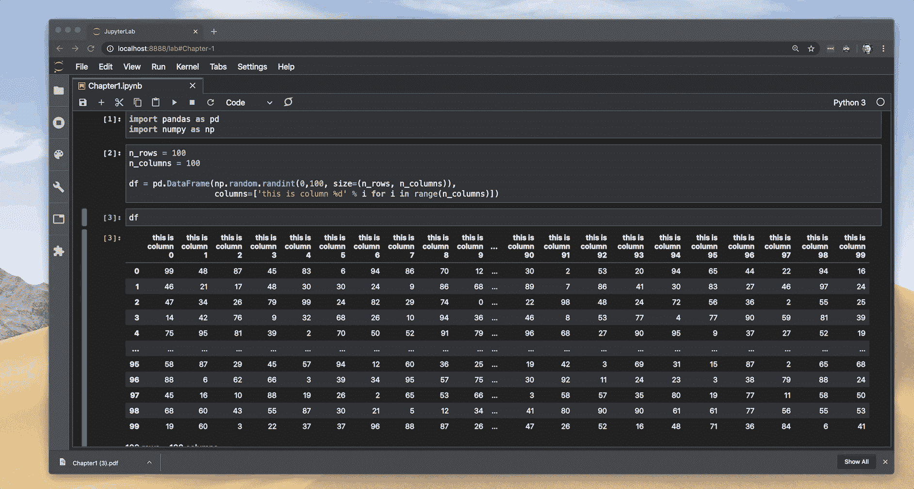
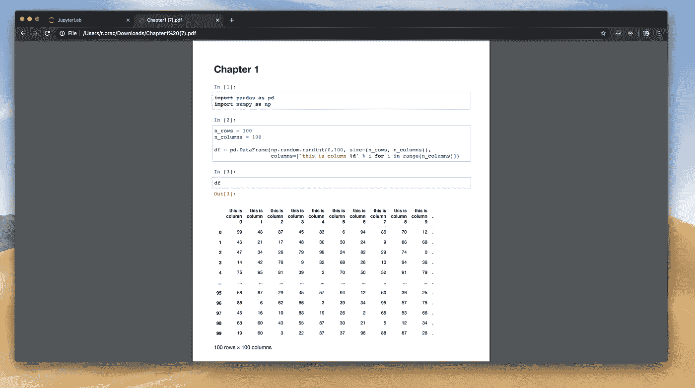
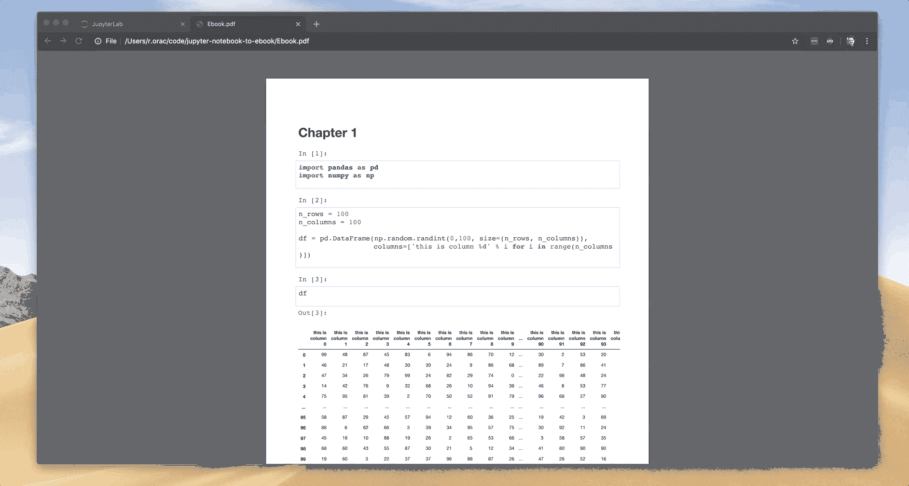
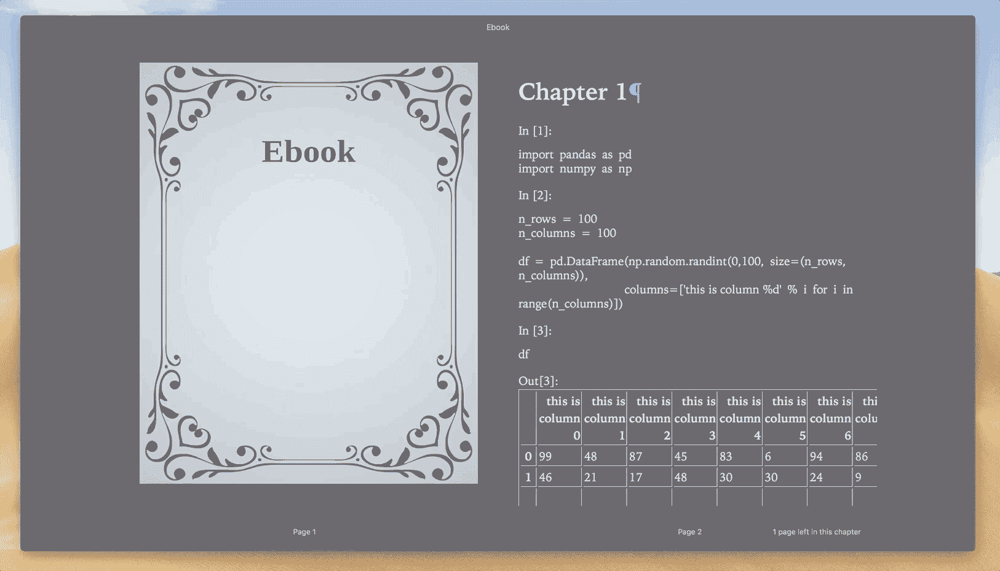

# 将 Jupyter 笔记本转变为电子书

> 原文：<https://towardsdatascience.com/transform-jupyter-notebook-to-an-ebook-ef3a9d32ac4f?source=collection_archive---------39----------------------->

将你的 Jupyter 笔记本转换成 PDF、EPUB 和 AWZ3 格式的精美电子书的一些技巧。不要像我一样花几个小时研究！


Kourosh Qaffari 在 [Unsplash](https://unsplash.com?utm_source=medium&utm_medium=referral) 上拍摄的照片

一个月前，我决定开始学习[，这是一门专注于数据科学实用方面的在线课程](https://datascienceisfun.net/)。在 Jupyter 笔记本上写一本电子书似乎是一个不错的选择，因为它提供了文本、可视化和代码的完美结合。虽然写一本电子书本身已经是一个挑战，但我在将笔记本转换成电子书格式时遇到了很多问题。这些技巧对技术作家和希望在电子阅读器上查看笔记本的数据科学家很有用。遵循这些建议，这样你就不会像我一样花几个小时去研究了！

[](https://github.com/romanorac/jupyter-notebook-to-ebook) [## romanorac/jupyter-笔记本到电子书

### 编译脚本将 Jupyter Notebook 转换成 PDF、EPUB 和 AWZ3 格式的精美电子书。编译…

github.com](https://github.com/romanorac/jupyter-notebook-to-ebook) 

**这里有几个你可能会感兴趣的链接:**

```
- [Labeling and Data Engineering for Conversational AI and Analytics](https://www.humanfirst.ai/)- [Data Science for Business Leaders](https://imp.i115008.net/c/2402645/880006/11298) [Course]- [Intro to Machine Learning with PyTorch](https://imp.i115008.net/c/2402645/788201/11298) [Course]- [Become a Growth Product Manager](https://imp.i115008.net/c/2402645/803127/11298) [Course]- [Deep Learning (Adaptive Computation and ML series)](https://amzn.to/3ncTG7D) [Ebook]- [Free skill tests for Data Scientists & Machine Learning Engineers](https://aigents.co/skills)
```

*上面的一些链接是附属链接，如果你通过它们进行购买，我会赚取佣金。请记住，我链接课程是因为它们的质量，而不是因为我从你的购买中获得的佣金。*

# 1.创建 Github 存储库

我建议你从一个专门的 Github 库开始，它将帮助你跟踪你的电子书的版本。Github 免费提供私有库，所以没有理由不使用它。JupyterLab 还有一个 Git 扩展，可以帮助您跟踪版本之间的变化:

[](/3-must-have-jupyterlab-2-0-extensions-41024fe455cc) [## 3 个必备的 JupyterLab 2.0 扩展

### JupyterLab 刚刚成为一个成熟的 IDE，具有代码辅助、调试和 Git 等功能——欢迎来到未来……

towardsdatascience.com](/3-must-have-jupyterlab-2-0-extensions-41024fe455cc) 

请确保将以下内容添加到。gitignore，这样您就不会意外地将不必要的文件推到您的 Git 存储库中:

```
*.csv
.DS_Store
.ipynb_checkpoints/
*.mov
*.pdf
*.html
*.azw3
*.epub
cpdf
```

# 2.在自己的笔记本中组织每一章

按章节组织笔记本中的内容，便于写作时专注于某个主题。它减少了干扰，也简化了对版本控制差异的审查。

以这种方式组织电子书还有另一个好处，这一点在最后变得很明显。电子书中的每一章都应该在新的一页开始，而不是在前一页的中间。



第二章从这一页的中间开始。

我花了几个小时寻找一种解决方案，在将 Jupyter 笔记本导出到 HTML 或 PDF 时，在章节之间添加分页符，但运气不好。

然后我想到了一个主意！将 Jupyter 笔记本中的每一章转换成 PDF，然后将它们合并成最终的 PDF。

# 3.不要用 Jupyter 的导出笔记本当 PDF

JupyterLab 有一个简洁的“将笔记本导出为 PDF”功能，起初看起来像是节省时间。JupyterLab 的导出功能不考虑 CSS，所以熊猫数据帧在 PDF 中是普通格式。



有很多列的 Dataframe 在 JupyterLab 看起来很棒，但是当我们把它导出到 PDF 时会发生什么？



当我们将笔记本导出为 PDF 时，一个包含许多列的数据框架会被分解到多个页面上。

我试图说服自己“出口”看起来没有那么糟糕，但我仍然不满意。在花了一些时间进行研究后，我尝试将笔记本导出为 HTML 格式，在 Chrome 浏览器中打开，并使用 Chrome 的保存为 PDF 功能。



Jupyter 笔记本导出为 HTML 格式，用 Chrome 浏览器保存为 PDF 格式。

啊哈！数据帧格式现在看起来更好了。

# 4.不要手动保存到 PDF

拥有多个章节并将每个章节导出为 HTML 并保存为 PDF 是一个繁琐的过程。我们能自动化它吗？

Chrome 有一个无头模式，所以我们可以从命令行保存 HTML 到 PDF。这在理论上应该行得通，但对我来说行不通。

```
chrome --headless --print-to-pdf=Chapter1.pdf --print-to-pdf-no-header Chapter1.html
```

尽管使用了-print-to-PDF-no-header 标志，但使用 Chrome 导出的 PDF 仍填充了页眉和页脚。

经过研究，我发现了 [wkhtmltopdf](https://wkhtmltopdf.org/) 工具，它使用 Qt WebKit 渲染引擎将 HTML 渲染为 pdf 和各种图像格式。在 macOS 上，您可以使用 Brew 安装它。该工具使我们能够自定义 CSS 和边距。

Chrome 浏览器生成了一个不错的 PDF，所以我从 Chrome 中提取 CSS 格式并保存到一个 custom.css 文件中，这是 [wkhtmltopdf](https://wkhtmltopdf.org/) 工具默认采用的:

```
div#notebook {
    font-size: 18px;
    line-height: 26px;
}img {
    max-width: 100% !important;
    page-break-inside: avoid;
}tr, img {
    page-break-inside: avoid;
}*, *:before, *:after {
    background: transparent !important;
    box-shadow: none !important;
    text-shadow: none !important;
}p, h2, h3 {
    orphans: 3;
    widows: 3;
    page-break-inside: avoid;
}*, *:before, *:after {
    page-break-inside: avoid;
    background: transparent !important;
    box-shadow: none !important;
    text-shadow: none !important;
}*, *:before, *:after {
    page-break-inside: avoid;
    background: transparent !important;
    box-shadow: none !important;
    text-shadow: none !important;
}
```

获取 HTML 并输出 pdf 的 wkhtmltopdf 命令:

```
wkhtmltopdf — enable-internal-links -L 10mm -R 9.5mm -T 10mm -B 9.5mm Chapter1.html Chapter1.pdf
```

# 5.合并 pdf

我使用 [cpdf](https://community.coherentpdf.com/) 工具将 pdf 合并成最终的 PDF。我下载了 cpdf 工具，放在 Jupyter 笔记本的文件夹里。要合并 pdf，请使用以下命令:

```
./cpdf Chapter1.pdf Chapter2.pdf -o Ebook.pdf
```



最终合并的 PDF。

# 6.将 Jupyter 笔记本转换为 EPUB 格式

我们把每一章都放在一个单独的笔记本里。让我们用 nbmerge 工具合并笔记本。可以用 pip 安装:pip install nbmerge。

```
nbmerge Chapter1.ipynb Chapter2.ipynb  > Ebook.ipynb
```

JupyterLab 的“导出到 HTML”命令也可以导出 CSS，这对于 PDF 来说很好，但是对于电子书来说就有问题了，因为它太复杂了。Jupyter 带有 nbconvert 工具，可以导出不同的格式。要将笔记本导出为不带 CSS 的 HTML 格式:

```
jupyter nbconvert --to html Ebook.ipynb --template=basic
```

我们需要安装 [Calibre](https://calibre-ebook.com/) ，将 HTML 转换成 EPUB。如果你是一个狂热的电子书读者，我敢肯定你以前见过 Calibre。Calibre 是一个用于电子书管理的跨平台开源套件。

运行以下命令将 HTML 转换为 EPUB 和 AWZ3(命令在 macOS 上有效):

```
/Applications/calibre.app/Contents/MacOS/ebook-convert Ebook.html Ebook.epub
/Applications/calibre.app/Contents/MacOS/ebook-convert Ebook.html Ebook.azw3
```



在苹果 iBooks 上阅读 EPUB 电子书。

# 7.让我们把所有的东西放在一起

作为软件开发人员，我们将事情自动化。我编写了一些可以很好地打包到 bash 脚本中的命令。因此，每当我在 Jupyter 笔记本中进行更改时，我都可以运行编译脚本来创建电子书的新版本:

```
#!/bin/bashnbmerge Chapter1.ipynb Chapter2.ipynb  > Ebook.ipynbjupyter nbconvert --to html Ebook.ipynb --template=basic/Applications/calibre.app/Contents/MacOS/ebook-convert Ebook.html Ebook.epub/Applications/calibre.app/Contents/MacOS/ebook-convert Ebook.html Ebook.azw3jupyter nbconvert --to html Chapter1.ipynbjupyter nbconvert --to html Chapter2.ipynbwkhtmltopdf --enable-internal-links -L 10mm -R 9.5mm -T 10mm -B 9.5mm Chapter1.html Chapter1.pdfwkhtmltopdf --enable-internal-links -L 10mm -R 9.5mm -T 10mm -B 9.5mm Chapter2.html Chapter2.pdf./cpdf Chapter1.pdf Chapter2.pdf -o Ebook.pdf
```

我还用上面提到的命令创建了一个 Git 存储库:

[](https://github.com/romanorac/jupyter-notebook-to-ebook) [## romanorac/jupyter-笔记本到电子书

### 编译脚本将 Jupyter Notebook 转换成 PDF、EPUB 和 AWZ3 格式的精美电子书。编译…

github.com](https://github.com/romanorac/jupyter-notebook-to-ebook) 

# 在你走之前

在 [Twitter](https://twitter.com/romanorac) 上关注我，在那里我定期[发布关于数据科学和机器学习的](https://twitter.com/romanorac/status/1328952374447267843)。


由[考特尼·海杰](https://unsplash.com/@cmhedger?utm_source=medium&utm_medium=referral)在 [Unsplash](https://unsplash.com/?utm_source=medium&utm_medium=referral) 拍摄的照片