# 用熊猫改变现实

> 原文：<https://towardsdatascience.com/transform-reality-with-pandas-96f061628030?source=collection_archive---------12----------------------->

## 使用转置、融合、合并等功能重塑数据。

尼克·伍德在 [Unsplash](https://unsplash.com/s/photos/pandas?utm_source=unsplash&utm_medium=referral&utm_content=creditCopyText) 上的照片

# 熊猫让 python 变得简单

纯 python 是一种非常清晰的语言。但是熊猫真的让它变笨了。简化 python 脚本语言使得更复杂的编程变得更加容易。DataFrame 操作使数学、科学、探索、艺术和魔法变得简单而直观。图书馆是研究者最好的朋友。

> *熊猫*让我们可以更专注于研究，而不是编程。我们发现*熊猫*易学、易用、易维护。最重要的是，它提高了我们的生产力。”(* [*Roni Israelov，博士*](https://pandas.pydata.org/) *，投资组合经理，* [AQR 资本管理](https://www.aqr.com/))*

# *改变现实*

*数据科学项目的第一步是将数据集加载到 pandas 数据框架中，并使用 ***检查前五行。***(head())法，翻着白眼，不可置信地呻吟，并对数据集的作者缺乏远见感到绝望。他们不知道您需要列级聚合吗？在 Excel 中，这将是一场复制粘贴的噩梦。熊猫给你一条走出迷雾的路，非常聪明，可读性强。*

**

*照片由 [Ibrahim Rifath](https://unsplash.com/@photoripey?utm_source=unsplash&utm_medium=referral&utm_content=creditCopyText) 在 [Unsplash](https://unsplash.com/s/photos/fog-road?utm_source=unsplash&utm_medium=referral&utm_content=creditCopyText) 上拍摄*

# *本文的目标*

*在本文中，我将演示几个 pandas DataFrame 操作，用于转换数据和构建可重现的函数，您可以使用这些操作来自动化 ETL-Transform 的“T ”,并节省您的脑力和耐心来关注真正重要的问题。指导我的数据集设计的许多原则来自于 [R tidyverse。](https://tidyverse.tidyverse.org/articles/manifesto.html)*

***跟着我的** [**Jupyter 笔记本一起上 GitHub 吧！**](https://github.com/rchardptrsn/Pandas-Data-Transformation/blob/master/Pandas%20Data%20Transformation.ipynb)*

# *1.下载数据*

*我们将使用世界银行的数据，该数据给出了自 1960 年以来每个国家的年度 GDP。乍一看，很可怕。专栏的年份？*

*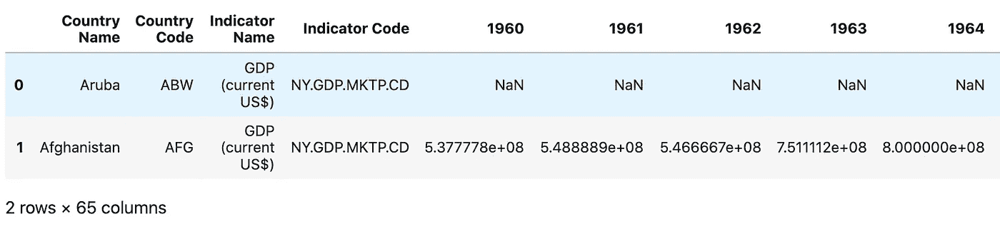*

# *2.想象你的目标。*

*现在我可以看到数据是如何排列的，我需要设想转换的最终目标，并考虑完成转换所需的步骤。*

*这是我希望的最终结果，一个显示年份、GDP 四分位数和平均 GDP 百分比变化的 3 列数据框架。这将用于创建一个线图，显示每个四分位数每年的增长百分比。这有助于可视化全球经济趋势，并衡量某些事件和趋势对全球 GDP 不同四分位数的影响。(滚动到底部查看最终图表)*

*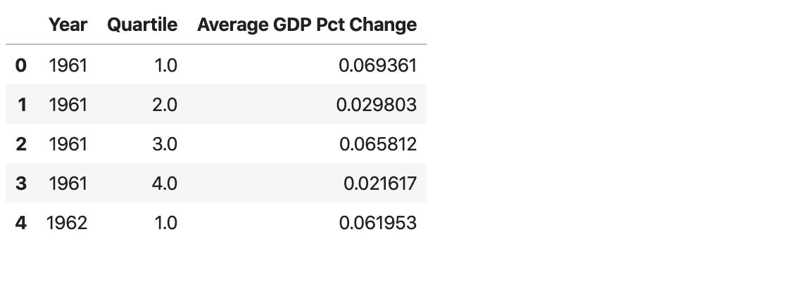*

# *3.移项*

*我们需要得到每个国家 GDP 的百分比变化，这样我们就可以按四分位数计算总平均值。现在，数据框架指数是按国家的，所以我们需要将数据框架转换成按年份的指数，以国家为列。以年份为索引，以国家为列，这将非常适合于计算每一列(即各个国家)各行的百分比变化。*

*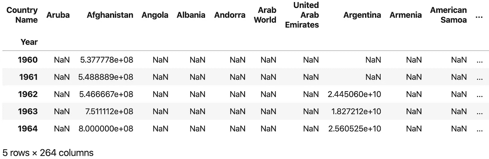*

# *4.百分比变化*

*熊猫有一个很优秀的 DataFrame 操作叫做 ***DataFrame.pct_change()。*** 此操作向下计算列，并用该列与其上一行之间的百分比变化替换该值。*

*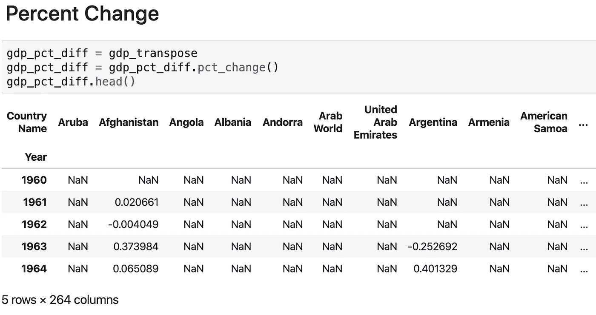*

# *5.转置回原始形状*

*使用转换后的 GDP 百分比变化数据框架，将行和列转置回原始形状。*

*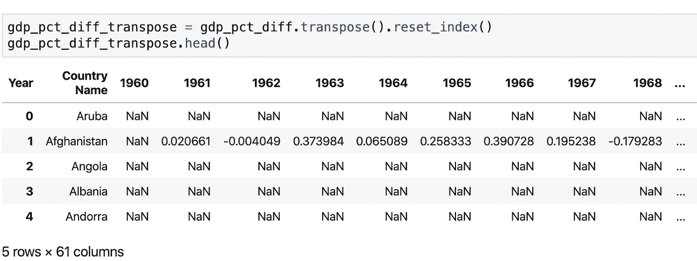*

# *6.熔化数据帧*

*别忘了我们还有原始的 GDP 数据框架。计算每个国家的四分位数需要原始数据框架和未转换的国内生产总值分数。我们现在必须做的是融合国内生产总值和国内生产总值百分比变化数据框架，以便在下一步将其合并。*

*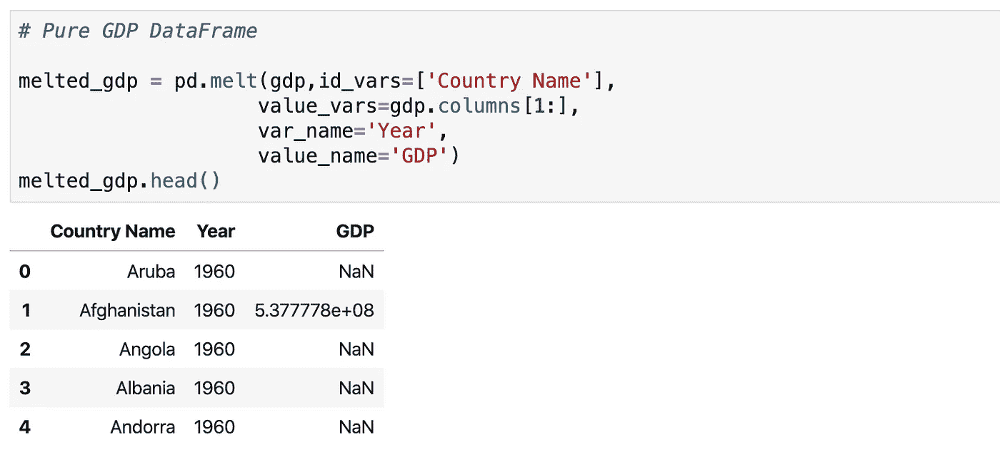*

*国内生产总值数据框架*

*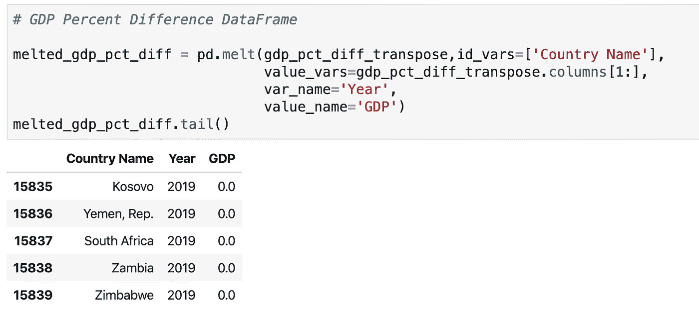*

*国内生产总值百分比差异数据框架*

# *7.合并数据帧*

*在我们迄今所做的一切之后，与熊猫融合是如此容易，这是一种解脱。我们可以简单地对原始 GDP 数据执行 DataFrame.merge()，并告诉它将百分比差异数据作为参数进行合并。*

*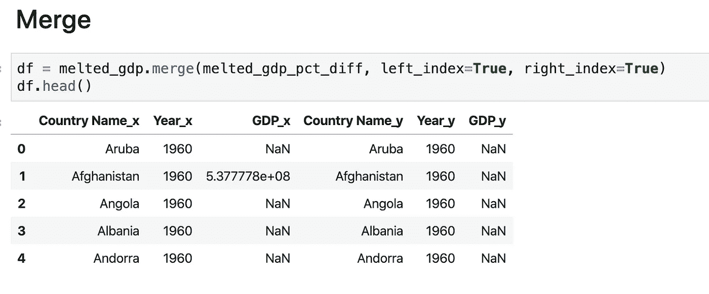*

## *日常管理—删除、重命名、转换为数字、删除 NAs*

*您会注意到 _x 和 _y 后缀，Pandas 很好地分配了它们，这样我们就不会被合并后的数据集弄糊涂了。现在我们必须删除不必要的列，重命名这些列，并将 year 转换为 numeric(它被错误地作为对象读入)。*

*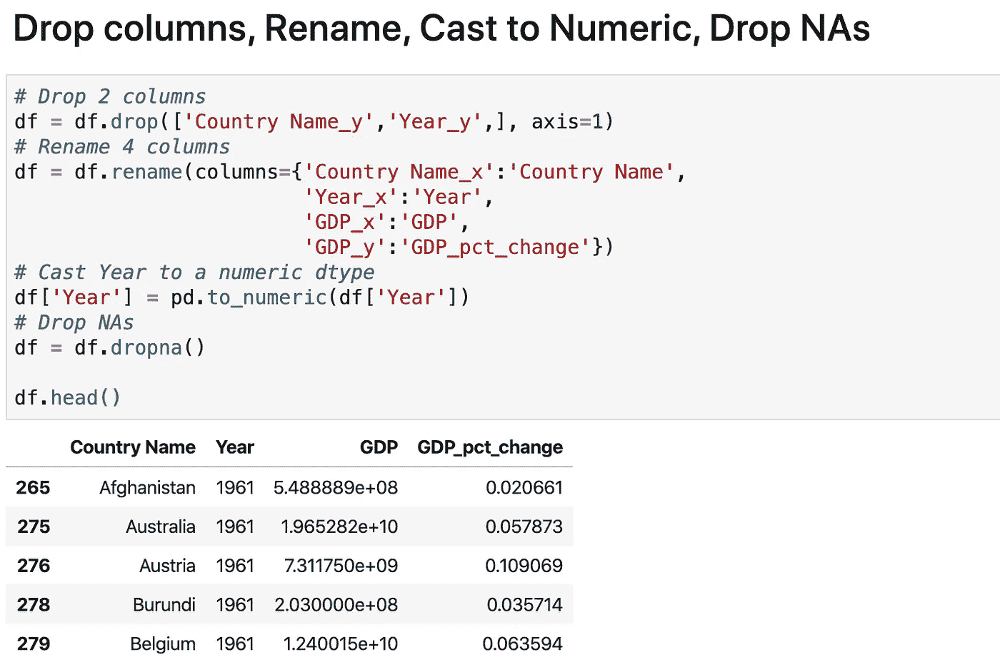*

# *8.计算每年 GDP 的四分位数*

*我们需要的是每个国家的 GDP 指标，以了解它在年度 GDP 分布中的位置。四分位数是根据数据在后 25%(按计数，而不是值)、26–50%、51–75%和 76–100%中的位置对数据进行分组的极好方法。我们将使用这个[优秀的 StackOverflow 答案，结合 *groupby()、transform()和 lambda()，为该年计算的 GDP 四分位数创建一个新列。*](https://stackoverflow.com/questions/19403133/pandas-groupby-and-qcut)*

*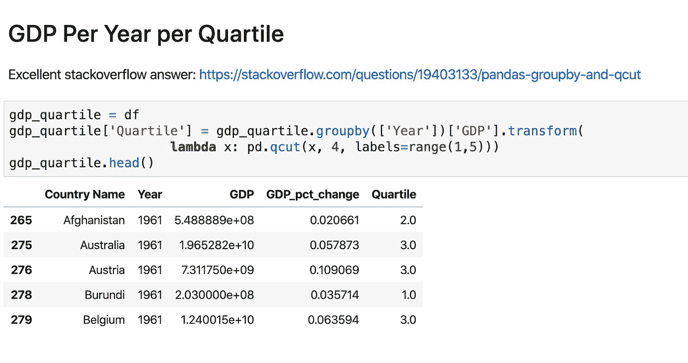*

# *9.平均 GDP 百分比变化——按四分位数*

*现在我们有了创建最终数据帧的所有部分。我们将再次使用***data frame . group by()****按年份和四分位数分组，并将平均值计算集中在 GDP_pct_change 上。**

**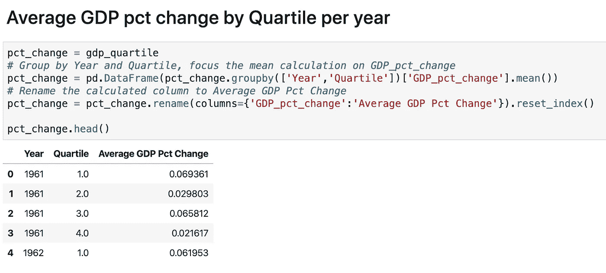**

**你现在可以呼吸了。我们已经走了这么远！**

**当我们第一次用 ***检查时，数据集几乎无法辨认。*头()**。我们现在可以看看过去 60 年的全球 GDP 变化，并检查不同的 GDP 四分位数对全球趋势的反应。**

**让我们用一个简单的 Seaborn line 情节来享受我们的劳动成果吧。**

****

**谢谢你陪我坚持下来！数据清理和转换是分析过程中至关重要的一部分，我们刚刚经历了一次令人费解的旅程，数据采用了许多不同的形状和维度。**