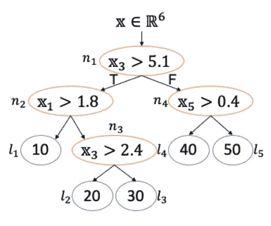

# 用蜂鸟把你的 ML 模型变成 Pytorch

> 原文：<https://towardsdatascience.com/transform-your-ml-model-to-pytorch-with-hummingbird-da49665497e7?source=collection_archive---------48----------------------->

## 机器学习

## 利用张量加速您的机器学习模型

在过去的几年里，深度学习的能力已经大大增加了。随着这一点，许多服务于你的神经网络的标准已经找到了通往大众的道路，如 [ONNX](https://onnx.ai/) 和 [TVM](https://tvm.apache.org/) 。

这种流行导致了对通过利用**张量计算**来优化深度学习管道、训练、推理和部署的关注。

相比之下，传统的机器学习模型，如随机森林，通常在推理任务上是基于 **CPU 的**，并且可以受益于基于 **GPU 的**硬件加速器。

> 用蜂鸟把你训练过的机器学习模型转换成 Pytorch

现在，如果我们可以在传统的随机森林中使用神经网络的许多优势，会怎么样呢？更好的是，如果我们能够**转换**随机森林并且**利用** GPU 加速推理会怎么样？

这就是微软的[蜂鸟](https://github.com/microsoft/hummingbird)的用武之地！它将你的机器学习模型转换为张量计算，这样它就可以使用 GPU 加速来加速**推理**。

在本文中，我不仅将描述如何使用这个包，还将描述相应论文和路线图中的基础理论。

**注**:蜂鸟只是用来加快时间做预测的，不是用来加快训练的！

# 1.理论

在深入研究这个包之前，重要的是要理解为什么这种转换是可取的，以及为什么可以这样做。

## 为什么要把你的模型转换成张量？

在某种程度上，张量是一个 N 维数据数组(见下图)。在 TensorFlow 的上下文中，它可以被视为一个矩阵的一般化，允许您拥有多维数组。您可以对它们执行优化的数学运算，而无需知道每个维度在语义上代表什么。例如，如何使用矩阵乘法来同时操作几个向量。

张量的简化。注意，在数学、物理和计算机科学中，张量的应用和定义可能不同！

将你的模型转换成张量有几个原因:

1.  张量作为深度学习的中坚力量，在让深度学习走向大众的背景下，得到了广泛的研究。张量运算需要显著优化，以便深度学习在更大规模上可用。这极大地加快了推断的速度，从而降低了进行新预测的成本。
2.  与使用传统的机器学习模型相比，它允许一个更加**统一的标准**。通过使用张量，我们可以将传统模型转换为 ONNX，并在所有人工智能解决方案中使用相同的标准。
3.  神经网络框架中的任何**优化**都可能导致传统机器学习模型的优化。

## 转换算法模型

向张量的转换不是一项简单的任务，因为有两个模型分支:**代数**(例如，线性模型)和**算法模型**(例如，决策树)。这增加了将模型映射到张量的复杂性。

在这里，**算法模型**的映射尤其困难。张量计算已知用于执行大量或对称运算。这对于算法模型来说是很难做到的，因为它们本质上是不对称的。

让我们以下面的决策树为例:

要映射到张量的示例决策树。此处检索到。

决策树分为三个部分:

*   输入特征向量
*   四个决策节点(橙色)
*   五个叶节点(蓝色)

产生的神经网络的第一层是连接到四个决策节点(橙色)的输入特征向量层。在这里，所有条件一起评估。接下来，通过使用矩阵乘法来一起评估所有叶节点。

作为神经网络，生成的决策树如下所示:

作为神经网络的决策树。此处检索到。

所产生的神经网络引入了冗余度**因为所有条件都被评估。然而，通常只评估一条路径。这种冗余部分地被神经网络向量化计算的能力所抵消。**

**注**:模型转化为张量的策略还有很多，在他们的论文里有描述，这里[这里](http://learningsys.org/neurips19/assets/papers/27_CameraReadySubmission_Hummingbird%20(5).pdf)和[这里](https://scnakandala.github.io/papers/TR_2020_Hummingbird.pdf)。

## 加速

根据他们的论文，与传统模型相比，GPU 加速的使用大大提高了推理速度。

比较使用 Sklearn 的相同模型与使用 Hummingbird 的神经网络的推理结果。此处检索到。

上述结果清楚地表明，将您的森林转换为神经网络可能是值得的。

我想亲眼看看在启用了 GPU 的 Google 联合实验室服务器上的结果会是什么样子。因此，我在谷歌联合实验室上做了一个快速的，但绝不是科学的实验，结果如下:

在启用 GPU 的情况下，在 Google Colab 上运行二元分类模型 100 次的结果。数据集是随机生成的，包含 100000 个数据点。看来用蜂鸟推断肯定比基础款快。实验的代码可以在[这里](https://gist.github.com/MaartenGr/e07906cea23e137ef1e1d8d3dce2455c)找到。

我们可以清楚地看到，在使用单一数据集时，对新数据的推断速度大大加快。

# 2.使用

> *蜂鸟是*

幸运的是，使用这个包非常简单。很明显，作者已经花费了大量的时间来确保这个包可以直观地在许多模型上使用。

现在，我们从通过 pip 安装包开始:

`pip install hummingbird-ml`

如果您还想安装 LightGBM 和 XGboost 依赖项:

`pip install hummingbird-ml[extra]`

然后，我们简单地开始创建我们的 Sklearn 模型，并在数据上对其进行训练:

这样做之后，我们实际上要做的唯一一件事就是导入蜂鸟并使用`convert`函数:

得到的`model`只是一个`torch.nn.Module`，然后可以像平常使用 Pytorch 一样使用。

正是转换到 Pytorch 的便利首先吸引了我对这个包的注意。只需几行代码，您就已经改造了您的模型！

# 3.路标

目前，以下型号**已实施**:

*   大多数 **Scikit-learn** 模型(例如，决策树、回归和 SVC)
*   **LightGBM** (分类器和回归器)
*   **XGboost** (分类器和回归器)
*   **ONNX。ML** (TreeEnsembleClassifier 和 TreeEnsembleRegressor)

虽然一些模型仍然不见踪影，但是他们的**路线图**表明他们正在前进:

*   特征选择器(例如，变量阈值)
*   矩阵分解(例如 PCA)
*   特征预处理(例如，MinMaxScaler、OneHotEncoder 等。)

你可以在这里找到蜂鸟的完整路线图。

# 感谢您的阅读！

如果你像我一样，对人工智能、数据科学或心理学充满热情，请随时在 [LinkedIn](https://www.linkedin.com/in/mgrootendorst/) 上添加我，或者在 [Twitter](https://twitter.com/MaartenGr) 上关注我。

点击下面的一个帖子，了解更多关于其他有趣的软件包的信息:

 [## 几行代码中的强化学习

### 使用稳定基线和 Gym 训练 SOTA RL 算法

towardsdatascience.com](/reinforcement-learning-in-a-few-lines-of-code-d6c8af1e0fd2)  [## 借助 Streamlit 快速构建和部署应用

### 将您的 Streamlit 应用程序部署到 Heroku，展示您的数据解决方案

towardsdatascience.com](/quickly-build-and-deploy-an-application-with-streamlit-988ca08c7e83)  [## 打开黑盒:如何利用可解释的机器学习

### 使用 PDP、LIME 和 SHAP 制定可解释的决策，为利益相关方创造价值

towardsdatascience.com](/opening-black-boxes-how-to-leverage-explainable-machine-learning-dd4ab439998e)