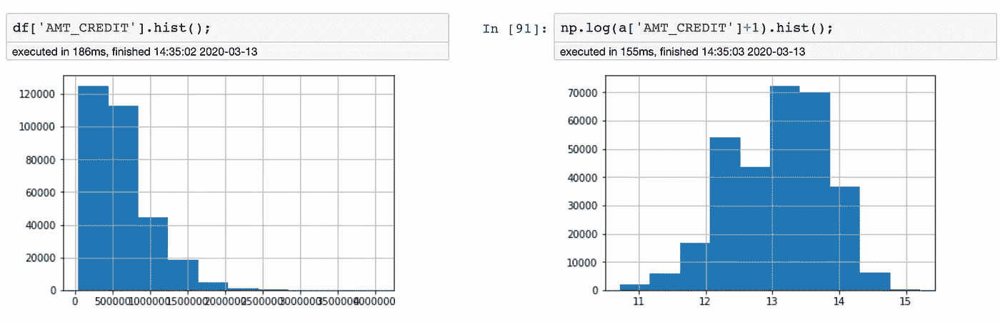

# 解释:ML 变换和缩放

> 原文：<https://towardsdatascience.com/transformation-scaling-of-numeric-features-intuition-7f4436e8e074?source=collection_archive---------11----------------------->

## 何时使用变换或缩放？哪个定标器？哪些算法？

在建模之前，所有不同的实体应该在相同的比例上；保罗·卡萨尔斯在 [Unsplash](https://unsplash.com?utm_source=medium&utm_medium=referral) 上的照片

缩放、标准化和变换是数字特征工程的重要步骤，它们正被用于处理倾斜的特征并为建模而重新缩放它们。机器学习和深度学习算法高度依赖于输入数据质量。如果数据质量不好，再高性能的算法也是白搭。就像*垃圾进:垃圾出一样简单。*

在建模之前，数据科学家有如此多的预处理步骤需要测试和验证。这进一步增加了围绕变换和缩放的效果和使用的混乱。在这里，我们将尝试使用公共数据集来回答一些问题

> 何时使用变换或缩放？使用哪个定标器？哪些算法受益？

本练习使用的数据是来自*家庭信用违约风险的*主数据文件*。数据被整理以预测客户的还款能力。数据是针对所有贷款申请的，在我们的数据示例中，一行代表一个贷款申请。*

数据集可以从[数据](https://www.kaggle.com/c/home-credit-default-risk/data)下载。而 Jupyter 笔记本可以从— [笔记本](https://github.com/manu007sharma/Medium_Notebooks/tree/master/Scale_Transform)下载。

公布数据集是为了说明每个申请人的还贷能力？下面是目标特征和一些独立特征的分布。目标特征存在数据不平衡问题，正类只占全部数据的 8%。

目标特征:贷款违约

以下是一些重要的数字独立特征及其直方图。选择它们只是为了解释练习。他们都在寻找不同的范围和规模，例如*AMT _ annuity*在 *mn* 范围内，但 *OWN_CAR_AGE* 最大可以开到 90。

*AMT _ 年金；金额 _ 贷方；金额 _ 商品 _ 价格；金额 _ 收入 _ 总额；天数 _ 出生；OWN _ CAR _ AGE*

数字特征直方图:原始数据

下面是原始数据的合并箱线图，由于一个空间中不同的比例和倾斜特征，它看起来高度倾斜。

组合箱线图:原始数据

# 转换

正态分布特征是统计算法中的一种假设。深度学习和回归型算法也受益于正态分布的数据。

需要进行变换来处理倾斜的要素并使其呈正态分布。使用*平方根/立方根/* ***对数变换可以将右斜特征变换为正态特征。***

根据上述直方图*金额 _ 年金、金额 _ 信用、金额 _ 商品 _ 价格、金额 _ 收入 _ 总额、&自有 _ 汽车 _ 年龄*为偏态数字特征，*天数 _ 出生*为正态分布。

**偏斜可能是由于以下两个原因之一**

*   *存在极端异常的异常值，对我们来说可能不重要。*
*   *或者说特征的自然分布是偏斜的，而尾部对我们很重要。这是大多数现实生活中的情况*

**对数变换简介:**如左图所示，正值的对数函数输出增长非常缓慢。因此，与较低的观测值相比，较高的值被边缘化得更多。

**变换的效果:**对数变换后，倾斜的数字特征可能呈正态分布。例如，在下图*中，金额信用*经过对数变换后呈正态分布。

日志转换前后:金额 _ 信用

*   **对数变换对倾斜目标特征的影响(回归的情况):** *对数变换可以将倾斜特征视为常态。并且，如果我们的目标特征是正态分布的，该算法将给予所有样本同等的重要性。它也被称为同质性。这相当于处理分类目标特征中的不平衡数据问题，就像我们在给定的数据集中一样。所以有一个正态分布的目标特性是很好的。*
*   **对数变换对偏斜的独立特征的影响:** *对数变换可以使独立特征像上面一样正态化，其中 AMT_CREDIT 在对数之后接近正态分布。但是它可能不会改善目标和独立特征之间的关系。因此，处理独立的倾斜特征可能有益于也可能无益于建模精度，这完全取决于两者之间的原始因果关系。*

# 缩放比例

缩放是重新缩放数据所必需的，当我们希望在我们的算法中使用相同的缩放比例来比较要素时，会用到缩放。而且，当所有特征都处于相同的比例时，它也有助于算法更好地理解相对关系。

> 如果从属特征转换为正态，则应在转换后应用缩放。

**缩放后哪些算法可能受益**？缩放有助于基于距离的算法，也有助于加快收敛

*线性&逻辑回归、KMeans/ KNN、*神经网络、 *PCA* 将受益于规模化

**缩放后哪些算法可能不会受益？**有些算法与缩放无关。基于熵&信息增益的技术对单调变换不敏感。

*基于树的算法、决策树、随机森林、增强树(GBM、light GBM、xgboost)* 可能无法从扩展中受益。

D 在缩放/标准化/规范化过程中，我们将遵循 sklearn 词汇表，因此使用通用单词 S *缩放*而不是*标准化*或*规范化*是一个不错的选择

> 训练数据上拟合的定标器模型将用于转换测试集。切勿在测试数据上再次安装定标器

Sklearn 主要有以下四种定标器

1.最小最大缩放器
2。鲁棒定标器
3。标准缩放器
4。标准化者。

**Minmax 定标器**应该是定标的首选。对于每个特征，每个值减去相应特征的最小值，然后除以同一特征的原始最大值和最小值的范围。它的默认范围在[0，1]之间。

下面是最小最大缩放后所有 6 个特征的直方图。在缩放之前，我们没有对任何功能进行对数转换。MinMaxScaler 没有改变特性的内部分布，也把每个人放在了同一个尺度上。

最小最大缩放后的直方图

下面是缩放后所有 6 个特征的组合箱线图。并且，都在[0，1 ]的范围内。每个要素值之间的内部空间得到了保持，并且与原始数据相比，它们的相对分布看起来也更好

最小最大缩放器后的箱线图

**当数据含有大量异常值，并且我们希望消除它们的影响时，可以使用鲁棒定标器**。但是不重要的离群值应该首先被移除。RobustScaler 减去列的中值，然后除以四分位数范围。

下图是鲁棒缩放器后的特征直方图。尽管直方图看起来与原始数据分布相似，但它们各自的内部距离空间并不像原始数据那样保持不变。

鲁棒缩放器后的直方图

此外，如下面的方框图所示，现在范围不在[0，1]内。并且每个特征的值之间的相对空间被扭曲并且现在不相同。在这种情况下，使用 robustscaler 会向建模过程传递关于底层数据的错误信息。

鲁棒定标器后的箱线图

**StandardScaler** 重新调整每一列，使其具有 0 个平均值和 1 个标准差。它通过减去平均值并除以标准差来标准化特征。如果原始分布不是正态分布，可能会扭曲要素之间的相对空间。

以下是应用标准缩放器后的要素直方图，分布看起来类似于原始数据分布，但它们并不相同，它们各自的内部观测距离在标准缩放过程中发生了变化。

以下是标准缩放后要素的组合箱线图，正如预期的那样，它扭曲了要素值之间的相对距离，而在最小-最大值后它们看起来更好

标准定标器后的方框图

**规格化器**应用于行，而不是列，所以 sklearn 用户不应该混淆，也不应该使用规格化器。Normalizer 的一些应用案例是在同一时间序列中比较多个实体，即在给定时期内多个股票的股票移动

# 结论

*   在建模之前，应该对偏斜的目标特征进行正态性处理，尤其是当异常值也很重要时
*   在分析过程中，应了解如何处理倾斜的从属特征及其影响
*   MinMaxScaler 应该是缩放的首选
*   实验和观察可以帮助我们进一步决定正确的方法

感谢阅读。如果你喜欢过这篇文章，你可能也会喜欢 [*熊猫指数——隐形*](/pandas-index-explained-b131beaf6f7b) *灵魂、* [*熊猫支点&堆叠*](https://medium.com/analytics-vidhya/pandas-stack-unstack-pivot-table-crosstab-5cb9a16fe020)

*   *更多请关注我上* [*中*](https://medium.com/@manusharma_66718)
*   *让我们连线上*[*Linkedin*](http://www.linkedin.com/in/data2datasciences/)