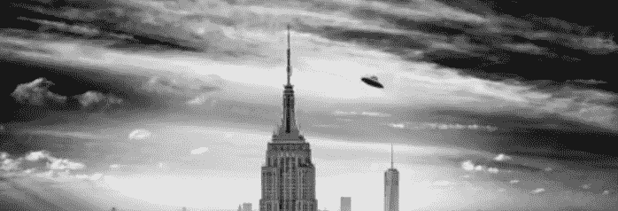
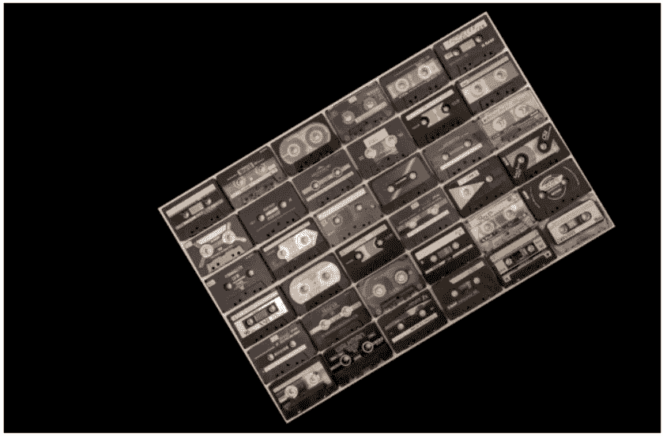
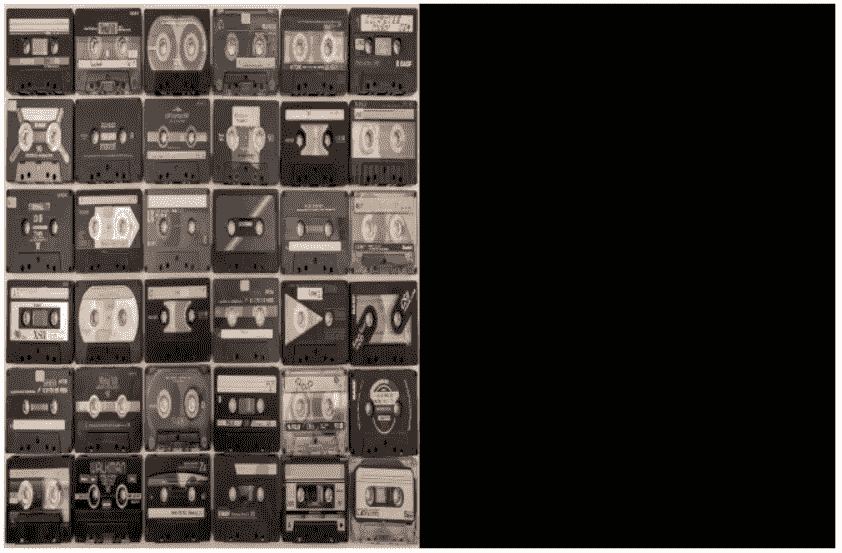
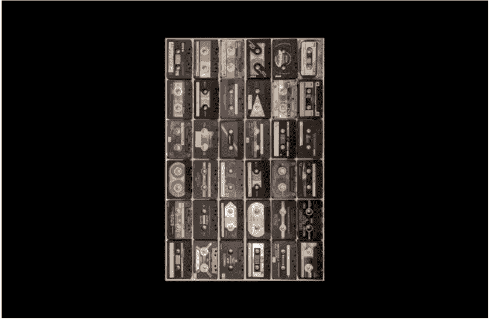
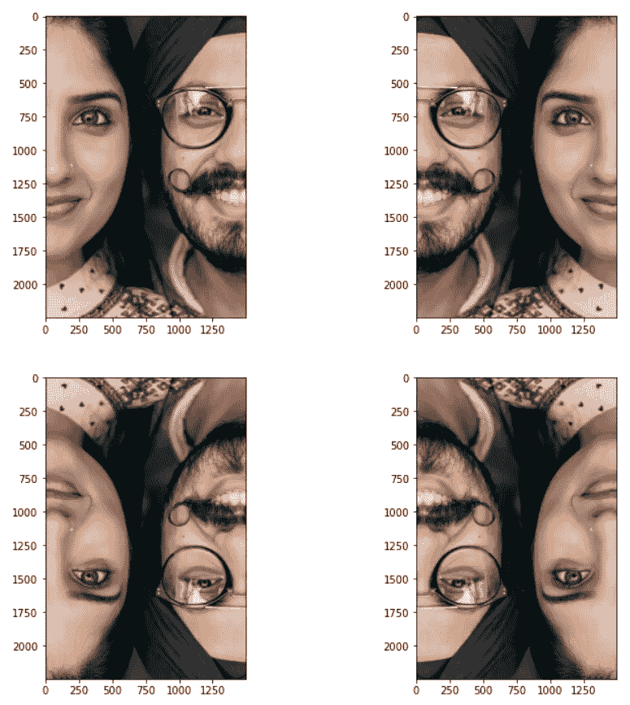
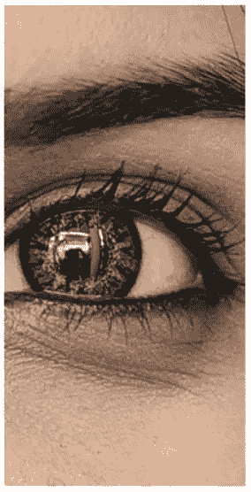
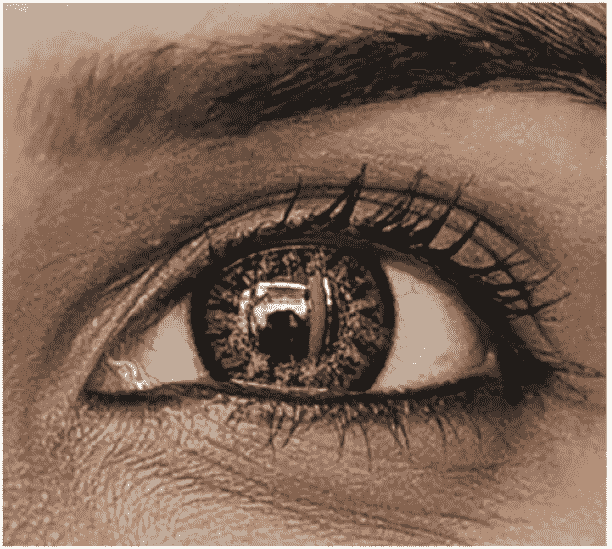
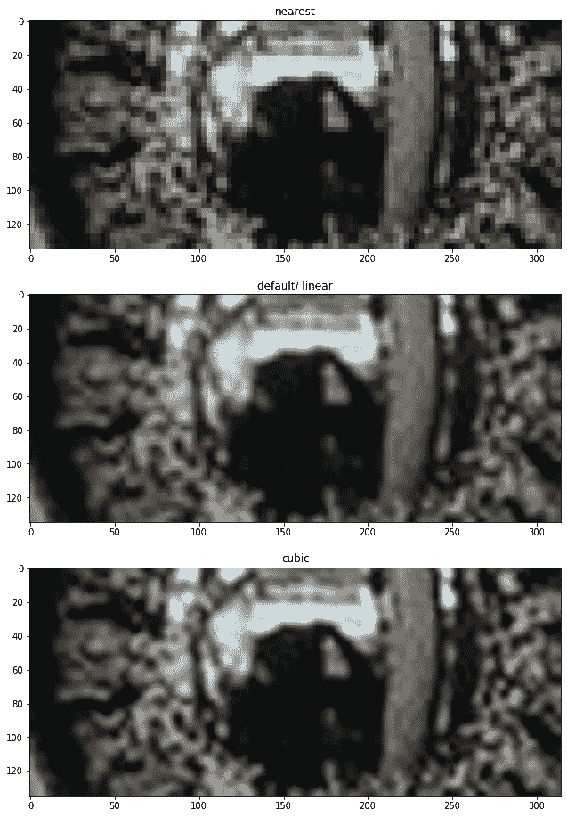
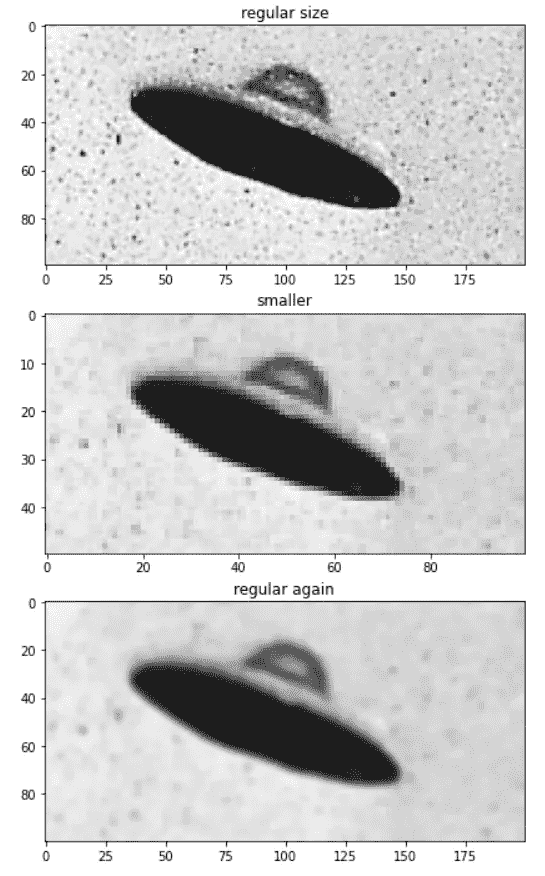

# 使用 OpenCV 进行转换

> 原文：<https://towardsdatascience.com/transformations-with-opencv-ff9a7bea7f8b?source=collection_archive---------22----------------------->

## 关于如何用 Python 的 OpenCV 转换图像的指南



如果你曾经不得不使用一个可以位图化的图像增强器，你可能知道这有多困难。在本文中，我们将了解变换，并探索移动、旋转、裁剪和调整大小等内容。

## 要求

对于示例，我们将使用 OpenCV、NumPy 和 Matplotlib。

```
import cv2
import numpy as np
import matplotlib.pyplot as plt
```

[在这里](/getting-started-with-opencv-249e86bd4293)，我学习了 OpenCV 的一些基础知识，比如读取、显示和修改图像的一些属性。本文中的例子将从那里开始，但我认为你不需要阅读它来跟上这一点。

## 变换矩阵

从一些简单的东西开始，我们将读取图像并将颜色序列从 BGR 转换为 RGB。

然后，我们将构建一个包含图像变换信息的变换矩阵。为简单起见，我们可以将该矩阵视为:

```
[[size, rotation, location], ←x-axis
[rotation, size, location]] ←y-axis
```

默认矩阵或不会改变任何东西的矩阵是:

```
[[1, 0, 0]
 [0, 1, 0]]
```

这意味着，100%的大小，零旋转，位置不变——再一次，我过于简化了。

在我们算出矩阵后，我们可以用。形状和用途。warpAffine 来转换图像。

让我们检查一个没有任何转换的例子，以了解这个过程。

```
# read img and convert color
img = cv2.imread('img3.jpeg')
img = cv2.cvtColor(img, cv2.COLOR_BGR2RGB)# build a transformation matrix
matrix = [[1, 0, 0], #x 
          [0, 1, 0]] #y
t = np.float32(matrix)# get the sizes
h, w = img.shape[:2]# transform
img = cv2.warpAffine(img, t, (w, h))# plot
fig, ax = plt.subplots(1, figsize=(12,8))
ax.axis('off')   
plt.imshow(img)
```


[Bru-nO 拍摄的图片](https://pixabay.com/photos/cassettes-tinge-magnetband-hifi-5148602/)

好吧，我们可以试着移动它。我们会用不同的矩阵重复所有的事情。

```
# Change location
matrix = [[1, 0, **300**], #x 
          [0, 1, **-300**]] #y
```


移动图像。

现在，让我们改变一切，看看它是如何工作的。

```
# Change size, rotation, and location
matrix = [[0.5, 0.3, 450], #x 
          [-0.3, 0.5, 600]] #y
```



移动、旋转和缩放图像。

有意思。你可能已经注意到我们有两种不同的“尺寸”——让我们来看看它们有什么不同。

我们可以在矩阵中将宽度缩放 0.5。

```
matrix = [[**0.5**, 0, 0], #x 
          [0, 1, 0]]   #y
```



按 0.5 缩放的宽度。

我们可以把宽度除以 2 英寸。

```
img = cv2.warpAffine(img, T, (**int(w/2)**, h))
```


宽度除以 2。

我想理解转换矩阵是必要的，但是它有点过于复杂了。

## 旋转

OpenCV 有一些更方便的方法来构建它，比如 getRotationMatrix2D 方法，我们可以在一个方法中设置所需的图像位置、旋转角度和缩放因子。

```
img = cv2.imread('Images/3.jpg')
img = cv2.cvtColor(img, cv2.COLOR_BGR2RGB)h, w = img.shape[:2]# (w/2, h/2) -> center of the image **T = cv2.getRotationMatrix2D((w/2, h/2), 90, .5)**img = cv2.warpAffine(img, T, (w, h))fig, ax = plt.subplots(1, figsize=(12,8))
ax.axis('off')   
plt.imshow(img)
```



移动、旋转和缩放图像。

如果我们只需要将整个画面旋转 90 度。trasponse 是一种更简便的方法。

```
img = cv2.imread('Images/3.jpg')
img = cv2.cvtColor(img, cv2.COLOR_BGR2RGB)img = cv2.transpose(img)fig, ax = plt.subplots(1, figsize=(12,8))
ax.axis('off')   
plt.imshow(img)
```


转置图像。

## 镜子

我们可以创造一种镜像效果，比如倒影。我们只需要。随着图像和我们想要反映的方向翻转。

```
img = cv2.imread('Images/2.jpeg')
img = cv2.cvtColor(img, cv2.COLOR_BGR2RGB)fig, ax = plt.subplots(1, figsize=(12,12))ax = plt.subplot(221) 
plt.imshow(img)img2 = cv2.flip(img, 1)
ax = plt.subplot(222) 
plt.imshow(img2)img3 = cv2.flip(img, 0)
ax = plt.subplot(223) 
plt.imshow(img3)img4 = cv2.flip(img, -1)
ax = plt.subplot(224) 
plt.imshow(img4)
```



原始图像和镜像图像。图片由[赖爷 Subiyanto](https://www.pexels.com/photo/happy-young-indian-couple-looking-at-camera-4312847/)

## 种植

很多时候，我们可能需要图像的特定部分，而不是整个图像。如果是这种情况，我们可以通过分割 NumPy 数组轻松地裁剪图片。

切片的第一部分与高度有关，所以如果我们把它看作一个表格，它就像行号，第二部分指的是宽度，所以它就像列号。

```
img = cv2.imread('Images/2.jpeg')
img = cv2.cvtColor(img, cv2.COLOR_BGR2RGB)fig, ax = plt.subplots(1, figsize=(12,8))
ax.axis('off')# [height start: height end, width start: width end]
# [first row : last row, first column: last column]
plt.imshow(img**[500:1000, 250:500]**)
```



裁剪的图像。

猜测我们希望从哪个像素开始和结束裁剪并不是最佳选择，所以让我们构建一个简单的缩放函数来理解我们如何系统地完成这项工作。

```
# scale function
**def px(size, proportion):
    return int(size * proportion)**# read, convert and get height/ width
img = cv2.imread('Images/2.jpeg')
img = cv2.cvtColor(img, cv2.COLOR_BGR2RGB)
h, w = img.shape[:2]# crop
img = img[**px(h, .25):px(h, .40)**, #25% to 40%
          **px(w, .10):px(w, .35)**] #10% to 35%# plot
fig, ax = plt.subplots(1, figsize=(12,8))
ax.axis('off')   
plt.imshow(img)
```



用函数裁剪

## 调整大小

默认情况下，调整大小是通过线性插值实现的，但是我们也可以尝试其他方法来看看它们之间的区别。

让我们尝试使用。resize。我们需要图像和所需的大小，在这里我们可以指定我们想要的插值方法。尺寸可以是新照片的尺寸，也可以是 x 和 y 的比例因子。

```
# read, convert and get height/ width
img = cv2.imread('Images/2.jpeg')
img = cv2.cvtColor(img, cv2.COLOR_BGR2RGB)
h, w = img.shape[:2]# crop
img = img[px(h, .33):px(h, .35), 
          px(w, .18):px(w, .25)]# figure
fig, ax = plt.subplots(1, figsize=(12,16))# resize - nearest
ax = plt.subplot(311) **img_scaled = cv2.resize(img, None, fx=3, fy=3, interpolation = cv2.INTER_NEAREST)**
plt.imshow(img_scaled)
plt.title('nearest')# resize - default/ linear
ax = plt.subplot(312)
**img_scaled = cv2.resize(img, None, fx=3, fy=3)** plt.imshow(img_scaled)
plt.title('default/ linear')# resize - cubic
ax = plt.subplot(313)
**img_scaled = cv2.resize(img, None, fx=3, fy=3, interpolation = cv2.INTER_CUBIC)** plt.imshow(img_scaled)
plt.title('cubic')
```



不同的插值。

另一种调整大小的方法是使用金字塔。让我们快速看一下这是如何工作的。

```
# read and convert
img = cv2.imread('Images/ufo.jpg')
img = cv2.cvtColor(img, cv2.COLOR_BGR2RGB)# crop
img = img[50:150, 200:400]# figure
fig, ax = plt.subplots(1, figsize=(12,12))# img
ax = plt.subplot(311)
plt.imshow(img)
plt.title('regular size')# downsize
**small = cv2.pyrDown(img)**ax = plt.subplot(312)
plt.imshow(small)
plt.title('smaller')# upsize
**regular = cv2.pyrUp(small)**ax = plt.subplot(313)
plt.imshow(regular)
plt.title('regular again')
```



金字塔法— [原图来自维基百科](https://upload.wikimedia.org/wikipedia/commons/d/df/PurportedUFO2.jpg)

我们可以看到，就像其他方法一样，分辨率有一些损失，但总的来说这是一个很好的方法。

好的，在我们结束前再来一个。

对我们的数组进行切片不仅对裁剪有用，我们还可以用它来操作图像的特定部分，甚至用切片来替换不同的部分。

```
# read and convert
img = cv2.imread('Images/ufo.jpg')
img = cv2.cvtColor(img, cv2.COLOR_BGR2RGB)img2 = cv2.imread('Images/8.jpg')
img2 = cv2.cvtColor(img2, cv2.COLOR_BGR2RGB)# replace
img2[200:250, 1000:1100] = small# plot
fig, ax = plt.subplots(1, figsize=(12,12))
plt.imshow(img2)
```


[图片由马克·阿斯特霍夫](https://unsplash.com/photos/Y_7wXiRn_J8)(没有飞碟)

好了，我们看到了如何移动、旋转和调整图像大小。我们还了解了裁剪、镜像以及如何处理图片的切片。

感谢阅读我的文章。我希望你喜欢它。

参考资料:
OpenCV 几何图像变换；
[OpenCV 对数组的操作](https://docs.opencv.org/2.4/modules/core/doc/operations_on_arrays.html)；
[OpenCV 转置示例](https://docs.opencv.org/4.2.0/js_contour_properties_transpose.html)；
[OpenCV 金字塔](https://docs.opencv.org/2.4/doc/tutorials/imgproc/pyramids/pyramids.html)；