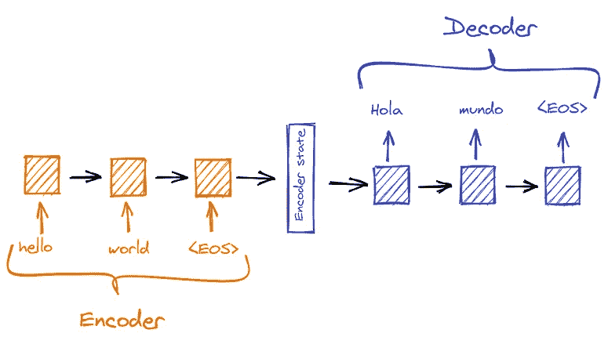
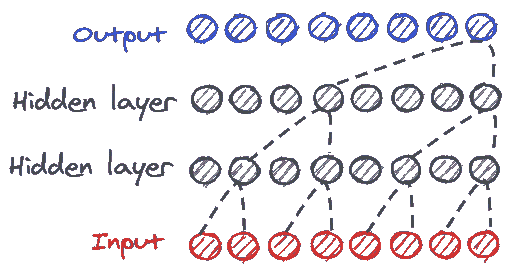
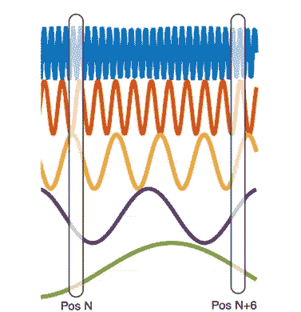
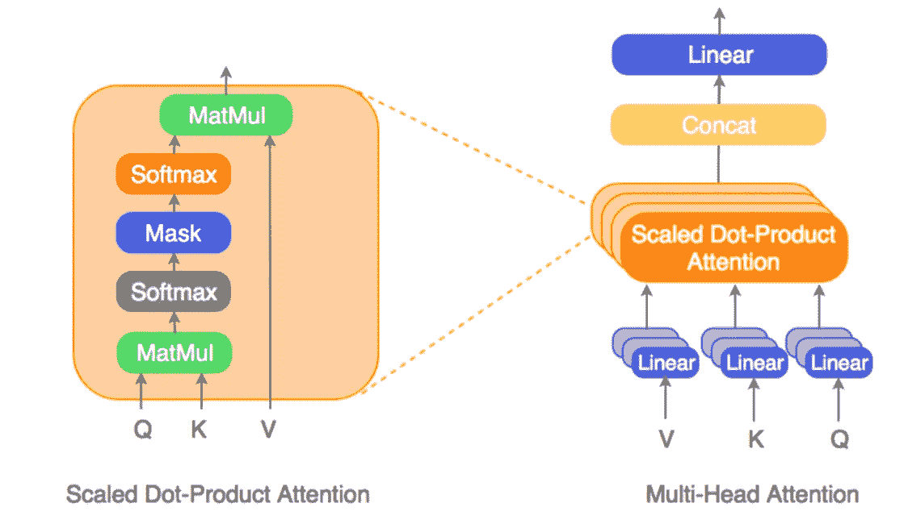

# 变形金刚模型…这一切是如何开始的？

> 原文：<https://towardsdatascience.com/transformer-models-how-did-it-all-start-2e5b385ddd93?source=collection_archive---------29----------------------->

Transformer 模型彻底改变了自然语言处理领域，但是，这一切是如何开始的呢？为了理解当前最先进的架构，并真正理解为什么这些模型成为该领域的突破，我们必须在时间上走得更远，因为我们知道 NLP 是从哪里开始的:当我们第一次在 NLP 中引入神经网络时。

将神经模型引入 NLP 找到了克服传统方法无法解决的挑战的方法。最显著的进步之一是序列对序列模型:这种模型通过一次预测一个单词来生成输出序列。序列到序列模型对源文本进行编码，以减少歧义并实现上下文感知。

序列对序列模型(图片由作者提供)

在任何语言任务中，语境都起着至关重要的作用。为了理解单词的意思，我们必须了解一些使用它们的情况。Seq2Seq 模型通过查看标记级别来实现上下文:上一个单词/句子生成下一个单词/句子。引入这种嵌入在空间中的上下文表示具有多个优点，例如避免了由于相似的上下文数据被映射为彼此靠近而导致的数据稀疏，并且提供了生成合成数据的方式。

然而，语言中的语境是非常复杂的。很多时候，只关注前一句话是找不到上下文的。需要**长程相关性**来实现上下文感知。Seq2Seq 模型与递归神经网络(LSTM 或格鲁)一起工作。这些网络具有记忆机制，在处理序列时调节信息流，以实现“长期记忆”尽管如此，如果一个序列足够长，他们将很难将信息从较早的时间步骤传递到后面的时间步骤。

当试图处理文本的整个段落时，RNNs 将达不到要求。他们受到梯度消失问题的困扰。梯度值用于更新神经网络的权重，从而进行学习。当梯度随着时间反向传播而收缩时，就会出现消失梯度问题。如果一个梯度值变得极小，对学习贡献不大。此外，RNNs 的拓扑结构非常耗时，因为对于每个反向传播步骤，网络都需要看到整个单词序列。

CNN 对数路径(图片由作者提供)

作为尝试解决这些问题的一种方法，在 NLP 中引入了卷积神经网络的使用。使用卷积创建对数路径。网络可以在对数卷积层中“观察”整个序列。然而，这提出了一个新的挑战:位置偏差。我们如何确保我们在文本中观察到的立场是那些给出更多见解的立场？为什么关注序列的位置 X 而不是 X-1？

此外，挑战不仅在于找到一种编码大量文本序列的方法，还在于能够确定文本的哪些部分对于获得上下文感知是必不可少的。并非所有的文本对理解都同样重要。为了解决这个问题，Seq2Seq 模型中引入了注意机制。

注意力机制受到动物视觉注意力的启发，它们专注于视觉输入的特定部分来计算适当的反应。Seq2Seq 架构中使用的注意力寻求向解码器提供更多上下文信息。在每一个解码步骤中，解码器都被告知应该对每个输入单词给予多少“关注”。

Seq2Seq 车型中的关注度(图片由作者提供)

尽管环境意识有所提高，但仍有很大的提高空间。这些方法的最大缺点是这些体系结构的复杂性。

这就是 transformer 模型出现的原因。transformer 模型引入了这样一种思想，即不在已经很复杂的 Seq2Seq 模型上添加另一种复杂的机制(attention );我们可以通过忘记其他一切，只专注于注意力来简化解决方案。

这个模型消除了递归，它只使用矩阵乘法。它一次处理所有输入，而不必按顺序处理。为了避免失去顺序，它使用位置嵌入来提供每个元素在序列中的位置信息。尽管消除了递归，但它仍然提供了一种编码器-解码器架构，如 Seq2Seq 模型中所见

因此，在看到我们在以前的模型中面临的所有挑战之后，让我们深入研究 transformer 模型与 Seq2Seq 模型相比解决了什么问题。

# 变压器技术深度探讨

变压器架构(图片由作者提供)

当我们需要处理整个段落以获得上下文时，RNN 有所欠缺，而变形金刚能够识别长期依赖关系，实现上下文感知。我们还看到，RNN 自己努力确定文本的哪些部分给出了更多的信息，为此他们需要增加一个额外的层，一个双向 RNN 来实现注意力机制。相反，转换器只有在全神贯注的情况下才能工作，这样它才能在不同的层次上确定上下文的基本部分

另一个关键的区别是 transformer 模型消除了递归。通过消除递归，减少了顺序运算的次数，降低了计算复杂度。在 RNNs 中，对于每个反向传播步骤，网络需要看到整个单词序列。在变换器中，所有输入被同时处理，降低了计算复杂度。这也带来了一个新的优势，我们现在可以并行训练。能够将训练样本分割成几个独立处理的任务可以提高训练效率。

那么模型如何在不使用递归的情况下保持序列顺序呢？

使用位置嵌入。该模型采用 n 个单词嵌入的序列。为了模拟位置信息，将位置嵌入添加到每个单词嵌入中。

位置嵌入(作者图片)

使用不同维数的正弦和余弦函数创建位置嵌入。用由这些函数的组合产生的模式对单词进行编码；这导致序列中位置的连续二进制编码。

transformer 模型使用多头注意力对输入嵌入进行编码，这样做时，它会以向前和向后的方式处理输入，因此序列中的顺序会丢失。因此，它依赖于我们刚刚解释过的位置嵌入。

转换器有三种不同的注意机制:编码器注意、编码器-解码器注意和解码器注意。那么注意力机制是如何工作的呢？它基本上是一个向量乘法，根据向量的角度，可以确定每个值的重要性。如果向量的角度接近 90 度，那么点积将接近零，但是如果向量指向相同的方向，那么点积将返回更大的值。

每个键都有一个相关的值，对于每个新的输入向量，我们可以确定这个向量与值向量的关系，并使用 softmax 函数选择最接近的项。

多头关注(图片由作者提供)

变形金刚有多头注意力；我们可以把它想象成 CNN 的过滤器，每一个都学会注意一组特定的单词。一个人可以学会识别短期依赖性，而另一个人可以学会识别长期依赖性。这提高了上下文意识，当不清楚时，我们可以理解术语指的是什么；比如用代词之类的词。

transformer 架构有助于创建基于海量数据集的强大模型。即使不是每个人都可以训练这些模型。我们现在可以利用迁移学习来使用这些预先训练的语言模式，并根据我们的具体任务对它们进行微调。

变形金刚模型彻底改变了这个领域。他们已经在许多任务中超越了基于 RNN 的架构，并将继续在 NLP 领域产生巨大的影响。