# 变压器神经网络:一步一步的野兽崩溃

> 原文：<https://towardsdatascience.com/transformer-neural-network-step-by-step-breakdown-of-the-beast-b3e096dc857f?source=collection_archive---------0----------------------->

来源: [unsplash](https://unsplash.com/?utm_source=medium&utm_medium=referral) 上的[阿森纽古列夫](https://unsplash.com/@tetrakiss)。

变压器神经网络是一种新颖的架构，旨在解决序列到序列的任务，同时轻松处理长距离依赖性。在论文*2017【1】中提出“注意力是你所需要的一切”。这是自然语言处理领域目前最先进的技术。*

*在直接跳到 Transformer 之前，我会花一些时间来解释我们使用它的原因以及它是从哪里出现的。(如果您想跳过这一部分，直接进入 Transformer 主题，但我建议您按顺序阅读，以便更好地理解)。*

*所以，故事从 RNN(递归神经网络)开始。*

# ***RNN***

*什么是 RNN？和简单的 ANN 有什么区别？主要区别是什么？*

*rnn 是随着时间推移推出的前馈神经网络。*

*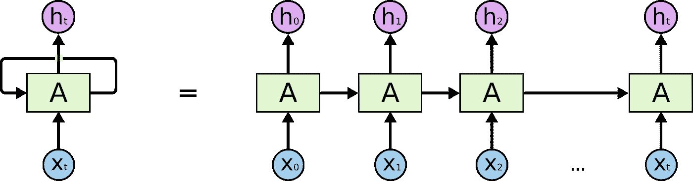*

*来源:[科拉的](https://colah.github.io/posts/2015-08-Understanding-LSTMs/) (CC0)。*

*与普通的神经网络不同，RNNs 被设计成接受一系列输入**而*没有预先确定的大小限制*。“系列”作为该序列的任何输入，与它们相邻的输入有某种关系或对它们有某种影响。***

*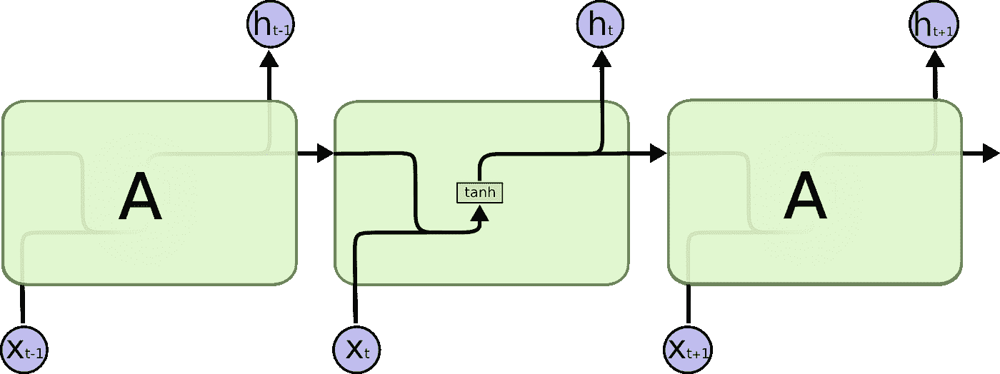*

*RNN 建筑。来源:[科拉赫的](https://colah.github.io/posts/2015-08-Understanding-LSTMs/) (CC0)。*

*基本的前馈网络也能“记住”东西，但它们记住的是在训练期间学到的东西。此外，虽然 rnn 在训练时学习类似，但是它们在生成输出时记住从先前输入中学到的东西。*

*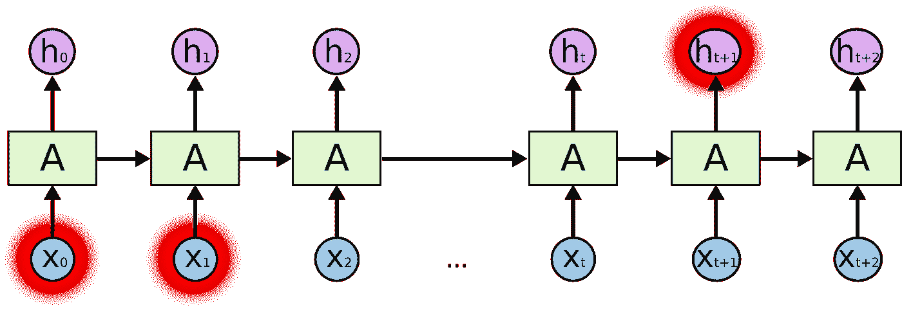*

*图示长期依赖关系的图像。来源:[科拉赫的](https://colah.github.io/posts/2015-08-Understanding-LSTMs/) (CC0)。*

*它被用于不同类型的模型中-*

*1.)**向量-序列模型-** 它们以固定大小的向量作为任意长度的输入输出向量，例如在图像字幕中，图像作为输入给出，输出描述图像。*

*2.)**序列-向量模型-** 取任意大小的向量，输出固定大小的向量。电影的情感分析将对任何电影的评论评定为正面或负面，作为固定大小的向量。*

*3.)**序列对序列模型——**最流行、使用最多的变体，把输入作为一个序列，把输出作为另一个序列，变量大小。例如，语言翻译，用于股票市场预测的时间序列数据。*

***其缺点-***

1.  *训练缓慢。*
2.  *长序列导致梯度消失，或者说，长期依赖性的问题。简单来说，在回忆旧联系的时候，它的记忆力并没有那么强。*

*对于 **Eg** 。“云在 ____ 里。”*

*很明显，下一个词将是天空，因为它与云联系在一起。这里我们可以看到云和预测词之间的距离更小，所以 RNN 可以很容易地预测它。*

**但是，再举一个例子，**

*“我和我的父母在德国长大，我在那里生活了很多年，对他们的文化有一定的了解，这就是为什么我能说一口流利的 ____ 语。”*

*这里预测的单词是德语，它与德国直接相连，但在这种情况下，德国与预测的单词之间的距离更大，因此 RNN 很难预测。*

*因此，不幸的是，随着这种差距的扩大，rnn 变得无法连接，因为它们的记忆随着距离而消失。*

# ***LSTM***

*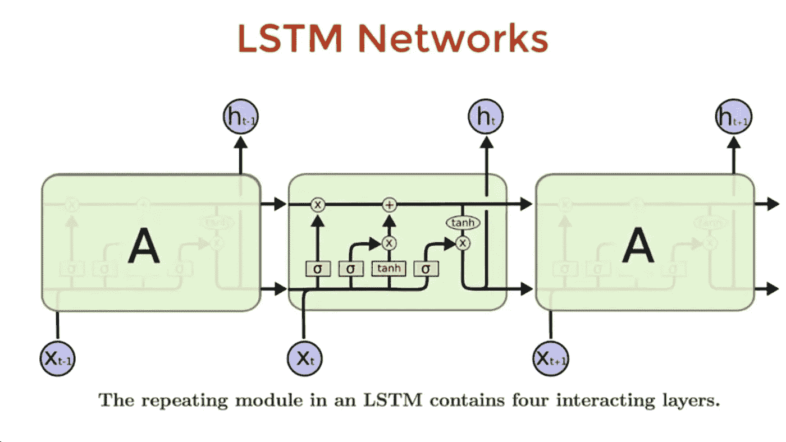*

*来源:[科拉赫的](https://colah.github.io/posts/2015-08-Understanding-LSTMs/) (CC0)。*

***长短期记忆-** 特殊种类的 RNN，专为解决消失梯度问题而制作。他们有能力学习长期的依赖性。长时间记住信息实际上是他们的默认行为，而不是他们努力学习的东西！*

*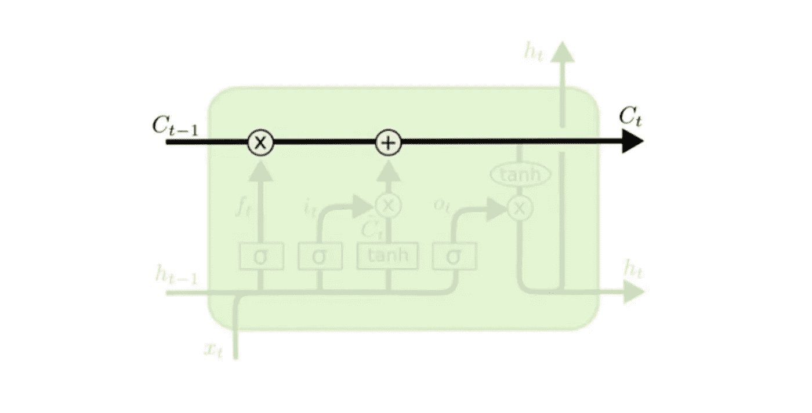*

*这个分支允许传递信息并跳过对单元的长时间处理。来源:[科拉赫的](https://colah.github.io/posts/2015-08-Understanding-LSTMs/) (CC0)。*

*LSTM 神经元与正常神经元不同，它有一个分支，允许传递信息并跳过当前细胞的长时间处理，这允许记忆保留更长的时间。它确实改善了消失梯度问题的情况，但并不令人惊讶，就像它在 100 个单词之前会很好，但在 1000 个单词之后，它开始失去控制。*

*但是像简单的 RNN 一样，它的训练速度也很慢，甚至更慢。*

***它们一个接一个地按顺序接受输入，这不能很好地用尽 GPU，GPU 是为并行计算而设计的。***

***如何并行化顺序数据？？** *(这个问题我会回去的。)**

*目前，我们正在处理两个问题-*

*   *消失梯度*
*   *慢速训练*

**解决渐变消失问题:**

# ***注意***

*它回答了我们应该关注输入的哪一部分的问题。*

*我将用一种稍微不同的方式来解释注意力。让我们来看一个例子-*

*假设有人给了我们一本机器学习的书，让我们给出分类交叉熵的信息。有两种做法，一是通读全书，带着答案回来。第二，转到索引，找到“损失”一章，转到交叉熵部分，阅读分类交叉熵部分。*

*你认为更快的方法是什么？*

*像第一种方法一样，可能要花整整一周的时间来读完整本书。而在第二档，几乎不需要 5 分钟。此外，我们从第一种方法得到的信息将更加模糊和多样，因为它基于太多的信息，而从第二种方法得到的信息将精确到需求。*

**我们在这里做了哪些不同的事情？**

*在前一种情况下，我们没有特别关注这本书的任何部分，而在后一种情况下，我们将注意力集中在损失一章，然后进一步将注意力集中在交叉熵部分，在那里解释了分类交叉熵的概念。其实这是我们人类大多数人都会做的事情。*

*神经网络中的注意力有点类似于我们在人类中发现的。他们关注输入的某些部分的高分辨率，而输入的其余部分是低分辨率的[2]。*

*假设我们正在制造一台 NMT(神经机器翻译机)，*

*请看这个动画，它展示了一个简单的序列到序列模型是如何工作的。*

**

*经典序列到序列模型的工作原理。来源:[贾勒马的](https://jalammar.github.io/visualizing-neural-machine-translation-mechanics-of-seq2seq-models-with-attention/) (CC BY-NC-SA 4.0)。*

*我们看到，对于编码器或解码器的每一步，RNN 都在处理其输入，并生成该时间步的输出。在每一个时间步中，RNN 根据它看到的输入和先前的输出更新它的隐藏状态。在动画中，我们看到隐藏状态实际上是我们传递给解码器的**上下文向量**。*

**“注意”的时间*。*

*对于这些类型的模型，**上下文向量**被证明是有问题的。模型在处理长句时有一个问题。或者说他们正面临长句中消失梯度的问题。因此，在一篇论文[2]中出现了一个解决方案，注意力被引入。它极大地提高了机器翻译的质量，因为它允许模型根据需要专注于输入序列的相关部分。*

*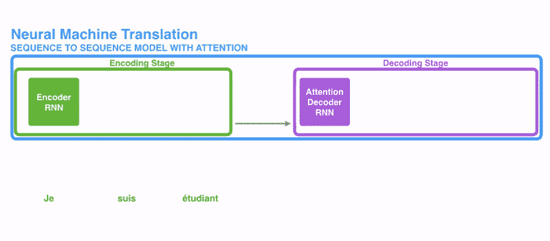*

*注意使用序列对序列模型。来源:[贾勒马的](https://jalammar.github.io/visualizing-neural-machine-translation-mechanics-of-seq2seq-models-with-attention/) (CC BY-NC-SA 4.0)。*

*这个注意力模型在两个方面不同于经典的序列对序列模型*

*   *与简单的 seq-to-seq 模型相比，编码器向解码器传递更多的数据。以前，只有编码部分的最后的隐藏状态被发送到解码器，但是现在编码器将所有的隐藏状态(甚至是中间状态)传递到解码器。*
*   *解码器部分在产生其输出之前进行额外的步骤。解释如下-*

*解码器最后一步如下进行*

1.  *它检查它接收到的每个隐藏状态，因为编码器的每个隐藏状态大多与输入句子的特定单词相关联。*
2.  *我给每个隐藏的州打分。*
3.  *然后每个分数乘以各自的 softmax 分数，从而放大高分的隐藏状态，淹没低分的隐藏状态。*(请参考下图以获得清晰的视觉效果。)**

*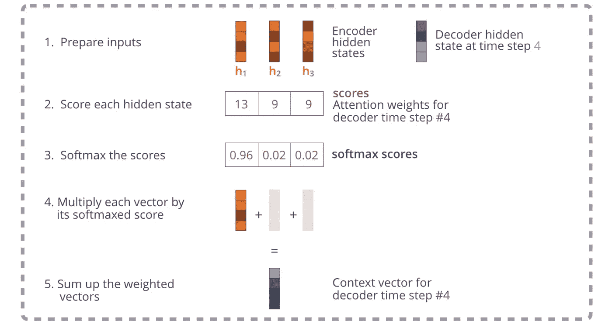*

*来源:[贾勒马的](https://jalammar.github.io/visualizing-neural-machine-translation-mechanics-of-seq2seq-models-with-attention/) (CC BY-NC-SA 4.0)。*

*这种评分练习在解码器端的每个时间步进行。*

*现在当我们把所有的东西放在一起:*

1.  *注意力解码器层采用<end>令牌的嵌入和初始解码器隐藏状态，RNN 处理其输入并产生输出和新的隐藏状态向量(h4)。</end>*
2.  *现在我们使用编码器隐藏状态和 h4 向量来计算这个时间步长的上下文向量 C4。这就是注意力概念被应用的地方，这就是为什么它被称为注意力步骤。*
3.  *我们在一个向量中连接(h4)和 C4。*
4.  *现在，这个向量被传递到一个前馈神经网络，前馈神经网络的输出指示这个时间步长的输出字。*
5.  *这些步骤将在下一个时间步骤中重复。*(请参考下面的幻灯片以获得清晰的视觉效果。)**

*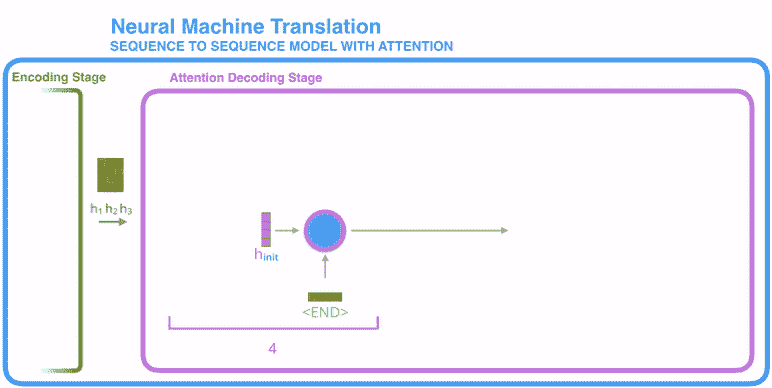*

*最后一步。来源:[贾勒马的](https://jalammar.github.io/visualizing-neural-machine-translation-mechanics-of-seq2seq-models-with-attention/) (CC BY-NC-SA 4.0)。*

*所以，这就是**注意力**的工作方式。*

**例如，在图像字幕问题中的注意力工作:-**

*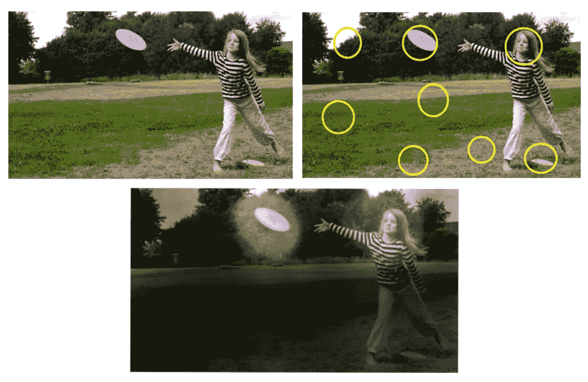*

*图像字幕问题中的注意加工。资料来源:[百货公司](https://www.youtube.com/channel/UC5_6ZD6s8klmMu9TXEB_1IA) (CC0)。*

*现在，记住我之前提出的问题-*

***如何将** **顺序数据并行化？？***

**所以，我们的弹药来了——**

# ***变形金刚***

*2017 年发表的一篇名为*“注意力是你所需要的一切”*的论文进入了画面，它介绍了一种基于注意力层的编码器-解码器架构，称为变压器。*

*一个主要的区别是输入序列可以并行传递，这样可以有效地利用 GPU，也可以提高训练的速度。并且它基于多头注意层，消失梯度问题也被大幅度克服。本文是基于 transformer 在 NMT 上的应用。*

*所以，我们之前强调的两个问题在这里都得到了一定程度的解决。*

*例如，在由简单的 RNN 组成的翻译器中，我们以连续的方式输入序列或句子，一次一个单词，以生成单词嵌入。由于每一个单词都依赖于前一个单词，其隐藏状态也随之动作，所以需要一步一个脚印。而在 transformer 中则不是这样的，我们可以同时传递一个句子的所有单词，同时确定单词嵌入。所以，它实际上是如何工作的，让我们看看未来-*

# *架构:-*

*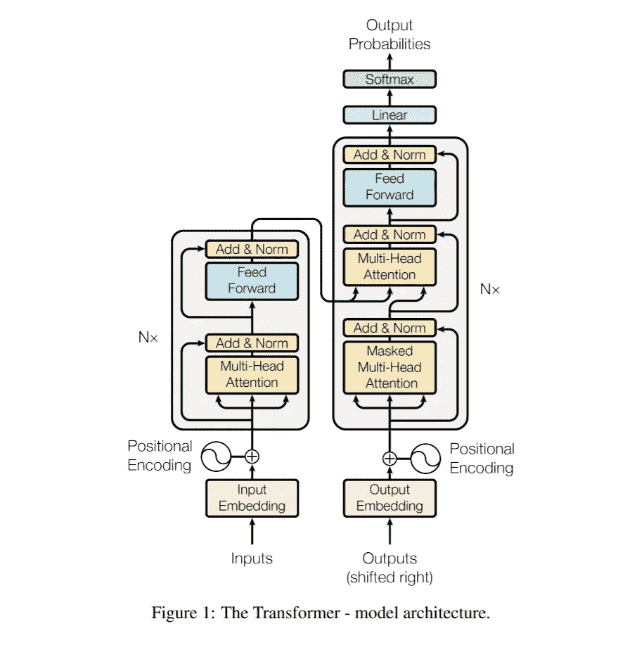*

*来源:[arXiv:1706.03762](https://arxiv.org/abs/1706.03762)**【cs。CL】。***

> ***1。编码器模块-***

*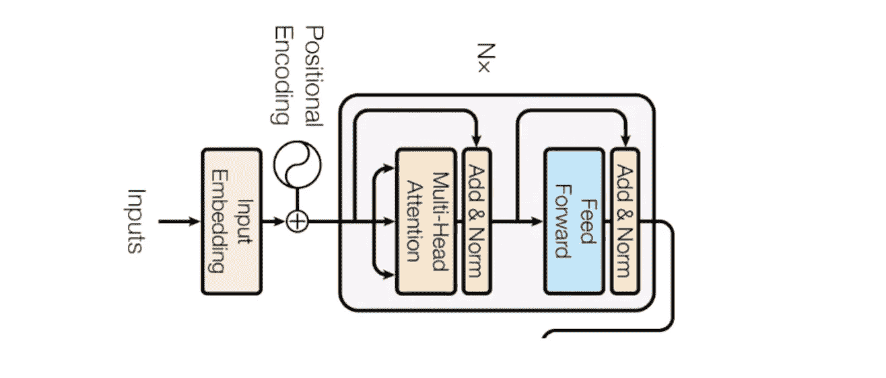*

*来源:[arXiv:1706.03762](https://arxiv.org/abs/1706.03762)**【cs。CL】。***

*这是一个事实，计算机不理解单词，它对数字，向量或矩阵起作用。所以，我们需要把我们的单词转换成一个向量。但是这怎么可能。于是，**嵌入空间**的概念就来了。它就像一个开放的空间或字典，意思相似的单词被组合在一起，或者在该空间中彼此靠近。这个空间被称为嵌入空间，在这里，每个单词，根据其含义，被映射并被赋予特定的值。所以，这里我们把单词转换成向量。*

*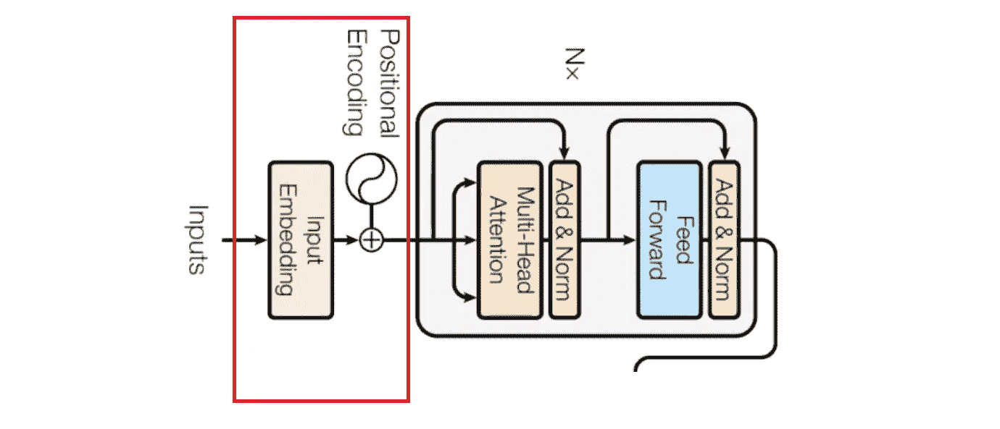*

*来源:[arXiv:1706.03762](https://arxiv.org/abs/1706.03762)**【cs。CL】。***

*但我们将面临的另一个问题是，不同句子中的每个单词都有不同的含义。因此，为了解决这个问题，我们借助了**位置编码器**。它是一个向量，根据单词在句子中的位置给出上下文。*

*词→嵌入→位置嵌入→最终向量，称为上下文。*

*我们的输入已经准备好，现在进入编码器模块。*

> *多头注意力部分-*

*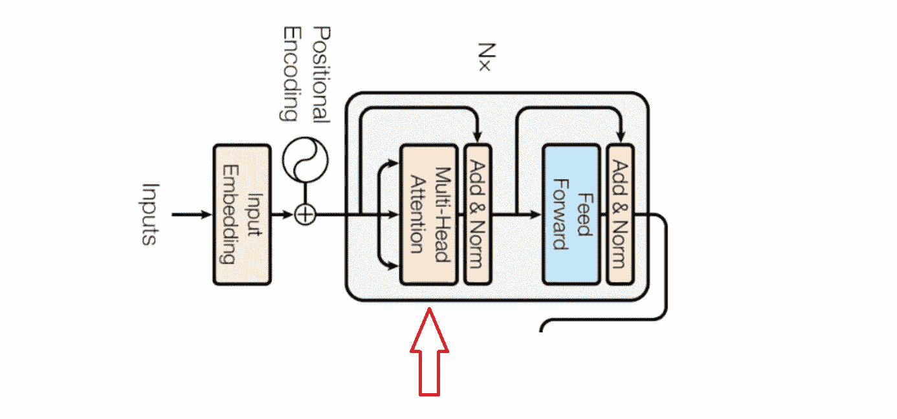*

*来源:[arXiv:1706.03762](https://arxiv.org/abs/1706.03762)**【cs。CL】。***

*现在，变形金刚的主要本质来了，“自我关注”。*

*它关注的是一个特定的单词与句子中其他单词的相关程度。它被表示为一个注意力向量。对于每个单词，我们可以生成一个注意力向量，该向量捕获该句子中单词之间的上下文关系。*

*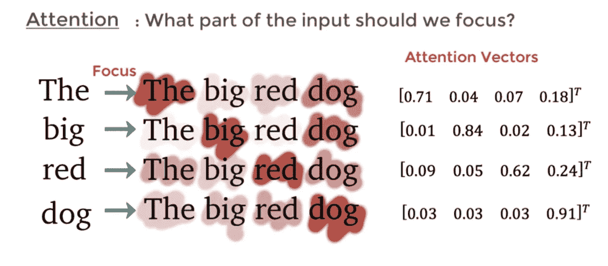*

*来源:[百货公司](https://www.youtube.com/channel/UC5_6ZD6s8klmMu9TXEB_1IA) (CC0)。*

*它所面临的唯一问题是，对于每一个单词，它在句子中的自身价值要高得多，尽管我们倾向于它与句子中其他单词的相互作用。因此，我们确定每个单词的多个注意力向量，并进行加权平均，以计算每个单词的最终注意力向量。*

*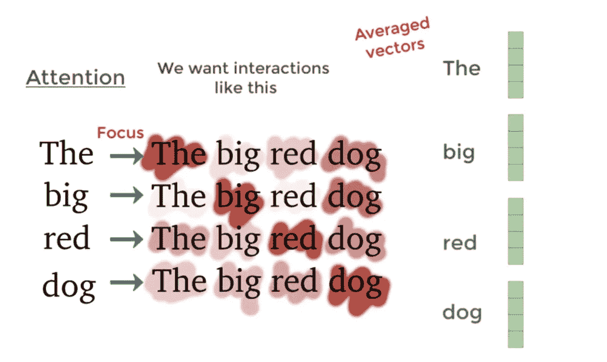*

*资料来源:[百货公司](https://www.youtube.com/channel/UC5_6ZD6s8klmMu9TXEB_1IA) (CC0)。*

*由于我们使用了多个注意力向量，它被称为**多头注意力块**。*

> *前馈网络-*

*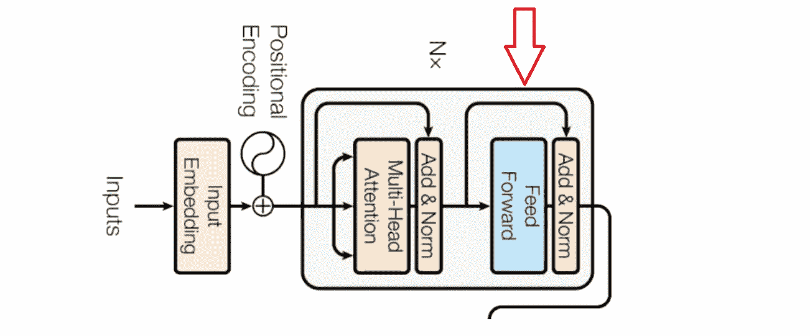*

*来源:[arXiv:1706.03762](https://arxiv.org/abs/1706.03762)**【cs。CL】。***

*现在，第二步是前馈神经网络。这是应用于每个注意力向量的简单前馈神经网络，其主要目的是将注意力向量转换为下一个编码器或解码器层可接受的形式。*

*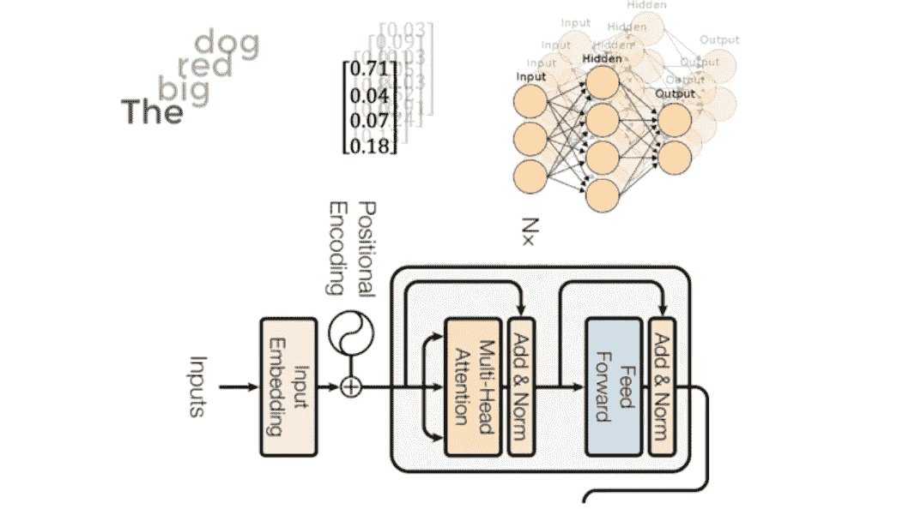*

*来源:[arXiv:1706.03762](https://arxiv.org/abs/1706.03762)**【cs。CL】。***

*前馈网络“一次一个”地接受注意力向量。这里最棒的是不像 RNN 的情况，这里每个注意力向量都是彼此独立的。因此，**并行化**可以在这里应用，*这就造成了所有的差异*。*

*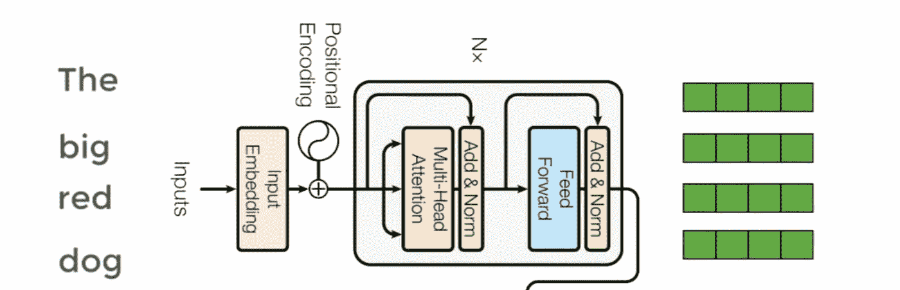*

*编码器的输出。来源:[arXiv:1706.03762](https://arxiv.org/abs/1706.03762)**【cs。CL】。***

*现在，我们可以将所有单词同时传递到编码器模块，并同时获得每个单词的编码向量集。*

> ***2。解码器模块-***

*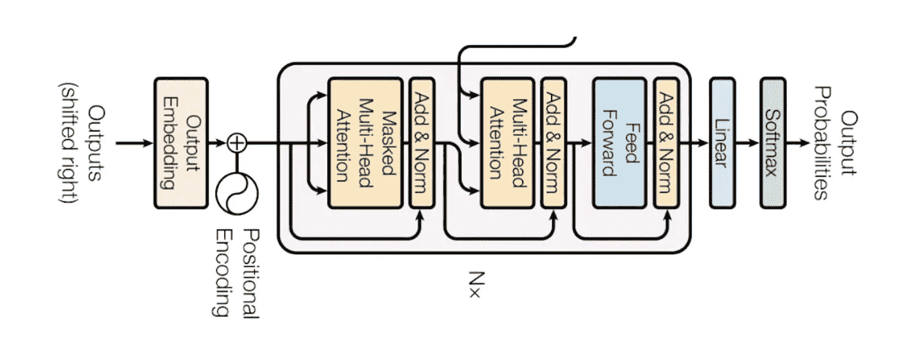*

*来源:[arXiv:1706.03762](https://arxiv.org/abs/1706.03762)**【cs。CL】。***

*现在，就像我们正在训练一个从英语到法语的翻译，所以为了训练，我们需要给出一个英语句子和它翻译的法语句子，让模型学习。所以，我们的英语句子通过编码器模块，法语句子通过解码器模块。*

*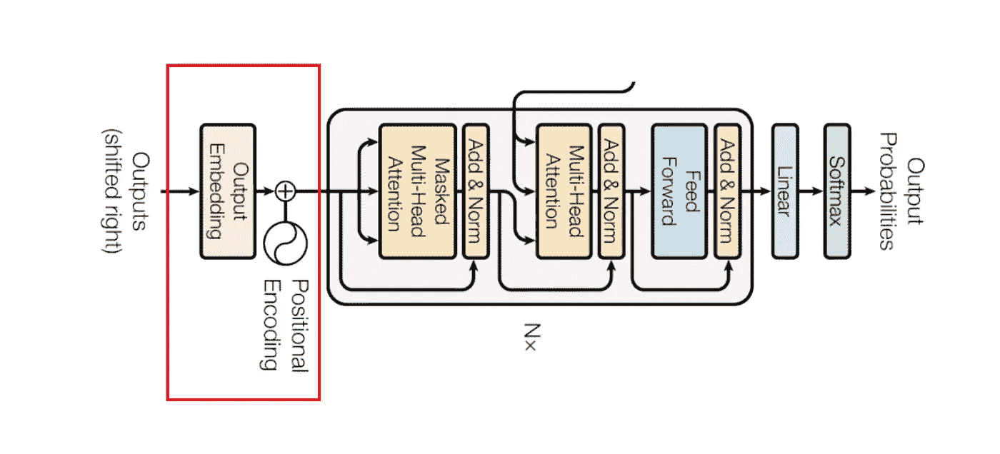*

*来源:[arXiv:1706.03762](https://arxiv.org/abs/1706.03762)**【cs。CL】。***

*首先，我们有嵌入层和位置编码器部分，它将单词转换为各自的向量，这与我们在编码器部分看到的类似。*

> *蒙面多头注意力部分-*

*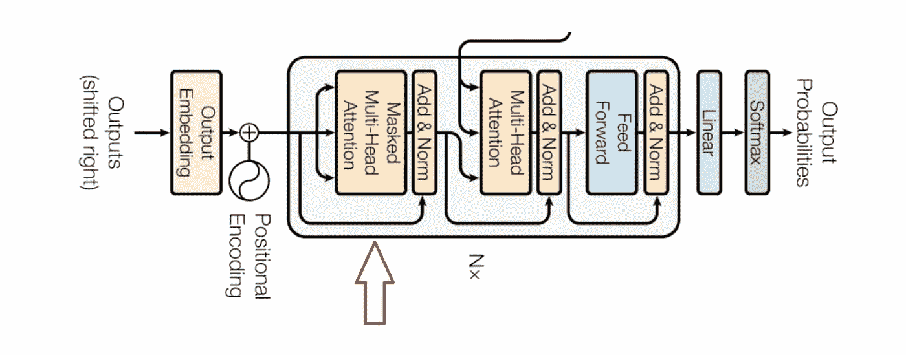*

*来源:[arXiv:1706.03762](https://arxiv.org/abs/1706.03762)**【cs。CL】。***

*现在它将通过自我注意块，在这里为法语句子中的每个单词生成注意向量，以表示每个单词与同一个句子中的每个单词的相关程度。(就像我们在编码器部分看到的一样)。*

*但这个区块被称为**掩蔽多头注意力区块**，我将简单解释一下——*

*为此，我们需要知道学习机制是如何工作的。首先，我们给出一个英语单词，它将使用之前的结果翻译成法语版本，然后它将与实际的法语翻译(我们输入到解码器模块中)进行匹配和比较。在比较两者之后，它将更新它的矩阵值。这就是它在几次迭代后的学习方式。*

*我们观察到的是，我们需要隐藏下一个法语单词，这样一开始它会使用以前的结果来预测下一个单词本身，而不知道真正的翻译单词。如果它已经知道下一个法语单词，学习就没有意义了。因此，我们需要隐藏(掩盖)它。*

*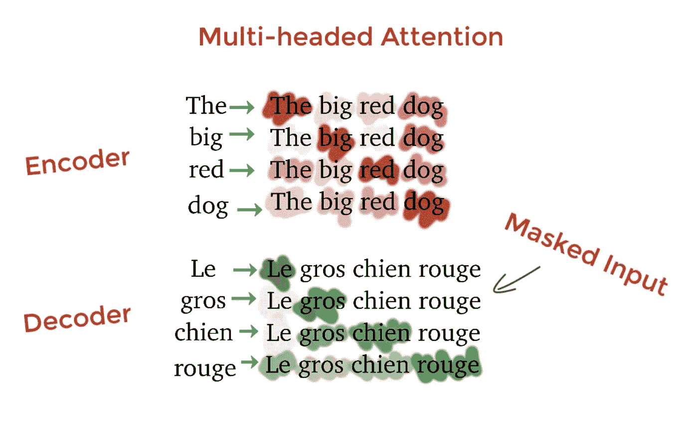*

*这是一个英法翻译的例子。资料来源:[百货公司](https://www.youtube.com/channel/UC5_6ZD6s8klmMu9TXEB_1IA) (CC0)。*

*我们可以从英语句子中取任意一个单词，但只能取法语句子的前一个单词来学习。因此，在执行矩阵运算的并行化时，我们确保矩阵应该**屏蔽**稍后出现的单词，将它们转换为 0，这样注意力网络就不能使用它们。*

*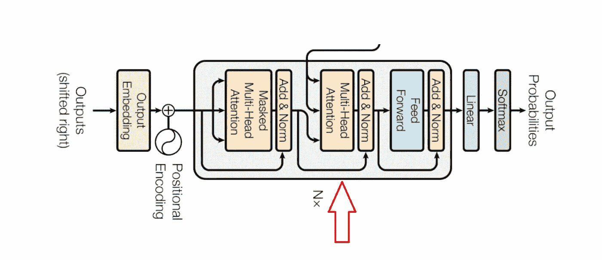*

*来源:[arXiv:1706.03762](https://arxiv.org/abs/1706.03762)**【cs。CL】。***

*现在，来自前一层的结果注意力向量和来自编码器块的向量被传递到另一个**多头注意力块**。(*这部分也是编码器模块的结果进入图像的地方。在该图中还可以清楚地看到，来自编码器模块的结果将传到这里。*)。这就是为什么它被称为**编解码器关注块**的原因。*

*因为对于每个英语和法语句子，每个单词都有一个向量。这个模块实际上完成了英语和法语单词的映射，并找出了它们之间的关系。所以，这是主要的英语到法语单词映射发生的部分。*

*这个模块的输出是英语和法语句子中每个单词的注意力向量。*每一个向量代表两种语言中与其他词的关系*。*

*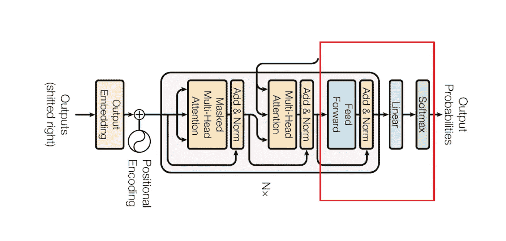*

*来源:[arXiv:1706.03762](https://arxiv.org/abs/1706.03762)**【cs。CL】。***

*现在，我们将每个注意力向量传递到一个前馈单元，它将使输出向量形成易于被另一个解码器模块或线性层接受的形式。*

*线性层是另一个前馈层。它用于在翻译后将维度扩展为法语中的单词数。*

*现在，它通过 Softmax 层，将输入转换为人类可以理解的概率分布。*

*并且在翻译之后以最高的概率产生结果单词。*

*下面是*谷歌的人工智能博客【6】*中举例说明的例子，我把它放在这里供你参考。*

**

*概述-变压器网络的工作。来源:[谷歌 AI](https://ai.googleblog.com/2017/08/transformer-novel-neural-network.html) (CC0)。*

*转换器从为每个单词生成初始表示或嵌入开始。这些由空心圆圈表示。然后，使用自我关注，它从所有其他单词中聚合信息，根据整个上下文信息为每个单词生成一个新的表示，用实心球表示。然后对所有单词并行重复该步骤多次，连续生成新的表示。*

*解码器的操作类似，但从左到右一次生成一个字。它不仅关注其他先前生成的单词，还关注由编码器生成的最终表示。*

*这就是变压器的工作原理，它现在是 NLP 中最先进的技术。它使用了一种 ***自关注机制*** 并解决了并行化问题，产生了非常好的结果。甚至谷歌也使用 BERT 来为普通的自然语言处理应用程序预先训练模型。*

> ***参考文献-***

1.  *[*注意力是你所需要的一切*；Ashish Vaswani，Noam Shazeer，Niki Parmar，Jakob Uszkoreit，Llion Jones，Aidan N. Gomez，Lukasz Kaiser，Illia Polosukhin。](https://arxiv.org/abs/1706.03762)*
2.  *[*基于注意力的神经机器翻译的有效方法*；放大图片作者:Christopher D .](https://arxiv.org/abs/1508.04025)*
3.  *[科拉的博客。](https://colah.github.io/posts/2015-08-Understanding-LSTMs/)*
4.  *[杰伊·阿拉玛的博客。](https://jalammar.github.io/visualizing-neural-machine-translation-mechanics-of-seq2seq-models-with-attention/)*
5.  *百货商店:Youtube。*