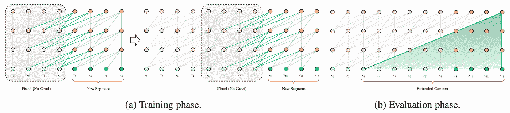
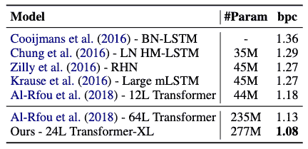

# Transformer-XL 回顾:超越定长上下文

> 原文：<https://towardsdatascience.com/transformer-xl-review-beyond-fixed-length-contexts-d4fe1d6d3c0e?source=collection_archive---------41----------------------->

## “Transformer-XL:超越定长语境的注意力语言模型”述评

这篇论文(“Transformer-XL:固定长度上下文之外的注意力语言模型”)发表在顶级 NLP 会议之一的 ACL 2019 上，作者是谷歌 AI 的研究人员。它提出了 Transformer-XL，这是一种新的架构，能够在不破坏时间一致性的情况下，超越固定长度的上下文理解自然语言。它的主要创新是段级递归机制和新颖的位置编码方案。与传统的 Transformer 模型不同，它可以捕获长期的依赖关系，并解决上下文碎片问题，这是 vanilla Transformer 的主要局限性。实验表明，Transformer-XL 学习依赖的时间比 RNNs 和 vanilla Transformer 长得多。Transformer-XL 还在大型基准数据集的评估中取得了一流的结果。

论文链接:[https://www.aclweb.org/anthology/P19-1285.pdf](https://www.aclweb.org/anthology/P19-1285.pdf)

# 1.背景

语言建模是自然语言处理中的一个重要课题。人们提出了许多像 BERT 和 ELMo 这样的无监督预训练方法。然而，建模长期依赖仍然是一个挑战。递归神经网络(RNNs)，尤其是长短期记忆网络(LSTM)已经成为建模长期依赖的标准解决方案。在 LSTMs 中引入门控和梯度削波技术提高了对长期依赖性建模的能力，但不足以解决这一挑战。此外，由于梯度消失和爆炸，很难优化用于建模长期依赖性的 RNNs。

图一。线段长度为 4 的普通变形金刚。来源:【变压器-XL】【戴等，2019】

转换器被提出来解决这个问题，它允许单词对之间的直接连接，并且比 LSTMs 更好地捕捉长期依赖性。作者定义了原始变形金刚和香草变形金刚。然而，转换器是用固定长度的上下文实现的。它将输入分割成段，并在每个段内进行训练(图 1)。因此，转换器无法捕获超过预定义上下文长度的长期依赖关系。并且固定长度的片段不考虑句子边界，导致上下文碎片，从而导致低效的优化和性能损失。在评估过程中，它通过在每一步中将输入移动一个位置来一次在一个位置进行一次预测，其中数据段从头开始处理。所以评估程序是昂贵的。

为了解决这些限制，作者提出了 Transformer-XL。它重用先前片段中的隐藏状态来支持长期依赖并解决上下文碎片。并且它采用相对位置编码方案来避免时间混淆。

# 2.变压器-XL

图二。线段长度为 4 的 Transformer-XL 型号。来源: [Transformer-XL](https://arxiv.org/abs/1901.02860) 【戴等，2019】

# 2.1 分段级重现

在训练期间，为前一段计算的隐藏状态序列是固定的，并被缓存以作为扩展上下文重用(图 2)。在每个段中，每个隐藏层接收前一个隐藏层的输出和前一个段的输出。它通过使用来自几个先前片段的上下文信息来增加最大可能的依赖性。尽管解决了上下文碎片问题，但是这种片段级递归机制提高了评估速度，因为它可以前进整个长片段，并且使用来自先前片段的表示而无需重新计算。

# 2.2 相对位置编码

天真地应用递归引入了另一个技术挑战。也就是说，位置信息是不一致的，并且来自不同片段的标记具有相同的位置编码，这被称为时间混淆。为了应对这一挑战，Transformer-XL 采用了新的相对位置编码。位置信息偏差被编码在隐藏状态中，这不同于在初始嵌入中结合偏差的其他方法。使用带有可学习转换的固定嵌入使得它更直观，并且更可推广到更长的序列。相对位置编码使得段级递归成为可能，因此 Transformer-XL 可以比普通的 Transformer 模型建立更长期的依赖关系。

# 3.实验和结果

作者将 Transformer-XL 应用于单词级和字符级数据集，包括 WikiText-103、text8、enwik8、十亿单词和 Penn Treebank，并将其与其他模型进行比较。

表 1:WikiText-103 的结果。来源:【变压器-XL】【戴等，2019】

在 WikiText-103 数据集上，Transformer-XL 达到了 18.3 的困惑度，相比之下，之前最先进的(SoTA)结果(Baevski & Auli)达到了 20.5 的困惑度(表 1)。

表 2:环境观察 8 的结果。来源:【变压器-XL】T5【戴等，2019】

在 enwik8 数据集上，12 层 Transformer-XL 实现了 1.06 比特每字符(bpc)，这与 Al-Rfou 等人之前的 SoTA 结果相似..24 层 Transformer-XL 将 SoTA bpc 从 1.06 提高到 0.99(表 2)。

表 3:文本 8 的结果。来源: [Transformer-XL](https://arxiv.org/abs/1901.02860) 【戴等，2019】

在 enwik8 上使用相同的超参数时，Transformer-XL 将 SoTA bpc 从 1.13 降至 1.08(表 3)。

表 4:十亿字的结果。来源:【变压器-XL】【戴等，2019】

十亿字数据集只有短期依赖性，但 Transformer-XL 也实现了新的 SoTA 结果，将 SoTA 困惑度从 23.7 降低到 21.8(表 4)。

表 5:宾夕法尼亚树库的结果。来源:【变压器-XL】T5【戴等，2019】

在只有 100 万训练令牌的单词级 Penn Treebank 数据集上，与没有两步微调的其他模型相比，Transformer-XL 将 SoTA 困惑度从 55.3 提高到 54.52(表 5)。这表明 Transformer-XL 可以很好地在小数据集上推广。

表 6:相对有效上下文长度比较。来源: [Transformer-XL](https://arxiv.org/abs/1901.02860) 【戴等，2019】

作者提出了一个新的度量，相对有效上下文长度(RECL)，它定义在一个模型组上，长上下文的增益通过相对于最佳短上下文模型的相对改进来衡量。RECL 中的参数 *r* 限制了 top- *r* 硬示例上的比较。如表 6 所示，Transformer-XL 可以模拟比 RNN 长 80%到 133%的依赖性，比普通 Transformer 长 291%到 447%的依赖性。它表明段级递归和相对位置编码都有助于 Transformer-XL 的较长 RECL。在 WikiText-103 和十亿字数据集上的消融研究也表明，Transformer-XL 优于其他模型，因为它可以对递归和新编码的长期依赖性进行建模。

此外，由于不需要重新计算，Transformer-XL 在评估过程中比普通变压器快 1874 倍。

# 4.结论

Transformer-XL 在多个数据集上获得新的 SoTA 困惑或 bpc 结果。结合递归和相对位置编码，它可以模拟比 RNNs 和普通变压器更长期的依赖性，并在评估过程中大大降低计算成本。Transformer-XL 在其他领域也很有效，比如生成长文章和改进语言模型预处理方法，比如 BERT 和 ALBERT。

# 5.相关著作

你所需要的只是注意力

本文提出了 Transformer，这是一种完全依赖于注意力机制来模拟输入和输出之间的全局依赖关系的新型模型架构。Transformer 模型允许更多的并行化，因此需要更少的培训时间。Transformer 在 WMT 2014 年英语到法语翻译任务上取得了新的 SoTA 结果。原始变压器是本文介绍的 Transformer-XL 的基础。

引文:Ashish Vaswani、Noam Shazeer、Niki Parmar、Jakob Uszkoreit、Llion Jones、Aidan Gomez、ukasz Kaiser 和 Illia Polosukhin。2017.你需要的只是关注。在*神经信息处理系统进展*中，第 5998–6008 页。

(2)具有更深自我关注的字符级语言建模

本文提出了一种用于角色级建模的深度、非递归的 transformer 模型。具有因果注意的变压器自我注意层用于处理固定长度的输入和预测即将出现的字符。Al-Rfou 等人设计了三个辅助损耗来训练深度变压器网络，其性能优于 LSTMs，并在 text8 和 enwik8 数据集上获得了新的 SoTA 结果。但是，它使用固定长度的数据段，因此它无法捕获任何超过预定义上下文长度的长期依赖关系。这一限制促使作者设计 trans former-XL 来模拟长期依赖性。

引文:Rami Al-Rfou，Dokook Choe，Noah Constant，Mandy Guo 和 Llion Jones。2018.具有更深自我关注的字符级语言建模。在*AAAI 人工智能会议记录*，第 3159-3166 页。

(3) Bert:用于语言理解的深度双向转换器的预训练

介绍了一种新的语言表示模型——来自变压器的双向编码器表示(BERT)。它被设计成用未标记的文本预先训练双向语言表示。然后，预训练的 BERT 可以通过一个额外的输出层微调到各种任务，并实现 SoTA 结果。实际上，BERT 只是将长文本分成固定长度的较短片段，导致了上下文碎片问题。Transformer-XL 解决了上下文碎片问题，因此它可以用于改进 BERT，然后在不同类型的任务中获得新的 SoTA 结果。

引文:雅各布·德夫林、张明蔚、肯顿·李和克里斯蒂娜·图塔诺瓦。2019.Bert:用于语言理解的深度双向转换器的预训练。在*计算语言学协会北美分会 2019 年会议论文集:人类语言技术*，第 4171–4186 页。

(4)具有相对位置表征的自我注意

本文提出了一种将序列元素之间的相对位置表示或距离结合到变压器的自注意机制中的方法。与绝对位置表示相比，相对位置编码可以提高 WMT 2014 英德数据集上的翻译质量。它启发了 Transformer-XL 的作者们去衍生一种新形式的相对位置编码。Transformer-XL 的新的相对位置编码解决了时间混淆问题，并且在经验上具有更好的通用性。

引文:彼得·肖、雅各布·乌兹科雷特和阿希什·瓦斯瓦尼。2018.自我注意与相对位置表征。在*计算语言学协会北美分会 2018 年会议记录:人类语言技术*中，第 464-468 页。

(5) ALBERT:一个用于语言表达自我监督学习的 Lite BERT

本文提出了两种新的技术来减少 BERT 中的参数，有助于降低存储和训练时间的成本。它还引入了句子顺序预测的自我监督损失，重点是建立句子间的一致性模型。它用比 BERT-large 更少的参数在不同的基准数据集上建立新的 SoTA 结果。与 BERT 一样，它也将长文本分割成固定长度的片段，从而导致潜在的上下文碎片问题。Transformer-XL 可用于解决 ALBERT 中的上下文碎片问题，从而进一步提高其性能。

引文:兰，陈明达，萨巴斯蒂安古德曼，凯文金佩尔，皮尤什夏尔马，拉杜索里科特。2019.ALBERT:一个用于语言表达自我监督学习的 Lite BERT。在*国际学术交流会议*。