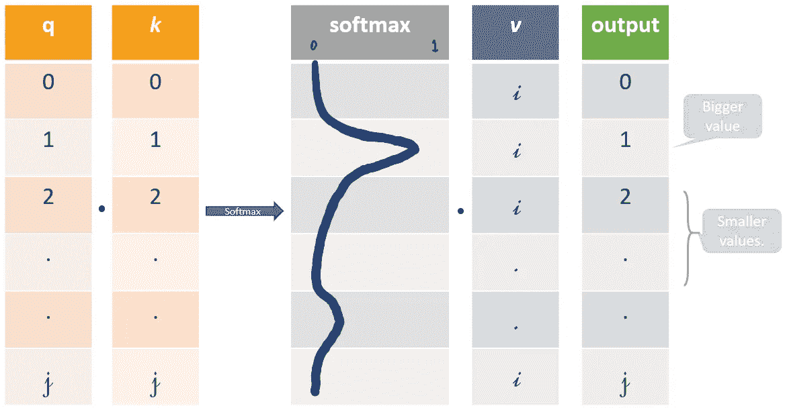
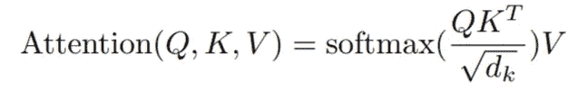
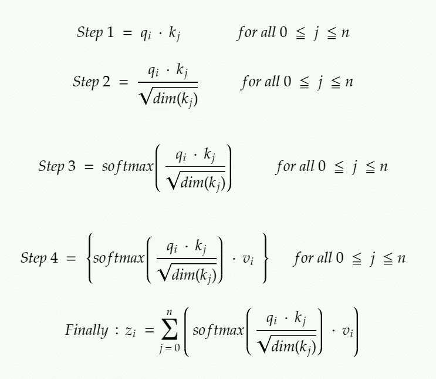
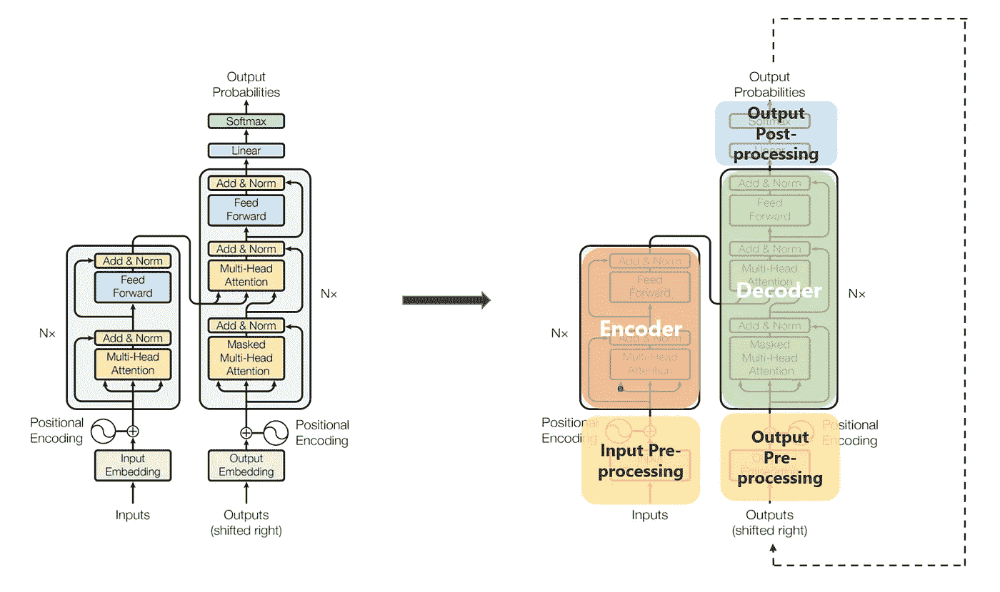
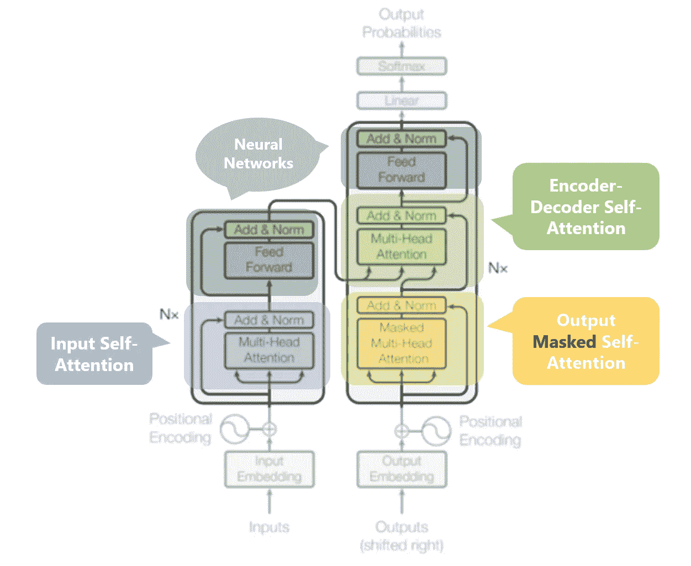
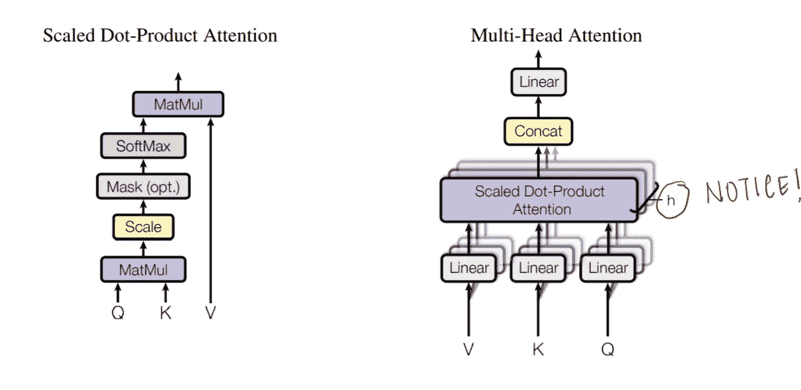

# 变形金刚(电影名)

> 原文：<https://towardsdatascience.com/transformers-89034557de14?source=collection_archive---------1----------------------->

## 或者我喜欢称之为类固醇引起的注意。💉💊


阿瑟尼·托古列夫在 [Unsplash](https://unsplash.com?utm_source=medium&utm_medium=referral) 上的照片

不，这篇文章不是关于美国科幻动作电影系列——这里没有擎天柱。它也与用于将能量从一个电路转移到另一个电路的电气设备无关。你会问，这是怎么回事？

这是有史以来最科幻的领域之一，人工智能——特别是自然语言处理，它在传递信息方面非常出色，并得到了很好的利用。(看我在那里做了什么。:P)

这篇文章基于一篇论文:[注意力是你所需要的全部](https://arxiv.org/abs/1706.03762)。附:作者选择这个标题并不是开玩笑，因为你需要所有的注意力来处理这个问题。但是不要让这吓到你，这是非常值得的！！

# 什么是变压器？

NLP 中的 Transformer 是一个**新颖的架构**，旨在解决序列到序列的任务，同时轻松处理长距离依赖。它完全依靠自我关注来计算其输入和输出的表示**，而不使用**序列对齐的 RNNs 或卷积。🤯

如果你还记得我以前的帖子，[理解深度学习中的注意力](/attaining-attention-in-deep-learning-a712f93bdb1e)，我们讨论了许多模型在处理长期依赖时如何以及为什么会失败。注意力的概念在某种程度上让我们克服了这个问题，现在在《变形金刚》中，我们将建立在注意力之上，并释放其全部潜力。

[](/attaining-attention-in-deep-learning-a712f93bdb1e) [## 理解深度学习中的注意力

### 一点点关注怎么改变了 AI 游戏！

towardsdatascience.com](/attaining-attention-in-deep-learning-a712f93bdb1e) 

# 潜入变形金刚之前需要知道的几件事

## 自我关注

让我们从重新审视 NLP 宇宙中的注意力开始。[理解深度学习中的注意力](/attaining-attention-in-deep-learning-a712f93bdb1e)。(*我为这些明目张胆的自我广告道歉，但是认真读一读。在变形金刚下会对你帮助大很多。我保证。*)

***注意力让我们在预测我们的输出序列*** 时，专注于我们输入序列的部分。如果我们的模型预测单词“*胭脂*”(红色的法语翻译)，我们很可能在我们的输入序列中找到单词“*红色*”的高权重年龄。所以，在某种程度上，注意力让我们在输入单词“ *rouge* ”和输出单词“ *red* ”之间建立了某种联系/关联。

> **自我注意**，有时被称为内部注意，是一种与单个序列的不同位置相关的注意机制，以便计算该序列的表示。

简单来说， ***自我关注帮助我们在同一个句子中建立相似的联系。*** 看下面这个例子:

```
“I poured water from the *bottle* into the ***cup*** until **it** was ***full***.”
it => cup“I poured water from the **bottle** into the cup until **it** was ***empty***.”
it=> bottle
```

通过改变一个词“*满了*”——>——*空了*”*它的参照对象为*变了。如果我们在翻译这样一个句子，我们就会想知道“*这个词它*指的是什么。

## 模型中可能存在的三种注意力:

1.  ***编解码器注意* :** 注意输入序列和输出序列之间的关系。
2.  ***输入序列中的自我关注* :** 关注输入序列中的所有单词。
3.  ***输出序列中的自我注意:*** 这里我们要警惕的一点是，自我注意的范围仅限于给定单词之前出现的单词。这防止了模型训练期间的任何信息泄漏。这是通过屏蔽在每一步之后出现的单词来实现的。因此，对于步骤 1，只有输出序列的第一个字不被屏蔽，对于步骤 2，前两个字不被屏蔽，依此类推。

## 键、值和查询:

我刚才在这个标题中随机给你的三个词是向量，因为抽象对于计算自我注意力是有用的，下面会有更多的细节。这些通过将您的输入向量( *X* )乘以训练时学习的权重矩阵来计算。

*   ***查询向量***:*q*=*X * Wq。*把这个当做现在的词。
*   ***关键向量****:**k*=*X * Wk。*把这当成价值向量的索引机制。类似于哈希映射中的键值对，其中键用于唯一地索引值。
*   ***值向量:*** *v* = *X * Wv。*把这个当做输入单词中的信息。

我们想要做的是获取查询 *q* 并通过对 *q* 和 *k* 做点积来找到最相似的键 *k* 。最接近的查询关键字乘积将具有最高值，随后是 softmax，它将驱动具有接近 0 的较小值的 *q.k* 和具有较大值的 *q.k* 向 1 移动。这个 softmax 分布乘以*v。*乘以~1 的值向量将得到更多关注，而乘以~0 的值向量将得到较少关注。这些 *q、k* 和 *v* 向量的大小被各种实现称为“*”。*

**

*这些值代表 q、k 和 I 的指数。*

*所有这些矩阵 *Wq、Wk* 和 *Wv* 都是在模型训练期间联合训练时学习到的。*

## *从 q、k 和 v 计算自我注意力:*

**

*自我关注的公式。资料来源:论文。*

*如果我们为输入单词计算自我注意，*

*   ****第一步:*** 将 qᵢ乘以 word 的 kⱼ关键向量。*
*   ****第二步:*** 然后用这个乘积除以关键向量的维数的平方根。
    完成此步骤**是为了获得更好的梯度流量**，这在前面步骤中点积值过大的情况下尤为重要。因为直接使用它们可能会将 softmax 推入梯度流量非常小的区域。*
*   ****第三步:*** 一旦我们有了所有 *j* 的分数，我们就把这些通过一个 softmax。我们得到每个 *j* 的归一化值。*
*   ****第四步:*** 用 *v* ᵢ 向量乘以每个 *j* 的 softmax 分数。
    这里的想法/目的是，非常类似的注意，通过将它们乘以来自 softmax ~1 的高概率分数，仅保留我们想要关注的输入单词的值 *v* ，并且通过将它们驱向 0 来移除其余的值，即通过将它们乘以来自 softmax 的低概率分数~0 来使它们非常小。*

**

*计算第 I 个输入单词的自我注意输出。如果你正在寻找自我注意和注意之间的类比，考虑 z 服务于上下文向量的目的，而不是全局对齐权重。*

# *变形金刚*

*⚠️ **我们将把这个可怕的野兽分解成小野兽，这一切都将变得有意义。(我承诺#2)***

**

*(左)变压器架构。资料来源:论文。(右图)为了更好地理解，对其进行了抽象。*

## *Beast #1:编码器-解码器堆栈*

****编码器*** :编码器将输入的符号表示序列 *(x* ₁ *，…，x* ₙ *)* 映射到表示序列 *z = (z* ₁ *，…，z* ₙ *)* 。把它们想象成经过某种后处理的自我关注的输出。*

*每个编码器有两个子层。*

1.  *输入向量上的**多头自我关注机制**(想想并行化的和高效的自我关注的兄弟)。*
2.  *一个简单的位置式**全连接前馈网络**(想想后处理)。*

*查看[这张](https://peltarion.com/knowledge-center/documentation/modeling-view/build-an-ai-model/blocks/bert-encoder)伯特中使用的编码器模块的绝对炸弹 3D 图。说真的，你不能错过这个！！！这就像一个全新层次的理解。*

****解码器*** :给定 *z* ，解码器然后一次生成一个符号输出序列 *(y* ₁ *，…，y* ₘ *)* 。*

*每个解码器有三个子层。*

1.  *一种 ***屏蔽*** **多头自关注机制**对上一次迭代的输出向量。*
2.  *编码器输出上的**多头注意机制**和解码器中的屏蔽多头注意。*
3.  *一个简单的，位置式的**全连接前馈网络**(想想后处理)。*

*另外几点:*

*   *在原始论文中，编码器堆栈中有 6 层(2 个子层版本)，解码器堆栈中有 6 层(3 个子层版本)。*
*   *模型中的所有子层以及嵌入层产生相同维度的输出。这样做是为了方便剩余的连接。*

## *编码器-解码器堆栈中的 beast # 2—多头注意:*

**

*编码器和解码器中的三种注意以及前馈神经网络。*

*我们刚刚注意到，每个子层的输出需要具有相同的维度，在本文中为 512。zᵢ需要有 512 个维度。vᵢ需要有 512 个维度，因为 zᵢ只是 vᵢs.的加权和*

*此外，我们希望允许模型关注不同的位置，这是通过**使用不同的 *q、k* 和 *v* 向量集**多次计算自我关注度，然后取所有这些输出的平均值，以获得我们的最终 *z* 。*

*因此，我们不是处理这些庞大的向量并平均多个输出，而是将我们的 *k、q* 和 *v* 向量的大小减少到某个更小的维度——同时减少 *Wq、Wk* 和 *Wv* 矩阵的大小。我们将 *k、*q、 *v、*的多个集合( *h* )统称为一个*注意力头，*因此得名*多头*注意力。最后，我们将它们连接起来，而不是求平均值来得到最终的 *z* 。*

*级联向量的大小将会太大而不能馈送到下一个子层，所以我们通过将其乘以另一个学习矩阵 *Wo* 来缩小它。*

**

*(左)缩放的点积注意力。(右)多头注意力由几个并行运行的注意力层组成。资料来源:论文。*

*多个注意头允许模型在不同位置共同注意来自不同表示子空间的信息，这被平均在单个注意头中所抑制。*

## *Beast #3—输入和输出预处理:*

*使用某种形式的嵌入来表示输入单词。编码器和解码器都是这样做的。*

*单词嵌入本身缺乏任何位置信息，而这在 rnn 中是通过它们的顺序性质实现的。同时，在自我关注中，由于 softmax，任何这样的位置信息都丢失了。*

*为了保留位置信息，转换器将向量注入到各个输入嵌入中(可以使用单词嵌入来对应于输入单词)。这些向量遵循模型学习的特定周期函数(例如:具有不同频率的各种正弦/余弦的组合，简而言之，彼此不同步),并且能够**基于值**确定单个单词彼此**的位置。***

*这个注入的向量被称为“*位置编码*，并被添加到编码器和解码器堆栈底部的输入嵌入中。*

## *Beast #4 —解码器堆栈:重访*

*解码器堆栈在每一步的输出都反馈到下一个时间步的解码器，这与 RNNs 中前一步的输出被用作下一个隐藏状态非常相似。正如我们对编码器输入所做的那样，我们将位置编码嵌入并添加到这些解码器输入中，以保留每个单词的位置。这种位置编码+单词嵌入组合然后被馈入一个被掩蔽的多头自我注意。*

*解码器堆栈中的这个自我关注子层被修改，以防止位置关注后续位置——你不能看未来的单词。该屏蔽确保位置 *i* 的预测仅依赖于小于 *i* 位置的已知输出。*

*编码器堆栈的输出随后被用作多组关键向量***【k】***和值向量 ***v*** ，用于“编码器解码器注意”——在图中以绿色显示——层。这有助于解码器关注该步骤的输入序列中上下文相关的部分。(类似于全局注意力向量的部分。)的 ***q*** 向量来自于“输出自我注意力”层。*

*一旦我们得到解码器的输出，我们再次进行 softmax 来选择单词的最终概率。*

# *结论*

*让我们以一个快速的总结性复习来结束。*

*   *我们从理解什么是自我关注以及如何从这些 *v，k，q* 向量计算自我关注开始。*
*   *多头注意力是对自我注意力的有效修改，它使用多个更小的 *v，k，q* 集合，并连接每个集合的输出，以获得最终的 *z.**
*   *然后我们看到了这三种自我关注是如何在模型中使用的。*
*   *随后对编码器和解码器堆栈的输入进行预处理。*

# *参考文献+推荐阅读*

*   *[了解深度学习中的深度注意力](/attaining-attention-in-deep-learning-a712f93bdb1e)如果你面临注意力的问题。*
*   *图示变压器——有很好的视觉效果和解释。*
*   *[https://www . analyticsvidhya . com/blog/2019/06/understanding-transformers-NLP-state-the-art-models/](https://www.analyticsvidhya.com/blog/2019/06/understanding-transformers-nlp-state-of-the-art-models/)*

*   *YouTube 视频#1:获得模型直觉的绝佳资源。特别是如果你想进一步了解位置编码的话。*

*   *YouTube 视频# 2:Lukasz Kaiser 关于这篇解释自我关注的论文的讲话。他是这篇论文的作者之一。*

> *我很高兴你坚持到了这篇文章的结尾。*🎉我希望你的阅读体验和我写这篇文章时一样丰富。*💖***
> 
> *如果你喜欢这篇文章，请点击这里查看我的其他文章。*
> 
> *如果你想联系我，我会选择推特。*