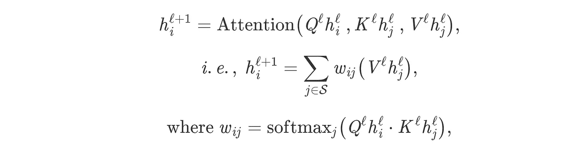
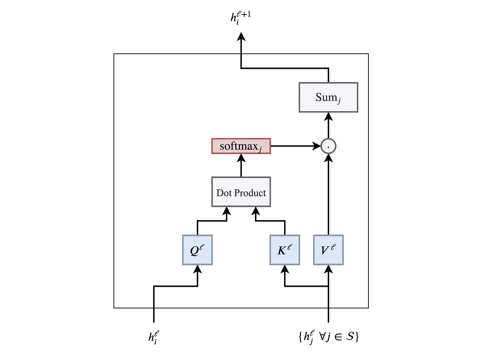
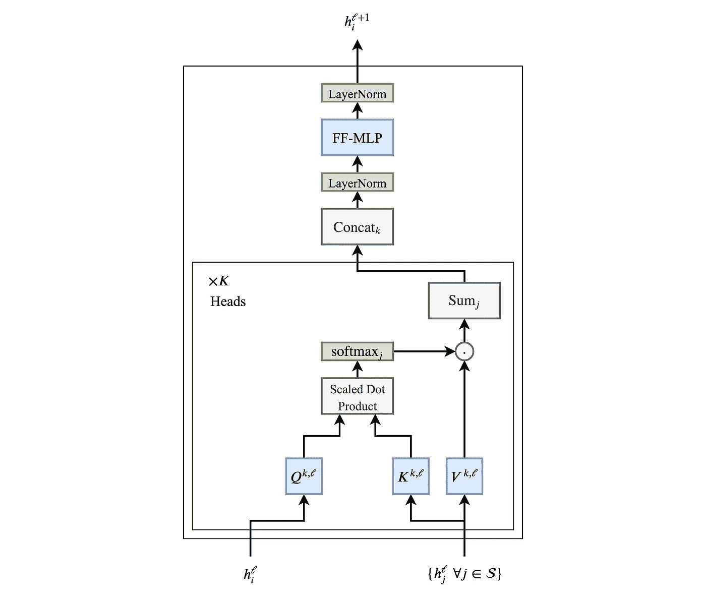
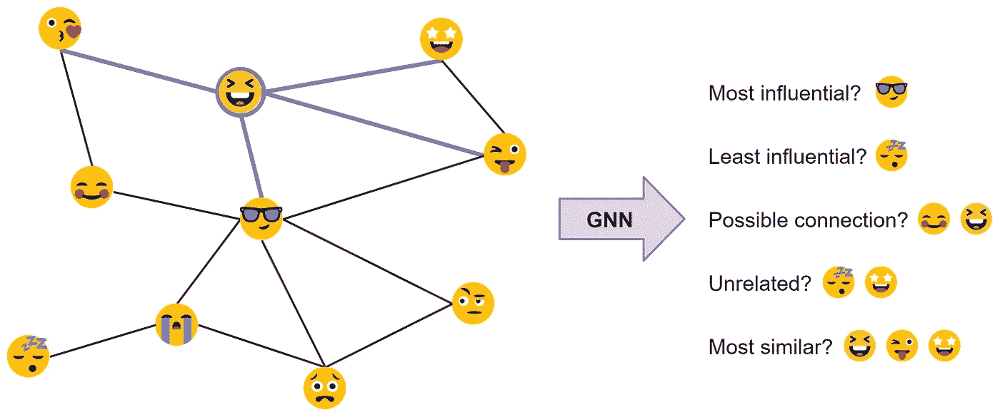
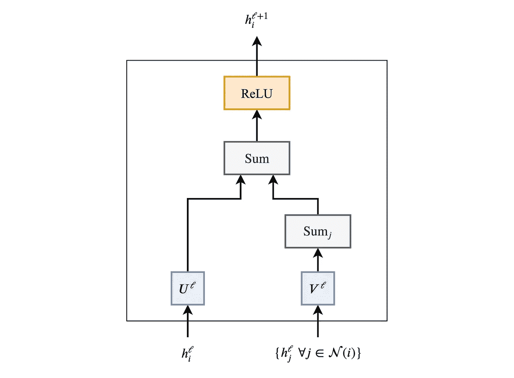
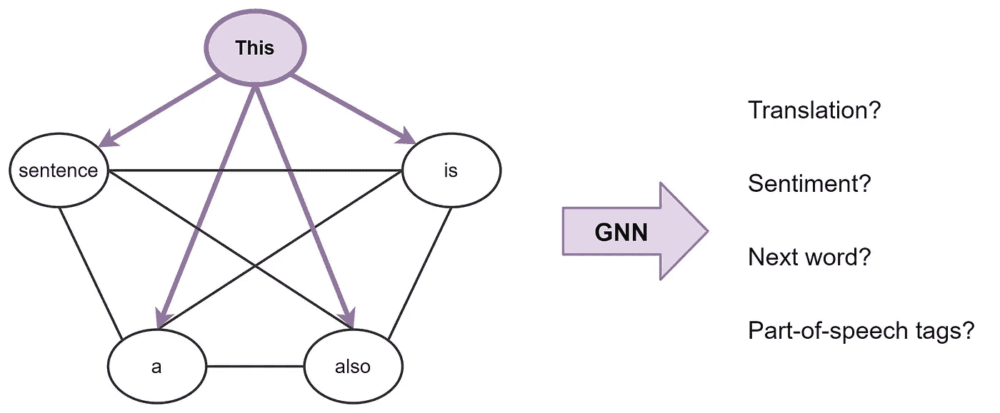
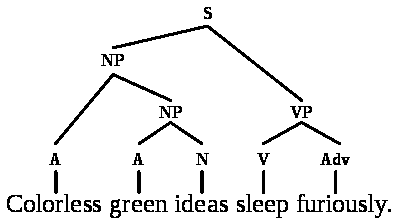
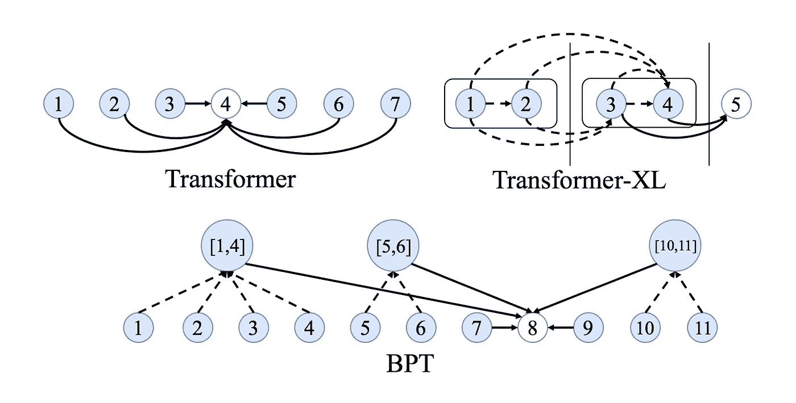
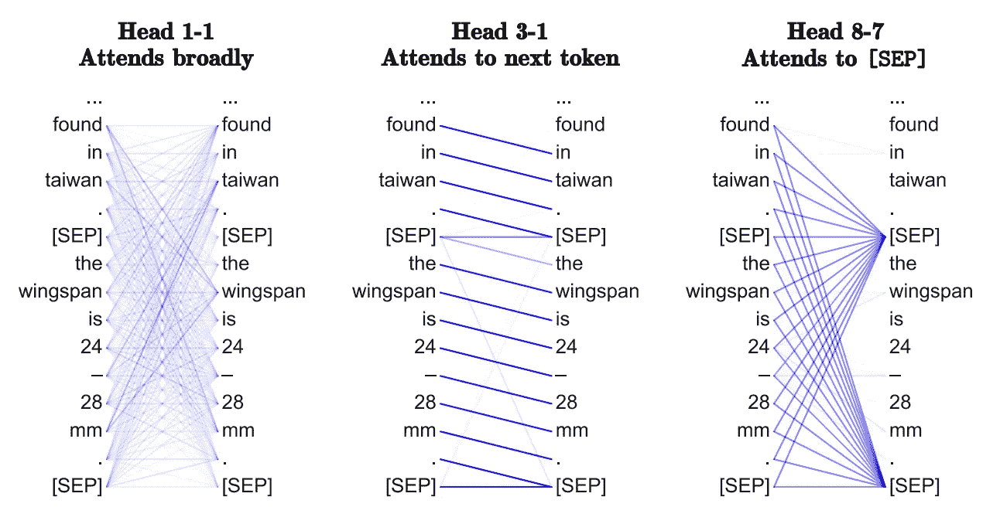
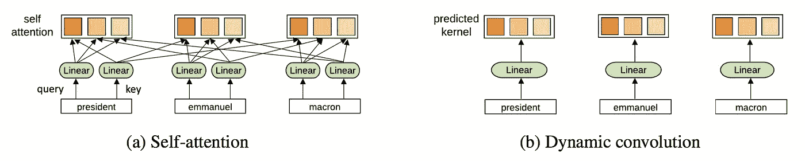

# 变压器是图形神经网络

> 原文：<https://towardsdatascience.com/transformers-are-graph-neural-networks-bca9f75412aa?source=collection_archive---------7----------------------->

## 这篇文章的目的是在 NLP 的 Transformer 架构背后建立直觉，以及它与图上神经网络的联系。

阿瑟尼·托古列夫在 [Unsplash](https://unsplash.com/s/photos/transformers?utm_source=unsplash&utm_medium=referral&utm_content=creditCopyText) 上的照片

工程师朋友经常问我:图深度学习听起来很棒，但是有没有大的商业成功案例？在实际应用中部署了吗？

除了那些显而易见的——在 [Pinterest](https://medium.com/pinterest-engineering/pinsage-a-new-graph-convolutional-neural-network-for-web-scale-recommender-systems-88795a107f48) 、 [Alibaba](https://arxiv.org/abs/1902.08730) 和 [Twitter](https://blog.twitter.com/en_us/topics/company/2019/Twitter-acquires-Fabula-AI.html) 的推荐系统——一个稍微微妙的成功故事是[**Transformer architecture**](https://arxiv.org/abs/1706.03762)，它已经[被](https://openai.com/blog/better-language-models/) [storm](https://nv-adlr.github.io/MegatronLM) 带走了[NLP](https://www.microsoft.com/en-us/research/project/large-scale-pretraining-for-response-generation/)[行业](https://ai.facebook.com/blog/roberta-an-optimized-method-for-pretraining-self-supervised-nlp-systems/) [。](https://blog.einstein.ai/introducing-a-conditional-transformer-language-model-for-controllable-generation/)

通过这篇文章，我想在[图形神经网络(GNNs)](https://graphdeeplearning.github.io/project/spatial-convnets/) 和变形金刚之间建立联系。我将谈论 NLP 和 GNN 社区中模型架构背后的直觉，使用等式和数字建立联系，并讨论我们如何一起工作来推动进展。

让我们从讨论模型架构的目的开始——*表示学习*。

# 自然语言处理中的表征学习

在高层次上，所有神经网络架构将输入数据的*表示*构建为向量/嵌入，其编码关于数据的有用的统计和语义信息。这些*潜在的*或*隐藏的*表征然后可以被用来执行一些有用的事情，比如对一幅图像进行分类或者翻译一个句子。神经网络*学习*通过接收反馈来建立越来越好的表示，通常是通过误差/损失函数。

对于自然语言处理(NLP)，传统上，**递归神经网络** (RNNs)以顺序方式构建句子中每个单词的表示，*即*、**一次一个单词**。直观地说，我们可以把 RNN 层想象成一条传送带，上面的文字从左到右进行自回归处理。最后，我们为句子中的每个单词获得一个隐藏的特征，我们将它传递给下一个 RNN 层或用于我们选择的 NLP 任务。

> *我强烈推荐 Chris Olah 的传奇博客 recaps 关于 NLP 的*[*RNNs*](http://colah.github.io/posts/2015-08-Understanding-LSTMs/)*和* [*表象学习*](http://colah.github.io/posts/2014-07-NLP-RNNs-Representations/) *。*

RNNs 以连续的方式构建句子中每个单词的表示，*即*、**一次一个单词**。另一方面，变形金刚使用一种注意力机制来计算出**在句子中的重要性。**

最初为机器翻译引入的**变形金刚**已经逐渐取代主流 NLP 中的 rnn。该架构采用了一种全新的表示学习方法:完全消除递归，变形金刚使用一种[注意力](https://distill.pub/2016/augmented-rnns/) [机制](https://lilianweng.github.io/lil-log/2018/06/24/attention-attention.html)来构建每个单词的特征，以计算出**在句子中的所有其他单词**对于前述单词的重要性。知道了这一点，单词的更新特征就是所有单词的特征的线性变换的总和，通过它们的重要性来加权。

> *回到 2017 年，这个想法听起来非常激进，因为 NLP 社区非常习惯于用 RNNs 处理文本的顺序-一次一个单词-风格。论文标题大概是火上浇油吧！*
> 
> *为了重述，扬尼克·基尔彻制作了一部出色的* [*视频概述*](https://www.youtube.com/watch?v=iDulhoQ2pro) *。*

# 分解变压器

让我们通过将前面的段落翻译成数学符号和向量的语言来发展对架构的直觉。我们从层 *ℓ* 到层 *ℓ+1* 更新句子 *S* 中第 *i* 个单词的隐藏特征 *h* 如下:

其中 *j∈ S* 表示句子中的单词集合，而 *Q，K，V* 是可学习的线性权重(分别表示用于注意力计算的 **Q** uery， **K** ey 和 **V** 值)。对句子中的每个单词并行执行注意机制，以在 *one shot* 中获得它们的更新特征 RNNs 上的变形金刚的另一个加分项，它逐词更新特征。

我们可以通过以下管道更好地理解注意机制:

吸收单词 *h_i^ℓ* 的特征和句子“h_j^ℓ”中的其他单词集合；∀ j∈ S，我们通过点积计算每一对(I，j)的注意力权重 w_{ij}，随后是所有 j 的 softmax。最后，我们通过对由它们相应的 w_{ij}加权的所有 h_j^ℓ's 求和来产生单词 I 的更新的单词特征 h_i^{ℓ+1}。句子中的每个单词并行地经历相同的流水线来更新其特征。

# 多头注意力机制

让这种点积注意力机制发挥作用被证明是棘手的——糟糕的随机初始化会破坏学习过程的稳定性。我们可以通过并行执行多个注意力“头部”并连接结果(每个头部现在有单独的可学习权重)来克服这一点:

其中 *Q^k,K^k、V^k* 是第 *k* 注意头的可学习重量，而 *O* 是向下投影，以匹配各层的 *h_i^{ℓ+1}* 和 *h_i^ℓ* 的尺寸。

多个头部允许注意力机制实质上“对冲赌注”，从上一层查看隐藏特征的不同转换或方面。我们稍后会详细讨论这一点。

# 比例问题和前馈子层

推动最终变压器架构的一个关键问题是，在之后的单词*的特征，注意机制可能处于**不同的标度**或**大小** : (1)这可能是由于当对其他单词的特征求和时，一些单词具有非常尖锐或非常分散的注意权重 *w_{ij}* 。(2)在单个特征/向量条目级别，跨多个注意力头(每个注意力头可能以不同的比例输出值)进行连接可以导致最终向量 *h_i^{ℓ+1}* 的条目具有大范围的值。按照传统的 ML 智慧，在管道中添加一个[规范化层](https://nealjean.com/ml/neural-network-normalization/)似乎是合理的。*

变形金刚用 [**图层名**](https://arxiv.org/abs/1607.06450) 克服了问题(2)，该图层名在特征级标准化并学习仿射变换。此外，**通过特征尺寸的平方根缩放点积**注意力有助于抵消问题(1)。

最后，作者提出了另一种控制尺度问题的“技巧”:**一种具有特殊结构的位置式两层 MLP** 。在多头关注之后，他们通过一个可学习的权重将 *h_i^{ℓ+1}* 投射到一个(荒谬的)更高维度，在那里它经历了 ReLU 非线性，然后被投射回其原始维度，接着是另一个归一化:

> *老实说，我不确定过度参数化的前馈子层背后的确切直觉是什么，似乎也没有人对此提出疑问！我认为图层归一化和缩放点积没有完全解决突出显示的问题，所以大 MLP 是一种重新缩放彼此独立的特征向量的方法。*
> 
> [*邮件我*](mailto:chaitanya.joshi@ntu.edu.sg) *如果你了解更多！*

变形层的最终图片如下所示:

Transformer 架构也非常适合非常深的网络，使 NLP 社区能够在模型参数和数据方面扩展***。**每个多头注意力子层和前馈子层的输入和输出之间的剩余连接**是堆叠变压器层的关键(但为了清楚起见在图中省略)。***

# ***gnn 构建图形的表示***

***让我们暂时离开 NLP 一步。***

***图形神经网络(gnn)或图形卷积网络(gcn)在图形数据中构建节点和边的表示。它们通过**邻域聚合**(或消息传递)来实现，其中每个节点从其邻居收集特征，以更新其周围的*局部*图结构的表示。堆叠几个 GNN 图层使模型能够在整个图中传播每个节点的特征-从其邻居到邻居的邻居，等等。***

****

***以这个表情符号社交网络为例:GNN 产生的节点特征可用于预测任务，如识别最有影响力的成员或提出潜在的联系。***

**在其最基本的形式中，gnn 更新节点 *i* 的隐藏特征 *h* (例如😆)在层 *ℓ* 通过节点自身特征的非线性变换 *h_i^ℓ* 添加到来自每个相邻节点的特征集合*h_j^ℓ*j∈n(I):**

****

**其中 *U，V* 是 GNN 层的可学习权重矩阵，而 *σ* 是诸如 ReLU 的非线性。在这个例子中， *N* (😆) *= {* 😘,😎,😜,🤩 *}* 。**

**可以用其他输入大小不变的**聚合函数**来代替对邻域节点 *j∈ N(i)】的求和，例如简单的平均值/最大值或者更强大的函数，例如经由[注意机制和](https://petar-v.com/GAT/)的加权求和。***

**听起来熟悉吗？**

**也许管道有助于建立联系:**

****

> **如果我们要进行多个并行的邻居头聚合，并用关注机制*即*的加权和来代替邻居 j 上的求和，我们将得到**图关注网络** (GAT)。加上归一化和前馈 MLP，瞧，我们有一个**图形转换器**！**

# **句子是完全连接的单词图**

**为了使这种联系更加明确，可以把一个句子看作一个完全连通图，其中每个单词都与其他每个单词相连。现在，我们可以使用 GNN 为图(句子)中的每个节点(单词)构建特征，然后我们可以用它来执行 NLP 任务。**

****

**大体上，这就是变形金刚正在做的事情:它们是具有多头注意力的 gnn，作为邻居聚合函数。标准 gnn 从它们的局部邻域节点 *j∈ N(i)* 聚集特征，而 NLP 的 Transformers 将整个句子 *S* 视为局部邻域，在每一层从每个单词 *j∈ S* 聚集特征。**

**重要的是，各种特定问题的技巧——如位置编码、因果/掩蔽聚合、学习率计划和广泛的前期培训——对变形金刚的成功至关重要，但在 GNN 社区中却很少出现。与此同时，从 GNN 的角度来看《变形金刚》可以启发我们摆脱架构中的许多花里胡哨。**

# **我们能从彼此身上学到什么？**

**现在我们已经在变形金刚和 GNNs 之间建立了联系，让我来给大家一些想法…**

## **全连通图是 NLP 的最佳输入格式吗？**

**在统计 NLP 和 ML 之前，像诺姆·乔姆斯基这样的语言学家专注于发展[语言结构](https://en.wikipedia.org/wiki/Syntactic_Structures)的形式化理论，例如**语法树/图**。已经尝试过了，但是也许 Transformers/gnn 是更好的架构，让语言理论和统计 NLP 的世界更近一步？**

****

**来源:[维基百科](https://en.wikipedia.org/wiki/Syntactic_Structures#/media/File:Cgisf-tgg.svg)**

## **如何学习长期依赖？**

**全连通图的另一个问题是，它们使得学习单词之间的长期依赖关系变得困难。这仅仅是由于图中的边数**与节点数*即*的平方比例关系，在一个 *n* 单词句子中，转换器/GNN 将对 *n^2* 单词对进行计算。事情失去了控制。****

**NLP 社区对长序列和依赖性问题的观点很有趣:根据输入大小使注意力机制[稀疏](https://openai.com/blog/sparse-transformer/)或[自适应](https://ai.facebook.com/blog/making-transformer-networks-simpler-and-more-efficient/)，在每一层中添加[递归](https://ai.googleblog.com/2019/01/transformer-xl-unleashing-potential-of.html)或[压缩](https://deepmind.com/blog/article/A_new_model_and_dataset_for_long-range_memory)，以及使用[位置敏感散列](https://www.pragmatic.ml/reformer-deep-dive/)进行有效的注意力都是更好的转换器的有希望的新思路。**

**有趣的是，我们可以看到来自 GNN 社区的想法混合在一起，*例如，*，[句子的二元划分](https://arxiv.org/abs/1911.04070)，**图稀疏化**似乎是另一种令人兴奋的方法。**

****

**来源:[叶等，2019](https://arxiv.org/abs/1911.04070)**

## **变形金刚在学习‘神经句法’吗？**

**已经有几篇来自 NLP 社区的[有趣的](https://arxiv.org/abs/1905.05950) [论文](https://arxiv.org/abs/1906.04341)关于变形金刚可能在学习什么。基本前提是，对一个句子中的所有词对进行关注——目的是识别哪些词对最有趣——使变形金刚能够学习类似于**任务特定语法**的东西。多头注意力中的不同头也可能“看”不同的句法属性。**

**在图的术语中，通过在全图上使用 GNNs，我们能从 GNN 如何在每一层执行邻域聚合中恢复最重要的边——以及它们可能包含的内容吗？我还不太相信这个观点。**

****

**来源:[克拉克等人，2019](https://arxiv.org/abs/1906.04341)**

## **为什么要多个头像关注？为什么关注？**

**我更赞同多头机制的优化观点——拥有多个注意力头**可以提高学习能力**并克服**糟糕的随机初始化**。例如，[这些](https://lena-voita.github.io/posts/acl19_heads.html) [论文](https://arxiv.org/abs/1905.10650)表明，在培训后，变压器头可以被“修剪”或移除*，而不会对性能产生重大影响。***

**多头邻域聚合机制在 GNNs 中也被证明是有效的，*例如*，GAT 使用相同的多头注意力， [MoNet](https://arxiv.org/abs/1611.08402) 使用多个*高斯核*来聚合特征。虽然发明多头技巧是为了稳定注意力机制，但它能成为挤出额外模型性能的标准吗？**

**相反，具有更简单的聚合函数如 sum 或 max 的 gnn 不需要多个聚合头进行稳定的训练。如果我们不必计算句子中每个词对之间的成对兼容性，这对变形金刚不是很好吗？**

**变形金刚能从转移注意力中获益吗？Yann Dauphin 及其合作者的[最近的](https://arxiv.org/abs/1705.03122) [工作](https://arxiv.org/abs/1901.10430)提出了一种替代的 **ConvNet 架构**。变形金刚也一样，最终可能会做与康文网类似的事情。**

****

**来源:[吴等，2019](https://arxiv.org/pdf/1901.10430.pdf)**

## **为什么训练变形金刚这么难？**

**阅读新的《变形金刚》论文让我觉得，在确定最佳**学习率计划、预热策略**和**衰减设置**时，训练这些模型需要类似于*黑魔法*的东西。这可能仅仅是因为模型是如此庞大，而所研究的 NLP 任务是如此具有挑战性。**

**但是[最近的](https://arxiv.org/abs/1906.01787) [结果](https://arxiv.org/abs/1910.06764) [暗示](https://arxiv.org/abs/2002.04745)这也可能是由于架构内归一化和剩余连接的特定排列。**

**在这一点上，我在咆哮，但这让我怀疑:我们真的需要多个昂贵的成对注意力、过度参数化的 MLP 子层和复杂的学习时间表吗？**

**我们真的需要碳足迹[巨大的模型](https://www.technologyreview.com/s/613630/training-a-single-ai-model-can-emit-as-much-carbon-as-five-cars-in-their-lifetimes/)吗？**

**对于手头的任务，具有良好[归纳偏差](https://arxiv.org/abs/1806.01261)的架构难道不应该更容易训练吗？**

# **进一步阅读**

**要从 NLP 的角度深入了解 Transformer 架构，请查看这些令人惊叹的博客帖子:[图解 Transformer](http://jalammar.github.io/illustrated-transformer/) 和[注释 Transformer](http://nlp.seas.harvard.edu/2018/04/03/attention.html) 。**

**此外，这个博客并不是第一个将 gnn 和变形金刚联系起来的博客:这是 Arthur Szlam 关于注意力/记忆网络、gnn 和变形金刚的历史和联系的精彩演讲。同样，DeepMind 的[众星云集的立场文件](https://arxiv.org/abs/1806.01261)引入了*图网络*框架，统一了所有这些想法。对于代码演练，DGL 团队有一个关于 seq2seq 作为图问题和构建变形金刚作为 gnn 的很好的教程。**

****在我们的下一篇文章中，我们将做相反的事情:使用 GNN 架构作为 NLP 的变形金刚(基于** [**的变形金刚库)🤗HuggingFace**](https://github.com/huggingface/transformers) **)。****

**最后，我们写了[一篇最近的论文](https://graphdeeplearning.github.io/publication/xu-2019-multi/)将变形金刚应用于草图。一定要去看看！**

## **更新**

***变形金刚 GNNs* 与[T3【渐变】](https://thegradient.pub/transformers-are-graph-neural-networks/) 于 2020 年 9 月出版！**

**该帖子最初出现在 [NTU 图形深度学习实验室网站](https://graphdeeplearning.github.io/post/transformers-are-gnns/)，也被翻译成了[中文](https://mp.weixin.qq.com/s/DABEcNf1hHahlZFMttiT2g)和[俄文](https://habr.com/ru/post/491576/)。一定要在 [Twitter](https://twitter.com/chaitjo/status/1233220586358181888?s=20) 、 [Reddit](https://www.reddit.com/r/MachineLearning/comments/fb86mo/d_transformers_are_graph_neural_networks_blog/) 或 [HackerNews](https://news.ycombinator.com/item?id=22518263) 上加入讨论！**

## **引用**

***在学术语境或书籍中的归属，请将此作品引用为***

> ***柴坦尼亚·k·乔希，《变形金刚是图形神经网络》，The Gradient，2020。***

***BibTeX 引用:***

> ***@ article { Joshi 2020 Transformers，
> 作者= {Joshi，Chaitanya}，
> 标题= { Transformers is Gradient 神经网络}，
> 期刊= {The Gradient}，
> 年份= {2020}，
> 如何发布= { \ URL {*[*https://The Gradient . pub/Transformers-are-gaph-Neural-Networks/*](https://thegradient.pub/transformers-are-gaph-neural-networks/)*}，***