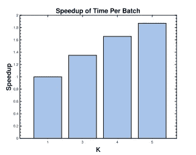
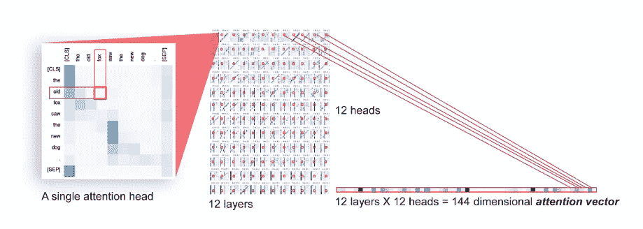
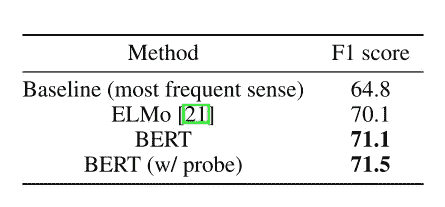
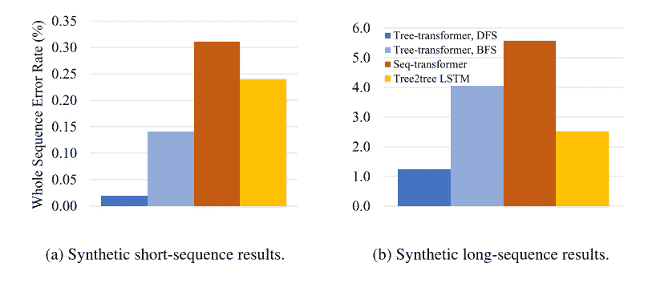
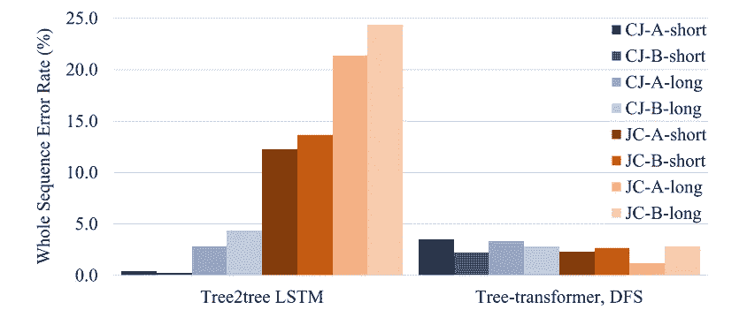
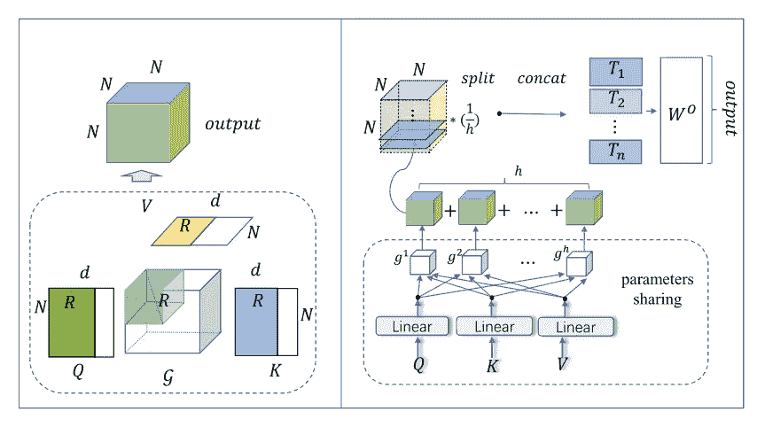
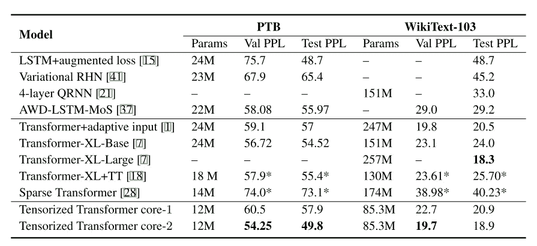
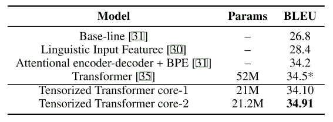

# NeurIPS 2019 上的变形金刚

> 原文：<https://towardsdatascience.com/transformers-at-neurips-2019-3c8e76e3ab42?source=collection_archive---------26----------------------->

## ml 评论

## NeurIPS 2019 上与变压器相关的论文

在我之前在 EMNLP 2019 上关于 [BERT 的报道之后，如果不对 NeurIPS 2019 上关于变形金刚的论文做一个简短的回顾，那将是一种犯罪。关于神经信息处理系统的会议和研讨会于 12 月 8 日至 14 日在温哥华**举行。像往常一样，有很多令人惊叹的想法和先进的研究。以下是其中的一些。**](/bert-at-emnlp-2019-46db6c2e59b2)

## **维尔伯特:为视觉和语言任务预先训练与任务无关的视觉语言表征**

[http://arxiv.org/abs/1908.02265](http://arxiv.org/abs/1908.02265)

介绍了一种学习图像内容和自然语言的任务不可知联合表示的新方法。

ViLBERT(视觉和语言 BERT)由两个并行的 BERT 风格模型组成，在图像区域和文本片段上运行。每个流都是一系列的变压器块和新颖的共注意变压器层，它们被引入以实现模态之间的信息交换。通过从预先训练的对象检测网络(更快的 R-CNN)提取边界框及其视觉特征，每个图像被表示为一组区域特征。

ViLBERT 模型由视觉(绿色)和语言(紫色)处理的两个并行流组成，它们通过新的共注意变压器层进行交互。

有两个预训练任务:掩蔽多模态建模和多模态比对预测。屏蔽的多模态建模任务遵循标准 BERT 中的屏蔽语言建模任务——屏蔽大约 15%的单词和图像区域输入，并在给定剩余输入的情况下给模型分配重构它们的任务。在多模态对齐任务中，模型已经呈现了图像-文本对，并且必须预测图像和文本是否对齐，即文本是否描述了图像。

在许多已建立的视觉和语言任务中，ViLBERT 模型优于最先进的模型:视觉问题回答、视觉常识推理、参考表达式和基于标题的图像检索。

将我们的 ViLBERT 模型的转移任务结果与现有的最先进和合理的建筑烧蚀进行比较。

## **Ouroboros:关于加速训练基于 Transformer 的语言模型**

[http://arxiv.org/abs/1909.06695](http://arxiv.org/abs/1909.06695)

毫无疑问，变形金刚在许多任务中都取得了巨大的成就，但是训练它们可能是一个漫长而昂贵的过程。解决这个问题的一个可能的方法是并行化。

当训练时模型太大而不适合单个设备时，模型并行化仍然是一个公开的问题。当一个模型变得太大而不适合单个计算设备时，最简单的解决方案是将模型层分布在多个设备上。

提出了一种新的模型并行算法来并行化基于转换器的语言模型的训练。这种算法可以在不损失精度的情况下显著提高速度。

每批计算时间的加速(在 K 个 GPU 上)

## 可视化和测量伯特的几何

[http://arxiv.org/abs/1906.02715](http://arxiv.org/abs/1906.02715)

在本文中，作者试图证明变形器具有一组语义和句法信息的中间表示。为了找到句法信息，他们在注意力向量的顶端训练线性模型。该模型必须预测两个单词之间依赖关系的存在和类型。二元探针实现了 85.8%的准确度，而多类探针实现了 71.9%的准确度。这个简单的线性探测的成功表明句法信息被编码在注意向量中。

一对有序标记的全模型注意力向量包含所有注意力头部和层中该对的标量注意力值。

第二部分是关于语义信息。人们很自然地会推测，变形金刚捕捉到了一个词在特定句子中的特定含义。

对于具有 n 个义项的给定单词，他们制作最近邻分类器，其中每个邻居是训练数据中给定词义的 BERT 基嵌入的质心。为了对一个新单词进行分类，他们找到这些质心中最近的一个，如果该单词没有出现在训练数据中，则默认为最常用的意义。简单的最近邻分类器实现了 71.1 的 F1 分数，高于当前的技术水平，精度随着层单调增加。这是一个强有力的信号，表明语境嵌入代表了词义信息。

词义消歧任务的 F1 分数。

## 支持树形结构变压器的新颖位置编码

【https://openreview.net/pdf?id=SJerEhR5Km 号

变压器适用于顺序建模任务。但是在某些情况下，使用纯面向序列的方法可能会导致丢失有价值的结构信息，例如，当我们想要表示层次结构时。这项工作为树结构数据引入了新的位置编码。这有可能将转换器扩展到从自然语言解析树到程序抽象语法树的设置范围。

这种方法有两种评估方法:合成翻译任务和生成的 CoffeeScript 与 JavaScript 代码之间的翻译。实验表明，使用这种编码的模型在面向树的任务中可以胜过序列转换器。

与 tree2tree LSTMs 比较的综合任务的整个程序错误率。

CoffeeScript-JavaScript 翻译任务的整个程序错误率数据。

## 用于语言建模的张量化转换器

[http://arxiv.org/abs/1906.09777](http://arxiv.org/abs/1906.09777)

我认为这是最有趣的作品。也许不是结果，而是使用张量分解来降低模型复杂性的事实。

如您所知，考虑如何减少内存和计算转换器所需的数量是非常重要的。现有的模型压缩方法主要分为参数剪枝和共享、低秩逼近、知识转移、转移卷积滤波器和张量分解方法。

基于参数共享的思想，本文重点研究了 transformer 中多头注意力的压缩。同时，它们还结合了低秩近似方法来降低参数和计算复杂度。提出了一种新的自我注意方法——多线性注意。

(左)使用塔克分解的单块注意。(右)基于块项张量分解的多线性注意。

在所有实验中，新架构都取得了与 SoTA 相当的结果，但参数更少。

结果(PPL)和模型参数与十亿人的最新结果。

在 PTB 和 WikiText-103 上使用最新的结果进行结果和压缩。

结果和压缩与变压器对 WMT-16 英语到德语的翻译。