# 变形金刚解释

> 原文：<https://towardsdatascience.com/transformers-explained-65454c0f3fa7?source=collection_archive---------7----------------------->

## 对谷歌 Transformer 模型的详尽解释；从理论到实施


[克里斯汀·瓦格纳](https://unsplash.com/@wagner2074?utm_source=medium&utm_medium=referral)在 [Unsplash](https://unsplash.com?utm_source=medium&utm_medium=referral) 上拍照

这篇文章是对谷歌研究的著名论文“[注意力是你所需要的全部](https://arxiv.org/abs/1706.03762)”中的变压器模型的深入阐释。该模型是序列转导任务(任何涉及将一个序列转换成另一个序列的任务)中许多 SOTA(现有技术)方法的先驱。以下是这篇帖子的内容:

# 内容

1.  **序列对序列模型的概述**
2.  **为什么是变压器？**
3.  **注意？自我关注！**
4.  **什么是变压器？**
5.  **结论**

这将是一个漫长的，所以坐稳了！

# 序列到序列模型概述


GNMT 中的 seq2seq，由[谷歌人工智能博客](https://ai.googleblog.com/2016/09/a-neural-network-for-machine.html)可视化

序列到序列编码器-解码器结构是序列转换任务的基础。它实质上建议立即编码完整的序列，然后使用该编码作为产生解码序列或目标序列的上下文。

> 人们可能会把这与人类倾向于首先完整地“听”一个句子(序列)，然后相应地作出反应，无论是对话、翻译还是任何类似的任务。

seq2seq 模型由分别位于编码器和解码器的独立 rnn 组成。编码序列是编码器网络中 RNN 的*隐藏状态*。使用这个编码序列和(通常)单词级生成模型，seq2seq 生成目标序列。由于编码是在单词级进行的，因此对于较长的序列，很难在编码器中保持上下文，因此将众所周知的注意机制与 seq2seq 结合，以*“注意”*序列中对目标序列的生成有显著贡献的特定单词。注意力是根据输入序列中的单个单词对目标序列生成的影响来衡量它们。

# 为什么是变形金刚？

使用 RNNs 的序列对序列是很棒的，注意它甚至更好。那变形金刚有什么了不起的？

rnn 的主要问题在于它们不能在处理时提供并行化。RNN 的处理是连续的，也就是说，我们不能计算下一个时间步长的值，除非我们有当前的输出。这使得基于 RNN 的方法进展缓慢。

然而，脸书研究中心解决了这个问题，他们建议使用基于**卷积的**方法，该方法允许将并行化与 GPU 相结合。这些模型建立了单词之间的层次表示，其中在序列中出现得较近的单词在较低的层次上相互作用，而出现得较远的单词在层次中的较高层次上起作用。ConvS2S 和 ByteNet 就是两个这样的型号。引入层次结构是为了解决长期的依赖性。

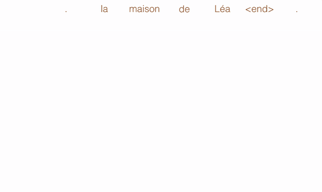

通过 [Michal Chromiak 的博客](https://mchromiak.github.io/articles/2017/Sep/12/Transformer-Attention-is-all-you-need/#.XreFtRbhU5l)形成 ConvS2S 的多步关注

虽然这实现了并行化，但它的计算量仍然很大。与 RNNs 和 CNN 提供的结果质量相比，它们每层的操作数量更不合理。最初的变压器论文已经提出了这些参数对于合格模型的比较:

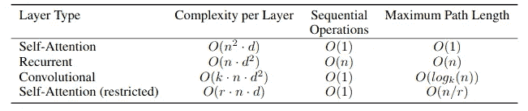

基于计算效率度量的 RNN、CNN 和自我注意模型的比较

这里，d(或 *d_model* )是单词的表示维度或嵌入维度(通常在 128-512 的范围内)，n 是序列长度(通常在 40-70 的范围内)，k 是卷积的核大小，r 是受限自我注意的注意窗口大小。从表中，我们可以推断出以下几点:

*   显然，自我关注的每层计算复杂度远低于其他人。
*   关于顺序操作，除了 RNNs，所有其他方法都提供并行化，因此它们的复杂度是 O(1)。
*   最后一个度量是最大路径长度，它表面上意味着*参与*长期依赖或远距离单词的复杂性。因为卷积模型使用分层表示，所以它们的复杂度是 nlog(n ),而自我注意模型在同一个步骤中关注所有单词，因此它们的复杂度是 O(1)。

转换器使用自关注机制，其中*关注权重*是使用输入序列中的所有单词一次性计算的，因此它有利于并行化。除此之外，由于转换器中的每层操作是在相同序列的字之间进行的，所以复杂度不超过 O(n d)。因此，transformer 被证明是有效的(因为它使用了注意力),同时也是一个计算高效的模型。

# 注意？自我关注！

在上一节中，我们讨论了转换器使用自我关注作为有效计算的手段。在这一节，我们将破译，到底什么是自我关注，它是如何在变压器使用。

## 查询、键和值

作为一般惯例，注意机制遵循查询、键、值模式。所有这三个都是来自输入序列的单词，它们以某种模式相互操作。查询和键最初经历某些操作，然后输出(通常)与值相乘。这将在下一小节中变得更清楚，我们将看到自我关注如何工作的图示描述。

## 自我关注

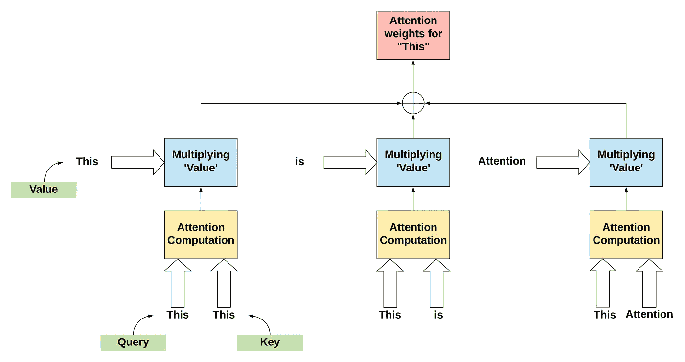

自我关注

如前所述，自我注意是“注意”来自同一序列的单词。

> 从表面上看，自我关注决定了一个单词对句子的影响

在上图中，自我注意的运作是用一个句子的例子来解释的，“这就是注意”。单词“This”与句子中的其他单词连用。类似地，计算所有单词的注意力权重(这里是“是”和“注意力”)。这里没有*‘隐藏状态’*的概念。输入被直接使用。这从架构中移除了*的顺序性*，从而允许并行化。

在变形金刚的情况下， ***多头注意*** 被使用，这将在后面的帖子中介绍。

# 什么是变压器？

到目前为止，我们已经看到了在 Transformer 中实现的机制。此后，我们将实际看到这些毗邻的机制和几个具体到模型的组成部分是如何被纳入。

> 我们将尝试自下而上地构建一个变压器

## 位置编码

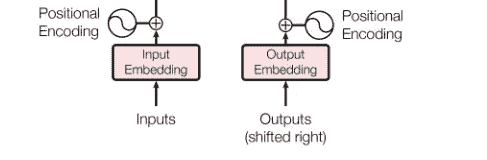

通过[“注意力是你所需要的一切”](https://arxiv.org/abs/1706.03762)在 Transformer 中进行位置编码

如果你观察，自我注意的计算没有单词在序列中排序的概念。尽管 rnn 很慢，但它们的顺序性确保了单词的顺序得以保留。因此，为了引出单词在序列中定位的概念，将*位置编码*添加到常规输入嵌入中。位置编码的维度与嵌入( *d_model* )相同，便于两者的求和。在该论文中，位置编码是使用以下方法获得的:

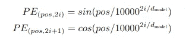

通过[“注意力是你所需要的一切”](https://arxiv.org/abs/1706.03762)使用正弦波进行位置编码

这里， *i* 是维度， *pos* 是字的位置。我们用正弦表示维度的偶数(2i)，余弦表示奇数(2i + 1)。位置编码有几种选择—学习的或固定的。这是固定的方法，因为论文陈述的学习和固定的方法获得了相同的结果。

> 背后的一般思想是，对于固定的偏移 k，PEₚₒₛ₊ₖ可以表示为 PEₚₒₛ.的线性函数

## 掩饰

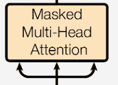

通过[“注意力就是你需要的全部”](https://arxiv.org/abs/1706.03762)在多头注意力中使用掩蔽

在变形金刚的多头注意机制中使用了两种遮罩。

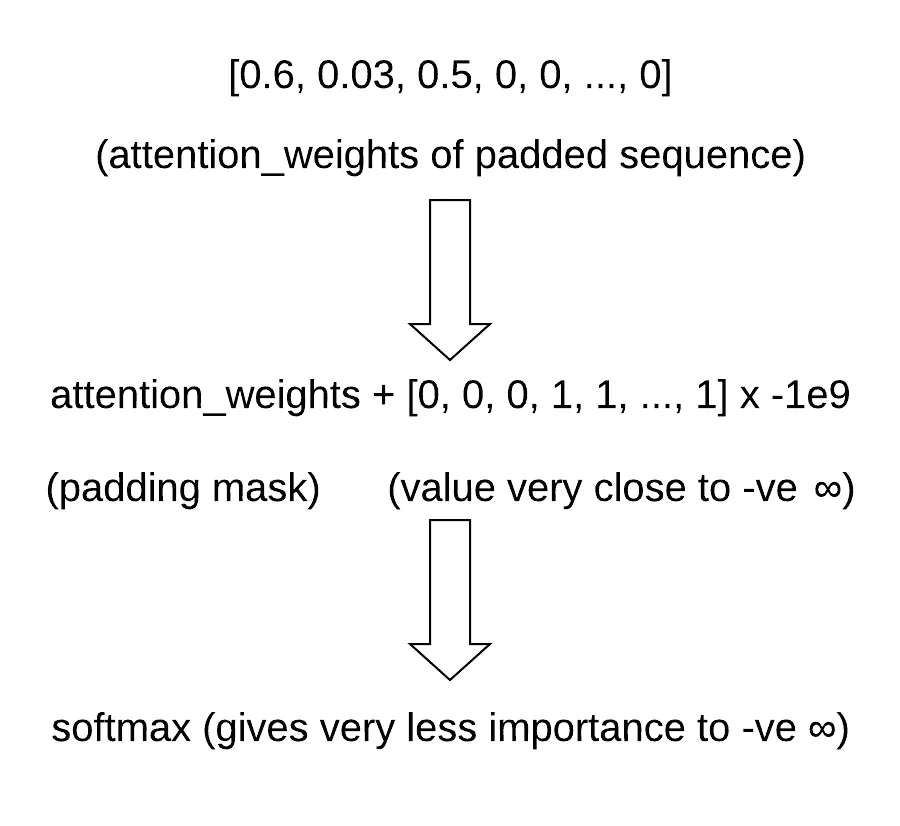

衬垫掩模的加工

*   **填充掩码:**序列的输入向量应该长度固定。因此， *max_length* 参数定义了转换器可以接受的序列的最大长度。长度大于 *max_length* 的所有序列都被截断，而较短的序列用零**填充。*然而，零填充既不应该有助于注意力计算，也不应该有助于目标序列生成。下图解释了填充遮罩的工作原理。这是变压器中的可选操作。*

*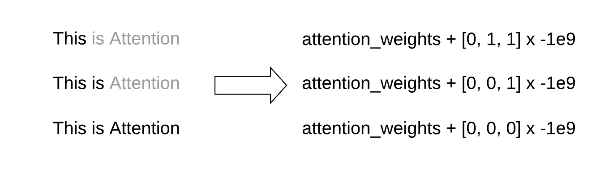*

*前瞻掩模的工作*

*   ***前瞻掩码:**在解码器处生成目标序列时，由于转换器使用自关注，它倾向于包括来自解码器输入的所有单词。但是，实际上这是不正确的。只有当前单词之前的单词可以有助于下一个单词的生成。掩蔽的多头注意力确保了这一点。下图解释了前瞻掩码的工作原理。*

*下面的代码片段解释了填充是如何起作用的:*

```
*>>> a = tf.constant([0.6, 0.2, 0.3, 0.4, 0, 0, 0, 0, 0, 0])
>>> tf.nn.softmax(a)
<tf.Tensor: shape=(10,), dtype=float32, numpy=
array([0.15330984, 0.10276665, 0.11357471, 0.12551947, 0.08413821,
       0.08413821, 0.08413821, 0.08413821, 0.08413821, 0.08413821],
      dtype=float32)>
>>> b = tf.constant([0.6, 0.2, 0.3, 0.4, -1e9, -1e9, -1e9, -1e9, -1e9, -1e9])
>>> tf.nn.softmax(b)
<tf.Tensor: shape=(10,), dtype=float32, numpy=
array([0.3096101 , 0.20753784, 0.22936477, 0.25348732, 0\.        ,
       0\.        , 0\.        , 0\.        , 0\.        , 0\.        ],
      dtype=float32)>*
```

## *标度点积注意力*

*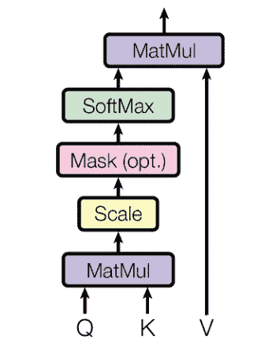*

*通过[“关注是你所需要的一切”](https://arxiv.org/abs/1706.03762)的成比例的点产品关注*

*这是主要的“注意力计算”步骤，我们之前在自我注意部分已经讨论过了。这包括几个步骤:*

*   *这是一个矩阵点积运算。首先，查询和键经历这个操作。该操作可以用数学方法表示如下:*

> *马特穆尔(q，K) = Q.Kᵀ*

*   ***Scale:** 点积运算的输出可能会导致较大的值，这可能会扰乱后面部分的 softmax。因此，我们通过将它们除以缩放因子 ***√dₖ.来缩放它们****
*   ***遮罩:**可选的填充遮罩已经在上面的遮罩部分讨论过了。*
*   ***soft max:**soft max 函数将数值降低到一个概率分布，即[0，1]。*

**

*通过[“注意力是你所需要的全部”](https://arxiv.org/abs/1706.03762)得出的比例点积注意力的最终等式*

*比例点积注意力是多头注意力的主要组成部分，我们将在下一小节中看到。*

## *多头注意力*

*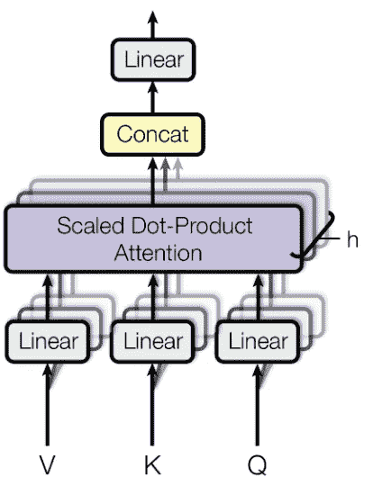*

*通过[的多头关注](https://arxiv.org/abs/1706.03762)*

*多头注意力本质上是前面讨论的所有微观概念的整合。*

*在相邻的图中， *h* 是头数。就数学而言，多头注意力的初始输入被分成 *h* 部分，每个部分都有查询、键和值，用于序列中的 *max_length* 字，用于 *batch_size 序列。*Q、K、V 的尺寸称为*深度*，计算如下:*

> *深度= d _ 模型// h*

*这就是 ***d_model* 需要被*h***整除的原因。因此，在分割时， *d_model* 形状矢量被分割成形状*深度的 *h* 矢量。*这些向量作为 Q、K、V 被传递给缩放的点积，并且通过再次将 *h* 向量整形为形状 *d_model* 的 1 个向量，输出为“ ***Concat*** ”。这个重组的向量然后通过前馈神经网络层。*

## *点式前馈网络和残余漏失*

*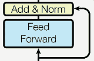*

*通过[“关注是你所需要的一切”](https://arxiv.org/abs/1706.03762)的逐点 FFN 和剩余辍学*

*逐点前馈网络块本质上是两层线性变换，在整个模型架构中使用相同，通常在关注块之后。*

*对于正则化，在将每个子层的输出添加到子层的输入并进行归一化之前，对每个子层的输出应用缺失。*

## *最后，我们有完整的变压器！*

*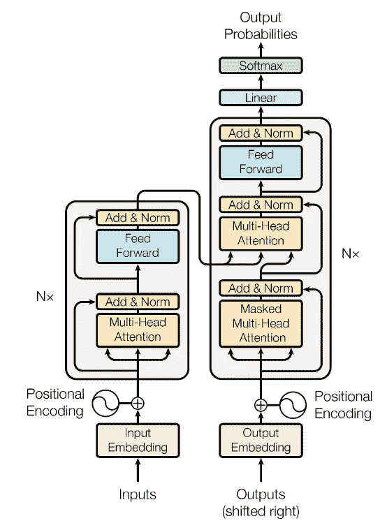*

*变压器 via [“注意力是你所需要的一切”](https://arxiv.org/abs/1706.03762)*

*所有的组件被组装在一起，以建立变压器。编码器模块在左边，解码器模块在右边。*

> *编码器和解码器块可以可选地微调到 Nₓ单位以调整模型。*

# *结论*

*在这篇文章中，我们看到了序列转导任务中基于 RNN 的方法的问题，以及革命性的 Transformer 模型如何解决这些问题。后来，我们研究了变压器的基本机制及其工作原理。最后，我们看到了各种组件和底层机制如何与转换器一起工作。*

*我已经在这里介绍了使用 TensorFlow 进行抽象文本摘要的 Transformer 的逐步实现[。](https://medium.com/@rojagtap/abstractive-text-summarization-using-transformers-3e774cc42453)*

# *参考*

*《注意力是你所需要的全部》变形金刚原纸:【https://arxiv.org/abs/1706.03762*

*Seq2Seq 论文:【https://arxiv.org/abs/1409.3215 *

*巴林岛注意事项:[https://arxiv.org/abs/1409.0473](https://arxiv.org/abs/1409.0473)*

*ConvS2S 和 ByteNet 论文:[https://arxiv.org/abs/1705.03122](https://arxiv.org/abs/1705.03122)，[https://arxiv.org/abs/1610.10099](https://arxiv.org/abs/1610.10099)*

*[](/self-attention-and-transformers-882e9de5edda) [## 自我关注和变形金刚

### 从关注到自我关注到变形金刚

towardsdatascience.com](/self-attention-and-transformers-882e9de5edda) [](https://mchromiak.github.io/articles/2017/Sep/12/Transformer-Attention-is-all-you-need/#.XreFtRbhU5l) [## 变形金刚-你需要的只是注意力。

### 变形金刚——不仅仅是看上去那么简单！我们到了吗？良好的...不完全是，但是...消除复发怎么样…

mchromiak.github.io](https://mchromiak.github.io/articles/2017/Sep/12/Transformer-Attention-is-all-you-need/#.XreFtRbhU5l) 

一些很棒的变形金刚形象:

[](http://jalammar.github.io/illustrated-transformer/) [## 图示的变压器

### 讨论:黑客新闻(65 分，4 条评论)，Reddit r/MachineLearning (29 分，3 条评论)翻译…

jalammar.github.io](http://jalammar.github.io/illustrated-transformer/)*