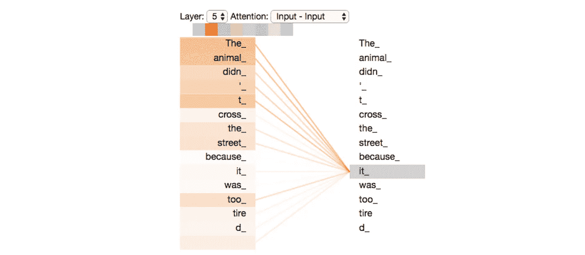

# 变形金刚(最先进的自然语言处理)

> 原文：<https://towardsdatascience.com/transformers-state-of-the-art-natural-language-processing-1d84c4c7462b?source=collection_archive---------5----------------------->

## 《变形金刚》第 1/3 部分 vs 谷歌 QUEST 问答标注(Kaggle top 5%)。

作者图片

*这是一个由 3 部分组成的系列，我们将经历变形金刚、伯特和动手 Kaggle 挑战—*[*Google QUEST Q&A Labeling*](https://www.kaggle.com/c/google-quest-challenge/)*以观看变形金刚的行动(在排行榜上排名第 4.4%)。在这一部分(1/3)中，我们将了解变形金刚是如何成为各种现代自然语言处理任务及其工作方式的艺术。*

The**Transformer**是谷歌和多伦多大学的研究人员于 2017 年在论文 [Attention is All You Need](https://arxiv.org/abs/1706.03762) 中提出的深度学习模型，主要用于自然语言处理(NLP)领域。

像递归神经网络(RNNs)一样，转换器被设计为处理顺序数据，如自然语言，用于翻译和文本摘要等任务。然而，与 rnn 不同，转换器不要求按顺序处理顺序数据。例如，如果输入数据是自然语言句子，转换器不需要在结束之前处理它的开头。由于这个特性，Transformer 允许比 RNNs 更多的并行化，因此减少了训练时间。

变压器是围绕注意力机制的概念设计的，注意力机制是为了帮助记忆神经机器翻译中的长源句子而设计的。

听起来很酷，对吧？让我们看一看引擎盖下面，看看事情是如何运作的。

图像[来源](https://www.overthinkingit.com/tag/autobot-matrix-of-leadership/)

变压器基于编码器-解码器架构，该架构由一组编码层组成的**编码器**和一组解码层组成的**解码器**组成，前者一层接一层地迭代处理输入，后者对编码器的输出执行相同的操作。

因此，当我们将一个句子传递到转换器中时，它被嵌入并传递到一个编码器堆栈中。最终编码器的输出随后被传递到解码器堆栈中的每个解码器模块。解码器堆栈随后产生输出。

变换器中的所有编码器模块都是相同的，同样，变换器中的所有解码器模块也是相同的。

来源:[http://jalammar.github.io/illustrated-transformer/](http://jalammar.github.io/illustrated-transformer/)

这是一个非常高层次的变压器表示，当理解变压器如何在现代 NLP 任务中如此有效时，它可能没有多大意义。不要担心，为了让事情更清楚，我们现在将讨论编码器和解码器单元的内部结构…

> 编码器

编码器有两个部分，自我关注，和一个前馈神经网络。

来源:[http://jalammar.github.io/illustrated-transformer/](http://jalammar.github.io/illustrated-transformer/)

编码器的输入首先流经自我关注层，该层帮助编码器在编码特定单词时查看输入句子中的其他单词。基本上，对于每个输入单词“x ”,自我关注层生成一个向量 **Z** ,使得它在生成 **Z** 之前将所有的输入单词(x1，x2，x3，…，xn)放入图片中。稍后我会在博客中解释为什么要将所有的输入单词嵌入到图片中，以及它是如何生成 **Z** 的，但是现在，只需要记住编码器子组件的这些简短的概要。

自我注意层的输出被馈送到一个前馈神经网络。前馈神经网络为每个输入 **Z** 生成一个输出，前馈神经网络的输出被传递到下一个编码器模块的自关注层，依此类推。

现在我们已经知道了编码器内部的所有内容，让我们来理解每个组件内部发生的张量运算。

> **首先是输入:**

我们知道变压器用于 NLP 任务，因此我们处理的数据通常是句子的语料库，但由于机器学习算法都是关于矩阵运算的，我们首先需要将人类可读的句子转换为机器可读的格式(数字)。为了将句子转换成数字，我们使用“单词嵌入”。这一步很简单，句子中的每个单词都表示为一个 n 维向量(n 通常是 512)，对于变形金刚，我们通常使用单词的手套嵌入表示。
还有一种叫做 ***位置编码*** 的东西，适用于这些嵌入，但我稍后会谈到。一旦我们有了每个输入单词的嵌入，我们将这些嵌入同时传递给自我关注层。

> **自我关注层的训练参数:**

不同的层具有不同的学习参数，例如，*密集*层具有*权重*和*偏差*，而*卷积*层具有*内核*作为学习参数，类似地，在自我关注层中， 我们有 4 个学习参数:
*-查询矩阵:****【Wq】***
*-关键矩阵:****Wk***
*-值矩阵:****Wv***
*-输出矩阵:****Wo***

*前 3 个可训练参数有特殊用途，它们用于生成 3 个新参数:
*-查询:****【Q】*** *-关键:****K*** *-值:****V***这些参数稍后用于生成输出*

***需要记住的几点是:
-输入张量 **x** 具有 *n 行*和 *m 列*，其中 *n* 是输入单词的数量， *m* 是每个单词的向量大小，即 512。
-输出张量 ***Q、K、V、*** 和 ***Z*** 有 *n 行*和 dk*列，其中 n 是输入字数， *dk* 是 64。 *m* 和 *dk* 的值不是随机值，而是提出这种架构的研究人员发现的最佳值。****

********

****来源:[http://jalammar.github.io/illustrated-transformer/](http://jalammar.github.io/illustrated-transformer/)****

****在如上所述计算了 3 个参数 *Q，K，V* 之后，自我关注层然后为每个输入单词计算 ***分数*，**向量。****

> ******点状产品注意:******

****自我关注层的下一步是计算每个输入单词对应的向量分值。这个分数计算是将注意力机制带入生活的最关键的步骤之一(嗯…不是字面上的意思)。向量*的大小为 ***n*** 其中****n****是输入单词的数量，并且该向量的每个元素是一个数字，该数字表示其对应的单词对当前单词的贡献有多大
让我们考虑一个例子来得到直觉——
***“动物没有过马路是因为它太累了”***在上面的句子中， ***这个词 it*** 指的是动物而不是路。对我们来说，这很容易掌握，但对一台没有注意力的机器来说就不一样了，因为我们知道语法是如何工作的，而且我们已经发展出一种感觉，那就是它指的是 ***动物*** 而不是像 ***穿越*** 或 ***道路这样的词。*** *这种语法感是经过训练后出现在变形金刚身上的，但事实是，对于一个给定的单词，它会考虑输入的所有单词，然后有能力选择它认为贡献最大的一个单词，这就是注意力机制的作用。* 对于上面的句子，为单词 ***it*** 生成的得分向量会有 11 个数字，每个数字对应输入句子中的一个单词。对于训练有素的模型，该得分向量在位置 2 和 8 处将具有较大的数字，因为位置 2(动物)和 8(它)处的单词对 ***it 贡献最大。*** 可能看起来是这样的:
【2， **60** ，4，5，3，8，5， **90** ，7，6，3】
注意位置 2 和 8 的值大于其他位置的值。*******

********

****来源:[http://jalammar.github.io/illustrated-transformer/](http://jalammar.github.io/illustrated-transformer/)****

****我们来看看这些分数是如何在自我关注层产生的。到目前为止，对于每个单词，我们有 ***Q，K，V*** 向量。为了生成分数向量，我们使用一种叫做*点积注意力*的东西，其中我们在 ***Q*** 和 ***K*** 向量之间取点积来生成分数。 ***Q*** 的值对应于我们正在计算得分的查询词，在上面的例子中，该词是*，而有 n 个*的值 ***K、*** 分别对应于输入词的关键向量。
所以，如果我们想为单词 it 生成分数:******

1.  ****我们取它的查询向量: ***Q*******
2.  ****我们取输入句子的关键向量: ***K1，K2，K3，…，Kn。*******
3.  ****我们取 ***Q*** 和 ***K*** 之间的点积，得到 ***n*** 的分数。****

****计算完分数后，我们通过将分数除以(***【dk】***)的平方根来对**分数进行归一化，平方根是向量***【Q，K，V.*** 的列维度。这一步是强制性的，因为 transformer 的创建者发现通过 sqrt 对分数进行归一化。的 ***dk 的*** 给出更好的结果。******

****标准化分数向量后，我们使用 **softmax 函数**对其进行编码，使得输出与原始分数成比例，但所有值的总和为 1。****

****一旦我们准备好“软最大化”分数，我们简单地将每个**分数**元素与对应的值向量 ***V*** 相乘，这样，在这个操作之后，我们得到 **n 个**值向量***V***:***V1，V2，V3，…，Vn*** 。
现在为了获得自我关注的输出 ***Z*** ，我们简单地把所有的 n 个值向量相加。****

********

****简而言之，所有自我关注的步骤****

********

****来源:[http://jalammar.github.io/illustrated-transformer/](http://jalammar.github.io/illustrated-transformer/)****

****上图说明了自我关注层的步骤。****

> ******多头关注:******

****现在我们知道了注意力头是如何工作的，以及它有多神奇，这就有一个陷阱了。单个注意力头有时会错过输入中对聚光灯单词贡献最大的一些单词，如在前面的例子中，有时注意力头在预测单词 **it** 时可能没有注意到单词**动物**，这可能会导致问题。为了解决这个问题，我们使用了多个注意力头，而不是单个注意力头，每个注意力头都以类似的方式工作。这个想法有助于我们减少任何单个注意力头的错误或误算。
这也被称为 ***多头关注*** 。****

********

****两种不同注意力的得分用橙色和绿色表示。我们可以看到，一个注意力集中者更关注像动物、十字路口这样的词，而另一个注意力集中者更关注像街道、疲倦这样的词。 ( [图像来源](http://jalammar.github.io/illustrated-transformer/))。****

****在变形金刚中，多头注意力通常使用 8 个注意力头。
现在注意，单个注意力头的输出是 64 维的，但是如果我们使用多头注意力，我们将得到 8 个这样的 64 维向量作为输出。****

********

****来源:[http://jalammar.github.io/illustrated-transformer/](http://jalammar.github.io/illustrated-transformer/)****

****原来有一个最后的可训练参数*输出矩阵* ***Wo*** 我之前提到的在这里发挥作用。
在自我关注的最后一层，所有的输出**【Z0，Z1，Z2，…，Z7】**被连接并与 ***Wo*** 相乘，使得最终的输出 ***Z*** 的维数为 64。****

****下图显示了上面讨论的所有步骤:****

********

****来源:[http://jalammar.github.io/illustrated-transformer/](http://jalammar.github.io/illustrated-transformer/)****

> ******位置编码:******

****记得在*首先是输入*部分，我提到了位置编码，让我们看看它们是什么以及它们如何帮助我们。我们目前的 awesome transformer 的问题是，它没有考虑输入单词的位置。与 RNN 不同，我们用时间步长来表示哪个单词在前面和后面，在《变形金刚》中，因为单词是同时输入的，所以我们需要某种位置编码来定义哪个单词在哪个单词后面。
位置编码帮助了我们，因为它为输入嵌入提供了位置感，我们首先为每个输入单词生成位置嵌入，然后将这些位置嵌入添加到相应单词的单词嵌入中，以生成带有时间信号的*嵌入。*****

****提出了许多方法来生成位置嵌入，如一键编码向量或二进制编码，但研究人员发现最有效的方法是使用以下等式来生成嵌入:****

********

****作者图片****

****当我们为最大长度为 50 的句子绘制 *128 维位置编码时，它看起来类似于:*****

********

*****每行代表嵌入向量(*作者图片 *)*****

> ******剩余连接:******

****最后，编码器中还增加了一个称为剩余连接或跳过连接的功能，允许前一层的输出绕过中间的层。
它在有许多隐藏层的深层网络中很有帮助，如果中间的任何层没有太大用处或没有学到太多，跳过连接有助于绕过该层。
另一个需要注意的是，当剩余连接被添加并且结果被归一化时。****

********

****带跳跃连接的编码器单元。([图像来源](http://jalammar.github.io/illustrated-transformer/))。****

> ****解码器****

****解码器与编码器非常相似。像编码器一样，它也有自关注和前馈网络，但它也有一个称为*编码器-解码器关注*的附加块夹在两者之间。
*编码器-解码器关注*层的工作方式与多头自我关注类似，只是它从其下一层创建查询矩阵，并从编码器堆栈的输出中获取键和值矩阵。
其余 2 层的工作方式与编码器单元中的完全相同。****

********

****编码器解码器架构。([图片来源](http://jalammar.github.io/illustrated-transformer/))。****

****解码器堆栈的输入是顺序的，不同于编码器堆栈中的同时输入，这意味着第一个输出字作为输入传递到解码器，解码器使用它生成第二个输出，现在该输出再次作为输入传递到解码器，并使用它生成第三个输出，依此类推…****

********

****变压器的工作。([图片来源](http://jalammar.github.io/illustrated-transformer/))。****

****解码器的输出被传递到具有 softmax 激活的线性层，使用该线性层来预测正确的字。****

********

****来源:http://jalammar.github.io/illustrated-transformer/****

****一旦变换器使用前向传播来预测单词，就使用像交叉熵这样的损失函数将预测与实际标签进行比较，然后使用反向传播来更新所有可训练参数。
嗯，这是理解学习如何在变形金刚中发生的一种简化方式。有更多的变化，如采取完整的输出句子来计算损失。想了解更多，你可以看看杰伊·阿拉玛在《变形金刚》上的博客。****

*****到此，我们就到此为止了。希望阅读愉快。
我要感谢所有的创作者，他们创作了我写这篇博客时提到的精彩内容。*****

*****参考链接:*****

*   *****应用人工智能教程:*[*https://www.appliedaicourse.com/*](https://www.appliedaicourse.com/)****
*   ****[https://arxiv.org/abs/1706.03762](https://arxiv.org/abs/1706.03762)****
*   ****[http://jalammar.github.io/illustrated-transformer/T21](http://jalammar.github.io/illustrated-transformer/)****
*   ****[*http://primo.ai/index.php?title=Transformer*](http://primo.ai/index.php?title=Transformer)****
*   ****[*https://en . Wikipedia . org/wiki/Transformer _(machine _ learning _ model)*](https://en.wikipedia.org/wiki/Transformer_(machine_learning_model))****
*   ****[*https://medium . com/inside-machine-learning/what-a-transformer-d 07 DD 1 fbec 04*](https://medium.com/inside-machine-learning/what-is-a-transformer-d07dd1fbec04)****

> ******最终注释******

****感谢您阅读博客。我希望它对那些渴望做项目或学习 NLP 新概念的人有用。****

****在[第 2/3 部分](/understanding-bert-bidirectional-encoder-representations-from-transformers-45ee6cd51eef?source=friends_link&sk=f48ce58edfdf395fe5d86436d8102a61)中，我们将讨论 BERT(变压器的双向编码器表示)。****

****在[第 3/3 部分](/hands-on-transformers-kaggle-google-quest-q-a-labeling-affd3dad7bcb?source=friends_link&sk=159fd259d7ae346bb4cfa07dc5180938)中，我们将经历一次动手的 Kaggle 挑战——[Google QUEST Q&A Labeling](https://www.kaggle.com/c/google-quest-challenge/)来看看变形金刚的行动(在排行榜上排名第 4.4%)。****

****在 LinkedIn 上找到我:[www.linkedin.com/in/sarthak-vajpayee](http://www.linkedin.com/in/sarthak-vajpayee)****

****和平！☮****