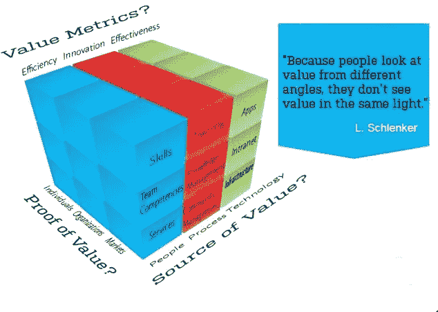
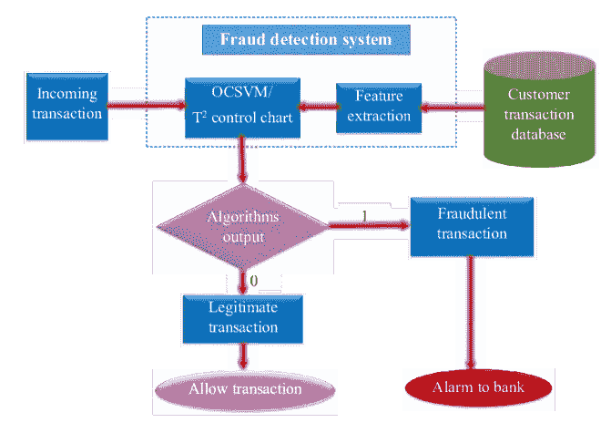

# 将数据转化为行动

> 原文：<https://towardsdatascience.com/transforming-data-into-action-5c8cffd3e8b2?source=collection_archive---------35----------------------->

*数据科学的商业价值取决于人工智能项目与企业战略、文化和资源的一致性*

图片来源:EB 局

许多公司正在大力投资人工智能，因为它们认为有必要“对每天捕获的大量数据做点什么”。Gartner 计算出今年的投资为 3830 亿美元，尽管事实上绝大多数人工智能项目都没有现实世界的应用。如果人工智能的潜在好处很难被忽视，那么成功的项目取决于权衡人工智能的潜力和组织现实的能力。管理层如何将数据科学中的实验与企业战略结合起来，鼓励他们的数据科学团队开发直接适用于业务的模型，并展示他们的投资如何影响底线？

金融欺诈案是一个非常明显的例子。行业观察家估计，仅在线信用卡欺诈一项就将在当前日历年内给金融界造成 320 亿美元的损失。[【ii】](#_edn2)根据 Javelin Strategy &的研究，如今银行使用传统的基于规则的系统检测欺诈交易需要 40 多天。这些偏见的实际成本甚至更高，因为 20%的客户在经历诈骗后会更换银行。数据科学可以将这一挑战转化为机遇，促进实时索赔评估并提高欺诈检测的准确性。

然而，尽管过去十年有多个人工智能项目，传统银行和金融科技都无法消除这一挑战。在实践中，当前将数据科学应用于欺诈检测的工作遵循以下三种场景之一。异常检测建立在当前基于规则的系统之上，表明低效流程是问题所在，解决方案是检测不遵守财务流程的情况。第二种方法使用预测分析来探索购买行为，表明行为特征是欺诈检测的关键。最后，第三种方法试图利用支持向量机和神经网络的蛮力，这种方法基于这样一种信念，即规范分析的进步肯定会产生预期的结果。考虑到实际成本和潜在收益，管理层应该在哪个场景中投资？

*商业价值矩阵*

Kees Pronk 和我在几年前引入了 Business Value Matrix(BVM)来探索数据、环境和商业价值之间的关系。[【iii】](#_edn3)矩阵基于几个前提。经理和他们的客户看待数据的角度不同，因为他们看待价值的角度不同。数据的价值取决于企业战略、文化和背景。该算法的商业价值并不来自其精确性，而是来自其在解决客户挑战方面的用途。最后，管理者的工作不仅仅是分析数据，而是利用数据来激励行动。让我们检查一下矩阵的结构，然后应用它来评估欺诈检测中不同的基于数据的方案。

商业价值矩阵

业务价值矩阵(BVM)建议可以将数据汇总，以沿着三个轴探索客户的挑战:利益相关者认为价值来自哪里，他们在哪个汇总级别寻找价值证明，以及他们使用什么指标来建议成功。对于一个数据科学团队来说，矩阵可以用来提供三个可交付成果——探索人工智能项目的范围和企业文化之间的最佳匹配，建议他们需要在哪里向他们的利益相关者提供价值证明，以及提供可以激励管理层将数据转化为行动的指标。让我们依次探索每一把斧子。

*价值从何而来？*第一个问题强调了每个利益相关者如何确定问题，以及他或她认为解决方案在哪里。对于一些利益相关者来说，一个成功的企业是建立在良好记录的、组织良好的流程之上的——客户的挑战揭示了可以检测、阐明和解决的流程缺陷。对于其他利益相关者来说，成功的项目是围绕理解他们的内部和外部客户而建立的:业务挑战需要努力更好地理解推动人们想要与组织合作的目标、愿景和激励。最后，在第三种情况下，企业是围绕技术建立的，这是一种根深蒂固的信念，即信息和物理技术的创新本身就可以积极影响底线。考虑到他们对商业价值的特殊观点，涉众收集和监控不同种类的数据，作为组织当前问题和未来机会的证据。

*利益相关者在哪一级寻找价值证明？*第二个问题提出了提供概念证明的三种可能性。那些相信个人可以改变公司表现的人；个人生产力的数据是组织成功的代表。对其他人来说，一个企业的好坏取决于它最薄弱的环节——在这里，组织作为一个整体如何运作的数据是成功的最佳指标。最后，对于某些经理或股东来说，唯一真正的证据是市场本身——生产率指标必须根据客户满意度和市场份额来分析。这里的数据科学家需要了解哪些类型的数据对利益相关者来说是重要的，并在利益相关者寻求概念证明的层面上集中精力提供证据。

*利益相关者如何衡量成功？*对于一定数量的决策者来说，成功是一个效率问题，数据需要揭示相关活动的成本和收益。对于其他人来说，有效性是一个更好的衡量成功的标准——数据需要反映组织与其客户之间关系的质量。对于其他人来说，创新是关键指标，数据需要说明组织如何应对外部威胁和机遇。对于其他人来说，利用率提供了突出组织资源随着时间的推移使用得如何的主要度量。在每一种情况下，理解利益相关者如何衡量成功是提供数据的先决条件，这些数据将帮助他们将证据转化为个人或集体行动。

*异常检测寻求组织流程*

BVM 能帮助数据科学家改善信用卡欺诈吗？异常检测算法建立在传统的基于规则的方法之上。学习模型是在被标记为欺诈或合法的连续输入数据流上训练的。在测试阶段，人工代理会被告知偏离可接受模式的情况，以供审查。因此，该模型被训练为接受银行交易内容的“常态”基线。这个基线本身并不反映消费者行为，而是反映了对组织过程的遵守程度。异常检测将吸引专注于改进欺诈检测流程的利益相关者，而不是那些对更好地了解消费者行为或获得技术优势感兴趣的人。

图片来源:潘金淑·TRAN

*自动化基于规则的欺诈检测*

如果这里的价值在于改进过程，那么涉众会在哪里寻找概念证明呢？他们不太可能在个体的基础上寻找证据，这可能是在理解测试数据中真阳性的数量时获得的。也有可能，但也不太可能，他们会对使用异常检测来获得市场竞争优势感兴趣，因为无论数据模型多么高效，都不会对市场份额产生什么影响。最有可能为整个业务部门寻找概念证明:一个更好的过程将使所有员工受益，而不管他们的个人知识或贡献如何。

最后，对于对改进流程感兴趣的赞助商，他们将如何衡量成功？一方面，效率指标，包括减少欺诈交易或减少检查每笔交易的成本，肯定会受到欢迎。另一方面，度量有效性的指标在这里没有什么帮助，因为产生的数据对改善组织和客户之间的关系没有什么直接作用。同样，与创新相关的指标在这里也没有什么意义，因为目标是细化流程，而不是设计新的服务产品。为了迎合相信价值来自过程的涉众，异常检测通常需要在组织级别上提供围绕效率度量的概念证明。

*聚类算法寻求改善对消费者行为的理解*

哪种欺诈检测方法会吸引对了解消费者行为更感兴趣的利益相关方？预测分析利用模式聚类和/或神经网络来识别交易数据流中的异常值..包括 K 均值、基于密度或均值漂移聚类的方法可用于研究消费行为，允许机器学习模型阐明与零售购物或电子商务交易相关联的欺诈行为的足迹。探索消费模式将吸引赞助商，他们更感兴趣的是提高组织对消费者行为特殊性的理解，而不是标准化操作流程。

图片来源:Dhruv Sharma

*探索消费者消费模式集群，了解欺诈行为*

如果这里的价值集中于更好地理解人性，那么利益相关者在哪里寻找概念的证明呢？需要仔细考虑三种情况。使用人口统计和行为数据阐明个人消费模式的能力当然是一个优势，尽管对尊重消费者数据保护权的担忧可能会在这方面造成障碍。对整个市场进行概念验证可能被证明是不现实的，因为溢价很可能被放在组织为目标人群提供的个性化服务上。探索行为数据来识别消费者特征似乎是一个诱人的选择。

对于那些相信价值来自理解人类行为的利益相关者，他们将如何衡量成功。？效率指标在这里不太重要，因为它们衡量的是与现有组织流程相关的成本，而不是开发新市场和服务的机会。在描述组织和消费者之间的关系质量时，围绕服务提供的有效性的度量将具有更大的吸引力。最后，创新也将在设计新服务方面获得动力，使本组织能够更好地为其目标群体服务。开发人类和机器智能的预测分析为更相信人而不是过程或技术的利益相关者提供了一条有吸引力的前进道路。

单靠技术能提供竞争优势吗？

规范分析旨在为组织提供解决方案，在“欺诈签名”出现并造成持久损害之前识别它们。数据科学团队可以通过分析数亿笔交易并将其提交给预测分析引擎(集成随机森林、朴素贝叶斯、支持向量机等)来构建估算模型。)提供一旦发现欺诈行为应采取的措施的建议。规范分析从预测模型中获取输入，结合规则和基于约束的优化，自动做出决策。这种类型的机器学习有效地将“人类”判断从计算最高可能真阳性率(TPR)和最低可能假阳性率(FPR)的等式中去除。

图片来源:凯瑟琳·梅尔彻，罗莎丽亚·西里波

*基于推荐代理的规定性分析*

如果这里的价值主张是技术，那么利益相关者在哪里寻找概念证明呢？需要仔细考虑三种情况。识别个人消费模式的能力肯定是一个优势，尽管对尊重消费者数据保护权的担忧可能会带来障碍。采用说明性分析也可能会遭到员工和经理的抵制，他们认为欺诈检测是他们获得报酬提供的技能的一部分。尽管如此，向整个市场推销概念证明对寻找创造可持续竞争优势的途径的利益相关者来说还是很有吸引力的。

相信价值来自技术的赞助商将如何衡量成功？考虑到开发可行的欺诈检测解决方案的成本，很难确定效率指标。考虑到员工、消费者和监管机构可能的抵制，围绕技术有效性的衡量标准也没有多大意义。鉴于这些机器学习模型的透明度和可解释性的挑战，组织学习也是极不可能的。规范性技术的支持者只能用创新的标准来证明这些新的欺诈管理使用场景的价值。

结论

数据科学的终极目标不是分析数据，而是解决业务问题。成功的人工智能项目取决于管理能力，以将机器学习的潜力与企业战略、文化和可用资源中反映的组织现实相结合。商业价值矩阵(BVM)提供了一个框架，通过关注利益相关者对价值来源(流程、人员或技术)的理解来探索这些现实，他们在哪里寻找证明价值(在个人层面、组织或整个市场)，以及他们如何定义成功(效率、有效性、利用率、创新……)。

我们探讨了 BVM 在欺诈管理中的潜在价值。基于异常检测、预测和规定分析的三种潜在方法对应于流程、人员和技术价值的对比视图。在通过矩阵探索利益相关方的观点时，数据科学团队可以提供他们的管理层正在寻找的数据，以增加其组织的价值。数据科学不是对每天捕获的大量数据做些什么，而是做些什么来帮助管理层将数据转化为行动。

— — -

[【I】](#_ednref1)Denis co Rayome，(2019) [为什么 85%的人工智能项目会失败](https://www.techrepublic.com/article/why-85-of-ai-projects-fail/)，Tech Republc

[【iii】](#_ednref3)Schlenker，l .和 Pronk，K. (2009)，[价值之旅](https://www.amazon.com/Journey-Value-Lee-Schlenker/dp/1906884048)，Goodfellow

Lee Schlenker 是 BAI 的校长，也是商业分析和社区管理教授。他在 LinkedIn 上的个人资料可以在查看