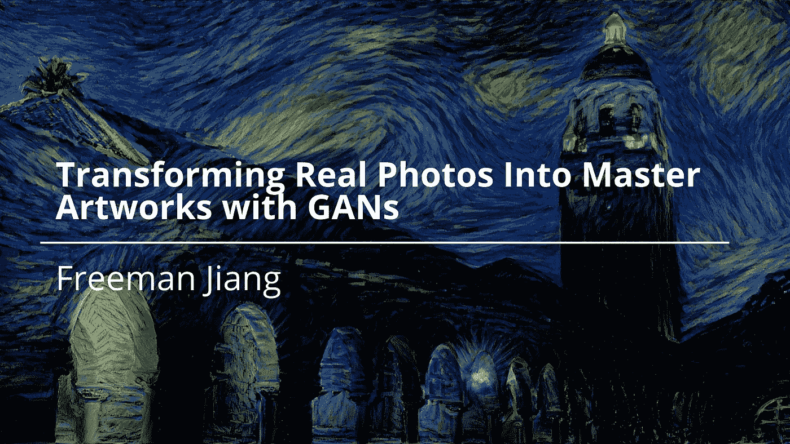
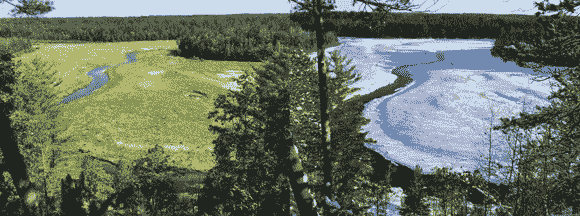
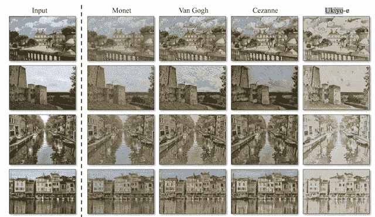

# 用 GANs 将真实照片转化为艺术大师作品

> 原文：<https://towardsdatascience.com/transforming-real-photos-into-master-artworks-with-gans-7b859a43e6ea?source=collection_archive---------19----------------------->

# 创造力:人类独有的

艺术——创造原创事物的能力，利用一个人无限的创造力和想象力——这是我们人类愿意相信自己独有的东西。毕竟，就写实绘画而言，迄今为止还没有任何其他动物或计算机能与人类的艺术技巧相媲美。

我是说猴子们尽力了。这是…抽象艺术| [来源](https://upload.wikimedia.org/wikipedia/commons/3/3f/Chimpanzee_congo_painting.jpg)

即使人工智能最近取得了进步，计算机仍然在创造性方面苦苦挣扎。他们擅长计算、分类和执行编程任务，但他们永远无法真正达到人类的创造力水平。人类的创造力无疑是独一无二的，独一无二的……那是在生殖对立网络被构想出来之前。在 2014 年，[关于 GANs 的原始论文](https://papers.nips.cc/paper/5423-generative-adversarial-nets.pdf)提出了一个新的评估生成模型的系统——可以创建的模型——使用两个模型。

# 永恒的猫和老鼠的游戏

GAN 由两个模型组成，生成模型 **G** 和判别模型 **D** 以及真实数据集。你可以把 **G** 想象成**造假者**，努力制造越来越像真钱的钱 **D** 想象成 **cop** ，努力区分钱是真的还是假的。真实数据集充当 cop 与伪造者的输出进行比较的参考。

典型的甘氏架构| [来源](https://developers.google.com/machine-learning/gan/images/gan_diagram_generator.svg)

一开始，伪钞制造者会很糟糕，因为他不知道如何让这些钱看起来像真钱，但是在每次警察确定假钞后，他会变得更好，并从错误中学习。请记住，鉴别者在鉴别真币和假币方面也越来越好——他正在成为一名更好的警察。这种循环一遍又一遍地继续，直到生成器非常擅长创建看起来像训练数据的数据，甚至连鉴别器都分辨不出来。

# 使用循环 GANs 的图像-图像翻译

在创建新的、看起来相似的数据时，经典的 GAN 架构很好，但在尝试改变现有图像时，它就不那么好用了。此外，传统的图像-图像翻译方法需要带有**成对示例**的数据集。

同一地点冬季/夏季视图的配对示例| [来源](https://news.tubbssnowshoes.com/wp-content/uploads/2015/07/summerwinter10.jpg)

这些成对的例子是与**直接相关的**数据点——它们显示了原始图像*和*对它的期望修改。例如，训练数据集需要在冬季和夏季包含相同的景观。然而，这些数据集具有挑战性，并且难以准备——有时甚至是不可能的，艺术就是如此。根本没有蒙娜丽莎或其他伟大艺术品的摄影等价物。

为了解决这个问题，我们使用了一个**周期 GAN。**这是一种特殊类型的生成对抗网络，对 GAN 架构进行了扩展:**循环一致性**。这是一个概念，即第一个生成器输出的图像可以用作第二个生成器的输入，第二个生成器的输出应该与原始图像匹配——撤销第一个生成器对原始图像所做的操作。

一个循环 GAN 用于斑马到马的图像-图像翻译| [来源](https://hardikbansal.github.io/CycleGANBlog/)

可以这样想:你正在使用谷歌翻译把一些东西从英语翻译成西班牙语。然后你打开一个新的标签页，将西班牙语复制粘贴回谷歌翻译，谷歌翻译会将其翻译成英语。在这一切的最后，你会再次期待原来的句子。这是一个循环 GAN 的原理，它作为一个附加损耗来衡量第二个发生器产生的输出与原始图像之间的差异， ***而不需要*** 成对的例子。

# 用于风格转换的循环 GAN 架构

如果我们的模特被训练成法国艺术家[塞尚的](https://en.wikipedia.org/wiki/Paul_C%C3%A9zanne)风格的图像，那么甘的循环是如何工作的。

## 数据集

*   **数据集 1** :真实照片
*   数据集 2 :塞尚的艺术作品

## 生成对抗网络

*   **甘 1** :将真实照片(数据集 1)转换成塞尚风格的艺术品(数据集 2)
*   **甘 2** :将塞尚风格的艺术品(数据集 2)转化为真实的照片(数据集 1)

## **正向周期一致性损失**

*   将真实照片(集合 1)输入到 GAN 1
*   来自 GAN 1 的塞尚风格艺术品的输出照片
*   GAN 1 至 GAN 2 生成的塞尚风格艺术品的输入照片
*   从 GAN 2 输出真实照片
*   使用鉴别器将真实照片(集合 1)与从 GAN 2 输出的真实照片进行比较

## **反向循环一致性丧失**

*   将塞尚艺术品(收藏 2)的照片输入到 GAN 2
*   从 GAN 2 输出真实照片
*   将 GAN 2 生成的真实照片输入到 GAN 1
*   从 GAN 1 输出塞尚风格的艺术品
*   使用鉴别器将塞尚原画(系列 2)与甘 1 的塞尚风格作品进行比较

通过最大限度地减少这两种损失，我们的模型最终将学会如何将真实的照片转化为塞尚风格的艺术品——由于我们有不止一个而是两个甘，我们也可以将塞尚的原始艺术品转化为真实的照片。如果我们希望我们的模型将我们的照片转换成另一位艺术家的风格，我们只需要将数据集 2 中的塞尚作品替换为另一位艺术家的作品，比如梵高或毕加索。

真的——我们能够用甘斯做的只是**坚果**。我的意思是，即使对于一个人来说，试图模仿一个艺术家的风格，并以一张照片作为灵感，也是一件令人生畏的任务。有些人把他们的一生都奉献给了这项工作，但对于一个甘来说，他们可以在几分钟内将任何训练有素的风格应用到任何图片上。坚果！

## 结果呢

[来源](https://github.com/junyanz/CycleGAN)

# 创造性计算的未来

虽然称它们为杰作可能有点夸张，但毫无疑问，在我们曾经认为安全的东西方面，人工智能正在迅速赶上人类——艺术天赋和创造力。我只解释了 GANs 的一个应用，我个人认为它很有趣，但 GANs 现在被用于无数的方面，从生成逼真的人脸到提高图像质量——在这一切的核心，只是一个骗子和警察之间的游戏。

[来源](https://deepdreamgenerator.com/)