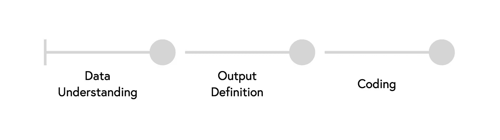
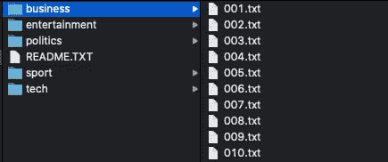
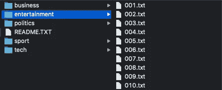
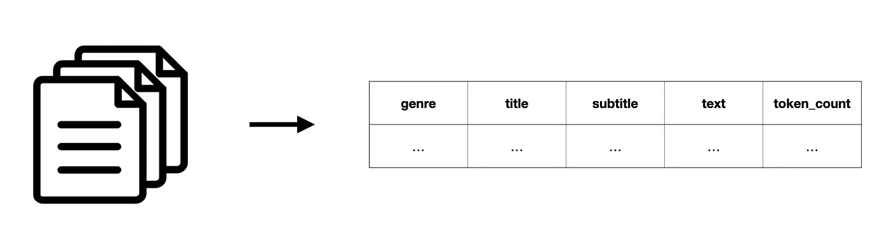

# 用 Python 将文本文件转换成数据表

> 原文：<https://towardsdatascience.com/transforming-text-files-to-data-tables-with-python-553def411855?source=collection_archive---------9----------------------->

## 从任何文本文件中提取信息的可重用方法


Maksym Kaharlytskyi 在 [Unsplash](https://unsplash.com?utm_source=medium&utm_medium=referral) 上的照片

在本文中，我描述了如何将一组文本文件转换成可用于自然语言处理和机器学习的数据表。为了展示我的方法，我使用了 D. Greene 和 P. Cunningham 在 2006 年发表的原始 BBC 新闻文章[数据集](http://mlg.ucd.ie/datasets/bbc.html)。

在进入 IDE 并开始编码之前，我通常会遵循一个过程，包括理解数据、定义输出以及将所有内容翻译成代码。我认为编码前的任务通常是最重要的，因为它们有助于更有效地构建和遵循编码过程。



我这个项目的三步流程

# 1.数据理解

在能够从文本文件中提取任何信息之前，我们希望知道它的信息是如何构造的，以及文本文件是如何存储的以及存储在哪里(例如，名称、目录)。

## 结构

为了理解这种结构，我们看一下一些文本文件，了解一下数据的结构。

```
Claxton hunting first major medal

British hurdler Sarah Claxton is confident she can win her first major medal at next month's European Indoor Championships in Madrid.

The 25-year-old has already smashed the British record over 60m hurdles twice this season, setting a new mark of 7.96 seconds to win the AAAs title. "I am quite confident," said Claxton. "But I take each race as it comes. "As long as I keep up my training but not do too much I think there is a chance of a medal." Claxton has won the national 60m hurdles title for the past three years but has struggled to translate her domestic success to the international stage.
...
```

在新闻文章的上下文中，可以容易地假设第一和第二部分分别对应于标题和副标题。以下各段是文章的正文。查看示例数据，我们还发现这些片段由新行分隔，这些新行可用于拆分文本。

## 储存；储备

要编写一个自动运行每个文本文件的脚本，我们需要知道文本文件是如何存储的。因此，我们对目录的命名和组织感兴趣。潜在地，我们需要重新构造东西，这样我们就可以更容易地遍历文件。



文本文件的命名和组织

幸运的是， [BBC 新闻数据集](http://mlg.ucd.ie/datasets/bbc.html)已经为自动化信息提取构建好了结构。从上面的截图中可以看出，文本文件根据它们的类型存储在不同的目录中。每个流派的名称也是相似的，由前导零(如果文件号小于 100)、文件号和“.”组成。txt”。

# 2.输出定义

基于数据理解步骤的见解，我们可以定义输出中应该包含哪些信息。为了确定输出，我们必须考虑上一步的学习，并考虑输出的潜在用例。

基于我们可能从文本文件中提取的信息，我提出了两种不同的机器学习训练用例:

*   文本分类(基于文本的类型预测)
*   文本生成(基于文本的标题或副标题生成)

为了满足这两个潜在用例的需求，我建议提取以下信息。



文本文件信息抽取的目标输出

我还将包括文本的长度(以记号的数量表示)，以便以后更容易过滤更短或更长的文本。为了存储提取的数据，我建议使用制表符分隔值(.tsv)文件，因为逗号或分号可以出现在文本列中。

# 3.编码

由于前面的步骤，我们知道我们正在处理的数据以及在转换过程结束时我们想要输出什么样的信息。现在你可能知道了，我喜欢把任务分成更小的部分。编码步骤也不例外:)通常，我会将编码分成至少三个不同的部分，并将它们包装在单独的函数中:

*   读取和分割文件
*   提取信息
*   构建数据框

为了使这个新闻文章提取器可重用，我创建了一个实现这些函数的新类。

## 读取和分割文件

为了用 python 读取文件，我们需要由目录和文件名组成的相应路径。正如我们在数据理解步骤中观察到的，文件存储在它们对应的流派目录中。这意味着要访问一个文件，我们需要基本路径(对我来说是“数据”)、类型和名称。

如果文件存在，我们要读取它，用新的行字符(' \n ')分割它，过滤空字符串，并将剩余的文本部分作为列表返回。在文件不存在的情况下(例如，文件数大于可用文件数)，我们希望返回一个空列表。如果文件不存在，我更喜欢这样做，而不是使用异常或不返回任何异常。

```
def read_and_split_file(self, genre: str, file_name: str) -> list:
    text_data = list()
    current_file = os.path.abspath(os.path.join('data', genre, file_name))
    if os.path.exists(current_file):
        open_file = open(current_file, 'r', encoding="latin-1")
        text_data = open_file.read().split('\n')
        text_data = list(filter(None, text_data))
    return text_data
```

正如您在上面的代码中看到的，使用操作系统包。因此，我们需要导入这个包。

## 提取信息

为了提取文本文件的信息并为下一步做好准备，我建议对每种体裁都这样做。这意味着，我们循环遍历相应流派目录中的每个文件。通过保存一个 current_number 变量，我们可以用前导零来格式化文件名，然后通过调用上面实现的方法来读取和拆分文件。

如果返回的列表是空的，我们想要停止循环，因为这意味着我们到达了循环的末尾，并且在目录中没有任何新的文件。

否则，我们将阅读和拆分功能返回的信息添加到特定的数据容器中，如标题、副标题和文本。因为我建议在最终输出中也提供文本的令牌计数，所以我们可以使用 nltk 包对文本进行令牌化，并将令牌列表的长度添加到 token_counts 列表中。最后，我们将 current_number 加 1，继续提取下一个文件。

```
def extract_genre_files(self, genre: str) -> pd.DataFrame:
    found = True
    current_number = 1
    titles = list()
    subtitles = list()
    texts = list()
    token_counts = list()
    while found:
        file_name = "{:03d}.txt".format(current_number)
        text_data = self.read_and_split_file(genre, file_name)
        if len(text_data) != 0:
            titles.append(text_data[0])
            subtitles.append(text_data[1])
            article_text = ' '.join(text_data[2:])
            texts.append(article_text)
            token_counts.append(len(nltk.word_tokenize(article_text)))
            current_number += 1
        else:
            found = False

    genres = [genre] * len(titles)
    data = {'genre': genres, 'title': titles, 'subtitle': subtitles, 'text': texts, 'token_counts': token_counts}
    data_frame = pd.DataFrame(data)
    return data_frame
```

在完成类型文件的循环之后，我们基于存储在特定列表中的提取信息创建一个数据帧。与上一步类似，我们需要导入两个包(nltk 和 pandas)。还请确保您已经下载了 nltk 包的“punkt”数据，因为它是标记文本所必需的。

```
import nltk
# nltk.download('punkt')
import pandas as pd
```

## 构建数据框

在最后一步，我们必须在现有流派上创建一个循环，通过调用上面实现的方法提取每个流派的信息，连接每个流派的输出，最后将连接的数据帧保存为带有所需分隔符的 csv。

```
def transform_texts_to_df(self, name, genre_list, delimiter = '\t'):
    article_df_list = list()
    for genre in genre_list:
        article_df_list.append(self.extract_genre_files(genre))
    df = pd.concat(article_df_list)
    df.to_csv(name, sep=delimiter)
    return df
```

在实现了类及其方法之后，我们需要创建 ArticlecsvParser 类的一个实例，并调用 transform_texts_to_df 方法，方法是为生成的 CSV 提供所需的名称和一个包含所有流派的列表。就这样。

```
if __name__ == "__main__":
    genre_list = ['business', 'entertainment', 'politics', 'sport', 'tech']
    parser = ArticleCSVParser()
    df = parser.transform_texts_to_df('bbc_articles.csv', genre_list)
    print(df.head())
```

# 结论

在本文中，我展示了如何将文本文件转换成数据帧，并将其保存为 csv/tsv。为了对不同的数据集重用该类，只需创建一个从 ArticleCSVParser 继承的新类，并覆盖必须更改的方法。

您也可以在这个[存储库](https://github.com/guggio/bbc_news/tree/master/article_to_csv)中找到完整的代码和数据集。

我希望你喜欢并快乐编码！