# 如何转换熊猫数据框架中的变量

> 原文：<https://towardsdatascience.com/transforming-variables-in-a-pandas-dataframe-bce2c6ef91a1?source=collection_archive---------9----------------------->

## 衍生和修改变量的方法，使其符合目的

无论是准备数据以提取洞察力，还是为模型设计特征，我认为处理数据的个人的基本技能之一是将数据可靠地转换为所需格式的能力。作为数据清理、数据准备、数据管理、数据操作、数据争论、数据丰富、数据预处理(咻！😅)，经常需要将变量/列/特性转换成更合适的形式。换句话说，原始数据往往需要改头换面✨才能更有用。


在 [Unsplash](https://unsplash.com?utm_source=medium&utm_medium=referral) 上 [Leone Venter](https://unsplash.com/@fempreneurstyledstock?utm_source=medium&utm_medium=referral) 拍摄的照片

# 0.Python 设置🔧

我假设读者(👀是的，你！)可以访问并熟悉 Python，包括安装包、定义函数和其他基本任务。如果你是 Python 的新手，[这个](https://www.python.org/about/gettingstarted/)是一个入门的好地方。

我已经在 Jupyter Notebook 中使用并测试了 Python 3.7.1 中的脚本。在我们开始推导之前，让我们确保你有正确的工具。

## ⬜️确保安装了所需的软件包:熊猫和 nltk

我们将使用以下强大的第三方软件包:

*   *numpy:* 数值计算库和
*   *熊猫*:数据分析库。

# 1.数据📦

为了使事情易于管理，我们将创建一个小的数据框架，它将允许我们在下一节中监视每个任务的输入和输出。在一个假设的世界里，我收集了一些弹珠🔮，让我们假设下面的数据框包含我拥有的每种弹珠的详细信息。(嘶！您可能需要将代码复制到 Jupyter 笔记本或代码编辑器中，以获得更好的格式。)

```
# Import packages
import numpy as np
import pandas as pd# Update default settings to show 2 decimal place
pd.options.display.float_format = '{:.2f}'.format# Create a small dataframe
df = pd.DataFrame({'name': ['bob 2012', 'Ava 2013', 'Aby 007', 'XYZ 8', 'GRZ x7', 'Boo VIII', 'Joy 2020'],
                   'p_date': ['2020-02-01', '2020-05-01', '2020-06-30', '2020-04-15', '2020-01-04', '2020-03-21', '2020-07-08'],
                   'count': [80, 30, 10, 60, 40, 20, np.nan],
                   'colour': ['pink', 'teal', 'velvet', 'pink', 'green', 'teal', 'pink'],
                   'radius': [1, 2, 3, 4, 5, 6, 7],
                   'unit': ['cm', 'inch', 'cm', 'cm', 'inch', 'cm', 'cm']})
df
```

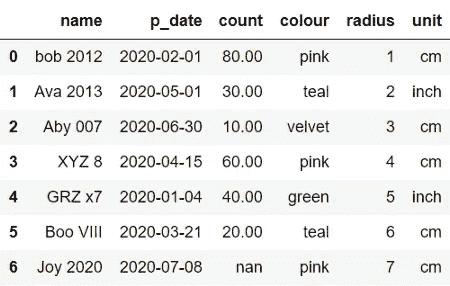

## 1.1.数据字典📘

每行代表一种大理石。列定义为:
◼ **名称:**每颗弹珠的名称(第一部分是型号名称，第二部分是版本)
◼ **购买日期:**我购买一种弹珠的日期
◼ **计数:**我拥有多少颗特定种类的弹珠
◼ **颜色:**该种类的颜色
◼ **半径:**该种类的半径测量值(对🙊)
◼ **单位:**单位为*半径*

如果这没有多大意义，不要太担心，因为这只是一个玩具数据。

# 2.转换变量🎨

在这一节中，我们将看一些转换不同数据类型的例子。我们将创建包含转换的新列，以便原始变量不会被覆盖。在可能的情况下，提供了实现相同转换的替代代码以供参考。从这些备选方案列表中，希望您能找到一两个技巧，用于日常数据操作。现在，是时候改头换面了！✨

请注意，所示的一些方法的底层逻辑可以应用于任何数据类型。

## 2.1.转换数值变量

🔦**类型:**基于两个条件创建一个条件变量。

**🔒任务:** *半径*不能直接跨种类比较，因为它们用不同的单位表示。让我们创建一个变量，以厘米为单位显示半径，以保持一致性。

**🔑答:**我们将调用新变量 *radius_cm* 。假设 1 英寸等于 2.54 厘米，我们可以将条件总结如下:
1)如果单位是“厘米”，则*radius _ cm = radius* 2)如果单位是“英寸”，则*radius _ cm =*2.54** radius*

我们可以使用下面的脚本创建*半径 _ 厘米*:

```
# Method using np.where
df['radius_cm'] = np.where(df['unit']=='inch', 2.54 * df['radius'], df['radius'])# ============== ALTERNATIVE METHODS ==============
## Method using np.select
# df['radius_cm'] = np.select([df['unit']=='inch'], [2.54 * df['radius']], default=df['radius'])## Method applying lambda function with if
# df['radius_cm'] = df[['radius', 'unit']].apply(lambda x: 2.54 * x[0] if x[1]=='inch' else x[0], axis=1)## Method A using loc
# df.loc[df['unit']!='inch', 'radius_cm'] = df['radius']
# df.loc[df['unit']=='inch', 'radius_cm'] = 2.54 * df['radius']## Method B using loc (works as long as df['radius'] has no missing data)
# df['radius_cm'] = df['radius']
# df.loc[df['unit']=='inch', 'radius_cm'] = 2.54 * df['radius']# Inspect results
df
```

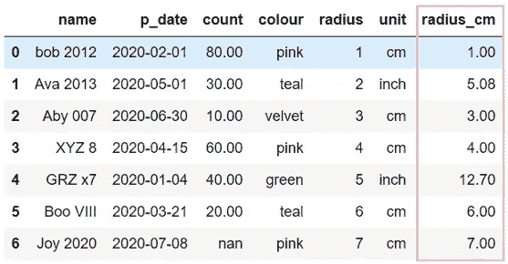

**💡快速提示:**要在 Jupyter 笔记本中注释或取消注释代码，如果你还不知道的话，选择一段代码并使用[Ctrl/Cmd + /]快捷键。

_________________________________________________________________🔦**类型:**根据 2 个条件创建一个条件变量(分类)。

**🔒任务:**根据其*半径创建一个描述大理石尺寸的变量，单位为厘米*。

**🔑答:**我们将新变量*的大小叫做*。让我们将“大”定义为*半径*为 5 厘米或更高的弹珠，任何低于 5 厘米的则定义为“小”。所以条件是:
1)如果 *radius_cm* ≥ 5 那么 *size* = '大'2)如果 *radius_cm <* 5 那么 *size =* '小'

我们可以使用下面的脚本创建*大小*:

```
# Method applying lambda function with if
df['size'] = df['radius_cm'].apply(lambda x: 'big' if x>=5 else 'small')# Inspect results
df.sort_values('radius_cm')
```

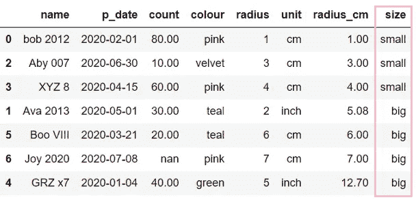

为了避免重复，我没有为这个任务提供任何替代方法，因为第一个任务中的任何方法都可以在这里使用。

**📌练习:**通过引用第一个任务中显示的方法，尝试使用不同的方法进行相同的转换。

_________________________________________________________________

🔦**类型:**创建一个计算变量。

**🔒任务:**为弹珠计算球体体积。

**➗公式:**

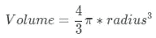

**🔑答:**我们可以使用下面的脚本创建*卷*:

```
# Method using eval
pi = np.pi
df.eval("volume = 4/3 * @pi * radius**3", inplace=True)# ============== ALTERNATIVE METHOD ==============
## Method using simple operators
# df['volume'] = 4/3 * np.pi * df['radius']**3## Method using pandas wrappers
# df['volume2'] = df['radius'].pow(3).mul(4/3*np.pi)## Short description for pow, mul and a few other wrappers:
## add: for addition 
## sub: for subtractaction
## mul: for multiplication
## div: for division
## pow: for exponential power (Tip: can use pow(0.5) or pow(1/2) for square root)# Inspect results
df
```

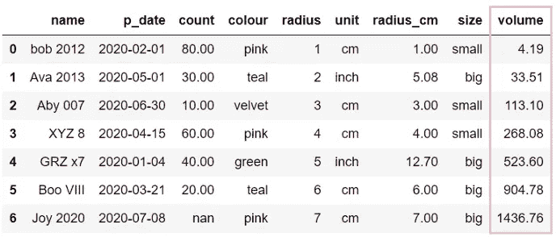

_________________________________________________________________🔦**类型:**将数值分割成等宽的条块(Discritise)。

**🔒任务:**创建一个变量，根据它们的*计数*将弹珠分成两个等宽的格子。

**🔑答:**我们将新变量*称为 cut* 。
◼最小*计数* = 10
◼最大*计数* = 80
◼范围*计数* =最大—最小= 70
◼箱宽度=范围/箱数= 70 / 2 = 35
*由于计数*的范围是从 10 到 80 个弹珠，具有 2 个箱将意味着第一个箱是 10 到 45，第二个箱是 45 到 80 目前，我们已经用默认设置`right=True`将面元定义为包含最右边的边。这意味着，如果我们有 45 个弹珠，它将落入较低的箱子(即 10–45)。通过在下面的函数中添加`right=False`,我们可以很容易地改变这种行为，以排除最右边的边缘。也请参见我在下一个任务中的注释。

我们可以使用下面的脚本创建*切割*:

```
# Method using pandas.cut
df['cut'] = pd.cut(df['count'], bins=2, labels=['bin1', 'bin2'])# Inspect results
df[['count', 'cut']].sort_values('count')
```

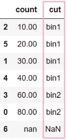

_________________________________________________________________

🔦**类型:**将数值分割成大小相等的块(Discritise)。

**🔒任务:**创建一个变量，根据弹球的*计数*，将弹球分成两个大小相等的桶(即分位数)。

**🔑答:**我们将调用新变量 *qcut* 。
◼排序*计数*升序:10、20、30、40、60、80
◼ #记录= 6
◼ #分位数= 2
◼ #每个分位数的记录数= #记录数/ #分位数= 6 / 2 = 3
因为 c *计数*中有 6 个非缺失值，具有相等大小的存储桶意味着第一个分位数将包括:10、20、30 和

值得注意的是，如果您有兴趣查看等宽或等大小箱子的确切分界点，一种方法是从函数中省去`label`参数。查看精确的截止点将使离散化时如何处理边缘上的点变得清晰。

所以无论如何…回到 *qcut* ，我们可以使用下面的脚本创建它:

```
# Method using pandas.qcut
df['qcut'] = pd.qcut(df['count'], q=2, labels=['q1', 'q2'])# Inspect results
df[['count', 'cut', 'qcut']].sort_values('count')
```

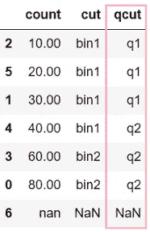

注意到*切割*和*q 切割*的区别了吗？

_________________________________________________________________

## 2.2.转换分类变量或字符串变量

🔦**类型:**基于 3+条件(组)创建一个条件变量。

**🔒任务:**创建一个变量，将粉色缩写为“PK”，将蓝绿色缩写为“TL”，将所有其他颜色(天鹅绒和绿色)缩写为“OT”。

**🔑答:**我们将新的变量叫做 *colour_abr* 。所以条件是:
1)如果*颜色*是‘粉色’那么*颜色 _ ABR*=‘PK’2)如果*颜色*是‘蓝绿色’那么*颜色 _ ABR =*‘TL’
3)如果*颜色*不是‘天鹅绒’就是‘绿色’那么*颜色 _ ABR*=‘OT’。

我们可以使用下面的脚本创建 *colour_abr* :

```
# Method using replace
df['colour_abr'] = df['colour'].replace({'pink': 'PK', 'teal': 'TL', 'velvet': 'OT', 'green': 'OT'})# ============== ALTERNATIVE METHODS ==============
## Method A using map
# mapping = {'pink':'PK', 'teal': 'TL', 'velvet': 'OT', 'green': 'OT'}
# df['colour_abr'] = df['colour'].map(mapping)## Method B using map (works as long as df['colour'] has no missing data)
# df['colour_abr'] = df['colour'].map({'pink':'PK', 'teal': 'TL'})
# df['colour_abr'].fillna('OT', inplace=True)## Method using nested np.wheres
# df['colour_abr'] = np.where(df['colour']=='pink', 'PK', np.where(df['colour']=='teal', 'TL', 'OT'))## Method using np.select
# df['colour_abr'] = np.select([df['colour']=='pink', df['colour']=='teal'], ['PK', 'TL'] , default='OT')## Method applying lambda function with nested ifs
# df['colour_abr'] = df['colour'].apply(lambda x: 'PK' if x=='pink' else ('TL' if x=='teal' else 'OT'))## Method using list comprehension
# df['colour_abr'] = ['PK' if x=='pink' else ('TL' if x=='teal' else 'OT') for x in df['colour']]## Method A using loc
# df.loc[df['colour'] == 'pink', 'colour_abr'] = 'PK'
# df.loc[df['colour'] == 'teal', 'colour_abr'] = 'TL'
# df.loc[df['colour'].isin(['velvet', 'green']), 'colour_abr'] = 'OT'## Method B using loc (works as long as df['colour'] has no missing data)
# df['colour_abr'] = 'OT'
# df.loc[df['colour'] == 'pink', 'colour_abr'] = 'PK'
# df.loc[df['colour'] == 'teal', 'colour_abr'] = 'TL'# Inspect results
df[['colour', 'colour_abr']].sort_values('colour_abr')
```

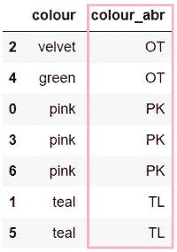

如果我们只是重命名类别而不是分组，我们也可以使用下面*中的任何一种方法。cat 访问器*除了上面显示的方法之外:

```
# Create a copy of colour and convert type to category
df['colour_abr'] = df['colour'].astype('category')# Method using .cat.rename_categories
df['colour_abr'].cat.rename_categories({'green':'GN', 'pink':'PK', 'teal':'TL', 'velvet': 'VT'}, inplace=True)# ============== ALTERNATIVE METHOD ==============
## Method using .cat.categories
## Make sure to get the order of the categories right
## Check the order with by running df['colour_abr'].cat.categories
# df['colour_abr'].cat.categories = ['GN', 'PK', 'TL','VT']# Inspect results
df[['colour', 'colour_abr']].sort_values('colour_abr')
```

有关*的更多信息，请参见本文档。卡特彼勒存取器*。🐱

_________________________________________________________________

🔦**类型:**解析字符串(从字符串中提取一部分)。

**🔒任务:**解析*名称*，这样我们就有了*型号*和*版本*的新列。

**🔑答:**我们现在将使用*中的一个方法。str 访问器*提取部件:

```
# Method using .str.split
df[['model', 'version']] = df['name'].str.split(' ', expand=True)# ============== ALTERNATIVE METHOD ==============
## Method applying lambda function
# df['model'] = df['name'].apply(lambda x: x.split(' ')[0])
# df['version'] = df['name'].apply(lambda x: x.split(' ')[1])# Inspect results
df[['name', 'model', 'version']]
```

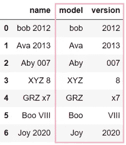

_________________________________________________________________

🔦**类型:**连接或合并列(与上述任务相反)。

**🔒任务:**将*模型*(大写)和*半径*中的值合并到一个新列中。

**🔑答案:**我们现在将使用下面的脚本来连接:

```
# Method using + operator
df['mod_rad'] = df['model'].str.upper() + '_' + df['radius'].astype(str)# ============== ALTERNATIVE METHOD ==============
## Method using chained .str methods
# df['mod_rad'] = df['model'].str.upper().str.cat(df['radius'].astype(str), sep="_")# Inspect results
df
```

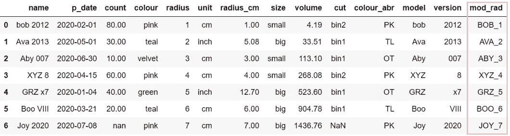

关于*的更多信息，参见[本文档](https://pandas.pydata.org/pandas-docs/stable/user_guide/text.html)。字符串存取器*。🎻

_________________________________________________________________

## 2.3.转换日期时间变量

🔦**类型:**解析日期时间(从日期时间中提取一部分)。

**🔒任务:**提取一周的*天*，以及购买的*年*。

**🔑答:**我们现在将使用*中的方法。dt 存取器*提取零件:

```
# Convert type to datetime
df['p_date'] = pd.to_datetime(df['p_date'])# Method using .dt.day_name() and dt.year
df['p_dname'] = df['p_date'].dt.day_name()
df['p_year'] = df['p_date'].dt.year# Inspect results
df[['p_date', 'p_dname', 'p_year']]
```

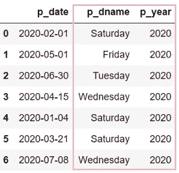

_ _ _ _ _ _ _ _ _ _ _ _ _ _ _ _ _ _ _ _ _ _ _ _ _ _ _ _ _ _ _ _ _ _ _ _ _ _ _ _ _ _ _ _ _ _ _ _ _ _ _ _ _ _ _ _ _ _ _ _ _ _ _ _ _ _ _ _ _ _ _ _ _ _ _ _ _ _**📌练习:**尝试从 *p_date* 中提取月和日，并找出如何将 *p_year* 、 *p_month* 、 *p_day* 组合成一个日期。

关于*的更多信息，参见本文档。dt 存取器*。🕟

通过滚动左边的窗格[到这里](https://pandas.pydata.org/pandas-docs/stable/reference/api/pandas.Series.str.split.html)，您可以浏览前面讨论的访问器的可用方法。当心*熊猫。Series.xxx.yyy* 其中 *xxx* 可以替换为 *cat* 、 *str* 或 *dt，yyy* 是指方法。

# 3.把所有东西放在一起📃

现在我们将熟悉*赋值，*它允许我们一次创建多个变量。测试完成后，我们可以结合如下步骤:

```
# Convert type to datetime
df['p_date'] = pd.to_datetime(df['p_date'])# Derive variables
df = df.assign(radius_cm = np.where(df['unit']=='inch', 2.54 * df['radius'], df['radius']), # Referenced radius as radius_cm hasn't been created yet
               size = list(map(lambda r, u: 'big' if ((u=='cm') & (r>=5)) | ((u=='inch') & (2.54*r>=5)) 
                               else 'small', df['radius'], df['unit'])),
               volume = 4/3 * np.pi * df['radius']**3,
               cut = pd.cut(df['count'], bins=2, labels=['bin1', 'bin2']),
               qcut = pd.qcut(df['count'], q=2, labels=['q1', 'q2']),
               colour_abr = df['colour'].replace({'pink': 'PK', 'teal': 'TL', 'velvet': 'OT', 'green': 'OT'}),
               # If you find a way to combine the following 2 lines in 1 line inside assign(), feel free to teach me how
               model = df['name'].str.split(' ', expand=True)[0],
               version = df['name'].str.split(' ', expand=True)[1],
               mod_rad = df['name'].str.split(' ', expand=True)[0].str.upper() + '_' + df['radius'].astype(str),
               p_dname = df['p_date'].dt.day_name(),
               p_year = df['p_date'].dt.year)# Inspect results
df
```

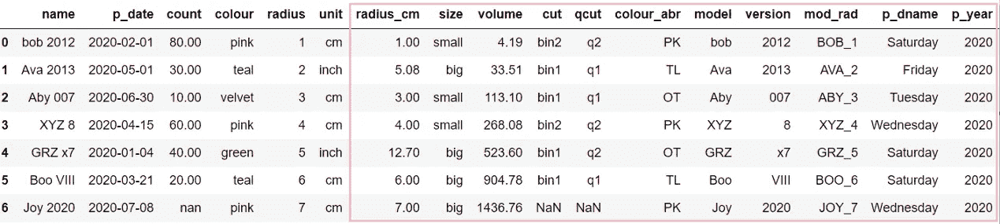

这个脚本看起来是不是有点忙乱？如果你一行一行地看，你会发现每一行都是我们从第 2 节中学到的代码的一个稍微变形的版本。

最后一点，在创建变量时，如果你犯了一个错误，你可以用正确的变量覆盖不正确的变量，或者使用⛔️:下面的脚本删除它

```
# Method A using del
del(df['var_name'])# ============== ALTERNATIVE METHODS ==============
## Method B using del
# del df['var_name']## Method using drop
# df.drop(columns='var_name', inplace=True)
```


照片由 [STIL](https://unsplash.com/@stilclassics?utm_source=medium&utm_medium=referral) 在 [Unsplash](https://unsplash.com?utm_source=medium&utm_medium=referral) 上拍摄

您想访问更多这样的内容吗？媒体会员可以无限制地访问媒体上的任何文章。如果您使用 [*我的推荐链接*](https://zluvsand.medium.com/membership)*成为会员，您的一部分会费将直接用于支持我。*

谢谢你看我的帖子。我希望你已经学到了一些东西，✂️.如果你感兴趣，这里有我其他一些帖子的链接:
◼️️[NLP 介绍—第 1 部分:Python 中的预处理文本](/introduction-to-nlp-part-1-preprocessing-text-in-python-8f007d44ca96)
◼️[NLP 介绍—第 2 部分:引理满足和词干化的区别](https://medium.com/@zluvsand/introduction-to-nlp-part-2-difference-between-lemmatisation-and-stemming-3789be1c55bc)
◼️[NLP 介绍—第 3 部分:TF-IDF 解释](https://medium.com/@zluvsand/introduction-to-nlp-part-3-tf-idf-explained-cedb1fc1f7dc)
◼️[NLP 介绍—第 4 部分:Python 中的监督文本分类模型](https://medium.com/@zluvsand/introduction-to-nlp-part-4-supervised-text-classification-model-in-python-96e9709b4267)

继续改造！保持，保持变换变量！🎤(跟着唱！🙋)
你继续改造！你继续，继续变换变量！🎶
继续改造！保持，保持变换变量！🎵
去转换你的数据…🎼

你猜到我的歌参考了吗？(提示: [L[a-z]{4}](https://cheatography.com/davechild/cheat-sheets/regular-expressions/) )

再见🏃💨