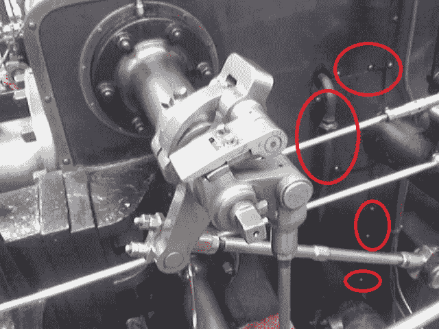
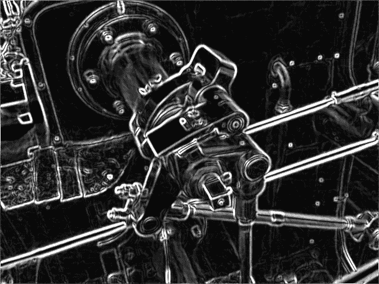

# 从机械工程师过渡到机器学习工程师(或数据科学家)

> 原文：<https://towardsdatascience.com/transition-from-mechanical-engineer-to-machine-learning-engineer-or-data-scientist-786b9887537?source=collection_archive---------1----------------------->

## 我自己从一个物理机器的世界到另一个充满数字机器的世界的旅程故事。

图片提供:【https://www.core77.com 

我有机械工程(ME)背景，因为我所有的学位都在我这里。在我获得学士学位后，当数据革命成形时，我正在机器人领域接受高等教育。当时人们更熟悉“大数据”这个词，而不是数据科学。然后，我迷上了机器学习，并从那时起开始将我的职业道路转向数据科学。我有一个机器人背景的良好开端，特别是在编程方面，所以我不必从零开始。尽管如此，我在尝试进入数据科学领域时遇到了许多障碍。

当时我很困惑，因为我不知道从哪里开始，我需要提高什么技能，我应该如何形成我的简历，等等。如果你正在阅读这篇文章，并且有类似的自我背景，我希望你会发现这很有帮助。

# 数据科学真的比机械工程好吗？

在我们决定为在线课程或其他不可逆转的行为投入时间和金钱之前，花点时间认真思考一下自己的动机可能是件好事。如果仅仅是因为[这份 21 世纪最性感的工作](https://hbr.org/2012/10/data-scientist-the-sexiest-job-of-the-21st-century)，很有可能当热情消退后，你会在浪费投资和迷失在航行中后留下困惑和沮丧。

在我看来，任何两个工作之间的比较都是无关紧要的，因为任何领域都有其利弊。然而，作为一个在这两个领域都呆过一段时间的人，我想指出这两个领域的一些特点，仅仅反映我个人的观点。

**机械工程:**

*   医用电气技术往往在行业内长期有效。例如，卡尔曼滤波器、PID 控制等。那些现在都在用，可能比我还老。这样，你就不必在你的学术教育之后经常学习和更新自己，至少在理论知识方面。(持续学习对于保持领先地位并不重要。)
*   有限的工具集:有机器控制、硬件设计等标准工具的基准。同样，这又回到了第一点，你不必经常更新。
*   并不总是要求高等教育学位。这是我的主观观察。这是因为这样一个事实，为了正常工作，并被认为是一个高技能的机械工程师，一个人需要一个长期的工作经验，而不是在一个特定的 ME 浓度高等教育学位。通常情况下，我发现硕士学位足以让一个人在整个职业生涯中追求我。
*   有点无聊，因为大多数问题都有很好的定义和经过测试的解决方案。这项工作的主要部分通常是选择正确的解决方案和工具。此外，机器是一致的和可预测的，因此一次有效的解决方案往往会在很长一段时间内有效。

数据科学具有几乎完全相反的特征。

**数据科学:**

*   技术日新月异。此外，你不仅要应对 AI/ML 的变化，还要应对更广泛的软件工程领域，尤其是当你选择成为一名 ML 工程师的时候。
*   明面上是广阔的。我几乎从来没有发现任何 ML 应用程序仅仅通过一个设计就可行。你可能会说“好吧，这难道不是一件好事吗，我只需要找到至少一种做事的方法，并且坚持不懈地做下去”。不完全是。你不仅要成为这个领域的*主管*，你还得成为*兼容*。您选择的工具可能无法与团队的其他成员一起工作。
*   高等教育学位往往是必备的，至少能帮你通过简历筛选。根据[这项研究](https://medium.com/indeed-engineering/where-do-data-scientists-come-from-fc526023ace)，**不到 30%** 的数据科学家或 ML 工程师*，*没有硕士或博士学位。但更有趣的是，根据同一项研究，不到 20% 的数据科学家和不到 50% 的 ML 工程师拥有*计算机科学*学位。所以不要担心，如果你已经有了一个博士学位，你可能不需要再考一个。
*   可以充满惊喜，因为问题空间是巨大的，并且经常存在人类交互层。毕竟，不管人工智能应用程序是什么领域，它们最终都会暴露给人类用户。因为人类是不可预测的，所以你的解决方案的生命周期也是不可预测的。有些可能会持续到你离开公司的那一天，有些可能明天就需要重新设计。
*   普遍有吸引力的薪酬待遇。

我没有将上述特征分为优点和缺点，因为我认为这在很大程度上取决于个人。例如，如果你想要一个稳定的生活和一个常规的工作空间，那么我的无聊就不是一个缺点。

## 需要多长时间？

执行转换需要大量的时间和精力。作为任何一种投资，你可能要考虑多久可以收回利息。对某些人来说，这种转变可能是自然的，需要时间、数月甚至数年才能完成，正如本文[中的](/to-be-or-not-to-be-a-data-scientist-13684ba7422)。对于[和其他](/how-i-went-from-zero-coding-skills-to-data-scientist-in-6-months-c2207b65f2f3)来说，它可能会被顿悟的时刻所推动，并被一个仓促的计划所执行。以我的经验来看，如果你已经有了一份全职工作，通常需要几年时间，如果你在读大学，时间可能会短一点。主要是因为你需要空闲时间去发展新的技能。同样，这也很大程度上取决于你已经有什么，所以这个时间框架只是供参考。

# 怎么做过渡？

我很喜欢“过渡”这个词。你从一个状态过渡到另一个状态，而不是“跳到”或“开始一个新的”。换句话说，通过认识到你拥有的 ME 背景，并战略性地开发数据科学中所需的新技能，你将获得成功。

由于数据科学中的技能通常分为 3 个主要类别:数学/统计、领域知识和编程，因此我将相应地构建这一部分，每个部分都有一个“可重用性分数”，我认为在过渡中我们可以重用 ME 背景有多难。

## 数学/统计

可重用性评分:**易**。

如果有一件事是我对自己的背景最有信心的，那就是对数学和统计学的严谨和扎实的理解。回顾你的学业成绩单，数一数你学过的数学相关课程，你可能会感到惊讶。挑战在于，每当我和我的朋友谈论在大学学习数学时，我都会得到这样的回答:“是的，是的，我仍然在等待有一天我可以在我的现实生活中使用[格林定理](https://en.wikipedia.org/wiki/Green's_theorem)”。不，你不会。但那不是学习数学的目的。它给你“精神食粮”。它给你解决问题的动力。

我给你举个例子。如果我让你计算这个函数的一阶导数。简单，就是`y = 2x`。但是，你如何利用这种技能赚钱呢(除了给一个高中生做家教)？

这里有个窍门，重要的不是数字和数学公式，而是数学背后的直觉。一阶导数告诉你函数增加或减少的速度。因此，在函数为常数的区域，它在 0 附近，而在其他地方不为零。让我们看看我们能用这种直觉做些什么。

现在，假设你是一名工程师，一家汽车制造厂的制造经理向你抱怨说，在让机器出厂之前，他们花了一大笔钱请一名测试人员来数机器上的螺丝数量。如果您能够自动化这项任务，那么在退出测试人员角色之后，您将获得 20%的利润。现在我们谈论的是真正的钱。

你拍一张测试者的照片。图片提供:[https://en.wikipedia.org/wiki/Sobel_operator](https://en.wikipedia.org/wiki/Sobel_operator)

你拍一张测试者的照片。你观察到螺丝和机身颜色不一样，那么如果有办法让它在照片中“弹出来”，你就可以有一个程序来“数”它们。因为你记得我们可以使用一阶导数来寻找函数显著变化的区域，所以你意识到这些螺钉的边缘应该具有非零的一阶导数。

应用一阶导数滤波后的相同照片。图片提供:【https://en.wikipedia.org/wiki/Sobel_operator 

对图像进行一阶导数滤波，瞧！螺丝钉像星星一样明亮。

现在你可以开发一个计算机视觉系统来代替(可怜的)测试员，并收取你的份额。所有这些都是基于基本的一阶导数直觉。

再举个例子:如果我让你写下概率链规则，那就是小菜一碟:P(A，B)=P(A|B)*P(B)。但是这有什么用呢？

假设有一天，你的高级经理问了这样一个问题:“今年我们花费 2000 美元恢复 XYZ 服务器的可能性有多大？你知道，如果它倒下了。”这是一个数据科学家应该能够回答的有效且常见的业务问题。你会回过头来定义:

*   事件 A:我们必须在服务器 XYZ 上花费 2000 美元。
*   事件 B:服务器 XYZ 关闭。

因此，P(A|B)是你必须支付 2000 美元来修复服务器 XYZ 的概率，假设它确实坏了，P(B)是服务器坏了的概率。确定这些概率的一个快速而又肮脏的方法可能是:

*   P(A|B):你把公司过去所有关于安装服务器 XYZ 的费用的发票翻出来，画一个柱状图，就截止到 2000 美元，假设曲线下的面积是 2%，即安装费用超过 2000 美元的概率。
*   P(B):你翻查公司过去所有的服务器日志，找出所有有宕机的年份，然后除以总年数就可以了。假设在 10 年期间，它在 2 年内被破坏了两次，因此是 20%。

(请注意，异常检测是一个巨大的主题，这只是一个过于简化的解决方案。但我认为这足以说明问题。)

所以，你的公司今年必须支付 2000 美元来修复服务器的最终概率是`0.2 * 0.02 = 0.004`，或者只有 0.4%。

任何学过概率统计 101 的人都可以编写链式法则，但是只有能够“翻译”它来回答商业问题，你才能得到这份工作。

## 领域知识

可重用性评分:**中等**。

与其他类型的工程不同，在其他类型的工程中，工程师的技能或工作成果*直接*产生最终用户购买的产品或服务，数据科学通常不直接创造价值。这就是领域知识至关重要的原因。数据科学家需要彻底了解业务，然后才能将人工智能模型应用于业务。

通常，我看到人工智能模型通过以下设置来创造利润:

1.  取代由人类完成的单调乏味的任务(生产成本更低)。例如 RPA、自动化流程控制、需要对事物进行分类的任务等。
2.  提高生产率(生产更快或销售更好)。例如过程优化器、AI 调度器、劳动力优化、推荐系统等。
3.  基于发现的可行见解，修改/创建新的业务模式。例如，基于调查数据发现客户使用产品的新方式的分析，从而指导新的广告活动。
4.  防止潜在损失。例如安全 AI、流失预测等。

这可能是显而易见的，但所有这些设置都回答了一个问题:

> *如何利用提出的 AI 模型盈利*？

可以通过美元计数或其他 KPI 来衡量。当一个人第一次开始研究数据科学时，他们在第一个项目中可能会有很多顾虑。它可能是方法的新颖性、模型性能、计算复杂性、最新技术水平或模型评估等。对于整个解决方案的工作来说，所有这些都很重要。但是他们都应该以这个问题为导向。这听起来可能很实用，但实际上是。在任何事情发生之前，这个问题在步骤 0 应该有一个满意的答案。

这种转变有点困难，因为对于一个机械工程师来说，你不必真的关心价值是如何创造的。但你所拥有的，是**如何设计和优化*流程*** *:* 机制设计、流程控制、热力学、奥托循环、顶点设计等训练有素的心态。都是过程！在某种程度上，商业模式本身就是一个过程。有更多的不确定性，因为人类参与其中(人类是随机的)，但是你已经被训练在过程中模拟不确定性！

然而，你所带来的(你的面向过程的心态)只是交通工具，你仍然需要燃料来运行。你有没有想过你住的地方附近的美食街是怎么赚钱的？或者你穿的这件衬衫是在地球另一端的一个国家制造的，然后被运到你那里去买？只要把你的想法画在纸上，你会感到惊讶的。你有“良好的库存”，而不是“储气库”(只是一种对气体容器的花哨的热力学行话)；你有了“数据提取管道”，而不是“流体导管”；不是“流量”，而是“数据传输速率”。*物理定律是普遍适用的*，它们在数字世界也同样适用。

## 编程；编排

可重用性评分:数据科学家:**中等**，ML 工程师:**硬**。

我区分这两者，因为在我看来，ML 工程师是可以做建模的核心软件工程师。因此，编程的能力水平需要达到极致。这种区别当然是相对的，因为肯定有数据科学家编写生产代码。

这是最需要花时间去掌握的部分。“编程”在这里有点用得不好，因为它不包括整个软件工程实践:网络、API、CI/CD、Dockerization 等等，你能想到的。不幸的是，ML 工程师之路需要他们(这里我假设数据科学家的背景包含在分析和可视化任务中，换句话说，就是那些不必编写生产代码的人。还是那句话，主观)。

TDS 上有无数的在线课程和精彩的文章，告诉你应该如何提高这一技能，所以我不会再重复了。我只想分享一点:封装的伟大概念，我指的不仅仅是 OOP。这对我的学习帮助很大。

您可以孤立地学习几乎任何软件工程工具/技能，并且一个完整的软件应用程序可以被分解成粒度模块，您可以分别学习每个模块。这太美了，我在机械工程专业做不到。这就产生了一个极其有效的学习策略:*分而治之*。我有很多文件夹，比如:`python-practice`、`spark-practice`、`Docker-practice`、`gRPC-practice`、`k8s-practice`等等。每个不超过 5 个文件包含该工具最基本的示例代码。一旦你掌握了足够数量的这些“乐高积木”，设计 solution architect 将充满乐趣。你可以自由决定你的人工智能模型如何与其他模块互动。

请注意，将所有模块组合在一起以形成一个功能应用程序需要付出巨大的努力，否则，软件工程师就不会存在，因为人们只需选择模块，一个“通用”程序就会编译出所需的应用程序，就像你在麦当劳自助点餐亭订购一样。这是一个你可以用来快速学习的有效方法。

当我离开的时候，有两个工具我不得不花相当多的时间来学习: **git** 和 **SQL** 。这很有意义，因为在我这里，你不必管理代码，也不必管理关系数据库。对当时的我来说，Dropbox 足以分享代码，后跟前缀如“backup_20080202”的文件夹足以进行版本控制，Excel 可以保存表格。生活简单又容易。所以我必须用 git 和 SQL 来升级游戏。

**git** :我一直认为通过了解一些 git 命令行，我可以流利地使用 git，直到我需要和我的同事合并代码。因此，我推荐的最佳实践是和你的朋友一起做一些结对编程项目:课程项目、爱好项目，或者和你的同事一起开发一个小功能。你越早这样做，你就越早意识到 git 不仅仅是版本控制，你会过得越好。

**SQL** :在我看来，你用的是什么版本的 SQL 并不重要，只要你理解了[SQL 中所有不同种类的连接](https://www.w3schools.com/sql/sql_join.asp)并且知道如何检查结果，你就是优秀的。为什么？因为语法错误很容易发现，所以平台会说“错误:不能将字符串类型转换为整数。”，你的查询会失败，你会知道的。但是连接是无声的杀手。如果您使用了错误的连接类型，或者您没有仔细检查就相信了您的查询结果，那么很可能只有当您的经理叫您进来并质疑您的“荒谬”图表时，您才会发现这一点。例如，如果在不检查重复项的情况下将一个销售表与其他一些产品信息表联接起来，那么联接后的表将会有重复的行。换句话说，一个售出的产品可能会出现不止一次，在你的视觉化视图中，销售量表明你的公司是财富 500 强，而不是一个创业公司。没有人会认真对待你的陈述。

# 最后的话

简而言之，我们讨论了:

*   数学/统计:你已经从教育中获得了所有需要的基础训练。挑战在于将这些知识运用到解决现实世界的问题中。
*   领域知识:理解人工智能应用的本质目的是创造利润有助于你在看待商业模式时将镜头转向不同的角度。毕竟都是过程。
*   编程:分而治之。利用好封装的性质快速学习。

这些东西在我的旅程中给了我很大的帮助，我希望它们对你也有用。

在这个数据领域工作在很多方面都是有益的，但对我来说，这是当一个模型被部署到生产中并看着它运行时我的喜悦，就像当我建造一个机器人并第一次看到整个东西运行时一样。

我们毕竟是工程师。

> **“像伟大的工程师一样进行机器学习，而不是像你不是伟大的机器学习专家一样。”**

快乐(机器)学习！