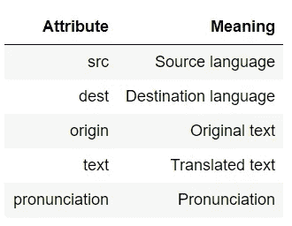
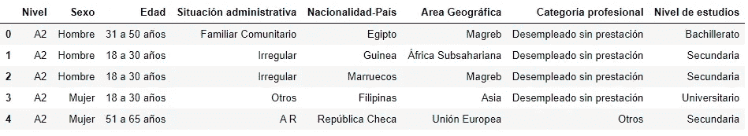
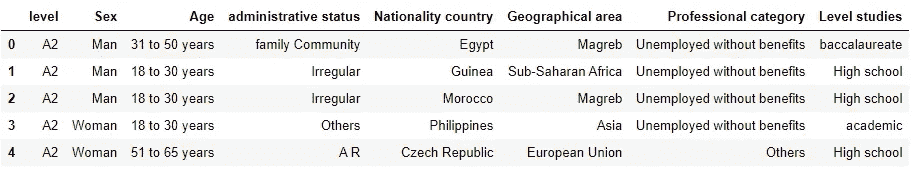

# 使用 googletrans 库翻译熊猫数据框

> 原文：<https://towardsdatascience.com/translate-a-pandas-data-frame-using-googletrans-library-fb0aa7fca592?source=collection_archive---------6----------------------->

谷歌翻译标志

**Googletrans** 是一个免费的 python 库，它使用了 **Google Translate API** 。在本文中，我们将解释如何使用这个库来翻译 Python 中的字符串和数据帧。

# 翻译字符串

**Googletrans** 是一个第三方库，我们可以使用 **pip 来安装。**安装完库之后，我们导入模块 **googletrans。**

第一步是创建一个**翻译器**对象。然后，我们使用方法 **translate** ，将我们想要翻译的字符串作为第一个参数传递。该方法返回一个对象，其属性为**。文本**提供如下翻译后的字符串:

可以使用 ***src*** 和 ***dest*** 参数指定源语言和目的语言。如果没有提供，googletrans 会尝试检测该语言并将其翻译成英语。下面，我们把前面的字符串 ***Hola Mundo*** (西班牙语)翻译成意大利语和德语。

我们可以使用 ***查询支持的翻译语言。*语言**属性。该属性返回一个字典，其中包含了 **googletrans** 中可用的语言。

如前所述，translate 方法返回一个翻译后的对象。该对象具有以下属性:

翻译方法属性

到目前为止，我们已经将一个字符串翻译成了英语、意大利语和德语。现在，我们想完成一项更具挑战性的任务:翻译一个完整的数据帧。

# 翻译数据帧

我们要翻译的数据框可通过以下链接下载:

 [## 马德里阿云达芒托群岛的门户网站

### 马德里大医院的门户网站——移民。西班牙语课程中的人物

datos .马德里. es](https://datos.madrid.es/portal/site/egob/menuitem.c05c1f754a33a9fbe4b2e4b284f1a5a0/?vgnextoid=454bdc5cc762b410VgnVCM2000000c205a0aRCRD&vgnextchannel=374512b9ace9f310VgnVCM100000171f5a0aRCRD&vgnextfmt=default) 

[**datos.madrid.es**](https://datos.madrid.es/portal/site/egob/) 是 [**Madrid**](https://en.wikipedia.org/wiki/Madrid) s 数据服务，包含近 500 个数据集，涵盖商业、交通、旅游、文化等广泛话题。目前，越来越多的欧洲城市提供开放的数据门户，允许公司、市民、研究人员和其他公共机构使用这些数据。数据集通常以该国语言提供。就[**datos . Madrid . es**](https://datos.madrid.es/portal/site/egob/)而言，大部分数据集都有西班牙语版本。

在本文中，我们翻译了包含 2018 年第一学期期间在市政办公室参加外国人西班牙语课程的**学生的信息的数据集。该数据集包括关于学生的信息，如他们参加的课程级别、性别、年龄、国籍、教育水平和行政地位。**

首先我们从[**datos . Madrid . de**](https://datos.madrid.es/portal/site/egob/menuitem.c05c1f754a33a9fbe4b2e4b284f1a5a0/?vgnextoid=454bdc5cc762b410VgnVCM2000000c205a0aRCRD&vgnextchannel=374512b9ace9f310VgnVCM100000171f5a0aRCRD&vgnextfmt=default)**下载 csv 文件。**然后，我们使用[**Pandas . read _ CSV**](https://pandas.pydata.org/pandas-docs/stable/reference/api/pandas.read_csv.html)函数将其加载到 Pandas 数据框中，并使用 [**pandas 可视化前 5 行。data frame . head**](https://pandas.pydata.org/pandas-docs/stable/reference/api/pandas.DataFrame.head.html)**方法。**

****

**数据集包含 8 栏:(1)级别，(2)性别，(3) Edad，(4)行政状况，(5)国家地理，(6)地区地理，(7)专业类别，和(8)研究级别。**

**现在，我们从翻译开始！首先，我们使用 [**熊猫来翻译列名。DataFrame.rename**](https://pandas.pydata.org/pandas-docs/stable/reference/api/pandas.DataFrame.rename.html) 功能如下:**

**使用 [**的熊猫。DataFrame.columns** 的](https://pandas.pydata.org/pandas-docs/stable/reference/api/pandas.DataFrame.columns.html)属性，我们可以检查翻译是否正确进行。在本文中，我们只是翻译列名，但还需要进一步的数据清理(用下划线代替空格，用小写字母代替大写字母)。**

**翻译完列名后，我们翻译其余的数据(单元格值)。首先，我们创建一个字典，其中的关键字是英语术语，值是西班牙语的原始术语。**

**在改变数据框架之前，我们检查由 **googletrans** 所做的翻译。正如我们所观察到的，有些术语翻译不正确(例如 A2 或 A2 DELE)。在这种情况下，我们以下列方式手动更改它们:**

**现在，我们可以通过使用**熊猫来修改数据帧。DataFrame.replace** 函数，使用之前创建的字典作为函数的输入。**

****

**英语数据框架**

**正如我们所观察到的，整个数据都被翻译了💪工作完成:)**

# **有趣的读物**

*   **[https://pypi.org/project/googletrans/](https://pypi.org/project/googletrans/)**
*   **[http://zetcode.com/python/googletrans/](http://zetcode.com/python/googletrans/)**
*   **[https://www . code project . com/Tips/1236705/How-to-Use-Google-Translator-in-Python](https://www.codeproject.com/Tips/1236705/How-to-Use-Google-Translator-in-Python)**

**感谢阅读！！🍀**