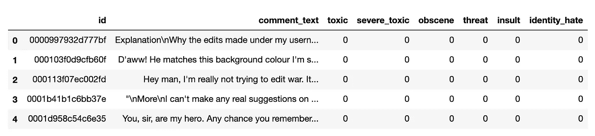
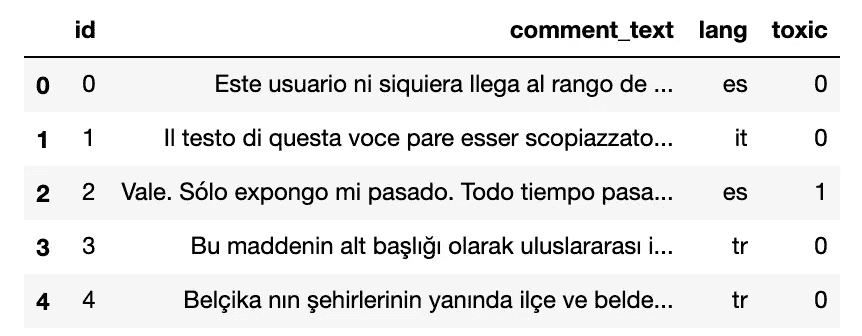
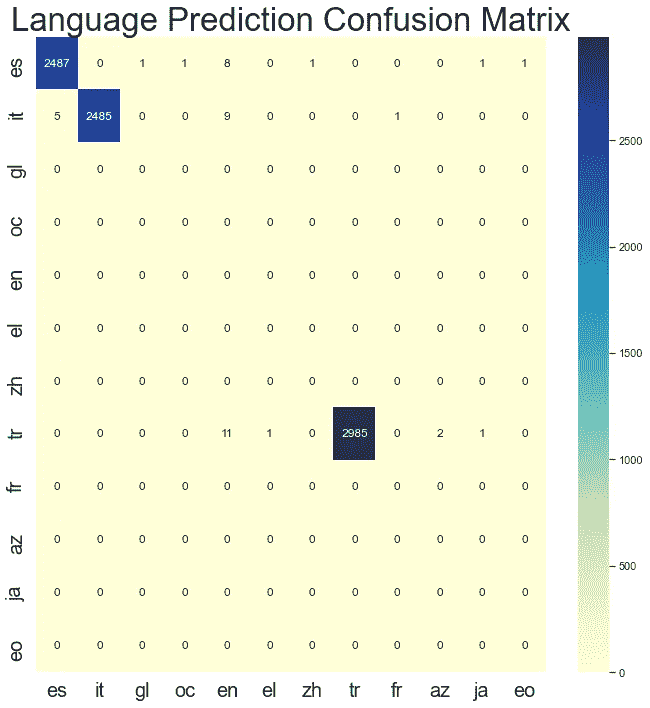
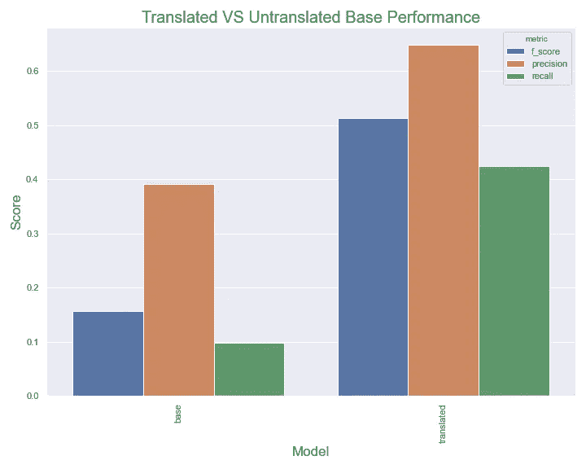

# 用 60 行 Python 语言翻译任意两种语言

> 原文：<https://towardsdatascience.com/translate-any-two-languages-in-60-lines-of-python-b54dc4a9e739?source=collection_archive---------21----------------------->

## 作为一名 NLP 工程师，我很快就要失业了😅


照片由来自 [Pexels](https://www.pexels.com/photo/white-airliner-wing-on-top-of-sea-clouds-2007401/?utm_content=attributionCopyText&utm_medium=referral&utm_source=pexels) 的 [C. Cagnin](https://www.pexels.com/@cacxcagnin?utm_content=attributionCopyText&utm_medium=referral&utm_source=pexels) 拍摄

# 介绍

我记得当我在 2015 年建立我的第一个 seq2seq 翻译系统时。从处理数据到设计和实现模型架构，这是一项繁重的工作。所有这些就是把一种语言翻译成另一种语言。现在模型变得更好了，围绕这些模型的工具也变得更好了。HuggingFace 最近将来自赫尔辛基[大学](https://blogs.helsinki.fi/language-technology/)的 1000 多个翻译模型整合到他们的变形金刚模型动物园中，它们很不错。制作这个教程让我感觉很糟糕，因为构建一个翻译系统就像从变形金刚库中复制文档一样简单。

总之，在本教程中，我们将制作一个转换器，它将自动检测文本中使用的语言并将其翻译成英语。这很有用，因为有时您将在一个包含来自许多不同语言的文本数据的领域中工作。如果你只用英语建立一个模型，你的性能会受到影响，但是如果你能把所有的文本标准化为一种语言，你可能会做得更好。

非常有才华的 Chema Bescós 将这篇文章翻译成西班牙语，如果英语不是你的第一语言，你可以在这里找到。

# 💾数据💾

为了探索这种方法的有效性，我需要一个包含许多不同语言的小文本的数据集。来自 Kaggle 的 [Jigsaw 多语言有毒评论分类](https://www.kaggle.com/c/jigsaw-multilingual-toxic-comment-classification/data)挑战非常适合这一点。它有一个超过 223，000 条标注为有毒或无毒的英语评论的训练集，以及一个验证集中来自其他语言的 8，000 条评论。我们可以在英语训练集上训练一个简单的模型。然后使用我们的翻译转换器将所有其他文本转换成英语，并使用英语模型进行预测。

看一下训练数据，我们看到在六个类别中的每一个类别中都有大约 22 万个英语*示例文本。



训练数据的视图

事情变得有趣的地方是验证数据。验证数据不包含英语，而是包含来自意大利语、西班牙语和土耳其语的示例。



验证数据的示例

# 🕵️‍♀️确定了🕵️‍♀️语

自然地，将任何语言标准化为英语的第一步是识别我们未知的语言是什么。为此，我们求助于来自脸书的优秀的[快速文本库](https://fasttext.cc/)。这个图书馆里有很多令人惊奇的东西。这个图书馆名副其实。它真的很快。今天我们只使用它的语言预测能力。

识别任意字符串是哪种语言就这么简单。我对验证集进行了测试，以了解模型的表现。坦率地说，我对它开箱即用的表现感到惊讶。在 8000 个例子中，Fasttext 只错分了 43 个。在我的 MacbookPro 上运行也只用了 300 毫秒。从这两方面来看，这都是非常荒谬的🍌。如果你仔细观察，你会发现在一些西班牙语的错误预测中，它预测了加利西亚语或欧西坦语。这些语言在西班牙及其周边地区使用，源自西班牙。因此，某些情况下的预测失误并没有我们想象的那么糟糕。



Fasttext API 的语言标识在我们的验证集上的混淆矩阵。

# 🤗变形金刚(电影名)🤗

既然我们可以预测一个给定的文本是哪种语言，那么让我们看看如何翻译它。来自 HuggingFace 的[变形金刚库一直让我惊叹不已。他们最近在他们的模型动物园中增加了超过 1000 个翻译模型，每一个都可以用来翻译大约五行代码中的任意文本。我几乎是直接从文档中窃取的。](https://huggingface.co/transformers/)

```
lang = "fr"
target_lang = "enmodel_name = f'Helsinki-NLP/opus-mt-{lang}-{target_lang}'# Download the model and the tokenizer
model = MarianMTModel.from_pretrained(model_name)
tokenizer = MarianTokenizer.from_pretrained(model_name)

# Tokenize the text
batch = tokenizer([text], return_tensors="pt", padding=True)

# Make sure that the tokenized text does not exceed the maximum
# allowed size of 512
batch["input_ids"] = batch["input_ids"][:, :512]
batch["attention_mask"] = batch["attention_mask"][:, :512]# Perform the translation and decode the output
translation = model.generate(**batch)
tokenizer.batch_decode(translation, skip_special_tokens=True)
```

基本上，对于任何给定的语言代码对，你都可以下载一个名为`Helsinki-NLP/optus-mt-{lang}-{target_lang}`的模型，其中`lang`是源语言的语言代码，`target_lang`是我们要翻译到的目标语言的语言代码。如果您想将韩语翻译成德语，请下载`Helsinki-NLP/optus-mt-ko-de`模型。就这么简单🤯！

我对文档做了一点小小的修改，将 input_ids 和 attention_mask 窗口设置为只有 512 个令牌长。这很方便，因为大多数转换器模型最多只能处理 512 个令牌的输入。这可以防止我们弄错较长的文本。如果你试图翻译很长的文本，这会引起问题，所以如果你使用这段代码，请记住这个修改。

# sci kit-学习管道

下载完模型后，让我们轻松地将它整合到 sklearn 管道中。如果你读过我以前的帖子，你可能知道我喜欢 SciKit 管道。它们是构成特征化和模型训练的一个很好的工具。考虑到这一点，让我们创建一个简单的转换器，它将接受任何文本数据，预测它的语言，并翻译它。我们的目标是通过运行以下命令来构建一个与语言无关的模型:

```
from sklearn import svm
from sklearn.feature_extraction.text import TfidfVectorizer
from sklearn.pipeline import Pipelineclassifier = svm.LinearSVC(C=1.0, class_weight="balanced")
model = Pipeline([
     ('translate', EnglishTransformer()),
     ('tfidf', TfidfVectorizer()),
     ("classifier", classifier)
 ])
```

这个管道将把任何文本中的每个数据点翻译成英语，然后创建 TF-IDF 特征，然后训练一个分类器。这个解决方案使我们的特性与我们的模型保持一致，并使部署更容易。通过在一个管道中完成特征、训练和预测，它还有助于防止特征与模型不同步。

现在我们知道了我们要努力的方向，让我们来建造这个英语变压器吧！上面的大部分代码你已经看到了，我们只是把它们拼接在一起。😄

*   第 15–18 行—确保 fasttext 模型已经下载并可以使用。如果不是，它会将其下载到 temp `/tmp/lid.176.bin`。
*   第 24 行——建立了可以用[赫尔辛基浪漫模型](https://huggingface.co/Helsinki-NLP/opus-mt-ROMANCE-en)翻译的语言代码。该模型可以很好地处理大量的语言，并且可以为我们节省大量的磁盘空间，因为我们不必为每种语言下载单独的模型。
*   第 27–30 行—定义我们要翻译的语言。我们想要创建一个允许的语言列表，因为每个模型大约 300MB，所以如果我们下载 100 个不同的模型，我们将得到 30GB 的模型！这限制了语言的设置，这样我们就不会在磁盘空间不足的情况下运行系统。如果你想翻译这些代码，你可以将[ISO-639–1](https://www.loc.gov/standards/iso639-2/php/code_list.php)代码添加到这个列表中。
*   第 32–38 行—定义一个函数来执行快速文本语言预测，就像我们上面讨论的那样。你会注意到我们也过滤掉了`\n`字符。这是因为 Fasttext 自动假定这是一个不同的数据点，如果它们存在，就会抛出一个错误。
*   第 41 行——定义了转换，也是魔法发生的地方。这个函数将把任何语言的字符串列表转换成英语的字符串列表。
*   第 48–50 行—检查当前字符串是否来自我们的目标语言。如果是的话，我们会将其添加到我们的翻译中，因为它已经是正确的语言了。
*   第 54–55 行—检查预测的语言是否能被浪漫模型处理。这有助于我们避免下载一堆额外的语言模型。
*   第 56–65 行—应该看起来很熟悉，它们只是拥抱脸文档的翻译代码。这个部分下载正确的模型，然后对输入文本执行翻译。

就是这样！超级简单，它可以处理任何事情。需要注意的是，这段代码被写得尽可能易读，而且非常慢。在这篇文章的最后，我包括了一个更快的版本，批量预测不同的语言，而不是为每个数据点下载一个模型。

# 🤑结果🤑

我们现在可以使用以下工具训练和测试我们的模型:

```
from sklearn import svm
from sklearn.feature_extraction.text import TfidfVectorizer
from sklearn.pipeline import Pipelineclassifier = svm.LinearSVC(C=1.0, class_weight="balanced")
model = Pipeline([
     ('translate', EnglishTransformer()),
     ('tfidf', TfidfVectorizer()),
     ("classifier", classifier)
 ])
model.fit(train_df["comment_text"].tolist(), train_df["toxic"])
preds = model.predict(val_df["comment_text"])
```

在英文训练集上训练一个简单的 TF-IDF 模型，并在验证集上进行测试，我们得到了 0.15 的有毒评论 F1 分数！太可怕了！预测每一类有毒物质的 F1 值为 0.26。使用我们新的翻译系统预处理所有输入并翻译成英语，我们的 F1 变成了. 51。这几乎是 4 倍的提高！



翻译和未翻译模型之间的性能比较

请记住，这里的目标是简单的翻译，而不一定是 SOTA 在这项任务上的表现。如果你真的想训练一个有毒评论分类模型，获得良好的性能来微调像 BERT 这样的深度 transformer 模型。

如果你喜欢这篇文章，可以看看我的另一篇关于使用文本和 SciKit-Learn 的文章。感谢阅读！: )

[](/build-a-bert-sci-kit-transformer-59d60ddd54a5) [## 建立一个伯特科学工具包变压器

### BERT 可以在许多 NLP 任务中为您提供最先进的结果，并且只需要几行代码。

towardsdatascience.com](/build-a-bert-sci-kit-transformer-59d60ddd54a5) [](/good-grams-how-to-find-predictive-n-grams-for-your-problem-c04a5f320b39) [## Good Grams:如何为您的问题找到预测性的 N-Grams

### 找出哪些单词对你的问题有预测性是很容易的！

towardsdatascience.com](/good-grams-how-to-find-predictive-n-grams-for-your-problem-c04a5f320b39) 

# 更快的变压器

正如所承诺的，这里是一个更快版本的英语变压器的代码。在这里，我们按照预测的语言对语料库进行排序，并且对于每种语言只加载一次模型。在此基础上使用 transformer 对输入进行批处理，可以使速度更快。