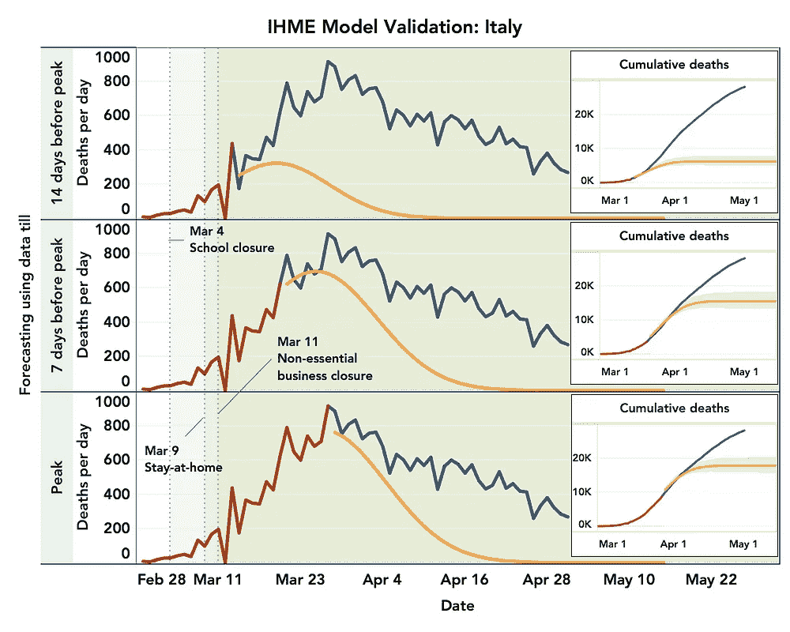
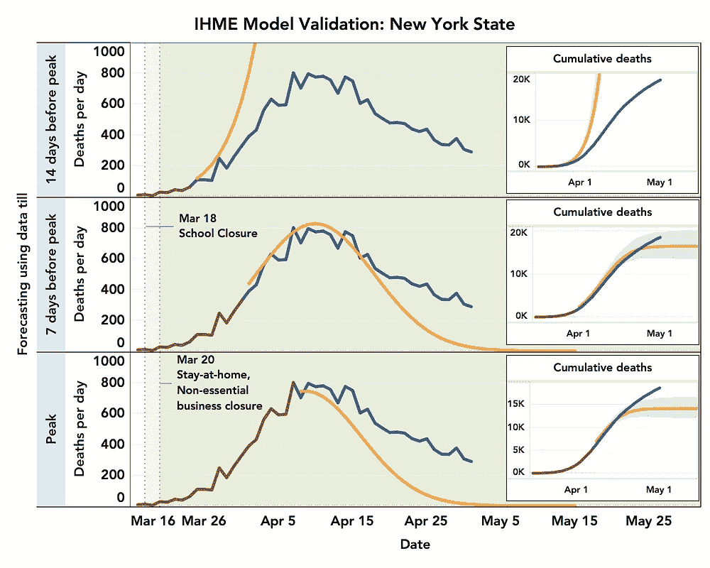
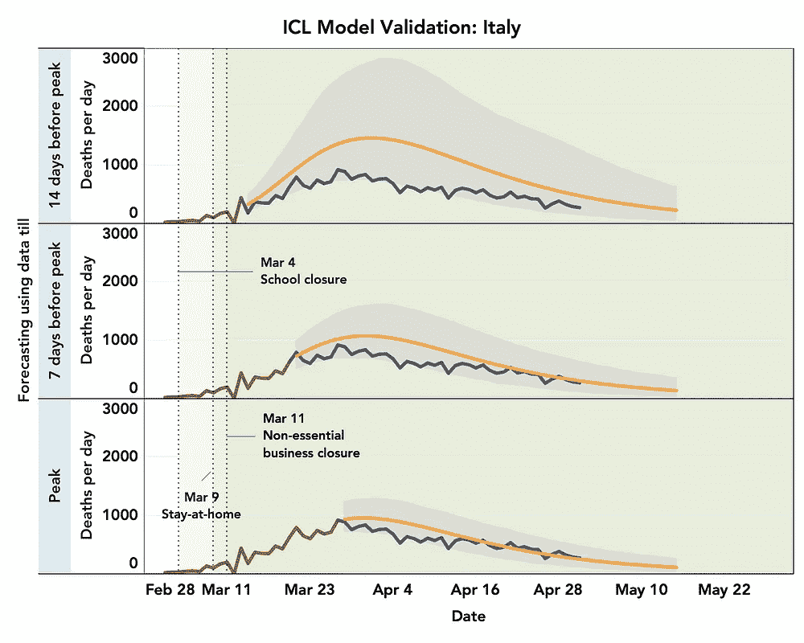
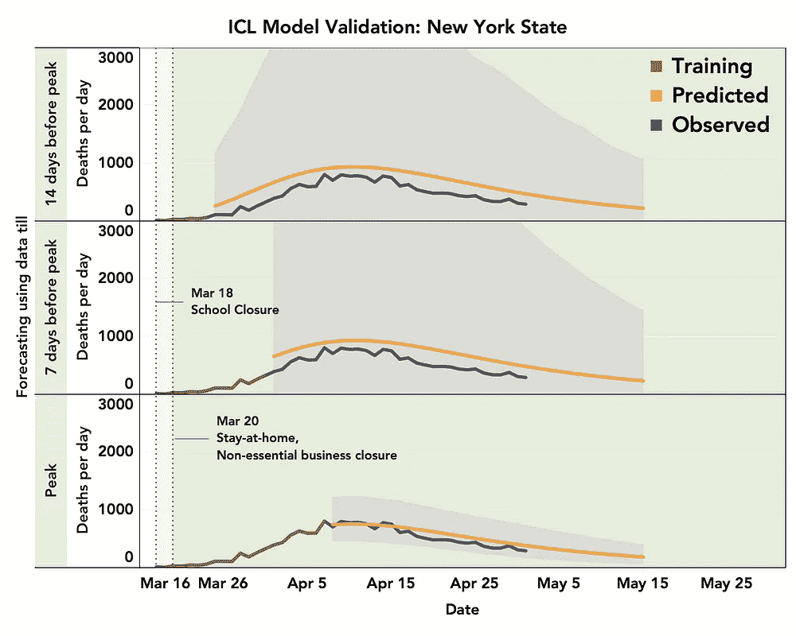
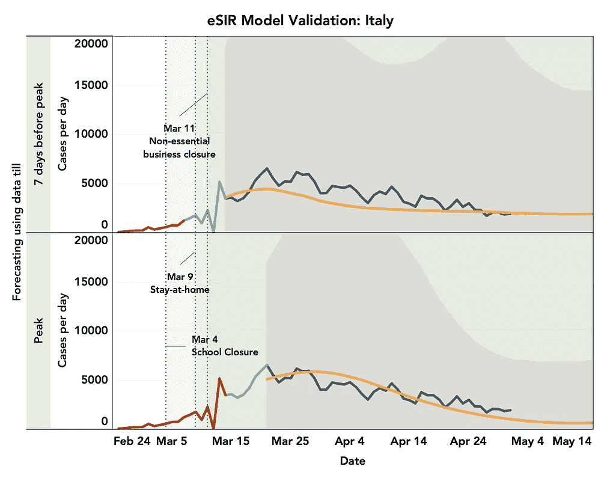
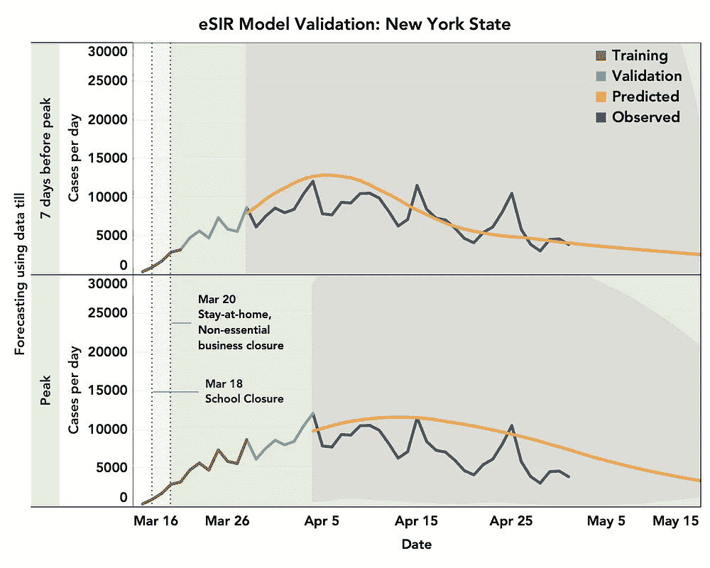
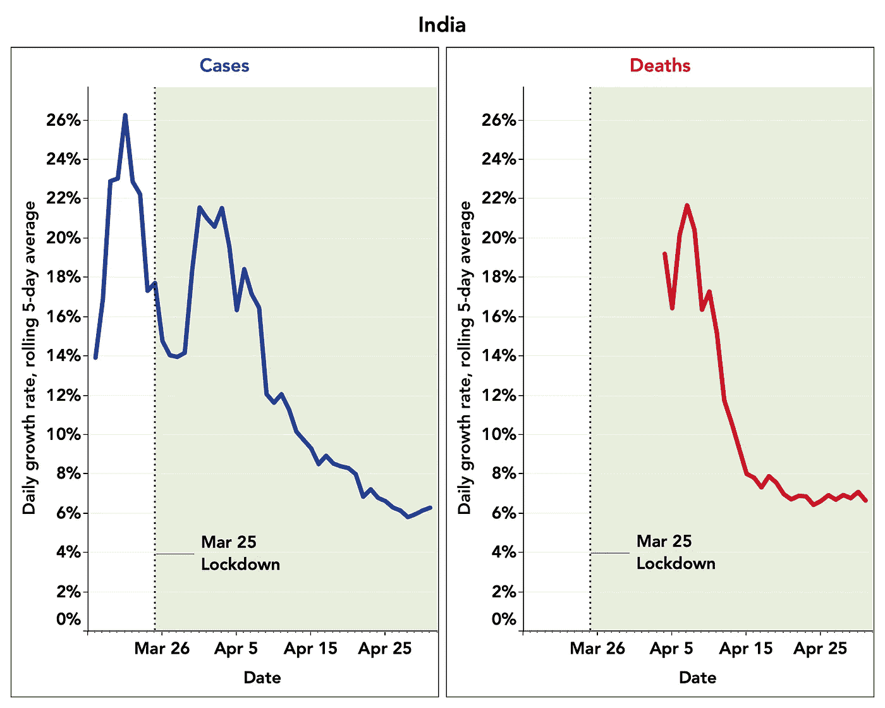

# 新冠肺炎投影模型的透明度、再现性和有效性

> 原文：<https://towardsdatascience.com/transparency-reproducibility-and-validity-of-covid-19-projection-models-78592e029f28?source=collection_archive---------20----------------------->

## 没有停滞迹象的模型的指数增长

预测传染病传播的模型在为全世界的公共卫生政策提供信息方面一直发挥着重要作用。但是在历史上，公众和媒体从来没有像新冠肺炎·疫情事件那样敏锐地意识到这些模型的存在和重要性。研究人员和决策者正依靠这些模型在国家和地方层面进行规划。此外，公众正在敏锐地跟踪趋势，希望这些模型可以指导他们何时生活将恢复正常，无论这意味着回到工作和学校，计划下一个假期，还是只是剪头发。在疫情第一阶段过后不久，需要进行快速预测，现成的模型受到了媒体和政府官员的关注。现在越来越清楚的是，这种疫情将在未来几个月甚至几年继续扰乱生活，关于锁定、社交距离和资源分配的关键决策将继续严重依赖其中一些模型。新的模式不断涌现，各种统计数据和预测在社交媒体平台上迅速传播，一些人将此称为“流行病”本身(见[卫报](https://www.theguardian.com/world/2020/apr/12/coronavirus-statistics-what-can-we-trust-and-what-should-we-ignore)文章)。很难知道这些预测中哪些是可靠的，而且来自不同模型的信息经常相互矛盾(见[《洛杉矶时报》文章](https://www.latimes.com/opinion/story/2020-04-22/models-modeling-coronavirus-covid-19))，在危机时期制造了一种进一步的不确定感。

我们相信，在未来，如果可用的预测种类更少，社会将得到更好的服务，但可用的预测将因其可靠性而受到更多审查。这促使我们探索一些可用的模型，包括两个最有影响力的模型，使用三个标准 ***(1)透明度(2)再现性和(3)有效性*** 。接下来，我们描述我们在这方面的经验和教训，希望在未来，它可以开始建立一个更好的评估未来模型的框架。我们使用了来自意大利和纽约的数据，这些数据可以在 [Github CSSEGISandData 新冠肺炎](https://github.com/CSSEGISandData/COVID-19/tree/master/csse_covid_19_data)和 [Github NYTimes 新冠肺炎-data](https://github.com/nytimes/covid-19-data) 网站上获得，这两个地方的疫情疫情严重，但每天的死亡人数已经达到峰值。我们使用不同数量的数据追溯到峰值，然后检查该模型在预测未来短期趋势方面的表现，并与截至 2020 年 5 月 1 日的观察模式进行比较。

# ***两种有影响力的死亡预测模型的比较评价***

可以说有两种模型，一种是由伦敦帝国理工学院(伦敦)****【ICL】***开发的，另一种是由美国、英国和欧洲最有影响力的政策制定机构(IHME)*华盛顿大学(西雅图)开发的。特别是，在三月中旬左右，帝国理工学院的模型预测，由于新冠肺炎没有采取任何缓解措施，英国将有 50 万人死亡，美国将有 200 万人死亡。这些预测引起了决策者对实施严格封锁和社会距离措施的紧迫性的关注。IHME 模型从 3 月下旬开始在美国受到关注，尤其是在白宫每日新闻简报开始引用其结果之后。除了死亡之外，该模型还可以预测住院和 ICU 入院，因此很可能已经用于州级资源规划。这一模式最近受到了传染病专家的批评，但它仍然被政府和媒体人员广泛引用。**

## ****透明度和再现性****

**帝国理工学院模型的源代码通过 [GitHub](https://github.com/ImperialCollegeLondon/covid19model) 公开。在 11 个欧洲国家应用该模型的代码是可用的，发布的结果是可复制的。然而，对在其他数据集上应用该方法感兴趣的用户将需要更多关于数据处理细节和参数设置的指导性指导。一份可用的[报告](https://spiral.imperial.ac.uk:8443/bitstream/10044/1/77731/10/2020-03-30-COVID19-Report-13.pdf)以透明的方式描述了基础方法，并为各种模型选择和假设提供了充分的理由。该方法使用贝叶斯框架，该框架建立在潜在感染病例的传播模型(见下文)上，并通过借用各国的信息来指定感染病例中的死亡分布。该报告还描述了对各种模型选择和假设的预测的各种敏感性分析。**

**IHME 模型的源代码也可以通过 [GitHub](https://github.com/ihmeuw-msca/CurveFit) 获得。IHME 模型预测可用于不同的地点，包括美国各州和欧洲经济区国家的[网站](https://covid19.healthdata.org/united-states-of-america)上。然而，重现这些结果所需的方法和参数的准确规格是不透明的，因此结果是不可重现的。[报告](https://ihmeuw-msca.github.io/CurveFit/methods/)提供了对基本方法的简要描述，该方法依赖于将一个相当严格的参数模型与观察到的数据进行拟合。然而，该报告对模型选择和假设给出了有限的理由。特别是，很难跟踪预测中的不确定性是如何量化的，以及社会距离协变量是如何定义的。**

## ****在意大利和纽约州进行回顾性验证****

**图 1 显示，IHME 模型使用高峰前 7 天的数据，对高峰时的死亡时间和强度做出了较好的估计。但是当数据在峰值前 14 天使用时，峰值预测并不可靠。此外，该模型预测死亡人数将在高峰后快速下降。然而，目前的趋势表明，峰值后的下降趋势要温和得多。事实上，观察到的累积死亡人数经常超过置信区间上限。ICL 模型高估了意大利每日死亡人数，尽管观察到的趋势在提供的置信带(阴影区域)内。就纽约而言，预测和观察到的趋势非常相似，但当使用峰值前一两周的数据建立模型时，预测趋势的置信界限非常宽。**

****************

****图一**。**验证 IHME 和 ICL 模型。**使用高峰前 14 天或 7 天的“训练”数据(棕色线)或高峰前的所有数据建立模型。在意大利和纽约，观察到的每日死亡高峰分别是 3 月 27 日和 4 月 7 日。训练期后的预测趋势(橙色线)与观察到的趋势(蓝色线)进行比较。阴影区域显示预测趋势周围 95%的置信界限。对于 IHME 模型，置信区域不可用于每日死亡，而是显示累积死亡。数据从累计死亡人数达到百万分之 0.31(IHME 模型拟合使用的标准)的那一天开始显示。**

# *****评估用于预测感染病例的传播模型*****

**预测感染病例的模型，而不是包含易感、暴露、感染和清除(SEIR)之间不同过渡状态的死亡模型，早在中国武汉省发生疫情后就已使用[ [Wu 等人，2020 年](https://www.thelancet.com/journals/lancet/article/PIIS0140-6736(20)30260-9/fulltext)。我们找不到 SEIR 模型的开源代码，这些代码很容易操作来拟合其他国家的数据。相反，我们使用了一个稍微简化的 SIR 模型[ [Song et al. 2020](https://www.medrxiv.org/content/10.1101/2020.02.29.20029421v1) ]，这是密歇根大学的研究人员最近开发的。**

## ****透明度和再现性****

**这个 eSIR 模型的源代码可以通过 [Github](https://github.com/lilywang1988/eSIR) 获得。该模型仅适用于武汉数据集，使用现有代码可再现结果。随附报告[ [宋等人 2020](https://www.medrxiv.org/content/10.1101/2020.02.29.20029421v1) ]中描述的基本方法易于遵循且合理。**

**该模型的一个局限性是，它需要指定表示封锁期内疾病动态的未知参数值。但是因为代码很容易访问，我们可以重写一部分代码，使用上周的训练数据对未知参数进行进一步的“调整”。具体来说，我们使用指数衰减函数来模拟首次干预后的传播率下降，其中我们假设在达到阈值后出现衰减平稳期。我们将衰减率和阈值水平视为“调谐参数”。我们拟合原始模型，删除最后一周的训练数据，然后搜索两个参数的组合，该组合给出最后一周内观察到的情况的预测趋势的最佳拟合。**

## ****验证****

**图 2 显示，对参数进行额外调整后的 eSIR 模型可以合理准确地预测报告案例的未来趋势。然而，这种特殊的模型产生了非常大范围的不确定性，并且该范围通常包括长时间内的零个新病例。**

********

****图二**。**eSIR 模型的验证。**使用峰值前 7 天的“训练”数据(棕色线)或峰值前的所有数据建立模型。观察到的每日病例高峰分别是意大利和纽约的 3 月 21 日和 4 月 4 日。训练数据被进一步分割，最后 7 天用于调整模型的锁定后参数。训练期后的预测趋势(橙色线)与观察到的趋势(蓝色线)进行比较。阴影区域显示预测趋势周围 95%的置信界限。数据显示，从当天开始累计死亡人数超过 6 人。**

# *****总结发现和注意事项*****

**在两个流行的模型中，我们发现伦敦帝国理工学院(ICL)的模型比 IHME 的模型更透明和可复制。前一个模型有时高估了未来的死亡人数，而后一个模型显然低估了高峰后的死亡人数。两个模型都使用一周前的数据合理地预测了峰值的时间。ICL 模型对纽约州产生了更大范围的不确定性，这可能是因为该模式不符合他们从欧洲国家使用的内部培训数据。eSIR 模型是透明的，我们可以修改他们的代码来提出我们自己的策略，通过数据分割来了解一些锁定后的参数。然而，目前实施的模型产生了非常大的不确定性，以至于置信下限提供的最佳情况可能没有意义。**

## ****更强调不确定性****

**我们主张更加重视围绕预测的不确定性的沟通。ICL 和 eSIR 模型都包含一个灵活的贝叶斯建模框架，可以围绕预测趋势产生非常宽的不确定性范围。IHME 模型产生了较窄的不确定性界限，但由于使用了无法解释观察到的趋势的非常严格的模型，它很可能低估了不确定性。在未来，建模者需要更有力地交流不确定性的水平和来源，并意识到，有时，主要的发现可能是不确定性本身的水平。媒体和政府人员也需要更多地关注不确定性的范围，并对宣传周围有太多不确定性的统计数据持谨慎态度。最佳做法可能是强调更短期的预测，并意识到长期趋势可能出现的最坏情况，正如一些最可靠预测的置信上限所表明的那样。**

## ****不要过度使用模特****

**我们还提倡在使用这些模型评估干预措施的有效性时要更加谨慎，因为估计中存在很大的不确定性。例如，在 COV-IND-19 研究小组的[媒体文章中，研究人员使用我们使用的相同 eSIR 模型评估了 3 月 25 日印度封锁的影响。他们预计，在没有封锁的情况下，到 4 月 30 日，病例数将在 35，000 例左右，如果封锁有效，病例数可能低至近 4000 例。事实上，在这篇文章发表的当天(4 月 3 日)，印度的病例数为 2567 例，到 4 月 30 日，报告的病例数接近 35000 例。值得称赞的是，尽管作者承认不确定性的范围很大，但决策者和公众并不容易理解不确定性的概念，这种分析可能会产生一种意想不到的印象，即封锁可能并不有效。提升封锁效果的最佳方法是以透明的方式报告经验数据，如报告病例和死亡的增长率，这些数据清楚地表明封锁在印度效果良好，就像在许多其他国家一样(见图 3)。](https://medium.com/@covind_19/historic-lockdown-prediction-models-to-study-lockdown-effects-and-the-role-of-data-in-the-crisis-a0afeeec5a6)**

****

****图三**。**病例/死亡日增长率。**显示自病例/死亡数超过 100/50 后的趋势。**

## ****我们的分析也有局限性****

**我们的分析结果也应该谨慎解读。我们只使用了两个高密度区域的数据来检验模型预测的有效性。在强度较低的国家/地区，模式可能有所不同，我们计划在以后的研究出版物中使用额外的数据进行更广泛的分析。我们已经尝试基于可用的文档尽可能最好地实现不同的模型。有可能我们没有在建模者想要的理想环境中实现其中的一些。此外，在我们完成分析后，ICL 和 IHME 模型最近都进行了更新，这些新版本的模型可能提高了有效性。我们也承认，在疫情这样一个非常动态的情况下，模型验证的意义可能存在模糊性，在这种情况下，与预测值相比，干预措施的实施和取消预计会改变观察到的趋势(参见[讨论](https://www.jhsph.edu/covid-19/articles/10-tips-for-making-sense-of-covid-19-models-for-decision-making.html))。尽管如此，我们相信，随着在疫情第一阶段的整个周期中，以及在不同类型的干预措施下，越来越多的数据可用，恰当地定义和展示模型验证将越来越有可能。**

# ****需要缓解*需要缓解*****

***展望未来，显然需要付出更多努力，遵循透明、可复制和有效的原则，更好地审查模型。不附带其他定量研究人员可以访问、操作和试验的开源代码的模型是不可靠的。使用这些模型的具体预测还应该附带额外的开源代码、规范和数据，以便其他研究人员可以准确地复制结果。此外，随着越来越多的经验数据可用于流行病第一阶段的整个周期，建模者应考虑使用回顾性数据来验证他们自己的预测。然而，当我们应用这些原则时，重要的是要记住，所有与疫情相关的事情都需要在有限的时间和资源内紧急完成。因此，我们呼吁热衷于对该领域做出贡献的定量研究人员，将他们的努力导向评估和可能调整现有模型。***

***显然，在未来，如果预测模型要更加精确，它需要纳入除疫情本身的简单时间序列数据之外的其他类型的数据。就像股票市场的预测将具有有限的价值，除非有关住房和劳动力市场、行业前景和消费者行为的信息被纳入模型，我们不能指望新冠肺炎预测模型有更高的精确度，除非其他类型的数据，如移动和基于 GPS 的移动信息或不同类型干预下的公众行为调查数据被纳入。***

# ***密码***

***本文中所有分析使用的代码可以在这里访问***

# ***贡献者***

***这篇文章是合作努力的结果***

***约翰·霍普金斯大学博士后金***

***Neha Agarwala，马里兰大学博士生***

***约翰·霍普金斯大学即将毕业的博士生 Prosenjit Kundu***

***约翰·霍普金斯大学博士生王怡***

***赵，约翰·霍普金斯大学博士生***

***约翰·霍普金斯大学彭博杰出教授 Nilanjan Chatterjee(电子邮件:nilanjan10c@gmail.com)***

# ***确认***

***这篇文章从我们的同事和约翰霍普金斯大学生物统计系的导师那里得到了实质性的改进，包括 Jeff Leek、Thomas Louis、Karen Bandeen-Roche 和 Elizabeth Stuart 教授。***