# 转置卷积去神秘化

> 原文：<https://towardsdatascience.com/transposed-convolution-demystified-84ca81b4baba?source=collection_archive---------0----------------------->

转置卷积对于图像分割、超分辨率等应用来说是一个革命性的概念，但有时它会变得有点难以理解。在这篇文章中，我将试图揭开这个概念的神秘面纱，让它更容易理解。

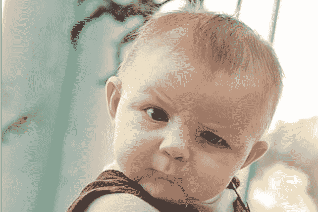

[(来源](https://imgflip.com/memegenerator/7296870/Confused-Baby))

# 介绍

自从卷积神经网络(CNN)流行以来，计算机视觉领域正在经历一个过渡阶段。这场革命始于 Alexnet 在 2012 年赢得 ImageNet 挑战赛，自那以来，CNN 一直统治着图像分类、对象检测、图像分割和许多其他图像/视频相关任务的领域。

随着我们深入网络，卷积运算降低了空间维度，并创建了输入图像的抽象表示。CNN 的这一特性对于图像分类等任务非常有用，在这些任务中，您只需预测特定对象是否出现在输入图像中。但是该特征可能会给诸如目标定位、分割之类的任务带来问题，其中原始图像中的目标的空间维度是预测输出边界框或分割目标所必需的。

为了解决这个问题，使用了各种技术，例如全卷积神经网络，其中我们使用“相同”填充来保留输入维度。虽然这种技术在很大程度上解决了这个问题，但是它也增加了计算成本，因为现在卷积运算必须应用于整个网络的原始输入维度。

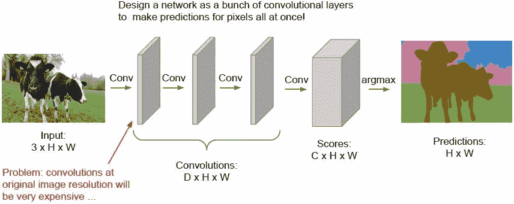

**图一。**全卷积神经网络([来源](https://arxiv.org/abs/1411.4038)

用于图像分割的另一种方法是将网络分成两部分，即下采样网络和上采样网络。
在下采样网络中，使用简单的 CNN 架构，并产生输入图像的抽象表示。
在上采样网络中，使用各种技术对抽象图像表示进行上采样，以使其空间维度等于输入图像。这种架构以编码器-解码器网络而闻名。

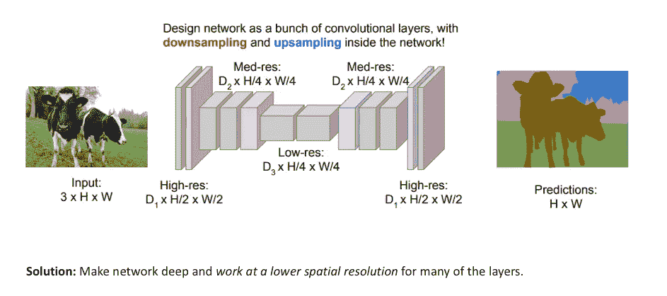

**图二**。用于图像分割的下采样和上采样网络([来源](https://arxiv.org/abs/1505.04366))。

# 上采样技术

下采样网络直观且众所周知，但很少讨论用于上采样的各种技术。

编码器-解码器网络中最广泛使用的上采样技术是 **:**

1.  **最近邻居**:顾名思义，在最近邻居中，我们取一个输入像素值，并将其复制到 K 个最近邻居，其中 K 取决于预期输出。

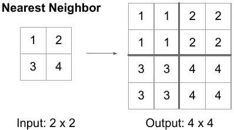

**图三**。最近邻向上采样

2.**双线性插值:**在双线性插值中，我们取输入像素的 4 个最近像素值，并根据 4 个最近像元的距离进行加权平均，平滑输出。

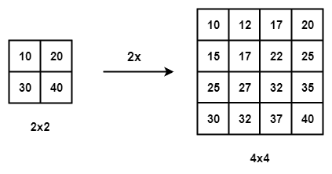

**图 4。**双线性插值

3.**钉床:**在钉床中，我们复制输出图像中相应位置的输入像素值，并在其余位置填充零。

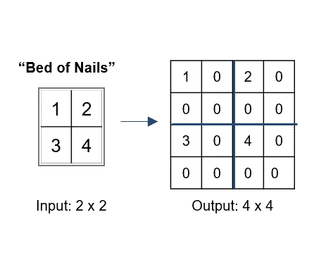

**图 5。**甲床上采样

4.**Max-un Pooling:**CNN 中的 Max-Pooling 层取内核中所有值中的最大值。要执行 max-unpooling，首先，在编码步骤中为每个 max-pooling 层保存最大值的索引。然后在解码步骤中使用保存的索引，其中输入像素被映射到保存的索引，在其他地方填充零。

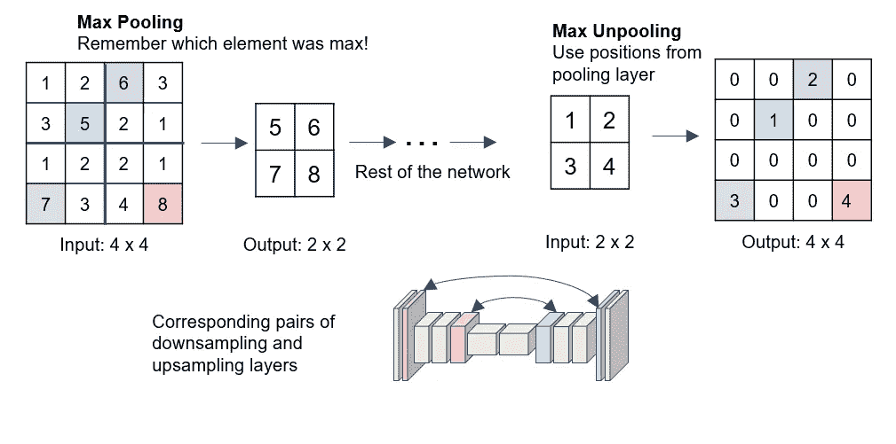

**图 6。**最大-取消上采样

所有上述技术都是预定义的，并且不依赖于数据，这使得它们是特定于任务的。它们不从数据中学习，因此不是一种通用的技术。

# 转置卷积

转置卷积用于使用一些可学习的参数将输入特征映射上采样为期望的输出特征映射。
转置卷积的基本操作解释如下:
1。考虑一个 2×2 编码的特征图，它需要被上采样为 3×3 的特征图。

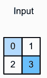

**图 7。**输入特征地图

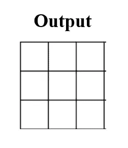

**图 8。**输出特征地图

2.我们取一个大小为 2x2 的核，单位步幅，零填充。

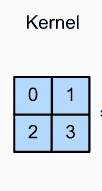

**图九。**大小为 2x2 的果仁

3.现在我们取输入特征图的左上元素，并将其与内核的每个元素相乘，如图 10 所示。

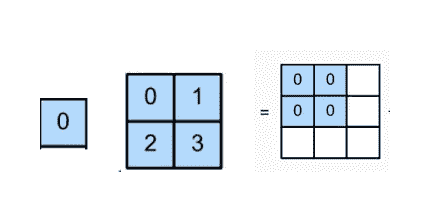

**图 10。**

4.类似地，我们对输入特征图的所有剩余元素都这样做，如图 11 所示。

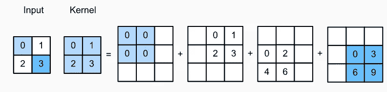

**图 11。**

5.如您所见，上采样后的要素地图中的某些元素相互重叠。为了解决这个问题，我们简单地添加重叠位置的元素。

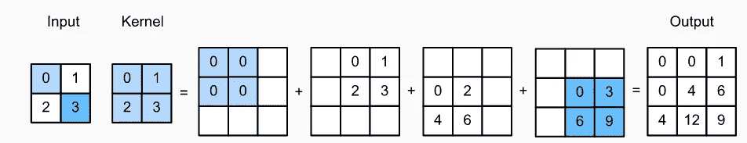

**图 12。**完整的转置卷积运算

6.最终输出将是最终的上采样特征地图，具有所需的 3×3 空间维度。

转置卷积也称为反卷积，这是不恰当的，因为反卷积意味着消除卷积的影响，这不是我们的目标。

它也被称为上采样卷积，对于它用来执行的任务是直观的，即上采样输入特征图。

它也被称为分数步长卷积 due，因为输出的步长相当于输入的分数步长。例如，输出上的步长 2 是输入上的 1/2。

最后，它也被称为后向步长卷积，因为转置卷积中的前向传递相当于正常卷积的后向传递。

# 转置卷积的问题:

如下所示，转置卷积会受到棋盘效应的影响。

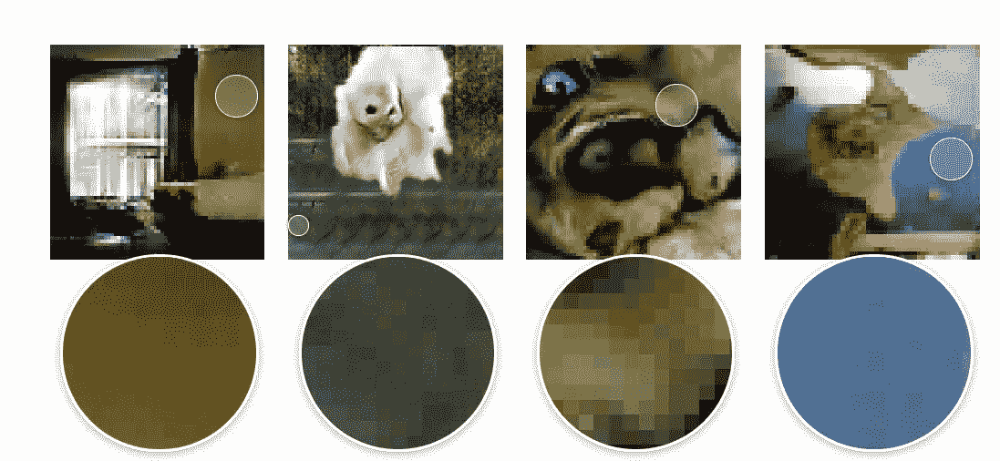

**图 13。**方格状文物([来源](https://distill.pub/2016/deconv-checkerboard/)

造成这种情况的主要原因是在图像的某些部分出现不均匀的重叠，从而导致伪像。这可以通过使用可被步幅整除的内核大小来固定或减少，例如，当步幅为 2 时，采用 2×2 或 4×4 的内核大小。

# 转置卷积的应用；

1.  超分辨率:

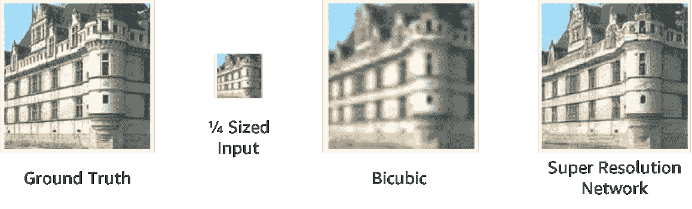

**图十四。**使用转置卷积的超分辨率([信号源](http://openaccess.thecvf.com/content_ECCV_2018/html/Seong-Jin_Park_SRFeat_Single_Image_ECCV_2018_paper.html))

2.语义分割:

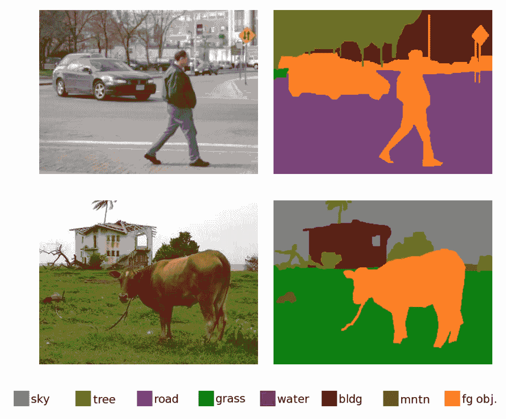

**图 15。**使用转置卷积实现语义分割([来源](https://thegradient.pub/semantic-segmentation/))

# **结论:**

转置卷积是现代分割和超分辨率算法的支柱。它们提供了抽象表示的最佳和最一般化的上采样。在这篇文章中，我们探讨了所使用的各种上采样技术，然后试图深入了解转置卷积的直观理解。
我希望你喜欢这篇文章，如果你有任何疑问、疑问或评论，请随时通过 [Twitter](https://twitter.com/Perceptron97) 或 [Linkedin](https://www.linkedin.com/in/divyanshu-mishra-ai/) 与我联系。

**参考文献:**

1.  [CS231n:视觉识别的卷积神经网络](https://www.youtube.com/watch?v=nDPWywWRIRo)

2.[转置卷积用… MS Excel 解释！](https://medium.com/apache-mxnet/transposed-convolutions-explained-with-ms-excel-52d13030c7e8)

3.[深入钻研深度学习](http://d2l.ai/chapter_computer-vision/transposed-conv.html)