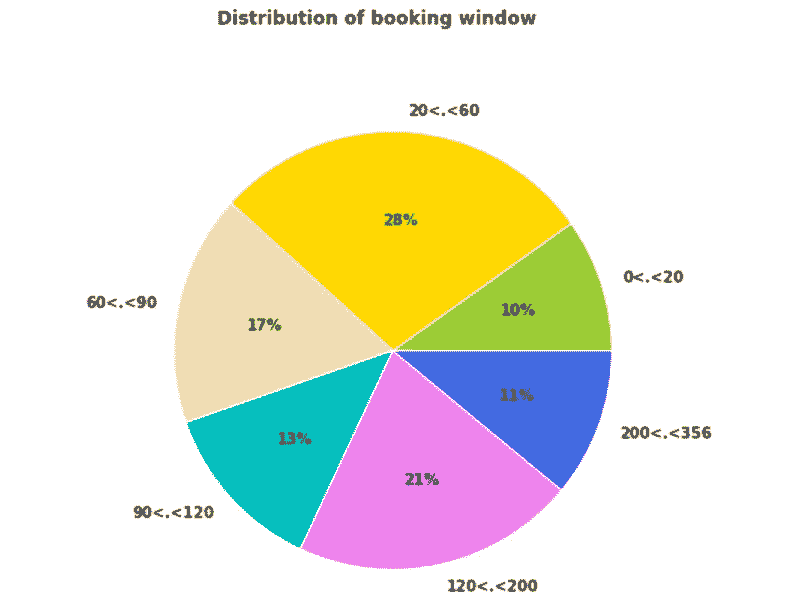

# 基于用户搜索行为的旅游细分

> 原文：<https://towardsdatascience.com/travel-segmentation-by-user-search-behaviors-c45e5ea56d22?source=collection_archive---------20----------------------->

图片来源:Pixabay

## 旅游意向，旅游个性化，K-Modes 聚类

在旅行和旅游业中，细分是针对具有不同旅行意图和动机的不同群体开发行程和营销材料的重要策略。它有助于企业了解组成受众的子群体，以便企业能够更好地定制产品和信息。

旅游业的一个警告是，与网上购物不同，休闲旅游是一种不频繁的购买，大多数休闲旅行者每年只旅行一次或两次，活跃的客户要么不常见，要么预订非常慢。

但好的一面是，人们喜欢旅行，我们中的许多人甚至花更多的时间计划假期，而不是理财。因此，如果你是任何在线旅行社的经常用户，你已经将你的数据交给了该公司，以换取该公司向你提供价值。你已经告诉他们关于你自己，你的旅行意图和动机。你期待对你来说更个性化的旅行选择，而不是你今天得到的一长串选择。

在这个细分模型的原型中，我们试图理解用户行为和意图的细微差别，通过旅行对用户的搜索进行细分，即根据共同特征将旅行分成组的过程。

由于各种原因，我不能分享数据集，但请随意使用您自己的适合这个原型的数据集。或者欢迎你查看 [Jupyter 笔记本](https://github.com/susanli2016/Machine-Learning-with-Python/blob/master/Trip%20Segmentation%20by%20User%20Search%20Behaviors.ipynb)。

# 数据预处理和特征工程

在数据处理和特征工程阶段，我做了以下决定:

*   我们将按行程对这些搜索进行细分，因此我删除了重复的 trip _ ids。
*   有超过 31%的搜索用户添加了“watch”，我会使用带有“watch_added_dt”的数据，因为:1)。我们对用户了解得越多，我们就能更好地根据他们的兴趣个性化信息。2).当用户添加“观察”时，这表明他(或她)对这次旅行感兴趣，并且希望接收关于航班票价更新的通知。
*   超过 77%的搜索来自美国，我认为首先对这些旅行(来自美国)进行分类是有意义的。因为:1)。我想把美国公共假日作为一个特色。2).来自不同国家/地区的旅行者的旅行行为可能不同。
*   用中间值填充缺失的“停留”。
*   删除缺少“最低价格”的行，因为我认为价格是旅行细分中最重要的元素之一。
*   增加一个新功能——“预订 _ 窗口”，这是“第一次搜索 _dt”和“出发 _ 日期”的区别。
*   增加一个新功能——“路线”，就是“始发地”到“目的地”。
*   增加一个新功能——“假日”，是由“出发 _ 日期”衍生而来的美国公共假日。

表 1

经过处理后，我们要处理的数据包含 269，203 次旅行，有 25，696 条不同的飞行路线和 773 个不同的出发日期，目的地有 178 个国家，如表 1 所示。

> **观察:**
> 在数据中，第一价格和最低价格相当接近。
> 大约。其中 0.3%的行程是在同一天出发和返回(即“停留”= 0)。
> 另外 0.1%的旅行希望尽快离开(即“第一次搜索日期”和“出发日期”是同一天)。

# 探索性数据分析

描述一次“旅行”的重要因素是什么？让我们重点关注以下特性。

*   周末或工作日出发

76%的搜索行程是在工作日出发。

*   目的地

图 1

该数据集主要由美国境内的旅行目的地决定(超过 68%)。

*   飞行路线

图 2

> **观察:**
> ·前 20 条搜索路线中有 19 条是在美国境内行驶的。
> :前 20 条航线中有 12 条是从纽约到某地，大多是到国内某个温暖的地方，只有一条是从纽约到巴黎。

*   出发那天是不是假期，如果是，什么假期。

图 3

我有一种感觉，用户不太可能在繁忙的假日旅游季节出行，这可能与旺季价格有关。

*   最低价格。当一个用户开始观察一个价格时，他(或她)应该总是以等待最低价为目标，所以我决定使用最低价而不是第一个价格。

图 4

我们可以看到 73%的旅行价格在 100 到 500 美元之间。

*   他们呆多久。

图 5

其中 73%的旅行停留时间在 0 到 7 天之间。

*   预订窗口

图 6

这些旅行中有 55%在 0 到 90 天的预订窗口范围内。

# k 模式聚类

标准的 [k-means](https://en.wikipedia.org/wiki/K-means_clustering) 算法并不直接适用于像这样的分类数据。因此，我将使用 [k-modes](https://pypi.org/project/kmodes/) 算法，该算法使用简单的匹配相异度来处理分类对象。它根据数据点之间匹配类别的数量来定义分类。

为了使用 k-mode，我将三个数字特征转换为分类特征，即:“最低价格”到“最低价格 _bin”，“停留”到“停留 _bin”，“预订 _ 窗口”到“预订 _ 窗口 _bin”，根据上面三个饼状图中的阈值。

图 7

根据图 7，我应该选择 k=3，也就是三个预测段。

# 识别细分

*   按目的地地区划分行程。

图 8

*   按飞行路线划分行程。

图 9

*   按美国公共假日划分旅行。

图 10

*   按周末和工作日细分。

图 11

*   按部门划分的最低价格分布。

图 12

*   按航段划分的停留时间分布。

图 13

*   按航段划分的订票窗口分布。

图 14

# 解释结果

***段 0:***

*   包含 178，519 次出行的最大路段。
*   它们大多是美国国内的航线，还有一些从美国到墨西哥或安的列斯的航线。
*   这些路线中的大多数可能是从纽约或芝加哥到温暖的地方，如加利福尼亚、佛罗里达或内华达。
*   这些旅行可能在工作日出发。
*   平均价格为 310 美元，平均停留时间约为 6 天，用户的平均预订窗口不到 3 个月。

因此，第 0 段中的旅行听起来像是从东部到阳光明媚的目的地的为期一周的假期。

***第 1 段*** :

*   该航段包含 48，101 次出行。
*   这一部分的旅行主要是国内旅行。
*   这些旅行很可能在周末出发，包括阵亡将士纪念日周末和劳动节周末；他们周末去度假大约 3 天。
*   因为这是一次周末度假，在美国境内的飞行距离可能很短。
*   平均价格是 319 美元。

因此，航段 1 中的旅行大多是相对短途的快速周末度假。他们可以是廉价的，浪漫的或最后一分钟的，或者只是从城市生活的喧嚣中充电。

***第二段*** :

*   该航段包含 42，583 次出行。
*   该细分市场中的旅行可能是国际旅行，例如从美国到欧洲或亚洲的旅行。它还包括国内旅行，但旅行到夏威夷很远。
*   对于这种类型的旅行，用户倾向于在工作日搜索出发。
*   平均价格为 743 美元，平均停留时间为 14 天左右。
*   用户倾向于更早地计划长途旅行，平均预订时间大约为 4-5 个月。

# 我们如何使用这些信息？

通过使用上述知识来创建更有效的内容或推荐，企业将能够基于用户的意图为其提供最佳体验。

例如，一旦用户搜索并观看段 1 中的旅行，在线旅行社将知道该用户可能寻找周末度假，在线旅行社然后可以给出关于周末度假的旅行建议或推荐当前在航班或酒店上有促销的其他类似的周末度假目的地。

[Jupyter](https://github.com/susanli2016/Machine-Learning-with-Python/blob/master/Trip%20Segmentation%20by%20User%20Search%20Behaviors.ipynb) 笔记本可以在 [Github](https://github.com/susanli2016/Machine-Learning-with-Python/blob/master/Trip%20Segmentation%20by%20User%20Search%20Behaviors.ipynb) 上找到，好好享受这周剩下的时光吧！

参考资料:

http://citeseerx.ist.psu.edu/viewdoc/download doi = 10 . 1 . 1 . 932 . 2724&rep = rep 1&type = pdf

 [## 混合数值和分类数据的 k-均值聚类

### begingroup$ K-Means 的目标是减少类内方差，因为它计算质心作为均值…

datascience.stackexchange.com](https://datascience.stackexchange.com/questions/22/k-means-clustering-for-mixed-numeric-andcategorical-data)  [## nicodv/kmodes

### k-modes 和 k-prototypes 聚类算法的 Python 实现。依赖 numpy 完成大量繁重的…

github.com](https://github.com/nicodv/kmodes) 

[https://www . ka ggle . com/ashydv/bank-customer-clustering-k-modes-clustering](https://www.kaggle.com/ashydv/bank-customer-clustering-k-modes-clustering)