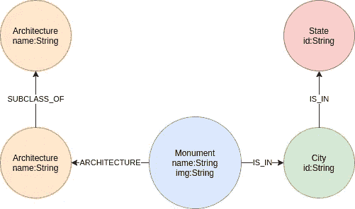
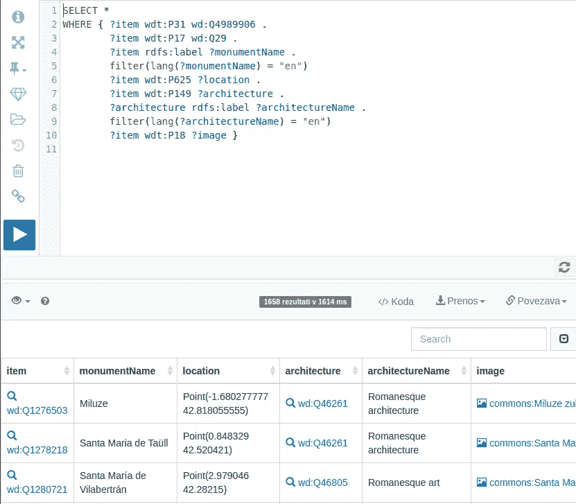
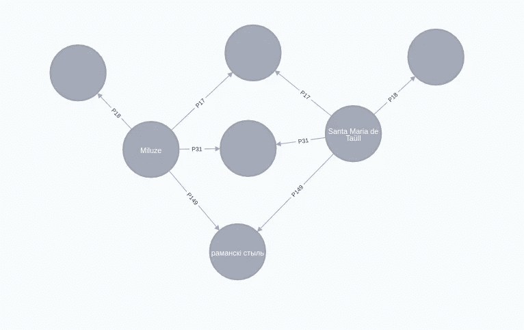
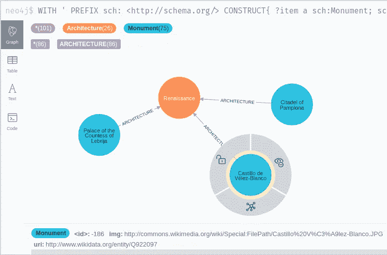
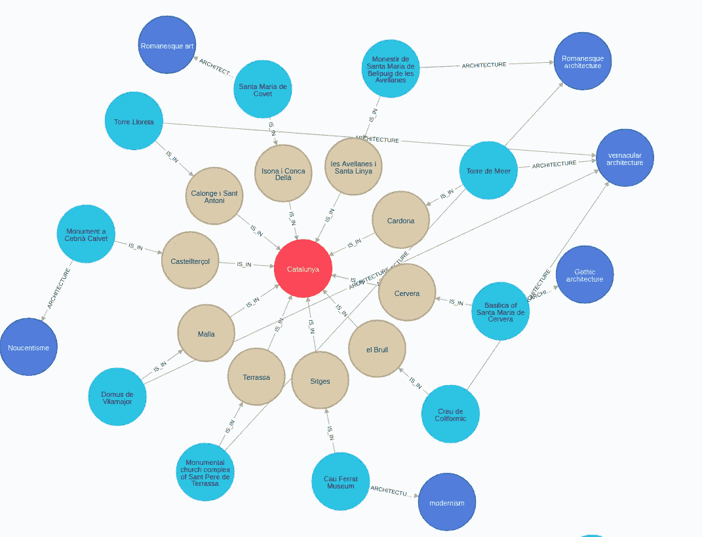

# 第 1 部分:用 Neosemantics 库将 WikiData 导入 Neo4j

> 原文：<https://towardsdatascience.com/traveling-tourist-part-1-import-wikidata-to-neo4j-with-neosemantics-library-f80235f40dc5?source=collection_archive---------21----------------------->

## [旅游的游客](https://towardsdatascience.com/tagged/traveling-tourist)

## 从 WikiData 导入数据并打开街道地图 API，以在 Neo4j 中创建知识图表

在短暂的暑假之后，我准备了一个新的博客系列。在这第一部分，我们将构建一个位于西班牙的古迹知识图表。你可能知道，我最近对通过[维基数据 API](https://www.wikidata.org/wiki/Wikidata:Main_Page) 获得的知识财富产生了浓厚的兴趣和敬意。我们将继续完善我们的 SPARQL 语法知识，并从 WikiData API 中获取有关西班牙古迹的信息。我之前并没有意识到这一点，但是收集网上可用的 RDF 数据并将其导入 Neo4j 是一个如此受欢迎的话题，以至于[Jesus Barrasa](https://twitter.com/BarrasaDV)博士开发了一个 [Neosemantics library](https://neo4j.com/labs/neosemantics/4.0/) 来帮助我们完成这个过程。

在本系列的下一部分，我们将看看 [Neo4j 图形数据科学库](https://neo4j.com/docs/graph-data-science/current/)中可用的寻路算法。

# 议程

1.  安装新语义库
2.  图形模型
3.  构造 WikiData SPARQL 查询
4.  导入 RDF 图
5.  使用 OSM API 进行反向地理编码
6.  验证数据

# 安装新语义库

在这个博客系列中，我们将使用标准的 [APOC](https://neo4j.com/developer/neo4j-apoc/) 和 [GDS](https://neo4j.com/graph-data-science-library/) 库，我们只需在 [Neo4j 桌面](https://neo4j.com/download/)应用程序中单击一下就可以安装它们。最重要的是，我们将把[新语义](https://neo4j.com/labs/neosemantics/4.0/)库添加到我们的堆栈中。它用于在 Neo4j 环境中与 RDF 数据进行交互。我们可以将 RDF 数据导入 Neo4j，或者以 RDF 格式导出属性图模型。

为了安装 Neosemantics 库，我们下载了[最新版本](https://github.com/neo4j-labs/neosemantics/releases)并将其保存到 Neo4j 插件文件夹中。我们还需要在 Neo4j 配置文件中添加下面一行。

`dbms.unmanaged_extension_classes=n10s.endpoint=/rdf`

我们现在准备启动我们的 Neo4j 实例。首先，我们需要用下面的 cypher 过程启动新语义配置。

```
CALL n10s.graphconfig.init({handleVocabUris: "IGNORE"})
```

查看一下[文档](https://neo4j.com/labs/neosemantics/4.0/reference/)中关于配置选项的信息。

## 图形模型

纪念碑在我们图表的中心。我们将它们的名称和图像的 URL 存储为节点属性。这些纪念碑受到了各种建筑风格的影响，我们将其表示为与建筑节点的关系。我们将把城市和州的纪念碑保存为一个两级分层位置树。



用 [draw.io](https://app.diagrams.net/) 创建的图形模型

Neosemantics 库需要对标记为 Resource 的节点的属性“uri”进行唯一约束。我们还将为州和城市节点添加索引。`apoc.schema.assert`过程允许我们通过一次调用定义许多索引和唯一约束。

```
CALL apoc.schema.assert(
  {State:['id'], City:['id']},
  {Resource:['uri']})
```

## 构造 WikiData SPARQL 查询

对我来说，构建新的 SPARQL 查询最简单的方法是使用 [WikiData 查询编辑器](https://query.wikidata.org/)。它有一个可爱的自动完成功能。它还有助于查询调试。

我们想要检索位于西班牙[的](https://www.wikidata.org/wiki/Q29)[古迹](https://www.wikidata.org/wiki/Q4989906)的所有实例。我发现在维基数据上找到各种实体最简单的方法就是简单地使用谷歌搜索。然后，您可以在网站上检查该实体的所有可用属性。我第一次看到的 SPARQL 查询如下所示:

```
SELECT * 
WHERE { ?item wdt:P31 wd:Q4989906 . 
        ?item wdt:P17 wd:Q29 . 
        ?item rdfs:label ?monumentName . 
          filter(lang(?monumentName) = "en") 
        ?item wdt:P625 ?location . 
        ?item wdt:P149 ?architecture . 
        ?architecture rdfs:label ?architectureName . 
          filter(lang(?architectureName) = "en") 
        ?item wdt:P18 ?image }
```

`WHERE`子句中的前两行定义了我们要寻找的实体:

```
// Entity is an instance of monument entity
?item wdt:P31 wd:Q4989906 . 
// Entity is located in Spain
?item wdt:P17 wd:Q29 .
```

接下来，我们还确定我们感兴趣的实体的属性。在我们的例子中，我们希望检索纪念碑的名称、图像、位置和建筑风格。如果我们在查询编辑器中运行这个查询，我们会得到以下结果。



我们已经在 SPARQL 查询的`WHERE`子句中定义了想要检索的信息。在用新语义导入数据之前，我们需要对数据格式进行一些调整。第一个也是最关键的是将`SELECT`条款改为`CONSTRUCT`。这样，我们将得到返回的 RDF 三元组，而不是信息表。你可以在这篇由[马克·李约瑟](https://twitter.com/markhneedham)写的[博客](https://markhneedham.com/blog/2020/02/02/querying-wikidata-construct-select/)中读到更多关于`SELECT`和`CONSTRUCT`的区别。

有了 Neosemantics 库，我们可以预览使用`n10s.rdf.preview.fetch`过程后我们存储的图模型会是什么样子。我们将从检查一个空的`CONSTRUCT`语句的图表模式开始。

```
WITH '
CONSTRUCT 
WHERE { ?item wdt:P31 wd:Q4989906 .
        ?item wdt:P17 wd:Q29 .
        ?item rdfs:label ?monumentName .
        ?item wdt:P625 ?location .
        ?item wdt:P149 ?architecture .
        ?architecture rdfs:label
        ?architectureName .
        ?item wdt:P18 ?image} limit 10 ' AS sparql
CALL n10s.rdf.preview.fetch(
  "https://query.wikidata.org/sparql?query=" +
     apoc.text.urlencode(sparql),"JSON-LD",
  { headerParams: { Accept: "application/ld+json"} ,
    handleVocabUris: "IGNORE"})
YIELD nodes, relationships
RETURN nodes, relationships
```

结果



一个问题是节点没有标签。您可能还会注意到，关系类型提供的信息并不多，因为如果您不知道 WikiData 属性映射，P149 或 P31 没有多大意义。另一件事情是，图像的 URL 被存储为一个单独的节点，这一点在这个可视化中并不明显。如果您还记得之前的图形模型，我们决定将图像 URL 保存为 monument 节点的属性。

我不会讲太多细节，但是在`CONSTRUCT`子句中，我们可以定义我们的图表模式在 Neo4j 中应该是什么样子。我们还使用以下语法定义了要将图像的 URL 保存为纪念碑节点的属性，而不是单独的节点:

```
?item wdt:P18 ?image . 
  bind(str(?image) as ?imageAsStr)
```

我们现在可以用更新后的`CONSTRUCT`语句预览新的查询。

```
WITH ' PREFIX sch: <http://schema.org/> 
CONSTRUCT{ ?item a sch:Monument; 
            sch:name ?monumentName; 
            sch:location ?location; 
            sch:img ?imageAsStr; 
            sch:ARCHITECTURE ?architecture. 
          ?architecture a sch:Architecture; 
           sch:name ?architectureName } 
WHERE { ?item wdt:P31 wd:Q4989906 . 
        ?item wdt:P17 wd:Q29 . 
        ?item rdfs:label ?monumentName . 
          filter(lang(?monumentName) = "en") 
        ?item wdt:P625 ?location . 
        ?item wdt:P149 ?architecture . 
        ?architecture rdfs:label ?architectureName .  
          filter(lang(?architectureName) = "en") 
        ?item wdt:P18 ?image . 
          bind(str(?image) as ?imageAsStr) } limit 100 ' AS sparql CALL n10s.rdf.preview.fetch(
  "https://query.wikidata.org/sparql?query=" +  
      apoc.text.urlencode(sparql),"JSON-LD", 
    { headerParams: { Accept: "application/ld+json"} ,   
      handleVocabUris: "IGNORE"})
YIELD nodes, relationships 
RETURN nodes, relationships
```

结果



# 导入 RDF 图

现在，我们可以将图表导入 Neo4j。我们使用`n10s.rdf.import.fetch`而不是`n10s.rdf.preview.fetch`过程，并保持查询的其余部分不变。

```
WITH 'PREFIX sch: <http://schema.org/> 
CONSTRUCT{ ?item a sch:Monument; 
            sch:name ?monumentName; 
            sch:location ?location; 
            sch:img ?imageAsStr; 
            sch:ARCHITECTURE ?architecture. 
           ?architecture a sch:Architecture; 
            sch:name ?architectureName } 
WHERE { ?item wdt:P31 wd:Q4989906 . 
        ?item wdt:P17 wd:Q29 . 
        ?item rdfs:label ?monumentName . 
         filter(lang(?monumentName) = "en") 
        ?item wdt:P625 ?location . 
        ?item wdt:P149 ?architecture . 
        ?architecture rdfs:label ?architectureName .
         filter(lang(?architectureName) = "en") 
        ?item wdt:P18 ?image . 
         bind(str(?image) as ?imageAsStr) }' AS sparql 
CALL n10s.rdf.import.fetch(
  "https://query.wikidata.org/sparql?query=" +   
   apoc.text.urlencode(sparql),"JSON-LD", 
   { headerParams: { Accept: "application/ld+json"} , 
     handleVocabUris: "IGNORE"}) 
YIELD terminationStatus, triplesLoaded
RETURN terminationStatus, triplesLoaded
```

让我们从一些探索性的图查询开始。我们将首先计算图表中纪念碑的数量。

```
MATCH (n:Monument) 
RETURN count(*)
```

我们已经将 1401 个纪念碑导入到我们的图表中。我们将继续计算按建筑风格分组的纪念碑的数量。

```
MATCH (n:Architecture) 
RETURN n.name as monument, 
       size((n)<--()) as count 
ORDER BY count DESC 
LIMIT 5
```

结果

罗马式和哥特式建筑风格影响了大多数纪念碑。当我探索 WikiData 时，我注意到一种架构风格可以是其他架构风格的子类。作为练习，我们将把架构层次关系导入到我们的图表中。在我们的查询中，我们将迭代存储在图中的所有架构风格，并从 WikiData 中获取任何父架构风格，并将其保存回我们的图中。

```
MATCH (a:Architecture) 
WITH ' PREFIX sch: <http://schema.org/> 
CONSTRUCT { ?item a sch:Architecture; 
             sch:SUBCLASS_OF ?style. 
            ?style a sch:Architecture; 
             sch:name ?styleName;} 
WHERE { filter (?item = <' + a.uri + '>) 
        ?item wdt:P279 ?style . 
        ?style rdfs:label ?styleName 
         filter(lang(?styleName) = "en") } ' AS sparql 
CALL n10s.rdf.import.fetch(
  "https://query.wikidata.org/sparql?query=" + 
    apoc.text.urlencode(sparql),"JSON-LD", 
  { headerParams: { Accept: "application/ld+json"} , 
    handleVocabUris: "IGNORE"}) 
YIELD terminationStatus, triplesLoaded 
RETURN terminationStatus, triplesLoaded
```

我们现在可以看一些架构层次的例子。

```
MATCH (a:Architecture)-[:SUBCLASS_OF]->(b:Architecture)
RETURN a.name as child_architecture,
       b.name as parent_architecture
LIMIT 5
```

结果

似乎现代主义是新艺术的子范畴，新艺术是装饰艺术的子范畴。

# 空间丰富

起初，我想在维基数据中包含一些市政信息，但是事实证明，这些信息相对较少。不过不用担心，我后来意识到我们可以使用反向地理编码 API 来检索这些信息。APOC 有专门的反向地理编码程序。默认情况下，它使用开放的街道地图 API，但我们也可以定制它来与其他提供商合作。查看[文档](http://neo4j-contrib.github.io/neo4j-apoc-procedures/3.5/utilities/spatial/#_configuring_custom_geocode_provider)了解更多信息。

首先，我们必须将位置信息转换为空间点数据类型。

```
MATCH (m:Monument) 
WITH m, 
   split(substring(m.location, 6, size(m.location) - 7)," ") as point 
SET m.location_point = point(
  {latitude: toFloat(point[1]), 
   longitude: toFloat(point[0])})
```

查看 OSM 反向地理编码 API 的示例响应。

```
MATCH (m:Monument)
WITH m LIMIT 1
CALL apoc.spatial.reverseGeocode(
  m.location_point.latitude,
  m.location_point.longitude)
YIELD data
RETURN data
```

结果

```
{   
    "country": "España",   
    "country_code": "es",
    "isolated_dwelling": "La Castanya",
    "historic": "Monument als caiguts en atac Carlista 1874",      
    "road": "Camí de Collformic a Matagalls",   
    "city": "el Brull",
    "municipality": "Osona",
    "county": "Barcelona",
    "postcode": "08559",
    "state": "Catalunya" 
}
```

开放街道地图 API 有点有趣，因为它在城市、城镇和村庄之间有所不同。此外，位于加那利群岛的纪念碑没有国家可用，但却是加那利群岛的一部分。我们将把群岛作为一个州，把城市、城镇和村庄放在一个标签下。出于批处理的目的，我们将使用`apoc.periodic.iterate`程序。

```
CALL apoc.periodic.iterate(
  'MATCH (m:Monument) RETURN m',
  'WITH m
   CALL apoc.spatial.reverseGeocode(
      m.location_point.latitude,m.location_point.longitude)
    YIELD data
   WHERE (data.state IS NOT NULL OR 
          data.archipelago IS NOT NULL)
   MERGE (s:State{id:coalesce(data.state, data.archipelago)})
   MERGE (c:City{id:coalesce(data.city, data.town, 
                             data.village, data.county)})
   MERGE (c)-[:IS_IN]->(s)
   MERGE (m)-[:IS_IN]->(c)',
   {batchSize:10})
```

该查询将花费很长时间，因为默认的限制延迟设置是 5 秒。如果您没有时间等待，我已经将空间结果保存到 GitHub 中，您可以在不到五秒钟的时间内使用以下查询轻松导入它们。

```
LOAD CSV WITH HEADERS FROM "https://raw.githubusercontent.com/tomasonjo/blogs/master/Traveling_tourist/traveling_tourist_cities.csv" as row
MATCH (m:Monument{uri:row.uri})
MERGE (c:City{id:row.city})
MERGE (s:State{id:row.state})
MERGE (m)-[:IS_IN]->(c)
MERGE (c)-[:IS_IN]->(s);
```

我们将首先检查是否有任何遗迹的空间价值缺失。

```
MATCH (m:Monument) 
RETURN exists ((m)-[:IS_IN]->()) as has_location, 
       count(*) as count
```

结果

我们已经检索了几乎所有遗迹的空间信息。创建位置层次结构树时需要注意的是，树中的每个节点与其父节点只有一个传出关系。如果这个规则被打破，位置树的结构完整性将丢失，因为一些实体将具有不止一个位置。查看我的[位置树帖子](https://tbgraph.wordpress.com/2017/04/01/neo4j-location-trees/)获取更多关于如何绕过这个问题的信息。

```
MATCH (c:City)
WHERE size((c)-[:IS_IN]->()) > 1
RETURN c
```

幸运的是，我们在这里没有遇到这个问题。我们现在可以探索我们的空间丰富的结果。我们将看看位于加泰罗尼亚的按照建筑风格分组的古迹数量。

```
MATCH (s:State{id:'Catalunya'})<-[:IS_IN*2..2]-(:Monument)-[:ARCHITECTURE]->(architecture)
RETURN architecture.name as architecture,
       count(*) as count
ORDER BY count DESC
LIMIT 5
```

结果

让我们快速看一下维基百科对教育目的的乡土建筑的定义。

> 乡土建筑是以使用当地材料和知识为特征的建筑，通常没有专业建筑师的监督。

我们还可以看看各州最常见的纪念碑建筑风格。我们将使用 Neo4j 4.0 中引入的子查询语法。

```
MATCH (s:State)
CALL {
  WITH s
  MATCH (s)<-[:IS_IN*2..2]-()-[:ARCHITECTURE]->(a)
  RETURN a.name as architecture, count(*) as count
  ORDER BY count DESC LIMIT 1
}
RETURN s.id as state, architecture, count
ORDER BY count DESC 
LIMIT 5
```

结果

# 结论



如果你遵循了这篇文章中的步骤，你的图表应该看起来像上面的图片。我总是对只用 cypher 从各种 API 获取数据是如此容易印象深刻。如果您想调用任何自定义端点，您仍然可以使用`apoc.load.json`过程。

在下一部分，我们将深入研究寻路算法。与此同时，[试试 Neo4j](https://neo4j.com/try-neo4j/) ，加入 [Twin4j 简讯](https://neo4j.com/tag/twin4j/)。

和往常一样，代码可以在 [GitHub](https://github.com/tomasonjo/blogs/blob/master/Traveling_tourist/Part1%20-%20Import%20knowledge%20graph.ipynb) 上获得。