# 将线性回归视为不仅仅是一个黑盒

> 原文：<https://towardsdatascience.com/treating-linear-regression-more-than-just-a-black-box-7053350f90e9?source=collection_archive---------45----------------------->

## 超越线性回归()。拟合(x，y)


由 [Fab Lentz](https://unsplash.com/@fossy?utm_source=unsplash&utm_medium=referral&utm_content=creditCopyText) 在 [Unsplash](https://unsplash.com/s/photos/arrow?utm_source=unsplash&utm_medium=referral&utm_content=creditCopyText) 拍摄的照片

线性回归是最基本的机器学习模型之一，但它的应用无处不在:从预测房价到预测电影收视率。即使当你坐出租车去上班时，你也有一个线性回归问题要处理。

简单来说，线性回归是指预测值和特征值之间的线性关系。线性回归的数学方程如下:

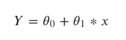

其中 ***Y*** 为预测值， ***θ₀*** 为偏差参数， ***θ₁*** 为参数值， ***x*** 为特征值。

为了说明这些参数的含义，假设您乘坐出租车去上班。你进入出租车后不久，出租车费就不会从 0 开始了。而是从一些值开始，比如说 5 美元。这 5 美元代表回归方程中的偏差项( ***θ₀*** )。预测值 ***Y*** 是你应该支付的价格，特征值 ***x*** 是行驶距离，***【θ₁】***是随着行驶距离的增加你需要多支付多少的斜率。

让我们在出租车费用和出行距离之间生成一个随机的线性外观数据，以形象化上面的图示。

```
import numpy as npnp.random.seed(1)
x = 2 * np.random.rand(100,1)
y = 4+ 2 * x + np.random.rand(100,1)
```

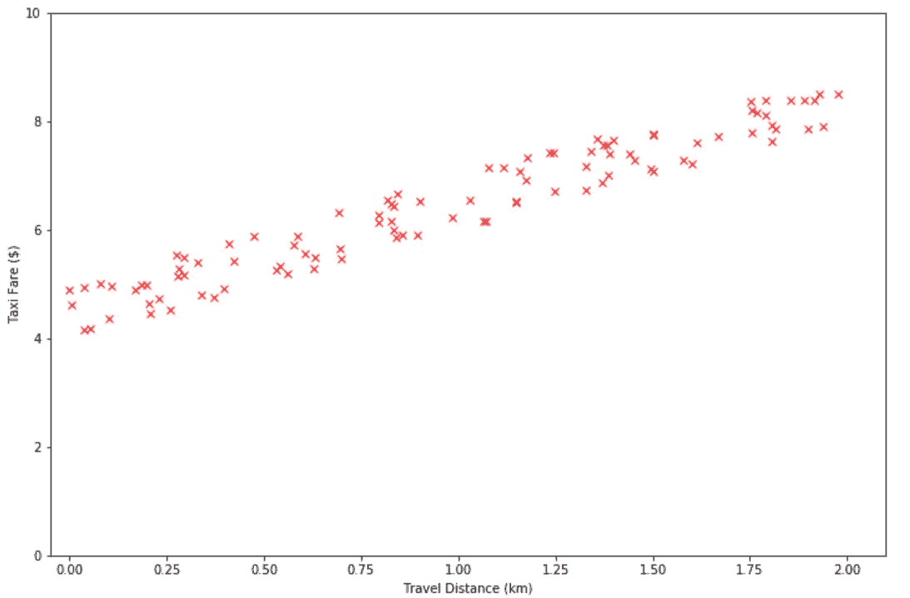

出租车费和旅行距离之间有一个线性趋势。因此，我们可以将出租车费和出行距离作为线性函数进行关联:

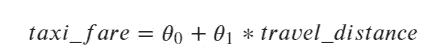

现在的问题是我们如何获得***【θ₀】******【θ₁】***的最优值，使得我们的线性回归模型表现最佳？为此我们可以使用 Scikit-learn。

# 用 Scikit-learn 构建线性回归模型

如果您有一个线性回归问题要解决，就像上面的研究案例一样，找到 ***θ₀*** 和 ***θ₁*** 的最优值的最简单方法是通过调用 Scikit-learn 库中的`LinearRegression`函数。这个问题可以用四行代码解决，如下所示:

```
from sklearn.linear_model import LinearRegressionlm = LinearRegression()#train the model
lm.fit(x,y)print(lm.intercept_, lm.coef_)## Output: [4.49781698] [[1.98664487]]
```

由此我们可以得出出租车费和出行距离之间的关系如下:

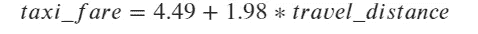

有了这个关系，现在你可以估算出你的位置和目的地之间的距离，现在你可以预测你应该付多少钱的出租车费。

# 线性回归不仅仅是一个黑箱

机器学习库可以让我们的生活更容易解决不同的问题，这令人惊叹。仅用四行代码，您就已经优化了一个线性回归模型，而无需了解任何内幕。

虽然这些机器学习库令人惊叹，但它们肯定为你隐藏了一些实现细节，例如，我们将线性回归问题视为黑盒。

知道引擎盖下是什么以及 Scikit-learn 如何提出解决方案*taxi _ fares = 4.49+1.98 * travel _ distance 岂不是太棒了？*他们怎么知道 4.49 是偏差项的最佳值，1.98 是斜率的最佳值？

如果我们知道在引擎盖下发生了什么，我们将对在任何给定问题中使用的适当模型有深刻的理解，并且我们可以更有效地调试错误。另外，对回归问题如何工作有一个很好的理解将是我们理解神经网络算法背后的数学和直觉的一个很好的基础。

要找到线性回归问题的最佳模型，通常有两种方法:

*   使用称为梯度下降的迭代优化方法。
*   使用“封闭形式”的方程称为正规方程。

# 线性回归的梯度下降

简而言之，梯度下降算法通过调整模型参数 ***θ*** (偏差项和斜率)来迭代地最小化关于训练数据的误差或成本函数，从而找到线性回归问题的最优解。

让我们形象化地描述一下梯度下降是如何工作的，以使其更加清晰。

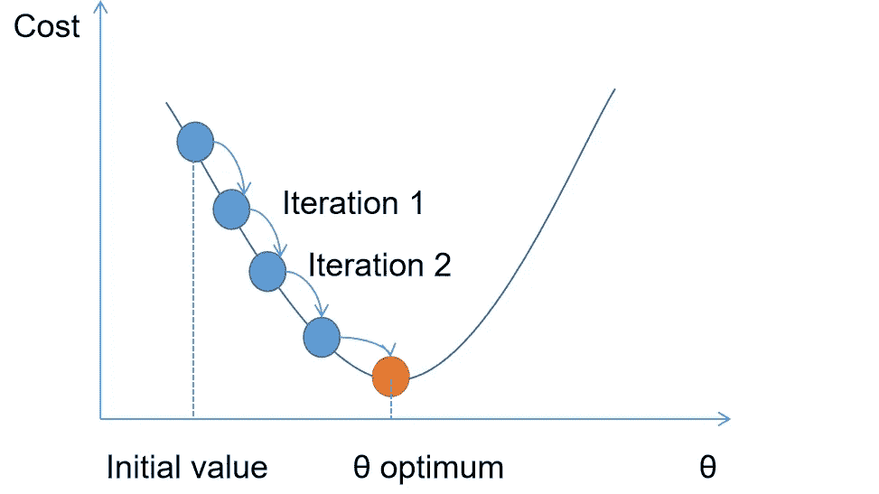

梯度下降从随机初始化参数值 ***θ*** 的初始值开始。然后，这个 ***θ*** 值将在每次迭代中被调整，使得误差或成本函数被最小化。一旦梯度下降算法找到 ***θ*** 最小值，代价函数就不会再变小。这意味着算法已经收敛。

需要注意的是，并非所有的成本函数都有一个完美的碗形，如上图所示。大多数情况下，成本函数有各种不规则的形状和平台，如下所示:

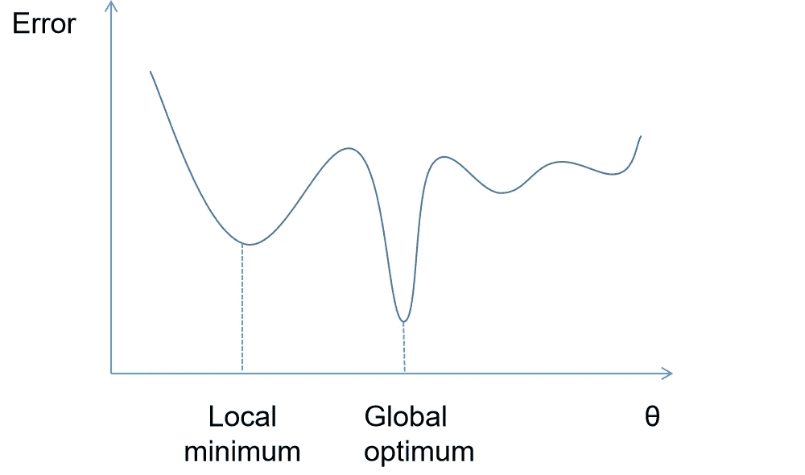

成本函数的形状不规则性使得梯度下降算法很难收敛，因为该算法很有可能会陷入局部最优而无法找到全局最优。

幸运的是，线性回归问题中的成本函数总是凸的，这意味着没有局部最优解，只有一个全局最优解。因此，无论你如何初始化你的初始值，几乎可以保证梯度下降算法将在全局最小解中结束。

但问题是，如果没有局部最优解，为什么“几乎”可以保证梯度下降最终会达到全局最小？

因为梯度下降中有一个重要的参数你需要提前定义，就是学习率。

学习率决定了算法在每次迭代中的步长。如果学习率太小，很有可能在迭代结束时达不到全局最小值。如果学习率太高，算法将在每次迭代中围绕谷值跳跃，并且算法将发散。

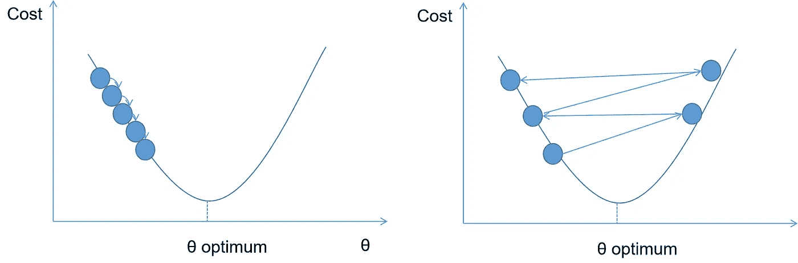

学习率过低(左)和过高(右)

**梯度下降的实现**

在所有关于梯度下降的解释之后，让我们使用研究案例“出租车费 vs 旅行距离”来实现它。

对于线性回归问题，我们应该最小化梯度下降算法的代价函数是均方误差(MSE)。

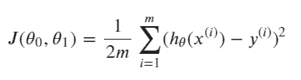

其中:

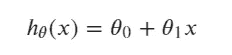

在上面的数学符号中，*是代价函数， ***m*** 是观测值或数据的个数， ***hθ*** 是来自线性回归的预测值， ***θ₀*** 是偏差项， ***θ₁*** 是斜率， ***x*** 是特征值我们可以用代码实现上述等式:*

```
*def computeCostFunction(x, y, theta, num_observations):

    linear_function= np.matmul(x,theta)
    error = np.subtract(linear_function,y) 
    error_squared = error.transpose()**2 
    cost_function = (0.5/num_observations)*(np.sum(error_squared))

    return cost_function*
```

*下一个重要步骤是计算每个模型参数*的成本函数的梯度。这种梯度背后的直觉是，如果你调整参数***【θⱼ】***的值，成本函数将改变多少。**

**对于均方误差，其偏导数有一个封闭形式的解。所以，如果你不是微积分专家，这不是问题。**

**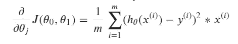**

**一旦你知道了每个参数 ***θⱼ*** 的梯度，现在你可以更新每个参数 ***θⱼ*** 进行一次迭代。这就是学习率 **α** 在梯度下降算法中发挥作用的地方。**

**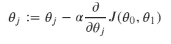**

**最后，我们可以用代码实现上述等式:**

```
**intercept_x = np.ones((len(x),1)) #add bias term
x = np.column_stack((intercept_x,x))alpha = 0.05 #learning rate
iterations = 25000
theta = np.random.randn(2,1) #random initialization of parameters
num_observations = 1000def gradientDescent(x, y, theta, alpha, num_observations, iterations):

    cost_history = np.zeros((iterations,1))

    for i in range (iterations):

        linear_function= np.matmul(x,theta)
        error = np.subtract(linear_function,y) gradient = np.matmul(x.transpose(),error)
        theta = theta - (alpha * (1/num_observations) * gradient)

        cost_history[i] = computeCostFunction(x, y, theta,              num_observations)

    return theta, cost_historytheta, cost_history = gradientDescent(x, y, theta, alpha, num_observations, iterations)print(theta)#Output: array([[4.49781697],[1.98664487]])**
```

**梯度下降的输出看起来与用 Scikit-learn 获得的输出相同。不同的是，你现在知道什么是引擎盖下。**

**有一种更直接的方法可以找到线性回归问题的最优解，那就是正规方程。**

# **正规方程**

**在线性回归中，正规方程是找到参数最佳值的封闭解。使用这种方法，没有迭代方法，没有偏导数，也没有参数更新。一旦你计算了正规方程，你就完成了，你得到了线性回归模型的最优解。**

**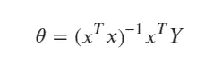**

**上式中， ***θ*** 为回归参数的最优值， ***x*** 为特征， ***Y*** 为预测值。我们可以用代码实现上面的等式:**

```
**def normalEquation(x, y):

    x_transpose = x.transpose()
    x = np.matmul(x_transpose, x)
    x_inverse = np.linalg.inv(x)
    x_final = np.matmul(x_inverse,x_transpose)

    theta = np.matmul(x_final,y)

    return thetatheta = normalEquation(x, y)print(theta)#Output: array([[4.49781698],[1.98664487]])**
```

**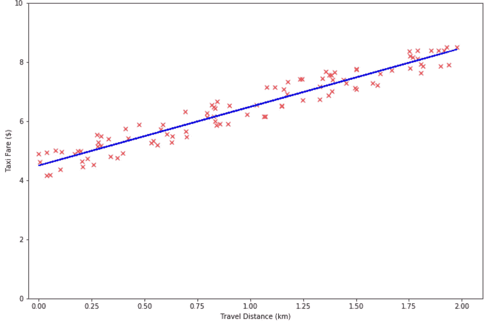**

**同样，结果与我们从 Scikit-learn 库和梯度下降优化中得到的结果相匹配。现在你可能会问一个问题:如果法方程非常简单，那么我们为什么不应该用它来代替梯度下降呢？让我们讨论一下。**

# **正规方程还是梯度下降？**

**在解决线性回归问题时，正规方程和梯度下降都有各自的优点和缺点。**

**利用正规方程，可以直接求解线性回归问题，不需要初始化初始参数值 ***θⱼ*** ，也不需要计算偏导数。所有这些都可以通过矩阵矢量化来完成。这使得一切都很快，即使观察或训练数据的数量很大。此外，您不需要对法线方程的每个参数进行归一化来得出最优解。**

**使用正规方程的主要缺点是它的计算复杂性。这是因为我们需要用这种方法求矩阵的逆矩阵。如果你有一个多元线性回归问题，有大量的特征可供选择，法方程的计算成本将非常昂贵。**

**使用梯度下降，如果在多元线性回归问题中有大量的特征选择，计算复杂性就不是问题。**

**然而，如果你有大量的观察或训练数据，梯度下降会变得很慢。这是因为在每次迭代中，梯度下降使用所有的训练数据来计算成本函数。**

**此外，您始终需要归一化或缩放每个要素，以使梯度下降收敛得更快。下图显示了归一化特征和忘记归一化特征的情况。**

**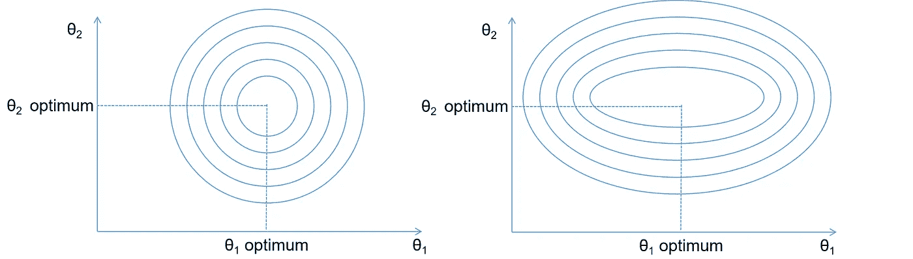**

**线性回归中的归一化要素(左)和非归一化要素(右)**

**如果对要素进行归一化，线性回归中的成本函数会形成一个完美的碗形，从而加快算法的收敛速度。同时，如果您忘记对要素进行归一化或它们不共享相同的比例，则会形成拉长的碗形。该算法最终仍会以全局最小解结束，但需要更长的时间来收敛。**

**现在你知道使用法方程和梯度下降算法的优缺点了。作为提示，下表总结了这两种算法的性能。**

**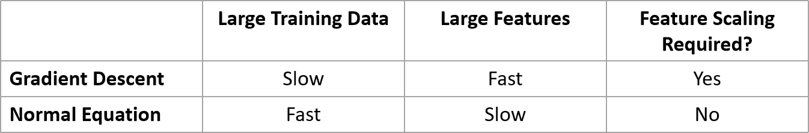**

# ****如何提高梯度下降的性能？****

**梯度下降的主要缺点是，它使用全部训练数据来计算每次迭代的成本函数。如果我们有大量的观察或训练数据，这将是有问题的。为了解决这个问题，通常采用随机梯度下降(SGD)或小批量梯度下降。**

**在 SGD 算法中，该算法不是使用整个训练样本，而是在每一步的训练样本中随机选取一个实例。然后，将基于这个随机实例计算梯度。这使得计算时间更快，成本更低，因为在每一步中只有一个实例需要在内存中。**

**在小批量梯度下降中，不是使用整个训练示例(如梯度下降)或使用随机实例(如 SGD ),而是基于称为小批量的随机实例的小子集来计算梯度。将整个训练数据分成几个小的小批量使得矩阵运算和计算过程更快。**

**对于简单或多元线性回归问题，通常使用梯度下降就足够了。然而，对于更复杂的应用，如神经网络算法，小批量梯度下降将是首选。**