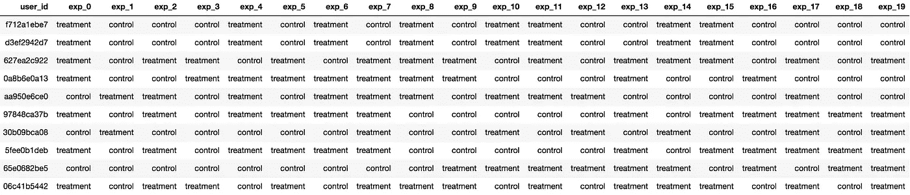
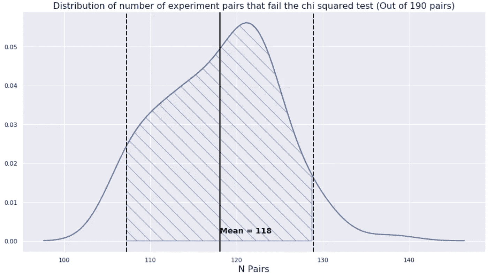
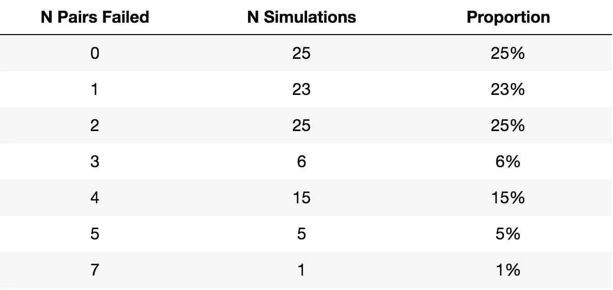

# A/B 测试中的处理分配策略

> 原文：<https://towardsdatascience.com/treatment-assignment-strategy-in-a-b-test-931133bb048f?source=collection_archive---------32----------------------->

## A/B 测试中常见处理分配策略的问题及克服方法概述。

在我之前的[帖子](/step-by-step-for-planning-an-a-b-test-ef3c93143c0b)中，我给出了规划 A/B 测试的一步一步的过程，但是没有涉及实现部分。本周，我将重点关注 A/B 测试实现的一个组成部分——治疗分配。

有效的随机对照实验的要求之一是随机处理分配。尽管它很重要，但不幸的是，这也是大多数人似乎不太关心的部分。也许因为随机的概念看起来很简单，我只是随机地将我的实验对象分配到控制组和治疗组，就这样，对吗？在商业环境中，实际情况远非如此，因为有些需求使得随机性难以实现。

在这篇博文中，我将试图强调其中一些需求，人们用来满足这些需求的常用策略，这些策略带来的问题，以及最后一个满足所有需求的简单而优雅的解决方案。

## 一致的治疗分配

> 给予实验对象的治疗每次都必须是一致的。

我在这里举几个例子:

1.  如果网飞想要衡量其新推荐引擎的效果，那么每个用户(实验对象)都应该像以前一样从相同的推荐引擎接收推荐。
2.  如果我想测试一个新的移动应用设计是否有更快的加载时间，那么每个设备(实验对象)每次都需要加载相同的移动应用设计。

如果我们在每次实验对象暴露时随机分配治疗，那么我们将无法保证这一点。(例如，用户 A 可能每次都登录并看到不同的处理。)

为了便于解释，并且考虑到大多数实验都是以用户为实验对象的事实，从今以后，我将把用户视为实验对象。

## 可量测性

满足第一个要求是相当容易的，我们只需记录下哪个用户第一次接触实验时接受了哪种治疗。在后续的登录或者后续的曝光中，我们只是查找这个用户过去的待遇，分配相同的待遇。

这对于一个小公司来说可能是可行的，但是随着你规模的扩大，你会发现这种方法根本不具备很强的可扩展性。我们可以想象，在我们有几千万用户，几百次实验的情况下，要做到这一点几乎是不可能的。

## 为了做到真正的随机，跨实验的**分配应该是独立的**

为了解决上述两个问题，公司常用的策略之一是利用用户 ID 的最后一个字符或数字。在这种情况下，治疗将是一致的和完全可扩展的，因为治疗仅依赖于固定的用户 ID。

然而，这带来了另一个问题。这个实验本身确实是随机的。但是随着我们做越来越多的实验，我们会发现不同实验的治疗任务现在是相互关联的。

这里举个例子。

```
+-------------------+-----------------+-------------------+-------+
|                   | **Exp 1 : Control** | **Exp 1 : Treatment** | **Total** |
+-------------------+-----------------+-------------------+-------+
| **Exp 2 : Control**   |            2107 |              2929 |  **5036** |
| **Exp 2 : Treatment** |            2916 |              2048 |  **4964** |
| **Total**             |            **5023** |              **4977** | **10000** |
+-------------------+-----------------+-------------------+-------+
```

想象一下，如果我们有 10，000 个用户，我们做了两个实验。在第一个实验(实验 1)中，我们测试了订阅费的减少是否会增加付费会员的转化率，并发现了一个显著的结果。在第二个实验(实验 2)中，我们测试了一个额外的特性是否会增加用户的购买次数，结果发现这种影响在统计上并不显著。

以下是可能出现这种情况的原因:

1.  付费用户会因为打折而购买更多的东西。
2.  实验 1 中处理组的更多用户被分配到实验 2 中的控制组，这意味着实验 2 控制组有更多的付费用户。
3.  如果两组都服用安慰剂，实验 2 对照组的用户自然会比治疗组购买更多的东西。
4.  因此，即使实验 2 中的额外特征确实增加了购买的数量，我们也不能准确地测量效果，因为实验 2 中的处理分配与实验 1 中的处理分配相关。

> 为了真正随机，在不同实验中的处理分配之间不应该有相关性。

## 这种相关性多久发生一次？

为了检验这一点，我执行了以下模拟。

1.  生成 10，000 个用户 id，其中每个 id 是长度为 10 的十六进制字符串(例如: *d3ef2942d7* )。

```
import pandas as pd
import randomexp_df = pd.DataFrame(['%010x' % random.randrange(16**10) for x in range(10000)], columns=['user_id'])
```

2.创建 20 个实验。对于每个实验，从 16 个可能值(0 - 9，a - f)中随机选择 8 个作为对照。如果用户 ID 的最后一个字符在控制中，则将他们分配到控制组，否则，将他们分配到处理组。

```
import numpy as np# number of experiments
j = 20# get all 16 possible values
random_list = exp_df['user_id'].apply(lambda x: x[-1]).unique()control_list = [set(np.random.choice(random_list, 8, replace=False)) for x in range(j)]
treatment_list = [set(random_list) - x for x in control_list]

for k in range(j):
    exp_df[f'exp_{k}'] = exp_df['user_id'].apply(lambda x: x[-1]).isin(control_list[k]).map({True:'control', False: 'treatment'})
```



结果数据帧的外观示例。

3.对于每一对实验，生成如上例所示的列联表，并进行卡方检验。

```
from scipy import stats# initialize list to store chi-square results all experiment pairs
chi2_res = []for cols in combinations(exp_df.columns[1:], 2): target_cols = list(cols)# generate contingency table
    aggregate_df = exp_df[target_cols]\
                   .groupby(target_cols)\
                   .size()\
                   .to_frame()\
                   .reset_index()\
                   .pivot(index=target_cols[1], 
                           columns=target_cols[0])# store chi-square test result
    chi2_res.append(stats.chi2_contingency(aggregate_df)[1])# number of pairs that fail the chi-square test at alpha = 0.01
print((np.array(chi2_res) < 0.01).sum())
```

直观地说，如果处理分配是真正独立的，我们应该期望看到以下情况(假设 50%的样本分配给对照，50%分配给处理)。

```
+-------------------+-----------------+-------------------+-------+
|                   | **Exp 1 : Control** | **Exp 1 : Treatment** | **Total** |
+-------------------+-----------------+-------------------+-------+
| **Exp 2 : Control**   |            2500 |              2500 |  **5000** |
| **Exp 2 : Treatment** |            2500 |              2500 |  **5000** |
| **Total**             |            **5000** |              **5000** | **10000** |
+-------------------+-----------------+-------------------+-------+
```

卡方检验告诉我们实际计数离独立案例有多远。距离越远，卡方检验统计值越高，因此有更强的证据表明两个实验的处理分配之间存在某种关联。

我将上面的模拟运行了 100 次，看看在每个模拟中有多少对实验没有通过卡方检验，得到了平均值**62%**(190 对中的 118 对)！换句话说，如果我们使用这种方法，平均来说，我们将观察到 62%的实验对没有通过卡方检验。我还尝试了 5 次或 10 次实验(而不是最初的 20 次)，得到了类似的结果(约 60%)。



在 100 次模拟中未通过卡方检验的实验对数量的分布。

## 奋力营救

满足上述所有要求的解决方案实际上非常简单。我们所要做的就是使用一个散列函数。散列函数是可以用来将任意大小的数据映射到固定大小的值的任何函数。该属性确保满足前两个要求(一致性和可伸缩性)。

为了满足最终的需求，我们只需要散列用户 ID 和实验 ID 的连接，而不是只散列用户 ID。

下面是如何使用 python 实现这一点的示例。

```
import mmh3def treatment_assignment(user_id, exp_id, control_bucket):

    # calculates the number of buckets
    num_buckets = len(control_bucket) * 2

    # this generates a 32 bit integer
    hash_int = mmh3.hash(user_id  + exp_id)

    # get the mod of the 32 bit integer
    mod = hash_int % num_buckets

    if mod in control_bucket:
        return 'control'
    else:
        return 'treatment'

# create 50 random integer as control group
control_bucket = np.random.choice(np.arange(0,100,1), 50, replace=False)
treatment_assignment('d3ef2942d7', 'exp_1', control_bucket)
```

根据您的控制桶和实验 ID，上述函数将返回`treatment`或`control`。我们也可以把它扩展到两个以上变量的实验。

我用这种方法再次运行了上面的模拟，下面是结果。



模拟 190 个实验对中未通过卡方检验(α= 0.01)的实验对的数量。

我们可以看到，100 次模拟中的 **73 次**导致 2 对或更少的实验(190 对中)无法通过卡方检验，这证明这是一种分配治疗的健壮方法，而不违反任何要求。

## 结论

在这篇博文中，我详细概述了实验中处理分配的要求。我列出了我见过的一些常见的实践，并陈述了它们为什么违反了一些需求。违反任何要求都意味着实验结果不再有效，这就是为什么我们应该开始更多地关注治疗方案。

最后，我给出了一个简单的解决方案，它满足了适用于两个以上变量实验的所有要求。

## 参考

[1]好哈希难求(offer up)
[https://blog . offer up . com/A-good-hash-is-hard-to-find-60 E8 A 201 E8 ce](https://blog.offerup.com/a-good-hash-is-hard-to-find-60e8a201e8ce)