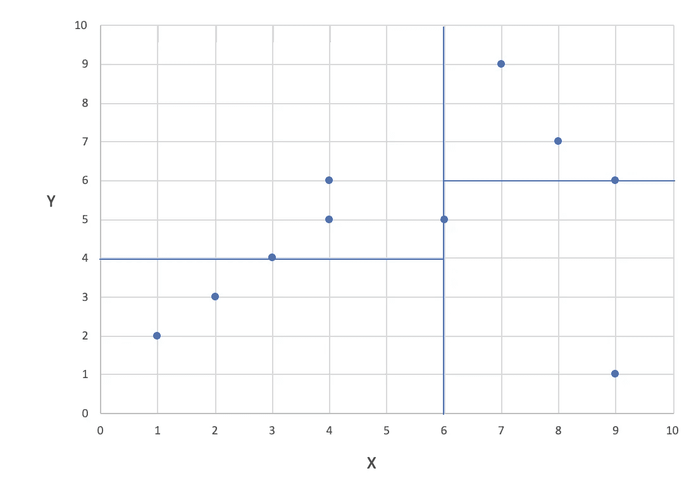

# 树算法讲解:球树算法 vs. KD 树 vs .蛮力

> 原文：<https://towardsdatascience.com/tree-algorithms-explained-ball-tree-algorithm-vs-kd-tree-vs-brute-force-9746debcd940?source=collection_archive---------5----------------------->

## 了解最近邻搜索的结构化数据算法背后的内容


来源: [pixabay](https://www.pexels.com/photo/flight-landscape-nature-sky-36717/) 。

这三种算法都用于最近邻搜索。球树和 KD 树算法是用于数据点的空间划分和它们到特定区域的分配的树算法。换句话说，它们用于在多维空间中构建数据。

**不过先从底层说起:** *为什么叫树算法？什么是树？—* 跳过，如果你已经知道了！

一棵**树**是一种结构化数据的分层方式。由于存在诸如队列的线性数据结构，其中数据被一个接一个地分配，所以树是一种常见的数据结构。树被应用于计算机科学的许多不同领域，从图形、数据库到操作系统。它们不仅与自然界中的植物学朋友有共同的名称，而且还有一些特征。作为植物树，计算机科学中的树有根、叶和分支。然而，与普通树相比，这些部分的分配是自底向上的。根在树顶，叶在下端。


树的结构。

**父节点=** 是另一个节点之上的节点，例如，根节点是其下内部节点的父节点

**子节点** =顾名思义，父节点的子节点，以及父节点下的子节点。子节点可以再次成为下面节点的父节点。

**根节点** =最上面的节点，树的原点

**叶节点** =也称为外部节点，可以看作是一个“死胡同”，它是最后一个节点，下面没有子节点

**内部节点** =也称为内部节点或分支节点。它是一个上下都有连接的节点(子节点和父节点)

# 你还没上媒体？每月仅需 4.16 美元。

# [开始使用](https://medium.com/@hucker.marius/membership)

为了更好地理解这在计算机科学话题中的表现，你可以在下面找到一段 HTML 代码。树有助于构建网站，网站通常可以用树来描述。

```
**<html>
<head>**
    **<meta charset=utf-8" />**
    **<title>**Ball Tree vs. KD Tree**</title>**
    **<nav>**
    **<a href="/r/">**R**</a>**
    **<a href="/js/">**JavaScript**</a>**
    **<a href="/python/">**Python**</a>**
    **</nav>**
**</head>****<body>**
    **<h1>**What is a tree?**</h1>**
    **<ul>**
        **<li>**List item one**</li>**
        **<li>**List item two**</li>**
    **</ul>**
    **<h2>**How does a tree look like?**</h2>**
**</body>**
**</html>**
```


html 代码的树形可视化。

KD-Tree 算法和 Ball 算法都是构建这种树的二进制算法。在这个上下文中，二进制意味着每个父节点只有两个子节点。典型地，该算法应用于最近邻搜索。

## 球树算法

球树算法可以被视为一个*度量树*。度量树考虑数据点所在的度量空间来组织和构造数据点。使用度量标准，点不必是有限维的或在向量中(Kumar，Zhang & Nayar，2008)。

该算法将数据点分成两个聚类。每个集群被一个圆(2D)或一个球(3D)包围。这个球通常被称为超球。

> “一个**超球**是距离称为其中心的给定点恒定距离的点集。”— [维基百科](https://en.wikipedia.org/wiki/Hypersphere)

从簇的球体形式，衍生出名称 ***球树算法*** 。每个簇代表树的一个节点。让我们看看算法是如何执行的。

选择的子节点之间的距离最大，通常在树的每一层使用以下结构。

首先，设置整个数据点云的质心。与质心距离最大的点被选为第一个群集和子节点的中心。离第一聚类中心最远的点被选为第二聚类的中心点。然后，将所有其他数据点分配给距离中心最近的节点和聚类，可以是聚类 1 或聚类 2。任何点只能是一个集群的成员。球体线可以彼此相交，但是这些点必须明确地分配给一个簇。如果一个点正好在两个中心的中间，并且随后到两边的距离相同，则该点必须被分配到一个聚类中。集群可能不平衡。这基本上是球树算法背后的概念。将数据点分成两个群/球的过程在每个群内重复，直到达到定义的深度。这导致嵌套集群包含越来越多的圆。


球树算法的可视化。

如上图所示，树的深度为 2。质心 1 是算法的开始。一个球体(2D)被放置在所有数据点(灰色)周围。从中心开始，选择聚类的最远点，这里是数字 3 或数字 9。这是星团 1 的新中心，这里是紫色星团的 3 号。离第三个点最远的点是聚类 2 的中心。这是橙色星团的 9 号。然后，包括紫色球体的所有数据点被考虑用于新质心 2 的计算。对位于橙色球体中的所有数据点进行同样的操作，得到质心 3。最远的点再次成为新群的中心。数据点编号 3 是距离质心 2 和新簇中心最远的点。

在质心 2 的另一侧，它和数据点 1 之间的最大距离 ist。它是第二个集群的中心。然后对橙色侧也执行该步骤，再次产生两个集群。然而，橙色的一面是不平衡的。
生成的树如下所示(M 是质心为 1 的球体和包含所有数据点的起始球体)。从那里，集群被划分为深度为 2:


产生的球树。

## KD 树算法

KD 树算法是最常用的最近邻算法之一。数据点在每个节点被分成两组。像前面的算法一样，KD 树也是一个二叉树算法，总是以最多两个节点结束。选择的分割标准通常是中间值。在下图的右侧，您可以看到数据点的确切位置，左侧是它们的空间位置。


数据点及其在坐标系中的位置。

KD 树算法首先使用第一轴的中值，然后在第二层中使用第二轴的中值。我们从 x 轴开始，
按升序排序的 x 值是:1，2，3，4，4，6，7，8，9，9。接下来，中位数是 6。

数据点然后被分成较小的和较大的，等于 6。这导致(1，2) (2，3) (3，4) (4，5) (4，6)在左侧，而(6，5) (7，9) (8，7) (9，6) (9，1)在另一侧的簇上。在坐标系中画出 6 的中值，就可以看到这两个可视化的集群。


将 6 的 x 中值绘制到坐标系中。

现在我们要用 Y 轴。我们已经有了两个集群，所以我们需要分别查看它们。在左边，我们得到了排序后的 y 值:2，3，4，5，6。中位数是 4。这会在值 4 处产生一条分隔线，坐标系如下所示:


中间值 4 分隔 X 中间值(=6)左侧的数据点。

这些值以 4 分隔，第一个分类包含(2，3) (1，2)。第二组包含点(4，6) (3，4) (4，5)。
在 x-median 的另一边，4 是目前的 5 个点(包括点(5，6))。按照排序顺序，y 值为 6，7，8，9，9。这导致中值为 8，并且第一个聚类包含(9，1)和(6，5)。第二个聚类包含(8，7)(7，9)(9，6)。
最终的坐标系如下所示。数据点被分成深度为 2 (X 和 Y)的 4 个聚类。



最终的空间分离。

但是，这棵树看起来像什么？让我们看看结果树是如何划分的。


KD 树。

## 比较和总结

由于考虑了所有数据点，暴力可能是最准确的方法。因此，没有数据点被分配给错误的聚类。对于小数据集，蛮力是合理的，然而，对于增加的数据，KD 或球树是更好的选择，因为它们的速度和效率。

> KD 树及其变体可以被称为“投影树”，这意味着它们基于点在一些低维空间中的投影来对点进行分类。(库马尔、张和纳亚尔，2008 年)

对于低维数据，KD 树算法可能是最好的解决方案。如上所述，KD 树的节点划分是轴对齐的，不能采取不同的形状。所以分布可能没有正确映射，导致性能下降。

对于高维空间，球树算法可能是最好的解决方案。它的性能取决于训练数据的数量、维度和数据的结构。由于没有清晰的结构，具有许多噪声数据点也可能导致糟糕的性能。

感谢您的阅读，希望您喜欢！

[](https://medium.com/subscribe/@hucker.marius) [## 请继续关注马里乌斯·哈克的新文章

### 请继续关注 Marius Hucker 的新文章。如果您还没有注册，您将创建一个中型帐户…

medium.com](https://medium.com/subscribe/@hucker.marius) 

***参考文献***

[](https://github.com/JKnighten/k-nearest-neighbors/wiki/KNN-and-BallTree-Overview) [## JKnighten/k-最近邻

### k 近邻(KNN)是一个简单的机器学习算法，可用于分类和…

github.com](https://github.com/JKnighten/k-nearest-neighbors/wiki/KNN-and-BallTree-Overview) [](https://ashokharnal.wordpress.com/tag/ball-tree-explained-in-simple-manner/) [## 球树深入浅出的解释——Linux 大叔

### 2015 年 1 月 20 日在这篇博客和接下来的几篇博客中，我将讨论 k-近邻(k-NN)算法的实现…

ashokharnal.wordpress.com](https://ashokharnal.wordpress.com/tag/ball-tree-explained-in-simple-manner/)  [## Python 中最近邻搜索的基准测试

### 我最近提交了一个 scikit-learn pull 请求，其中包含一个全新的球树和快速最近邻的 kd 树…

jakevdp.github.io](https://jakevdp.github.io/blog/2013/04/29/benchmarking-nearest-neighbor-searches-in-python/)