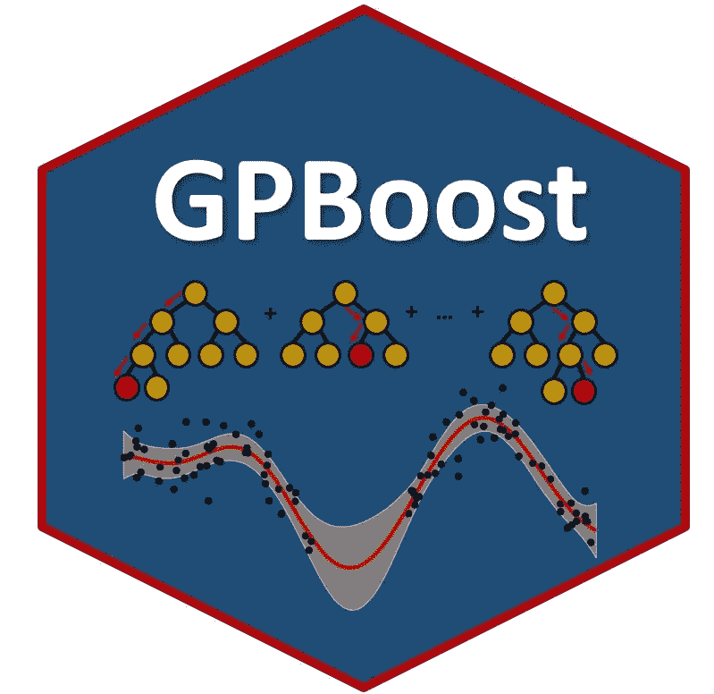
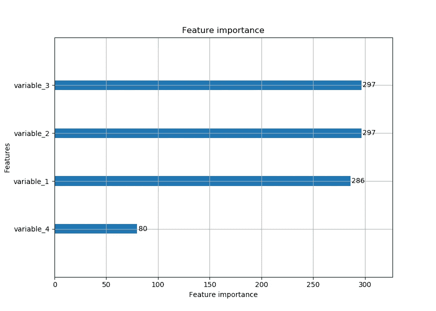
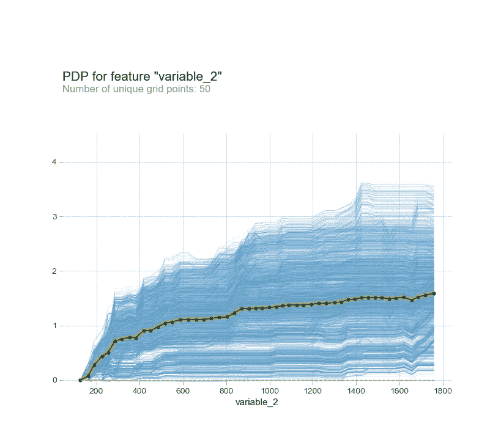
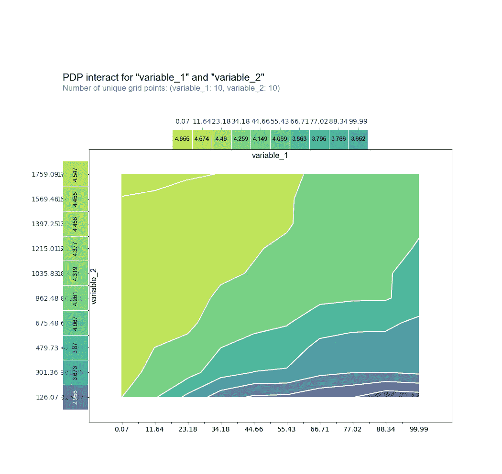
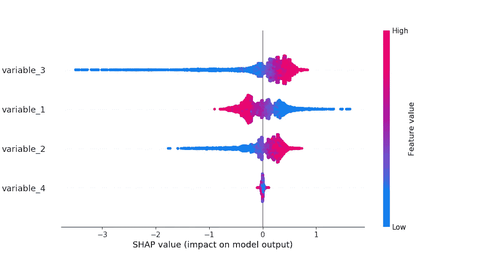
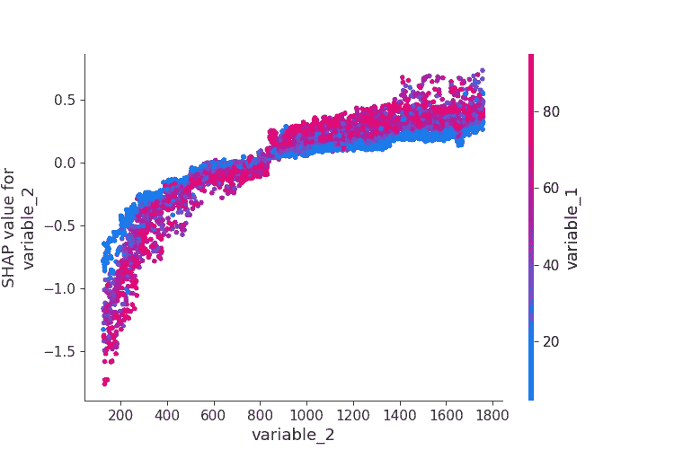
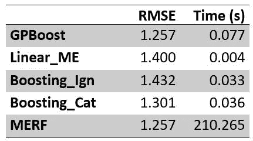

# 树增强混合效应模型

> 原文：<https://towardsdatascience.com/tree-boosted-mixed-effects-models-4df610b624cb?source=collection_archive---------2----------------------->

## GPBoost:结合树提升和混合效果模型

本文展示了如何使用 [GPBoost 算法](https://arxiv.org/abs/2004.02653)将树提升(有时也称为“梯度树提升”)与混合效果模型结合起来。提供了方法论以及如何使用 Python 应用 [GPBoost 库](https://github.com/fabsig/GPBoost)的背景知识。我们展示了如何(I)训练模型，(ii)调整参数，(iii)解释模型，以及(iv)进行预测。此外，我们还比较了几种可供选择的方法。



# 介绍

**树提升**凭借其众所周知的实现，如 XGBoost、LightGBM 和 CatBoost，被广泛用于应用数据科学。除了最先进的预测准确性之外，树提升还具有以下优势:

*   非线性、不连续性和复杂高阶相互作用的自动建模
*   对预测变量中的异常值和多重共线性具有稳健性
*   预测变量单调变换的尺度不变性
*   预测变量中缺失值的自动处理

**混合效应**模型是一种用于聚类、分组、纵向或面板数据的建模方法。其中，它们的优势在于，它们允许更有效地学习为回归函数选择的模型(例如，线性模型或树集合)。

如 [Sigrist (2020)所述，](https://arxiv.org/abs/2004.02653) **组合的梯度树提升和混合效果模型通常比(I)普通梯度提升、(ii)标准线性混合效果模型和(iii)将机器学习或统计模型与混合效果模型相结合的替代方法表现更好**。

# 建模分组数据

**分组数据(也称为聚类数据、纵向数据、面板数据)**在许多应用中，当对一个感兴趣变量的不同单位进行多次测量时，会自然出现分组数据。例子包括:

*   人们希望研究某些因素的影响(例如，学习技巧、营养、睡眠等。)对学生的考试成绩，每个学生做几个测试。在这种情况下，单元(即分组变量)是学生，感兴趣的变量是考试分数。
*   一家公司收集其客户的交易数据。对于每个客户，都有几笔交易。这些单元就是客户，而感兴趣的变量可以是交易的任何属性，比如价格。

**基本上，这种分组数据可以使用四种不同的方法建模:**

1.  **忽略分组结构**。这很少是一个好主意，因为重要的信息被忽略了。
2.  **分别为每个小组(即每个学生或每个顾客)建模**。这也不是一个好主意，因为相对于不同组的数量，每组的测量数量通常很小。
3.  **在您选择的模型中包含分组变量(如学生或客户 ID ),并将其视为分类变量。**虽然这是一种可行的方法，但它有以下缺点。通常，每组的测量数量(例如，每个学生的测试数量、每个客户的交易数量)相对较少，而不同组的数量(例如，学生数量、客户数量等)相对较多。).在这种情况下，该模型需要基于相对少的数据学习许多参数(每个组一个)，这使得学习效率低下。此外，对于树，高基数分类变量可能会有问题。
4.  **在混合效果模型中使用所谓的随机效果对分组变量进行建模。这通常是两种方法之间明智的妥协。第三。以上。具体而言，如下文和[SIG rist(2020)](https://arxiv.org/abs/2004.02653)所示，在树提升的情况下，与其他方法相比，这是有益的。**

# 方法论背景

对于 GPBoost 算法，假设**响应变量 y 是潜在的非线性均值函数 F(X)和所谓的随机效应 Zb** 的和:

> y = F(X) + Zb + e

在哪里

*   y 是响应变量(又名标签)
*   x 包含预测变量(即特征), F()是一个潜在的非线性函数。在线性混合效应模型中，这只是一个线性函数。在 GPBoost 算法中，这是树的集合。
*   Zb 是假设遵循多元正态分布的随机效应
*   e 是一个误差项

使用 **GPBoost 算法训练该模型，其中训练意味着使用树集合**学习随机效应的(共)方差参数(又名超参数) **和回归函数 F(X】。在模型被学习之后，随机效应 Zb 可以被估计(或预测，因为它经常被称为)。简而言之，GPBoost 算法是一种 boosting 算法，它迭代地学习(共)方差参数，并使用[梯度和/或牛顿 boosting](https://www.sciencedirect.com/science/article/abs/pii/S0957417420308381) 步骤向树集合添加一棵树。与现有 boosting 算法的主要区别在于，首先，它考虑了由于聚类而导致的数据之间的依赖性，其次，它学习随机效应的(共)方差参数。有关该方法的更多详细信息，请参见 [Sigrist (2020)](https://arxiv.org/abs/2004.02653) 。在 GPBoost 库中，可以使用(加速)梯度下降或 Fisher 评分来学习(共)方差参数，使用 [LightGBM 库](https://github.com/microsoft/LightGBM/)来学习树。特别是，这意味着 LightGBM 的全部功能都是可用的。**

# **如何在 Python 中使用 GPBoost 库**

在下文中，我们将展示如何使用 Python 中的 GPBoost 库来应用组合的树增强和混合效果模型。本文中使用的完整代码可以在这里作为 Python 脚本找到[。注意，还有一个等价的 R 包。更多相关信息可在](https://github.com/fabsig/GPBoost/blob/master/examples/python-guide/GPBoost_algorithm_blog_post_example.py)[这里](https://github.com/fabsig/GPBoost/tree/master/R-package)找到。

## 装置

```
pip install gpboost -U
```

## 模拟数据

我们在这里使用模拟数据。我们采用众所周知的非线性函数 F(X) 。为了简单起见，我们使用一个分组变量。但是同样可以使用几种随机效应，包括分层嵌套效应、交叉效应或随机斜率效应。样本的数量是 5000，不同组或聚类的数量是 500。我们还生成测试数据来评估预测的准确性。对于测试数据，我们既包括已知的观察组，也包括新的未观察组。

```
import gpboost as gpb
import numpy as np
import sklearn.datasets as datasets
import time
import pandas as pd# Simulate data
ntrain = 5000 # number of samples for training
n = 2 * ntrain # combined number of training and test data
m = 500  # number of categories / levels for grouping variable
sigma2_1 = 1  # random effect variance
sigma2 = 1 ** 2  # error variance
# Simulate non-linear mean function
np.random.seed(1)
X, F = datasets.make_friedman3(n_samples=n)
X = pd.DataFrame(X,columns=['variable_1','variable_2','variable_3','variable_4'])
F = F * 10**0.5 # with this choice, the fixed-effects regression function has the same variance as the random effects
# Simulate random effects
group_train = np.arange(ntrain)  # grouping variable
for i in range(m):
    group_train[int(i * ntrain / m):int((i + 1) * ntrain / m)] = i
group_test = np.arange(ntrain) # grouping variable for test data. Some existing and some new groups
m_test = 2 * m
for i in range(m_test):
    group_test[int(i * ntrain / m_test):int((i + 1) * ntrain / m_test)] = i
group = np.concatenate((group_train,group_test))
b = np.sqrt(sigma2_1) * np.random.normal(size=m_test)  # simulate random effects
Zb = b[group]
# Put everything together
xi = np.sqrt(sigma2) * np.random.normal(size=n)  # simulate error term
y = F + Zb + xi  # observed data
# split train and test data
y_train = y[0:ntrain]
y_test = y[ntrain:n]
X_train = X.iloc[0:ntrain,]
X_test = X.iloc[ntrain:n,]
```

## 学习和预测

下面的代码显示了如何训练模型并进行预测。如下所示，学习的方差参数接近真实值。注意，当进行预测时，可以对均值函数 F(X)和随机效应 Zb 进行单独的预测。

```
# Define and train GPModel
gp_model = gpb.GPModel(group_data=group_train)
# create dataset for gpb.train function
data_train = gpb.Dataset(X_train, y_train)
# specify tree-boosting parameters as a dict
params = { 'objective': 'regression_l2', 'learning_rate': 0.1,
    'max_depth': 6, 'min_data_in_leaf': 5, 'verbose': 0 }
# train model
bst = gpb.train(params=params, train_set=data_train, gp_model=gp_model, num_boost_round=31)
gp_model.summary() # estimated covariance parameters
#Covariance parameters: 
#        Error_term   Group_1
#Param.     0.92534  1.016069

# Make predictions
pred = bst.predict(data=X_test, group_data_pred=group_test)
y_pred = pred['response_mean']
np.sqrt(np.mean((y_test - y_pred) ** 2)) # root mean square error (RMSE) on test data. Approx. = 1.26
```

## 参数调谐

仔细选择调整参数对于所有升压算法都很重要。可以说，最重要的调优参数是提升迭代的次数。太大的数值通常会导致回归问题中的过度拟合，而太小的数值则会导致“欠拟合”。在下文中，我们展示了如何使用交叉验证来选择提升迭代的次数。其他重要的调整参数包括学习速率、树深度和每片叶子的最小样本数。为了简单起见，我们不在这里对它们进行调优，而是使用一些默认值。

```
# Parameter tuning using cross-validation (only number of boosting iterations)
gp_model = gpb.GPModel(group_data=group_train)
cvbst = gpb.cv(params=params, train_set=data_train,
               gp_model=gp_model, use_gp_model_for_validation=False,
               num_boost_round=100, early_stopping_rounds=5,
               nfold=4, verbose_eval=True, show_stdv=False, seed=1)
best_iter = np.argmin(cvbst['l2-mean'])
print("Best number of iterations: " + str(best_iter))
# Best number of iterations: 31
```

***更新*** *:从版本 0.4.3 开始，GPBoost 现在有了一个函数(` grid_search_tune_parameters `)，可以使用随机或确定性网格搜索进行参数调整。详见本* [*Python 参数调优演示*](https://github.com/fabsig/GPBoost/tree/master/examples/python-guide/parameter_tuning.py) *。*

## 特征重要性和部分相关性图

特征重要性图和部分相关性图是用于解释机器学习模型的工具。这些可以如下使用。

```
# Plotting feature importances
gpb.plot_importance(bst)
```



特征重要性图

单变量部分相关图

```
from pdpbox import pdp
# Single variable plots (takes a few seconds to compute)
pdp_dist = pdp.pdp_isolate(model=bst, dataset=X_train,      
                           model_features=X_train.columns,
                           feature='variable_2', 
                           num_grid_points=50,
                           predict_kwds={"ignore_gp_model": True})
pdp.pdp_plot(pdp_dist, 'variable_2', plot_lines=True)
```



多元部分相关图

```
# Two variable interaction plot
inter_rf = pdp.pdp_interact(model=bst, dataset=X_train,     
                            model_features=X_train.columns,
                            features=['variable_1','variable_2'],
                            predict_kwds={"ignore_gp_model": True})
pdp.pdp_interact_plot(inter_rf, ['variable_1','variable_2'], x_quantile=True, plot_type='contour', plot_pdp=True) 
# ignore any error message
```



用于可视化交互的二维部分相关图

## SHAP 价值观

SHAP 值和依赖图是模型解释的另一个重要工具。这些可以按如下方式创建。*注意:为此需要 shap 版本> =0.36.0。*

```
import shap
shap_values = shap.TreeExplainer(bst).shap_values(X_test)
shap.summary_plot(shap_values, X_test)
shap.dependence_plot("variable_2", shap_values, X_test)
```



SHAP 价值观



变量 2 的 SHAP 相关图

# 与替代方法的比较

在下文中，我们使用上述模拟数据将 GPBoost 算法与几种现有方法进行比较。我们考虑以下替代方法:

*   **线性混合效应模型(‘Linear _ ME’)**其中 F(X)是线性函数
*   **忽略分组结构的标准梯度树提升(‘Boosting _ Ign’)**
*   **标准梯度树提升，包括作为分类变量的分组变量(‘Boosting _ Cat’)**
*   **混合效果随机森林(‘MERF’)**(详见[此处](/mixed-effects-random-forests-6ecbb85cb177)和 [Hajjem et al. (2014)](https://www.tandfonline.com/doi/full/10.1080/00949655.2012.741599) )

我们根据使用均方根误差(RMSE)和计算时间(以秒为单位的时钟时间)测量的预测准确性来比较这些算法。结果如下表所示。产生这些结果的代码可以在下面的附录中找到。



GPBoost 和替代方法的比较。

我们看到 GPBoost 和 MERF 在预测准确性方面表现最好(几乎一样好)。此外，GPBoost 算法比 MERF 算法快大约 1000 倍。线性混合效应模型(' Linear_ME ')和忽略分组变量的树提升(' Boosting_Ign ')的预测精度明显较低。将分组变量作为分类变量(“Boosting_Cat”)的树提升也显示出比 GPBoost 或 MERF 更低的预测准确性。注意，在这个例子中，测试数据包含已经在训练数据中观察到的现有组和没有在训练数据中观察到的新组(各 50%)。如果测试数据仅包含现有组，Boosting_Cat 和 GPBoost / MERF 之间的差异更大；参见 [*中的实验 Sigrist (2020)*](https://arxiv.org/abs/2004.02653) *。*

*注意，为简单起见，我们只进行一次模拟运行(更详细的比较见*[*【SIG rist(2020)*](https://arxiv.org/abs/2004.02653)*)。除了 MERF，所有计算都是使用 gpboost Python 包 0.7.6 版完成的。此外，我们使用 MERF Python 包版本 0.3。*

# 结论

GPBoost 允许组合混合效果模型和树提升。**如果应用线性混合效应模型，应调查线性假设是否确实合适。GPBoost 模型允许放宽这一假设。它可以帮助您找到非线性和相互作用，并实现更高的预测准确性。如果您是 XGBoost 和 LightGBM 等 boosting 算法的频繁用户，并且您有潜在高基数的分类变量，GPBoost(它扩展了 LightGBM)可以使学习更加高效**[](https://en.wikipedia.org/wiki/Efficiency_(statistics))****，并产生更高的预测准确性。****

**据我们所知，GPBoost 库在计算速度和预测准确性方面目前是无与伦比的。其他优势是 GPBoost 支持一系列模型解释工具(可变重要性值、部分相关图、SHAP 值等)。).此外，除了分组或聚类随机效果外，[还支持其他类型的随机效果，如高斯过程](/tree-boosting-for-spatial-data-789145d6d97d)。**

**希望这篇文章对你有用。关于 GPBoost 的更多信息可以在配套文章 [Sigrist (2020)](https://arxiv.org/abs/2004.02653) 和 [github](https://github.com/fabsig/GPBoost) 上找到。**

# **参考**

**Hajjem、f . Bella vance 和 d . la rocque(2014 年)。聚类数据的混合效果随机森林。*统计计算与模拟杂志*， *84* (6)，1313–1328。**

**柯国光，孟，陈，王，陈，马，刘天元(2017)。Lightgbm:一种高效的梯度推进决策树。在*神经信息处理系统的进展*(第 3146–3154 页)。**

**皮涅罗和贝茨博士(2006 年)。*S 和 S-PLUS 中的混合效果车型*。斯普林格科学&商业媒体。**

**西格里斯特，F. (2020)。高斯过程增强。arXiv 预印本 arXiv:2004.02653 。**

# **附录**

## **替代方法比较代码**

```
results = pd.DataFrame(columns = ["RMSE","Time"],
                       index = ["GPBoost", "Linear_ME","Boosting_Ign","Boosting_Cat","MERF"])
# 1\. GPBoost
gp_model = gpb.GPModel(group_data=group_train)
start_time = time.time() # measure time
bst = gpb.train(params=params, train_set=data_train, gp_model=gp_model, num_boost_round=best_iter)
results.loc["GPBoost","Time"] = time.time() - start_time
pred = bst.predict(data=X_test, group_data_pred=group_test)
y_pred = pred['response_mean']
results.loc["GPBoost","RMSE"] = np.sqrt(np.mean((y_test - y_pred) ** 2))

# 2\. Linear mixed effects model ('Linear_ME')
gp_model = gpb.GPModel(group_data=group_train)
X_train_linear = np.column_stack((np.ones(ntrain),X_train))
X_test_linear = np.column_stack((np.ones(ntrain),X_test))
start_time = time.time() # measure time
gp_model.fit(y=y_train, X=X_train_linear) # add a column of 1's for intercept
results.loc["Linear_ME","Time"] = time.time() - start_time
y_pred = gp_model.predict(group_data_pred=group_test, X_pred=X_test_linear)
results.loc["Linear_ME","RMSE"] = np.sqrt(np.mean((y_test - y_pred['mu']) ** 2))

# 3\. Gradient tree-boosting ignoring the grouping variable ('Boosting_Ign')
cvbst = gpb.cv(params=params, train_set=data_train,
               num_boost_round=100, early_stopping_rounds=5,
               nfold=4, verbose_eval=True, show_stdv=False, seed=1)
best_iter = np.argmin(cvbst['l2-mean'])
print("Best number of iterations: " + str(best_iter))
start_time = time.time() # measure time
bst = gpb.train(params=params, train_set=data_train, num_boost_round=best_iter)
results.loc["Boosting_Ign","Time"] = time.time() - start_time
y_pred = bst.predict(data=X_test)
results.loc["Boosting_Ign","RMSE"] = np.sqrt(np.mean((y_test - y_pred) ** 2))

# 4\. Gradient tree-boosting including the grouping variable as a categorical variable ('Boosting_Cat')
X_train_cat = np.column_stack((group_train,X_train))
X_test_cat = np.column_stack((group_test,X_test))
data_train_cat = gpb.Dataset(X_train_cat, y_train, categorical_feature=[0])
cvbst = gpb.cv(params=params, train_set=data_train_cat,
               num_boost_round=1000, early_stopping_rounds=5,
               nfold=4, verbose_eval=True, show_stdv=False, seed=1)
best_iter = np.argmin(cvbst['l2-mean'])
print("Best number of iterations: " + str(best_iter))
start_time = time.time() # measure time
bst = gpb.train(params=params, train_set=data_train_cat, num_boost_round=best_iter)
results.loc["Boosting_Cat","Time"] = time.time() - start_time
y_pred = bst.predict(data=X_test_cat)
results.loc["Boosting_Cat","RMSE"] = np.sqrt(np.mean((y_test - y_pred) ** 2))

# 5\. Mixed-effects random forest ('MERF')
from merf import MERF
rf_params={'max_depth': 6, 'n_estimators': 300}
merf_model = MERF(max_iterations=100, rf_params=rf_params)
print("Warning: the following takes a lot of time")
start_time = time.time() # measure time
merf_model.fit(pd.DataFrame(X_train), np.ones(shape=(ntrain,1)), pd.Series(group_train), y_train)
results.loc["MERF","Time"] = time.time() - start_time
y_pred = merf_model.predict(pd.DataFrame(X_test), np.ones(shape=(ntrain,1)), pd.Series(group_test))
results.loc["MERF","RMSE"] = np.sqrt(np.mean((y_test - y_pred) ** 2))

print(results.apply(pd.to_numeric).round(3))
```