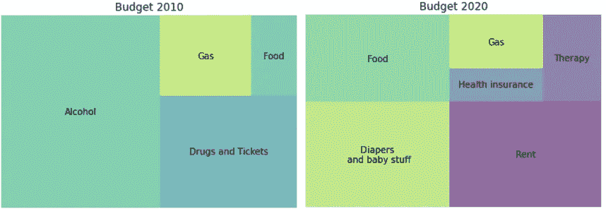
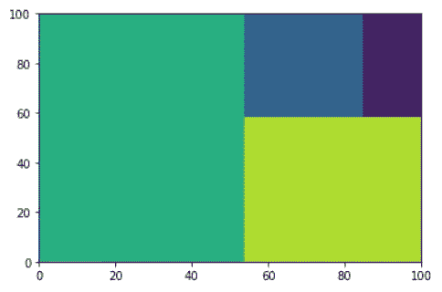
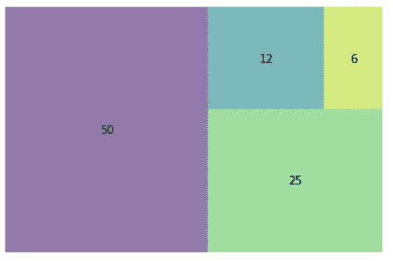
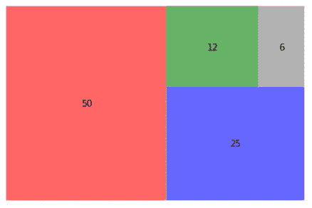
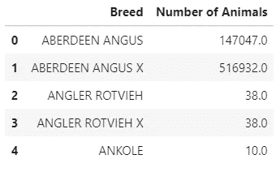
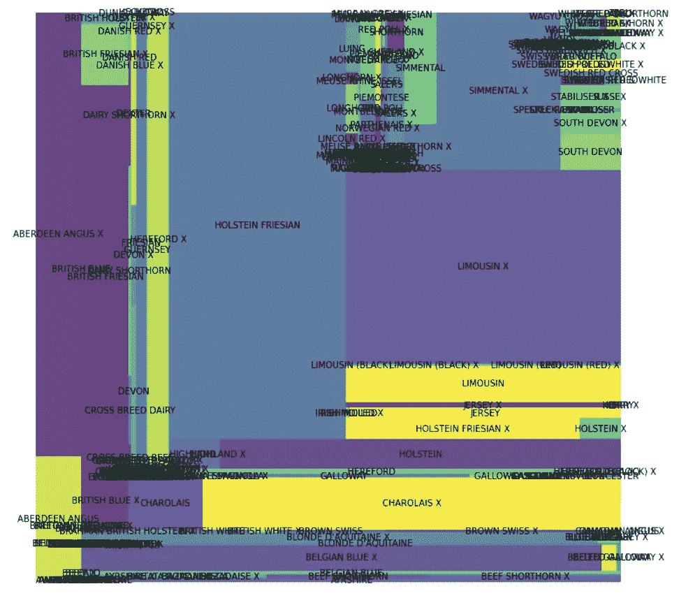
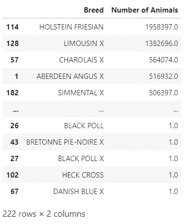
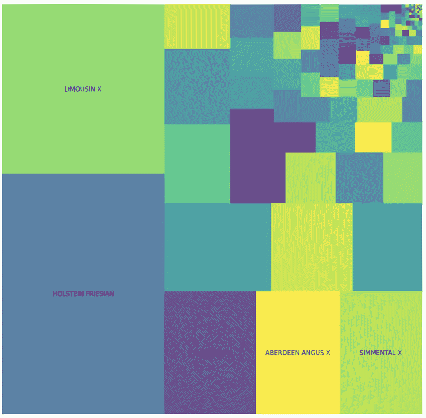
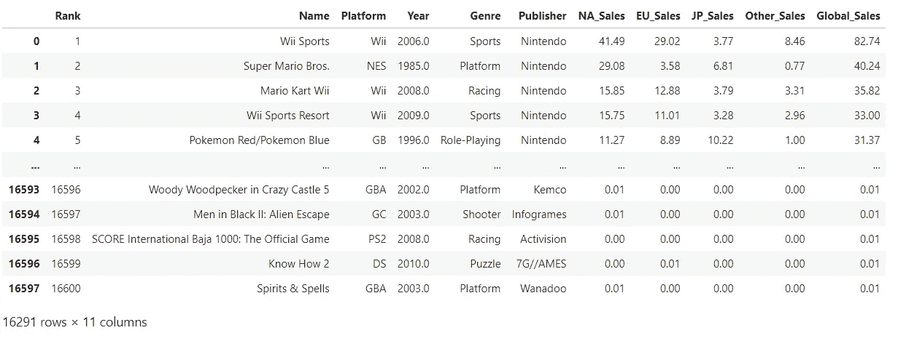
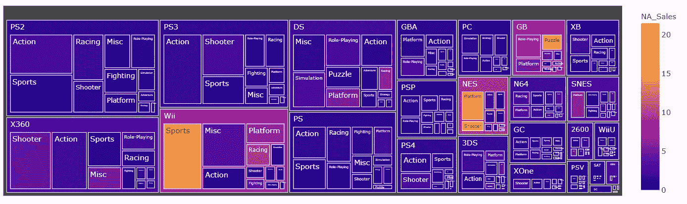

# Python 的树形图基础

> 原文：<https://towardsdatascience.com/treemap-basics-with-python-777e5ed173d0?source=collection_archive---------8----------------------->

## 一种非常简单的展示构图的方式

不缺乏可视化来显示单个值如何组成一个整体。有些可能非常复杂和具体；其他的，比如我们今天要探索的，非常简单易用。

从馅饼到华夫饼图表，展示整体比例的想法通常是讲故事的良好开端。您可以从构成开始，然后逐个探索不同的值，或者比较不同实体或不同时期的不同结构。



## 树形图

美国计算机科学家、马里兰大学教授本·施奈德曼在 20 世纪 90 年代首次使用了这种可视化技术。


[Ben Shneiderman 和他的两个树状图艺术项目作品](https://cmns.umd.edu/news-events/features/2511)

他的可视化变得非常流行，你可以在很多工具和语言中找到不同的实现和不同的算法来创建它们，比如 Tableau、PowerBi、Python、R 等等。

## 方形的

在接下来的例子中，我们将使用 Python 和 Matplotlib、Squarify 和 Pandas 来创建和设计我们的树形图。稍后我们将快速了解 Plotly 能做什么。

```
import matplotlib.pyplot as plt
import squarify # pip install squarify
import pandas as pd
```

Squarify 没有什么复杂的，我们可以简单地向它传递一个数字列表，它就会计算出布局。

```
sizes = [50, 25, 12, 6]squarify.plot(sizes)
plt.show()
```



小菜一碟。

现在，你不能从仅仅看这些随机的方块中得到太多的信息。也许你可以对整体构成有一些见解，但除非你熟悉数据本身，否则你无法识别那些方块。

让我们更具体一些，给我们的树形图添加一些标签。我们也可以去掉轴，让颜色柔和一点。

```
sizes=[50, 25, 12, 6]
label=["50", "25", "12", "6"]squarify.plot(sizes=sizes, label=label, alpha=0.6 )
plt.axis('off')plt.show()
```



## 旗帜

酷！你注意到颜色是如何变化的吗？我们降低了α，这就是为什么它们不那么亮，但不仅如此，它们还改变了位置。

将颜色分配给方块的方式有一些随机性——别问我为什么。

尽管随机性很有用，会带来一些意外的惊喜，但它并不总能让你得到一个有意义的配色方案。为了避免这种情况，我们可以定义我们的颜色列表。

```
sizes=[50, 25, 12, 6]
label=["50", "25", "12", "6"]
color=['red','blue','green','grey']squarify.plot(sizes=sizes, label=label, color=color, alpha=0.6 )
plt.axis('off')plt.show()
```



定义我们的颜色以获得更清晰的图像只是其中的一个方面。

颜色可以添加另一种编码，例如，如果我们在不同的地方有一家公司，我们可能希望看到每个公司对我们的总资产有多少贡献，这将是我们的树形图中方块的大小。

然后，我们可以根据利润、生产数量、成本或任何我们想要的东西来绘制这些地点的彩色地图。

让我们举一个更容易理解的例子来说明这个想法，假设我们在两个地方有四家公司。我们可以在不同的地方使用不同的颜色，在同一个地方使用相似的颜色。

```
sizes=[50, 25, 12, 6]
label=["BC 1", "OT 1", "OT 2", "OT 3"]
color=['red','#1C9FB0','#32A0CE','#1C51B0']squarify.plot(sizes=sizes, label=label, color=color, alpha=0.6 )
plt.axis('off')plt.show()
```


现在我们可以知道每个人贡献了多少，我们也可以很容易地区分 BC 和 OT。

## 可量测性

我们可以使用 Pandas 数据框而不是列表，这为我们可以在数据中执行的各种操作打开了大门，并大大增加了可伸缩性。

让我们看看这种可视化可以扩展到什么程度。我将使用英国按品种分类的农场动物数量数据集。

```
df = pd.read_csv('data/animal-population-by-breed-on_1-march-2010.csv')# convert to numeric and drop na
df['Number of Animals'] = pd.to_numeric(df['Number of Animals'], errors='coerce')
df.dropna(inplace=True)df.head()
```



现在，我们可以将“动物数量”作为我们的尺寸，将“品种”作为我们的标签。

```
fig, ax = plt.subplots(1, figsize = (12,12))squarify.plot(sizes=df['Number of Animals'], 
              label=df['Breed'], 
              alpha=.8 )plt.axis('off')
plt.show()
```



呃，这可不好。标签太多！

让我们尝试对数据框进行排序，并标记最大的方块。

```
df.sort_values('Number of Animals', ascending=False, inplace=True)
df
```



```
fig, ax = plt.subplots(1, figsize = (12,12))squarify.plot(sizes=df['Number of Animals'], 
              label=df['Breed']**[:5]**, 
              alpha=.8 )plt.axis('off')
plt.show()
```



厉害！有了最重要的人群的分类数据和标签，我们可以得到一些见解。

## Plotly

有了 Plotly，我们可以在树形图上更进一步，分组数据，添加工具提示，颜色图非常简单。

让我们快速地看一个例子，只是为了说明可能性。我将使用一个[视频游戏销售](https://www.kaggle.com/gregorut/videogamesales)数据集和 Plotly Express。

首先，让我们加载数据并删除空行。

```
df = pd.read_csv('data/vgsales.csv')
df.dropna(inplace=True)
df
```



现在我们来绘制它！我们将传递数据框、包含类别的字段的路径、方块的大小和颜色的强度。

Plotly 将使用颜色图绘制我们的绘图，添加颜色条、工具提示，并根据方块的大小调整标签的大小。

```
import plotly.express as pxfig = px.treemap(df, 
                 path=['Platform', 'Genre'], 
                 values='Global_Sales',
                 color='NA_Sales'
                )fig.show()
```



好的，标签不是每个方块都可读的，但是我们确实有工具提示来帮助我们找出那些我们不能读的，并且我们在这里添加了比以前更多的信息。

我个人并不热衷于互动；老实说，我很难想出如何将它添加到故事中——我的意思是，我们开始探索树状图，作为讲故事的开始和简化构图的方式，但这种可视化并不那么友好。

随着我们的视觉化增加了交互性和复杂性，我会提出相反的建议。通过显示单个方块或组，从您发现的具体见解开始，然后在最后，展示您的完整树形图，让用户自己探索它。

看看 Nadieh Bremer 的[用和弦图讲故事](http://bl.ocks.org/nbremer/94db779237655907b907)。她的最终视觉化相当复杂。尽管如此，她在向你展示大图之前处理细节的方式非常棒，让数据更容易理解。

这里有一个我们创建的交互式 viz 的[链接](https://thiagobc23.github.io/Treemaps/games.html)，在这里你可以找到[代码](https://github.com/Thiagobc23/Treemaps)。

感谢阅读我的文章。我希望你喜欢它。

**资源:** [Treemaps 马里兰大学](http://www.cs.umd.edu/hcil/treemap/)；
[Python 图库—Treemap](https://python-graph-gallery.com/200-basic-treemap-with-python/)；
[Datacadamia—Treemaps](https://datacadamia.com/data/type/tree/treemap)；
[plottly—Treemaps](https://plotly.com/python/treemaps/)；
[Plotly — HTML 导出](https://plotly.com/python/interactive-html-export/)；
[Github—Squarify](https://github.com/laserson/squarify)；