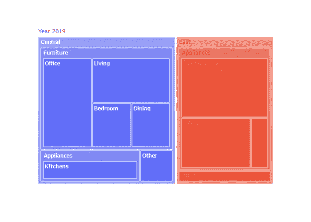
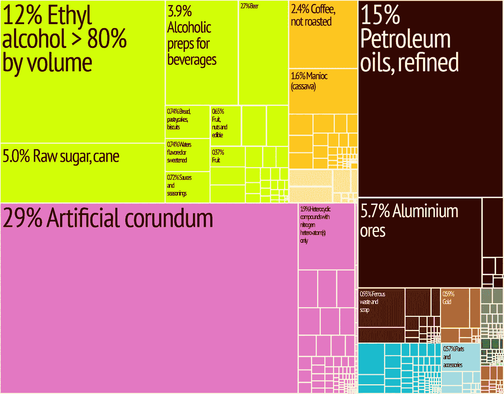
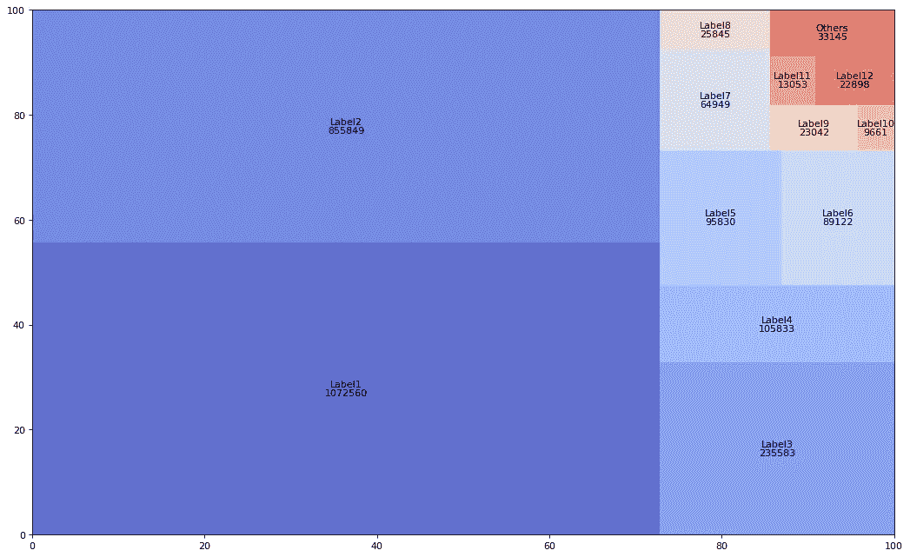
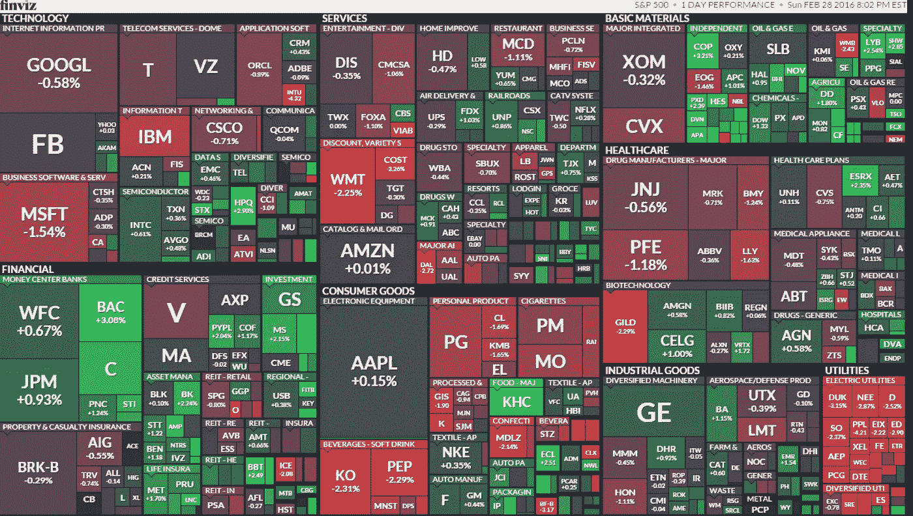

# 树状图，为什么和如何

> 原文：<https://towardsdatascience.com/treemaps-why-and-how-cfb1e1c863e8?source=collection_archive---------17----------------------->

## **用树形图讲故事**


图片由 Pixabay 提供

渐渐地，硬盘上的**文件数量从几十个增加到几百个，从几百个增加到几千个。同样，文件夹和目录的数量几乎呈指数级增长。有必要找到一些图表，让相对简单的方式来可视化新的 [*利维坦的内容。*](https://en.wikipedia.org/wiki/Leviathan)**

这个解决方案来自于 **Ben Shneiderman** ，马里兰大学的计算机科学教授和**人机交互实验室** (HCIL)的创建者。他在寻找“目录树结构的紧凑可视化”(#1)。很明显，目录的结构对应于一个分层的树形结构，但是现有的图非常庞大，因此效率很低。用他自己的话来说:“树形结构的节点连接图变得太大而无用，所以我探索了在空间受限的布局中显示树的方法”(#2)。

**最终结果是一个名为 Treemap** 的图表。令人意想不到的是，它目前的应用大大超出了最初的目的。

**为什么**:树形图是一个**基于矩形的可视化**，它允许你表示一个层次有序(树形结构)的数据集。概念上的想法是在一个物理限制的空间中比较数量和显示一些层次结构的模式。为此，不同大小和颜色的矩形用于从不同角度显示数据集。目标不是指出精确的数值，而是将数据集“分解”成其组成部分，并快速识别其较大和较小的组成部分。



图 1:用 Plotly 创建的树形图。

它们还用于表示等级、各部分之间的差异以及非等级“扁平”结构中的相对比例。从这个意义上说，它们被认为是传统饼图的替代品，传统饼图通常用于可视化“部分到整体”的关系。与饼状图最大的不同在于，树形图允许你在一个相对较小的空间内比较组成 **嵌套矩形**的**方案中整体的各个部分。与饼状图相比，饼状图的一个优势在于，它们可以在一个结构中包含数十或数百个部分，这个结构可能是分层的，也可能不是。**

物理空间的有效利用和智能色彩管理使它们成为在各种商业分析应用以及金融、商业、政府、选举和类似领域中可视化大量信息的出色工具:标准普尔 500 指数；Merval(布宜诺斯艾利斯证券交易所)；各省或各州的选举结果；按地区、国家或部门分列的出口；按产品划分的销售额；等等。以下树形图显示了 2017 年牙买加按行业(农业、石油、化工、矿产等)划分的出口情况。) (#3).



图 2:2017 年牙买加出口。资料来源:commons.wikimedia.org(# 3)。

由于前面提到的原因，树图是商业智能(BI)表示中最常用的可视化元素之一，尽管当可视化的目标是在数据集的组件之间进行精确比较时，不应使用树图。

**如何实现:**它们由一系列嵌套的矩形(**瓷砖**)组成，其面积与它们所代表的数据成比例。较大的矩形(层次的较高层)指示数据树的根或主分支，并被细分成较小的矩形，指示树的每个分支所具有的节点(层次的较低层)的大小。数据集的数值应该是正的，并且对应于矩形的面积。

色彩的巧妙运用让新的维度融入到图表中。通常的程序是在不同的矩形中使用颜色来表示第二个分类或定量值。因此，通过单一颜色的强度变化来表示等级；通过两种颜色强度的变化来显示不同的正负定量值。下图显示了高于和低于阈值的值，这些值以两种颜色的不同强度排列。



图 3:用 Squarify 创建的树形图。

从上面可以推断出，恰当地使用颜色可以让我们使用树形图来表示损失、销售额下降或其他非正值。总是指不是由矩形面积表示的第二定量值。

下面的树状图显示了标准普尔 500 (#4)。它是纽约证券交易所(NYSE)和纳斯达克(NASDAQ)500 只广泛持有的股票的指数或集合。矩形的大小表示指数中每家公司的相对规模。不同的颜色和不同的颜色强度显示了特定一天的阳性、阴性和“中性”结果的刻度:非常亮的红色表示向下的大偏移，非常亮的绿色表示向上的大偏移。毫无疑问，树状图是在相对较小的空间内显示大量信息的最合适的可视化方式。



图 4:标准普尔 500(排名第四)。

几个**算法**允许你通过彩色矩形形状的嵌套图形显示分层数据:方形、切片和方块，以及条状。 **Squarified** 是商业数据可视化工具实现最多的算法。它基于一种策略，即设法使每个区块尽可能地呈正方形，以便于它们之间的比较。它还试图从图的左上到右下以递减的方式排列数据集的连续成员(块、切片)。最后，该算法在台式机、笔记本电脑和手机上有很好的视觉呈现。

**用树状图讲述故事时需要考虑的一些注意事项:**

*   请记住，树状图很难阅读，因为它们依赖于观众通过比较区域来解码数字信息的能力。不要忘记，人类擅长估算距离，却不擅长计算面积。由于在树形图中显示了大量的区域(矩形、瓦片),这个缺点在树形图中被放大了。在使用树形图之前，有必要评估条形图或饼状图是否没有以较低的视觉强度讲述相同的故事。
*   当真正重要的信息有相似的数值时，这些图表是不可取的。在这种情况下，算法会生成非常相似的区域块，很难在仪表板中进行比较。
*   树形图不能用于显示可能取负值(如损失)的数值变量。请记住，这种类型的限制是所有那些使用区域来编码数量变量的图表所共有的。
*   如果你想在交互式演示中使用它们，要非常小心。请记住，如果比较区域相对困难，那么比较交互变化的区域就更加复杂。
*   另一个很难进行好的比较的问题是缺少一个共同的基线，这是条形图所没有的缺点。
*   当大块和小块之间的尺寸差异非常大时，通常不可能在较小的矩形中包含文本。标准的解决方案是使用**工具提示**在用户悬停在矩形上时提供与这些矩形相关的信息。

当然，了解 Stephen first 对这个问题的看法是很重要的:“当传统的图形(如条形图)无法使用时，因为在单个图形甚至单个屏幕上的一系列图形中有太多的项目要用条形来表示，树形图通过优化使用屏幕空间来解决这个问题。因为它们依赖于预先注意的属性来编码我们无法精确比较的值(面积和颜色)，所以我们保留这种方法用于无法使用其他更精确的可视化或没有必要精确的情况。”(#5).

**用 Python 绘制树状图**

正如*的 Python 图库* (#6)所指出的，“dataviz 的可能性相当差”。要用 Python 绘制树形图，必须导入 **Squarify 库** ( *pip install squarify* )并使用 *squarify.plot* 函数，通过 *alpha* 属性指示值、标签、颜色和透明度。与一些商业工具生成的图相比，生成的图非常有限。

一个更好的替代方法是通过 *treemap* 指令使用 **Plotly** ，其语法远优于其 Squarify 等价指令。除了指示值、标签和颜色之外，在 **plotly.express** 中的 *treemap* 语法还包括 *path* 参数，它允许你定义从根到分支(#7)的扇区层次。

```
plotly.express.treemap(*data_frame=None*, *names=None*, *values=None*, *parents=None*, *ids=None*, *path=None*, *color=None*, *color_continuous_scale=None*, *range_color=None*, *color_continuous_midpoint=None*, *color_discrete_sequence=None*, *color_discrete_map={}*, *hover_name=None*, *hover_data=None*, *custom_data=None*, *labels={}*, *title=None*, *template=None*, *width=None*, *height=None*, *branchvalues=None*, *maxdepth=None*)
```

**结论**

当数据集以具有根、分支和节点的树形布局的分层顺序构造时，树形图是一种合适的可视化类型。它允许我们在有限的空间内以非常有效的方式显示大量数据的信息。可视化的主要目的是在不同层级之间进行不精确的比较。它们也用于对非层次数据进行“整体的一部分”分析。它们不应该用于得出准确的结论，带有负面的定量数据，或者当数字差异不允许进行适当的比较时。


图片由来自 Unsplash 的 David Kovalenko 提供

如果你对这篇文章感兴趣，请阅读我以前的([https://medium.com/@dar.wtz](https://medium.com/@dar.wtz)):

**Mekko 图表，为什么&如何**

[](/mekko-charts-f38311c576e2) [## Mekko 图表

### 为什么和如何

towardsdatascience.com](/mekko-charts-f38311c576e2) 

仪表图和项目符号图，为什么和如何，用仪表讲故事

[](/gauge-bullet-charts-cfe171ca3094) [## 仪表图和项目符号图

### 为什么&如何，用量表讲故事

towardsdatascience.com](/gauge-bullet-charts-cfe171ca3094) 

**参考文献**

#1.本·施奈德曼(1992 年)。“用树状图显示树木:二维空间填充方法”。美国计算机学会图形汇刊。11: 92–99.[doi:10.1145/102377.115768](https://doi.org/10.1145%2F102377.115768)。

#2.— Ben Shneiderman，2006 年 4 月 11 日，使用树形图可视化发现商业智能，[http://www.perceptualedge.com/articles/b-eye/treemaps.pdf](http://www.perceptualedge.com/articles/b-eye/treemaps.pdf)

#3.—[https://commons . wikimedia . org/wiki/File:Jamaica _ Export _ treemap . jpg](https://commons.wikimedia.org/wiki/File:Jamaica_Export_Treemap.jpg)

#4.—[https://www.mergersandinquisitions.com/what-is-the-sp-500/](https://www.mergersandinquisitions.com/what-is-the-sp-500/)

#5.—Stephen first，2009，《现在你看到了:定量分析的简单可视化技术》，分析出版社；第一版(2009 年 4 月 1 日)

#6.——【https://python-graph-gallery.com/treemap/ 

#7.—[https://plotly . com/python-API-reference/generated/plotly . express . treemap . html](https://plotly.com/python-api-reference/generated/plotly.express.treemap.html)