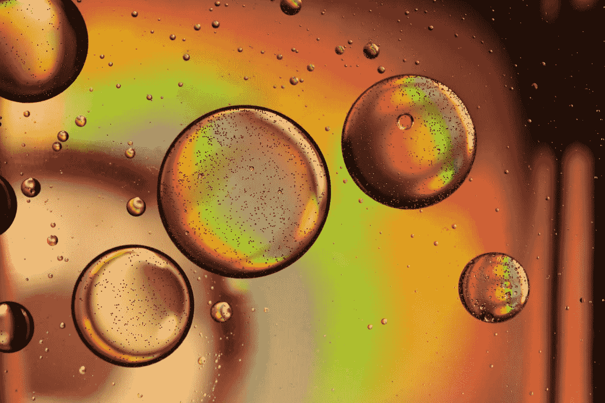

# 2020 年及以后人工智能的趋势

> 原文：<https://towardsdatascience.com/trends-for-ai-in-2020-and-beyond-d2cd4b037b64?source=collection_archive---------49----------------------->

## 在企业中实现真实、不可见和增强的三种方式

无论是[机器撰写的新闻文章](https://www.newyorker.com/magazine/2019/10/14/can-a-machine-learn-to-write-for-the-new-yorker)，人工智能主导的网络安全还是[情绪检测](https://www.govtech.com/products/AI-Can-Now-Read-Emotions--Should-It.html)的关键发展，2019 年无疑为人工智能(AI)世界带来了前沿成就。展望 2020 年代，我们能期待什么？

对企业和消费者来说，人工智能肯定会继续以充满希望的方式发展。迄今为止围绕人工智能的宣传正迅速被更切实的现实所取代，为组织提供了以结果驱动的方式收获人工智能回报的机会。

以下是人工智能将如何帮助商业领袖和决策者拓展其企业的边界，以提高业务绩效:

# *人工智能:不再只是一句流行语*

照片由 [Kai Dahms](https://unsplash.com/@dilucidus?utm_source=unsplash&utm_medium=referral&utm_content=creditCopyText) 在 [Unsplash](https://unsplash.com/?utm_source=unsplash&utm_medium=referral&utm_content=creditCopyText) 上拍摄

如今，AI 对大多数工作场所来说并不陌生。根据 Forrester 的[研究，53%的全球数据和分析决策者表示，他们已经实施、正在实施或正在扩展或升级某种形式的人工智能的实施。](https://www.forrester.com/report/Predictions+2020+Artificial+Intelligence/-/E-RES157592?utm_campaign=predictions_2020&docid=157592&utm_source=forrester_blog&utm_medium=web&utm_content=blog_sri)

2019 年，我们看到围绕人工智能的对话发生了转变。组织开始关注从人工智能中获得的商业价值，供应商就人工智能成熟度教育客户。与此同时，公司开始寻找数据科学家以外的角色，以支持他们的人工智能之旅。

今年，我们将继续关注用人工智能解决“真正的”挑战，而不是大肆宣传变得模糊不清的“人工智能”将会有更多关于你可以从哪里开始使用人工智能以及将人工智能应用于商业需要哪些团队技能的讨论。您将听到更多关于如何通过采用实现业务投资回报的信息。

更多的企业将意识到，让合适的人负责他们的人工智能项目将产生更大的效益。例如，与没有首席数据官的公司相比，拥有专门首席数据官(CDO)或首席分析官(CAO)的公司使用人工智能、机器学习(ML)和/或深度学习的可能性已经增加了大约 [1.5 倍](https://go.forrester.com/blogs/predictions-2020-ai/)。

通过在工作场所更加强调人工智能，每个部门和角色的员工都会注意到人工智能对企业越来越重要。

数据科学团队将继续实现欢迎具有[跨学科经验](https://techhq.com/2019/12/a-complete-data-science-team-requires-more-than-just-data-scientists/)的成员的好处，这将进一步扩大非技术人员的数量，在人工智能的使用中发挥更大的作用——这是由更容易获得 ML 工具包和 AutoML 功能推动的。

随着人工智能的采用越来越多，越来越多的员工实际体验到人工智能如何增强、改善甚至从根本上转变他们的战略和工作角色，人工智能将不再被归入企业的 R&D 翼。它将触及未来公司的几乎每一个部分。

# *隐形 AI 实现*

照片由[斯托伊察·艾奥尼拉](https://unsplash.com/@pupile_gustative?utm_source=unsplash&utm_medium=referral&utm_content=creditCopyText)在 [Unsplash](https://unsplash.com/?utm_source=unsplash&utm_medium=referral&utm_content=creditCopyText) 上拍摄

2019 年，我们看到了狭义 AI 的巨大进步，包括卫星图像、自然语言处理(NLP)和[计算机视觉](https://www.forbes.com/sites/adrianbridgwater/2019/05/25/ai-for-an-eye-how-computer-vision-is-learning-to-see/#391191b13336)等领域。展望未来，期待看到更多人工智能研究的突破，以及人工智能模型的商品化。

人工智能将越来越多地嵌入到领域驱动的解决方案中，使其变得无形而无所不在。人工智能在[边缘计算](https://www.gartner.com/en/information-technology/glossary/edge-computing)中的趋势性使用就是一个例子。在更有效地利用资源的推动下，信息处理和内容收集将更接近信息源。

边缘人工智能还可以降低延迟，提高数据隐私性。人工智能驱动的推理、模式匹配和预测将融入边缘的领域应用，使用户界面更加智能。

IDC 预测，到 2022 年，75%的企业将在技术和流程开发中嵌入智能自动化。同一份报告预测，到 2024 年，人工智能将成为新的用户界面，50%的用户触摸将通过计算机视觉、自然语言、增强现实和虚拟现实来增强。人工智能将无处不在，但从未见过。

# *增强人工智能:人类驱动的未来*

照片由[拉蒙·萨利内罗](https://unsplash.com/@donramxn?utm_source=unsplash&utm_medium=referral&utm_content=creditCopyText)在 [Unsplash](https://unsplash.com/?utm_source=unsplash&utm_medium=referral&utm_content=creditCopyText) 上拍摄

今年，你将看到更多人类与人工智能的合作。人工智能将越来越多地以人为本的方式设计，允许增强能力。

人在回路不仅仅是紧急情况下的自动防故障装置；这就像今天的自动驾驶汽车背后有一个人类司机。然而，人类在人工智能系统中的作用远不止是在出现问题时待命。

人类的输入是必要的，以减轻诸如[人工智能偏差](https://hbr.org/2019/10/what-do-we-do-about-the-biases-in-ai)等问题，并提高模型日常决策的质量。组织已经开始关注这种需求:根据 IDC 的数据，在未来四年，我们将看到 75%的企业重新培训和发展员工，以解决新的技能集，优化人与人工智能的交互。

然而，权力越大，责任越大。Forrester [警告](https://www.forrester.com/report/Predictions+2020+Artificial+Intelligence/-/E-RES157592?utm_campaign=predictions_2020&docid=157592&utm_source=forrester_blog&utm_medium=web&utm_content=blog_sri)今年有三个公关灾难可能会“撼动科技界的声誉”:深度假货的兴起、面部识别的不当使用和过度个性化。有了人在回路系统，组织可以确定这种人工智能技术可能发生不道德转向的点，并将其引导回正确的道路上。

很明显，2020 年为人工智能在企业中的应用带来了巨大的希望。然而，企业和消费者必须明白，快速涌现的人工智能能力不是可以盲目信任的解决所有问题的黑匣子。

纠正这些错误观念对公司来说至关重要，因为他们将继续利用技术的力量。借助为持续人工输入而设计的系统，企业可以使用人工智能来解决障碍，并在 2020 年及以后创造价值。

*这篇文章最初是* [*发表在《分析》杂志的*](https://pubsonline.informs.org/do/10.1287/LYTX.2020.02.01/full/) *上。增加了插图。标题照片由* [*在*](https://unsplash.com/@drew_beamer?utm_source=unsplash&utm_medium=referral&utm_content=creditCopyText)**上画出。**