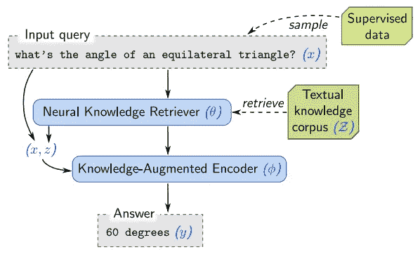
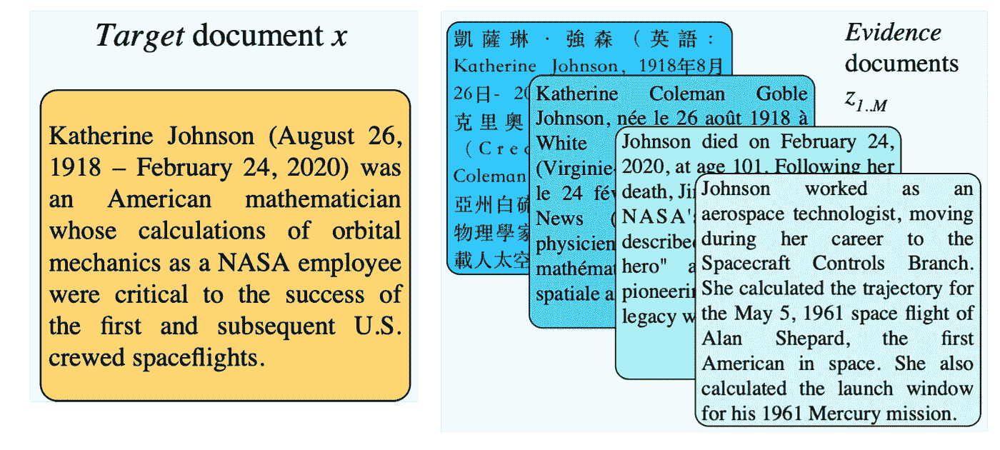

# 自然语言理解的模型预训练趋势

> 原文：<https://towardsdatascience.com/trends-in-model-pre-training-for-natural-language-understanding-d34424cf5715?source=collection_archive---------40----------------------->

## 令牌预测的不确定未来

帕特里克·托马索在 [Unsplash](https://unsplash.com?utm_source=medium&utm_medium=referral) 上的照片

预训练现在在自然语言理解中无处不在(NLU)。不管目标应用程序是什么(例如，情感分析、问题回答或机器翻译)，模型首先会在大量自由格式文本(通常有数百千兆字节)上进行*预训练*。目的是用一般的语言学知识初始化模型，以便以后在多种上下文中使用。一个预先训练好的精通语言学的模型可以在一个更小的数据集上*微调*来执行目标应用。

**虽然我们已经着重确定了将模型暴露给无止境的互联网空谈者的有用性，但是模型应该如何与之交互仍然不明显。关于这种互动有两个要求。首先，需要将数据游戏化到一个*任务*中:在每个训练步骤中，模型试图解决该任务，接收对其性能的反馈，然后相应地调整其参数。第二，由于数据量大，任务需要*无人监管*:正确的预测应该已经存在于原始数据中，不需要人工注释。**

传统上，预训练任务围绕着预测从文本文档中人工移除的标记。尽管它们很简单(或者正因为如此)，这些技术从预训练开始就一直统治着这个领域，取得了真正显著的成果。然而，我们可能只是触及了表面。数据集中一定有很多释放的潜力，比我们童年时接触到的令牌数量多几个数量级。在最近的研究中，创新的想法已经萌芽，提出了更精细的训练前任务，如文献检索和释义。

# 过去:单向语言建模

一种简单而有效的技术是下一个标记预测:给定一个文本文档，训练一个模型从左到右遍历它，并根据它目前已经读取的内容预测沿途的每个标记。这项任务也被称为*语言建模(LM)。*语言建模的香草*单向*公式被现在著名的 OpenAI 的 GPT 模型采用，其巨大的计算规模弥补了训练目标的简单性。GPT-3 模型[1]在 4000 亿个令牌上训练了 1750 亿个参数，记录了前所未有的*少量*性能:为了解决现实世界的任务，在预训练后不需要或很少需要微调。

在预训练+微调范式开始统治 NLU 之前，*伪双向*语言模型有过辉煌的时刻；他们将遍历输入文本两次(从左到右和从右到左),而不是一次通过，以给出双向处理的假象。例如，为[布偶系列](https://www.theverge.com/2019/12/11/20993407/ai-language-models-muppets-sesame-street-muppetware-elmo-bert-ernie)设定趋势的 ELMo [2]使用这种技术来产生连续的输入表示，这些表示稍后将被馈送到最终任务模型中(换句话说，只有输入嵌入被预训练而不是整个网络栈)。尽管当时很流行，但伪双向 LMs 从未在预训练+微调的背景下复兴。

# 现在:蒙面语言建模

在过去的两年里，NLU 事实上的基石是谷歌的 BERT [3]，它被预先训练了两个目标:*屏蔽语言建模* (MLM)和下一句话预测。在 MLM 训练期间，模型被暴露于文本文档，其中 15%的标记被替换为特殊的[掩码]标记；它的任务是恢复这些省略。访问掩码标记两侧的上下文有助于模型双向处理文本。假设 MLM 鼓励模型比单向和伪双向 LMs 更接近地模仿人类推理。

MLM 相对于它的下一个单词预测前身的主要缺点是降低了采样效率，因为只有 15%的标记被预测。此外,[MASK]标记在预训练和微调阶段观察到的输入之间引入了差异，因为下游任务不会屏蔽它们的输入。XLNet [4]提出了解决这些问题的 MLM 的变体，但是与 BERT 相比，它的采用仍然相对有限。

# 未来:超越象征性预测

尽管取得了成功，令牌预测的目标并非完美无缺。他们的主要批评是，他们只关注语言的形式:模型学习连贯语言的特征，而不一定将意义与它联系起来。像 GPT-2 [5]这样的生成模型是众所周知的*幻觉——*也就是说，产生令人信服的看起来真实的文本，而不是锚定在现实中。这或许就是 OpenAI 不愿意开源他们模型的原因。

最近的工作在将自然语言融入现实世界的*方面取得了进展。诸如 [**REALM**](https://arxiv.org/abs/2002.08909) (检索-增强语言模型预训练)[6]和 [**MARGE**](https://arxiv.org/pdf/2006.15020.pdf) (检索和生成的多语言自动编码器)[7]之类的研究项目引入了超越简单令牌预测的更精细的预训练技术。*

## **领域**(检索-增强语言模型预训练)

REALM 专注于开放领域问答(open-QA)的具体应用:给定一个问题和一个文档数据库，任务是从其中一个文档中提取正确答案。遵循标准实践，在自由形式文本的大型语料库上执行预训练。这项创新是对经典 MLM 任务的调整:在预测屏蔽令牌之前，模型被训练为首先检索有助于填补空白的文档。

通过屏蔽语言建模和文档检索进行领域预训练[6]

这种技术有两个主要优点。首先，它鼓励基于证据的预测，而不是听起来很好的猜测(它也有助于在像“1696 年 7 月”这样的突出时间跨度上应用掩码，而不是任意地)。其次，它方便地为端到端的开放式质量保证微调奠定了基础，如下图所示。注意，训练数据没有明确地将问答配对链接到相关文档。但是，由于模型在预训练期间获得了一些文档相关性的概念，因此缺少这种明确的信号不太具有破坏性。主要的缺点是在每个训练步骤中检索一个文档背后的工程复杂性，同时确保这个操作(在一个潜在的大集合上)保持可区分性。

面向开放领域问答的领域微调[6]

您可能会认为在预训练期间包含一个检索步骤会降低预训练模型的通用性(毕竟，REALM 只适用于 open-QA)。但是 MARGE **和**表明事实并非如此。

## **MARGE** (检索和生成的多语言自动编码器)

上面所有的方法都建议在输入被改变后对其进行某种类型的*重建*。从左到右 LMs 删除被预测标记右侧的所有文本，而 MLMs 从输入文本中删除任意标记。MARGE pre-training 将这一挑战提升到了一个新的水平，并要求模型完成看似不可能的任务:重建一个它从未见过的“目标”文档，甚至没有因截断或省略而受损。取而代之的是，向模型显示与输入相关的其他“证据”文档(例如，解释或甚至将其翻译成另一种语言)，并要求其重新生成原始文本。下图显示了一个示例。

用于 MARGE 预培训的目标和证据文件(改编自[7])

MARGE 和 REALM 之间的一个主要区别是，前者是一个*序列到序列*模型(由一个编码器和一个解码器组成)，而后者只是一个解码器。这使得 MARGE 能够在广泛的下游任务上进行微调，包括*辨别*(例如，分类或提取问题回答)和*生成*任务(例如，机器翻译、摘要或释义)。MARGE 提出了一个有趣的观察，即预训练+微调范式甚至在检索仅在预训练期间执行时也成立(记住 REALM 在两个阶段都使用了它的检索器)。一个真正显著的成果是 MARGE 可以执行体面的*零镜头*机器翻译——也就是说，不需要对并行数据进行任何微调！

# 结论

增加训练数据的数量仍然是提高模型质量的可靠方法，即使存在数千亿个令牌，这种趋势似乎也不会放缓。但是，尽管接触到的文本比人类一生中处理的还要多，但机器的表现仍然不如我们，特别是在本质上具有生成性或需要复杂推理的任务中。也就是说，模型与数据交互的方式非常低效。研究团体已经开始脱离单纯依赖语言形式的预训练任务，并纳入鼓励在现实世界中锚定语言理解的目标。

# 参考

1.  布朗等人，[语言模型是少量学习者](https://arxiv.org/abs/2005.14165) (2020)
2.  彼得斯等人，[深度语境化的词语表征](https://arxiv.org/abs/1802.05365) (2018)
3.  Devlin 等人， [BERT:用于语言理解的深度双向转换器的预训练](https://arxiv.org/abs/1810.04805) (2018)
4.  杨等， [XLNet:面向语言理解的广义自回归预训练](https://arxiv.org/abs/1906.08237) (2019)
5.  拉德福德等人，[语言模型和无监督多任务学习者](https://cdn.openai.com/better-language-models/language_models_are_unsupervised_multitask_learners.pdf) (2019)
6.  Guu 等人，[领域:检索-增强语言模型预训练](https://arxiv.org/abs/2002.08909) (2020)
7.  刘易斯等人，[通过转述进行预训练](https://arxiv.org/abs/2006.15020) (2020 年)