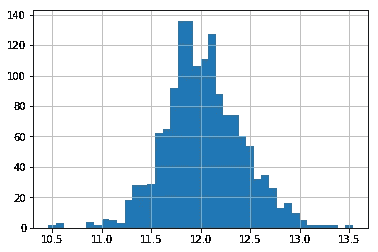

# 我在一次著名的纸牌游戏比赛中成功使用的技巧

> 原文：<https://towardsdatascience.com/tricks-i-used-to-succeed-on-a-famous-kaggle-competition-adaa16c09f22?source=collection_archive---------15----------------------->

## 使用创造性特征工程和高级回归技术预测房价|前 3 %


汤姆·朗布尔在 [Unsplash](https://unsplash.com?utm_source=medium&utm_medium=referral) 上拍照

作为一名新的数据科学家，在我攻读数据分析硕士学位期间，我积极参加了许多 Kaggle 比赛，以便将我在学习期间学到的所有知识投入到工作中。


我就说说我的第一场比赛，[**房价:高级回归技巧**](https://www.kaggle.com/c/house-prices-advanced-regression-techniques) 。对于数据科学初学者或通过了机器学习课程并希望扩展其技能组合的学生来说，这是一场完美的比赛。本次竞赛的目标是预测样本房屋的销售价格。根据预测值的对数和观察到的销售价格的对数之间的 [**均方根误差(RMSE)**](https://en.wikipedia.org/wiki/Root-mean-square_deviation) 对所有提交进行评估。

有几个因素会影响房子的整体价格，其中一些因素更为有形，如房子的质量或房子的整体大小(面积),其他因素更为内在，如经济表现。建立一个准确的模型来预测实际价值是一项艰巨的任务，因为有内部和外部因素会影响每栋房子的价格。

在这里我将为你描述我是如何从第 2800 名左右进入前 150 名的。你可以在我的 GitHub 个人资料上找到详细的笔记本:[https://github.com/chouhbik/Kaggle-House-Prices](https://github.com/chouhbik/Kaggle-House-Prices)

一开始，我从构建不同的模型开始，并让它们根据我从 Kaggle 下载的原始数据进行训练。随机森林表现良好，得分为 0.13825，足以让我在排行榜上垫底。

之后才知道 **EDA(探索性数据分析)****特征工程**的前期步骤是如此重要。接下来，我将向您展示我是如何改进的…

# **第一步:**因变量的对数变换

有两个原因需要预测销售记录，而不是销售额:首先，本次竞赛中使用的评估指标取决于销售记录，其次，许多货币实体的分布接近对数正态分布，即重尾分布。通常，预测不具有重尾性的事物会更好，并且大多数机器学习模型在正态分布的数据上表现良好。

```
(np.log(df_train["SalePrice"])).hist(bins = 40)
```



直方图:销售记录

# **步骤 2:重新编码预测值/缺失值/异常值**

一些顺序的预测值(即它们的值有自然顺序)最初被存储为因子。我以一种明智的方式对它们进行了重新编码(这种预测器的例子有*ext equal*和 *BsmtCond* )。显然，我必须填写缺失的值:

*   数字预测中的缺失:当有意义时，我用零填充(例如，如果地下室没有浴室，BsmtFullBath 应该等于零)，
*   分类预测中的缺失:我用中位数或其他典型值(均值或众数)填充。最后，
*   此外，去除预测值中的一些异常值也是值得的，如*总体质量*和 *GrLivArea* 。

# **第三步:处理非线性**

由于我计划使用一些线性方法(拉索，山脊，SVM)，我*用它们的对数替换了*所有的重尾预测值，并为一些预测值*添加了*它们的平方(即我们有预测值 X，我们添加了预测值 X)。用对数代替重尾预测值的动机是:

*   线性方法可能用非常小的权重来拟合这种预测值，并且值中包含的大部分信息可能会丢失
*   当这样的预测值取非常高的值时，预测值也可能非常高或误导。添加方块是由散点图“预测值与销售记录”中的非线性引起的

# **步骤 4:添加新的预测值**

我决定增加一些指标变量，如果相应的预测因子取某个值，它们就等于某个值。

例如:

```
*# feture engineering a new feature "TotalSF"*
all_data['TotalSF'] = all_data['TotalBsmtSF'] + all_data['1stFlrSF'] + all_data['2ndFlrSF']all_data['YrBltAndRemod']=all_data['YearBuilt']+all_data['YearRemodAdd']

all_data['Total_sqr_footage'] = (all_data['BsmtFinSF1'] + all_data['BsmtFinSF2'] +all_data['1stFlrSF'] + all_data['2ndFlrSF'])

all_data['Total_Bathrooms'] = (all_data['FullBath'] + (0.5 * all_data['HalfBath']) + all_data['BsmtFullBath'] + (0.5 * all_data['BsmtHalfBath']))

all_data['Total_porch_sf'] = (all_data['OpenPorchSF'] +                         all_data['3SsnPorch'] + all_data['EnclosedPorch'] + all_data['ScreenPorch'] +all_data['WoodDeckSF'])all_data['haspool'] = all_data['PoolArea'].apply(lambda x: 1 if x > 0 else 0)
all_data['has2ndfloor'] = all_data['2ndFlrSF'].apply(lambda x: 1 if x > 0 else 0)
all_data['hasgarage'] = all_data['GarageArea'].apply(lambda x: 1 if x > 0 else 0)
all_data['hasbsmt'] = all_data['TotalBsmtSF'].apply(lambda x: 1 if x > 0 else 0)
all_data['hasfireplace'] = all_data['Fireplaces'].apply(lambda x: 1 if x > 0 else 0)
```

# **步骤 5:堆叠模型**

下一步，我使用了 10 层*交叉验证和堆叠:对于每次“运行”的交叉验证，我试图在 10 层**(套索、脊、弹性网、GBM 和 XGBoost)** 中的 9 层上拟合 5 个模型，对遗漏的层进行预测，并使用这五组预测作为另一个**套索**模型的输入，以预测遗漏层的销售记录(这种**套索**模型被称为我们总共有 ***6*10=60 款*** (10 套 6 款)。我使用所有这些模型进行最终预测:我采用测试数据集，使用 5 个子模型进行预测，然后使用这些模型的输出作为各自元模型的输入，以获得给定模型集的预测集。我重复这个过程 10 次，得到 10 组预测，然后使用算术平均值*对它们进行平均，得到用于提交的数据。**

# ****第六步:调整参数****

**对于堆叠，我使用了 6 个不同的模型，每个模型都需要调整(对于 ***交叉验证*** 的每次“运行”,我用始终相同的参数拟合 6 个模型。我花了很多时间和提交来微调参数(最好的改进是通过为**GradientBoostingRegressor**调整***min _ samples _ leaf***和***min _ samples _ split***)。最终，我得到了 0.1167 左右的 smt，并且确信我无法通过调优来提高它。**

# ****第 7 步:更多缺失值****

**接下来，我尝试了不同的填充缺失值的策略(模式/方法/中间值等)。).在某种程度上，最有效的东西是出乎意料的:它基于 R 中的 mice 包，在这里描述为。我使用 [***鼠标***](https://cran.r-project.org/web/packages/mice/mice.pdf) 包来填充数值变量 NA 使用**随机森林**。**

****Mice** package 在填充 NAs 时非常方便。结果不是最好的，但比用每个变量的中间值来填补缺口要好。更重要的是，它很好用。**

**使用 **R/Mice/SVM** 和 **python/stacking** 并取这些预测的几何平均值，我得到了 0.1131，这已经很好了。令人意想不到的是，这种简单的、非业务驱动的填补异常值的方法起了作用。注意，**老鼠**可能会在数值预测器中填入不等于零的东西，而它们应该是零。我认为这种方法帮助了我，因为它与我在 python 中得到的完全不同。**

# ****第八步:野蛮武力****

**我对 0.1131 已经很满意了，但是我最不想尝试的就是这个。回归通常不适用于边缘情况，不适用于预测值的大小。我接受了培训，运行了 R/mice/svm、python/stacking，使用几何平均值对结果进行了平均，得到了销售记录的最终预测，并将它们与真实值的记录进行了对比:**

****

**从图中可以明显看出，对于小的最终预测，我们高估了销售记录，对于大的预测值，我们低估了。**

**最后，我尝试了一个相当残酷的方法:我取预测销售额(不是对数，而是实际销售额)，取 3 个百分点，手动增加/减少预测。**

**我用不同的百分位值重复了 8 次，直到最后得到 0.10985。值得注意的是，这种强力方法提高了对少量观察值的预测，但似乎足以提高排行榜上的分数。**

```
**q1 = final_sub['SalePrice'].quantile(0.0025)
q2 = final_sub['SalePrice'].quantile(0.0045)
q3 = final_sub['SalePrice'].quantile(0.99)

final_sub['SalePrice'] = final_sub['SalePrice'].apply(lambda x: x if x > q1 else x*0.79)
final_sub['SalePrice'] = final_sub['SalePrice'].apply(lambda x: x if x > q2 else x*0.89)
final_sub['SalePrice'] = final_sub['SalePrice'].apply(lambda x: x if x < q3 else x*1.0)**
```

# ****总结:****

**最后，我还尝试了一些其他的方法，但是没有用:**

*   **主成分分析**
*   **添加越来越多的预测器**
*   **将其他模型添加到堆叠中**
*   **在张量流和标度上使用 keras，具有密集的神经网络。**

**我想说的是，产品化版本的评估指标大约为 0.12，因为可以构建简单的模型来提供相同的结果。有帮助的有趣的事情:添加一些预测器的方块，在原始数据上使用**鼠标& SVM** 和 **R** 并使用边缘预测(非常低或非常高的预测)。**

**希望你喜欢这个项目的分析和预测模型，这些预测模型曾经接近准确的预测。**