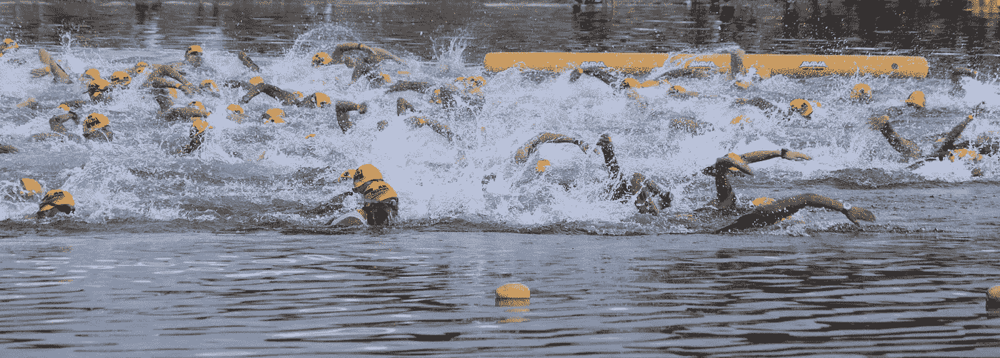
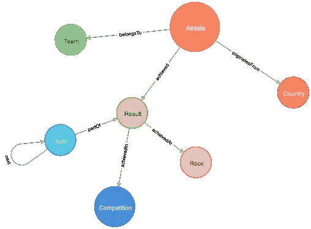
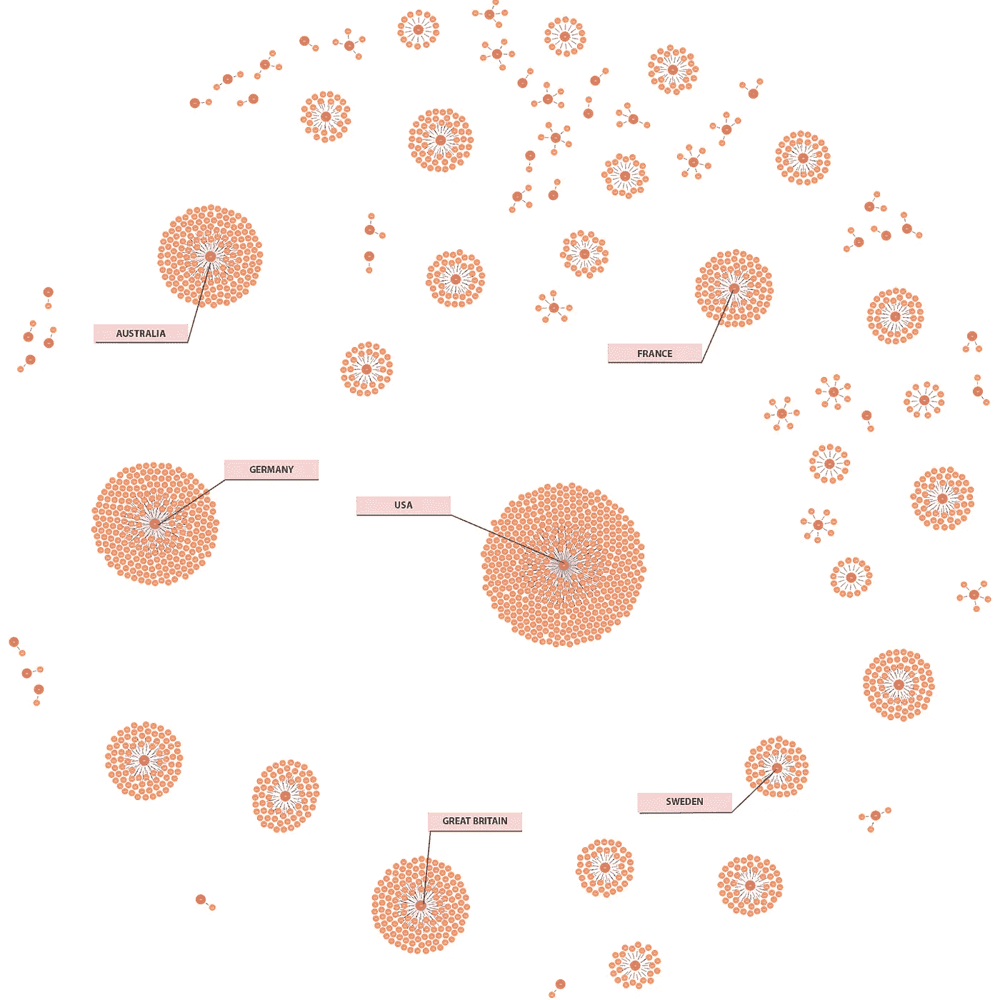
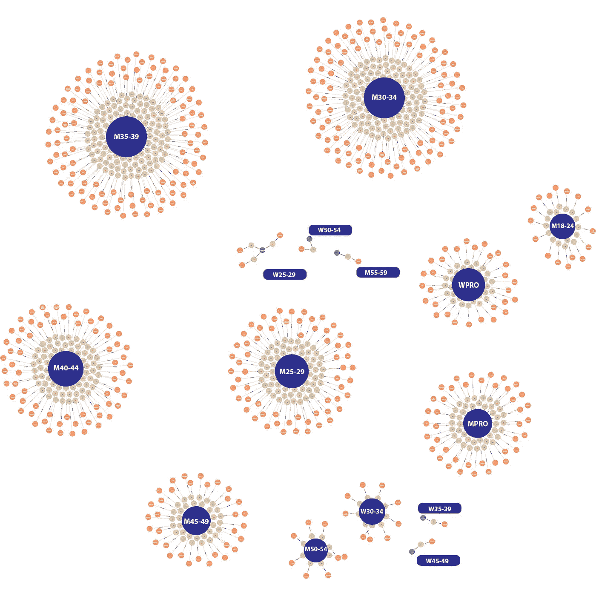

# TriGraph:如何使用图表分析铁人三项项目

> 原文：<https://towardsdatascience.com/trigraph-how-to-use-graphs-to-analyse-triathlon-events-145c5daefcc5?source=collection_archive---------26----------------------->



ID 21137693 Patrimonio 设计有限公司| Dreamstime.com

图形[直观](https://graphql.org/learn/thinking-in-graphs/)。图为[强大的](https://dzone.com/articles/the-power-of-graphs-and-how-to-use-them)。而且图形可以在[广泛的应用](https://neo4j.com/use-cases/)中使用。本文的目标是展示在我们的例子中，尤其是在铁人三项比赛中，图表如何简化定义良好的数据模型之上的数据分析。为了实现这一点，我们使用 [Neo4j](https://neo4j.com) 作为图形数据库，并使用 [Ironman Vega 世界锦标赛 2019](https://track.rtrt.me/e/IRM-WORLDCHAMPIONSHIP-2019) 的结果进行分析。我们想要回答的问题是:

*   所有首发球员的国家分布如何？
*   在 10 小时内完成比赛的所有运动员的年龄组分布如何？

正如我们将看到的，定义数据模型对于后面的分析至关重要。让我们直接开始吧。

# 数据模型

数据模型是后面分析的关键。它提供了一个抽象，将数据源定义的初始原始数据映射成信息([进一步阅读](https://www.ontotext.com/knowledgehub/fundamentals/dikw-pyramid/))。在这些信息的基础上，您可以定义您的查询并进行分析。在我们的例子中，一切都从运动员*开始，他的名字和姓氏被识别出来。一名*运动员*属于一个由名字定义的*队*。此外，运动员*来自*一个*国家*，目前由国家简称定义。最重要的是，运动员*在某个*比赛*和某个*比赛*中取得了*和*的成绩。一场比赛中所有的*分割*都是最终结果的一部分。产生的模式如下所示:**



Neo4j 生成的图形数据库的结果模式

这个例子表明，建立一个图表是多么直观和容易理解。正如我们所看到的，产生的模式非常接近我们如何定义和看待现实世界。

一旦定义了数据模型，就该用结果填充数据库了。当我们使用 Neo4j 时，填充图形数据库是通过名为[‘cypher’](https://neo4j.com/docs/cypher-manual/current/introduction/#cypher-introduction)的图形查询语言完成的。让我们来看一个例子，让你感受一下这是怎么做到的:

```
create (:Athlete {firstName: “testFN”, name: “testLN” })
```

现在，我们创建一个国家，然后让我们添加一名运动员来起源于它:

```
create (:Country{shortCode:”USA”});
match (a:Athlete),(c:Country)
create (a)-[:originatesFrom]->( c )
return a,c;
```


结果图看起来像预期的那样

一旦有了模式并获得了查询语言的逻辑，就很容易将原始数据映射到数据模型并导入它。为此，我将 python 与 [jupyter 笔记本](https://jupyter.org)和 [py2neo](https://py2neo.org/v4/) 一起使用。

# **回答问题**

有了数据模型和原始数据的导入，艰苦的工作已经完成，我们可以享受图形的可视化。所以，现在是时候回答我们上面提出的问题了，从第一个开始。这两个问题有一个共同点，即信息在图中被明确地陈述，这使得它容易得多。

*所有首发球员的国家分布如何？由于在数据模型中运动员和国家之间有直接关系，我们唯一要做的就是匹配它并返回节点，如下图所示。*

```
match (a:Athlete)-[:originatesFrom]->(c:Country)
return a,c
```



国家分布

*在 10 小时内完成比赛的所有运动员的年龄组和国家分布情况如何？这个问题有点难回答，因为它有一个条件。分割时间将总时间保存为 Neo4j 中的[持续时间。现在我们可以过滤时间，得到相应的结果以及与比赛(=年龄组)和运动员的关系。最后，所有三个都被返回，结果图如下所示。](https://neo4j.com/docs/cypher-manual/current/syntax/temporal/)*

```
match (s:Split)
where s.name = “FINISH” and s.total.minutes < 600
with s
match (a:Athlete)-[:achieved]->(r:Result)
where s.bib = r.bib
with a,r
match (r)-[:achievedIn]->(c:competition)
return a,r,c
```



完成 10 小时以下比赛的所有运动员的年龄组分布

# 摘要

我想展示的是，一旦数据模型就位，使用简单易懂的查询就可以获得非常好的结果。非常重要的一点是，数据模型可以很容易地用新的特性和信息进行扩展。此外，可以导入新的源，使用完全相同的查询可以获得相同的结果。但这只是开始。查询非常简单，结果并不令人惊讶，也可以通过其他技术实现。但是这张图表是下一步的基础。这个想法是为了回答关于铁人三项比赛和训练策略的更复杂的问题。我接下来想研究的是团队比赛如何影响不同比赛的最终结果，并拥有一套可以自动进行和共享的标准分析。