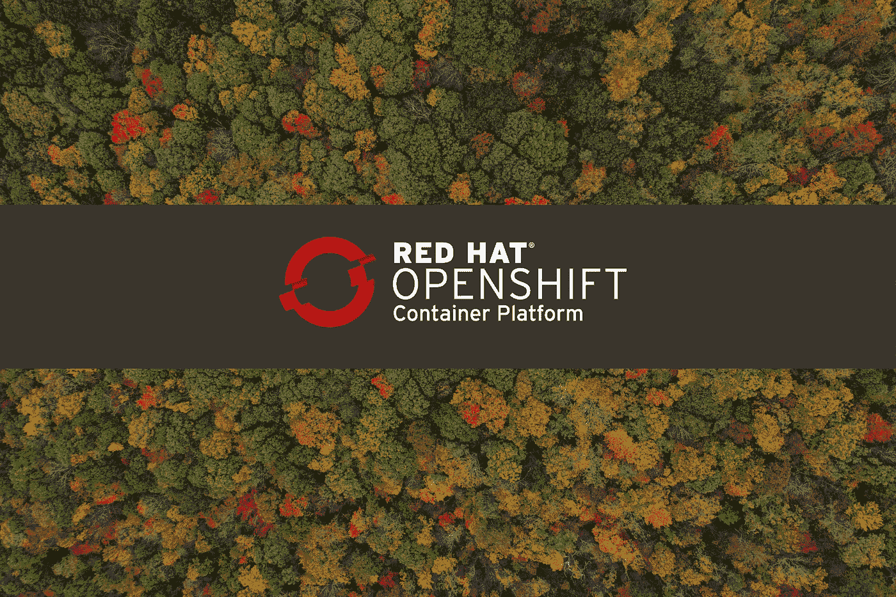

# OpenShift 集群和工作负载故障排除

> 原文：<https://towardsdatascience.com/troubleshooting-openshift-clusters-and-workloads-382664018935?source=collection_archive---------25----------------------->

## 每个 OpenShift 用户都应该知道的命令集合

如果您是集群管理员、集群操作员或团队中唯一真正知道 OpenShift 集群中发生了什么的开发人员，那么您会知道，一些可怕的事情会不时发生。这是不可避免的，最好为倒楣的时刻做好准备。因此，当涉及到调试中断的部署、资源消耗、缺少权限、无法实现的工作负载等时，这是应该成为您的武器库的一部分的命令集合…

[内森·安德森](https://unsplash.com/@nathananderson?utm_source=unsplash&utm_medium=referral&utm_content=creditCopyText)在 [Unsplash](https://unsplash.com/s/photos/forest?utm_source=unsplash&utm_medium=referral&utm_content=creditCopyText) 上的原始照片

# 不要使用 Web 控制台

是的，它看起来不错，易于导航，便于执行一些任务…如果路由器出现问题，或者部署失去其*端点*或者运营商出现一些问题，它也会变得不可达…

如果您不太习惯使用 web 控制台做任何事情，那么在每一分钟都很重要的时候，您可能最终无法使用 CLI 解决问题。因此，我的建议是熟悉`oc`工具，至少在这篇文章期间，忘记 web 控制台的存在。

# 监控节点资源

不时地检查工作节点上的可用内存和 CPU 是很好的，尤其是如果您的 pod 停留在`Pending`状态或正在`OOMKilled`状态。您可以通过以下方式做到这一点:

其中显示了节点的 CPU 和内存状态。如果你想过滤掉*主*节点，只看到*工人*，那么你可以使用`-l node-role.kubenetes.io/worker`，就像这样:

# 排除节点设备故障

如果您正在运行裸机集群，那么很有可能您最终会遇到与运行在节点本身上的东西相关的问题。要查看在 worker 节点上运行的特定`systemd`单元(例如 *crio* 或 *kubelet* )发生了什么，可以使用:

该命令从特定的`unit`检索日志。因此，使用`-u crio`运行会给我们带来以下结果:

当日志不够好，并且您需要在 worker 节点内部真正探索时，您可以运行`oc debug nodes/node-name`。这将通过在节点上创建特权 pod，为您提供这个特定节点内的 shell。这种交互式会话的示例:

在上面的会话中，我们使用`crictl`来检查直接在 worker 节点上运行的容器。如果需要，我们可以在这里启动/重启/删除一些容器或系统服务。不用说，在接触运行在节点本身上的东西时要非常小心。

顺便提一下，如果您在某个托管公共云上运行您的集群，那么您很可能没有直接访问节点的权限，因为这将是安全问题，所以最后一个命令可能会在您身上失败。

# 监控集群更新

当您决定是时候将您的集群更新到新版本时，您可能需要监控进度。或者，如果一些运营商在没有任何明确原因的情况下中断，您可能还想检查您的`clusterversion`运营商，看看它是否正在向新版本发展，这可能是暂时服务降级的原因:

上面的两个命令都检索版本和集群当前是否正在升级的信息，或者集群操作符的总体状态。

# 调试 pod 的所有方法

最容易出问题的当然是 pod 和/或部署( *DeploymentConfig* )。有很多命令可以让您了解应用程序的问题所在，所以从最高级的命令开始:

`oc status`是获得项目中部署的资源概况的最简单方法，包括它们的关系和状态，如上所示。

下一个，你已经知道了——`oc describe`。我提到它的原因是底部的`Events:`部分，它只显示与这个特定资源相关的事件，这比试图在`oc events`的输出中找到任何有用的东西要好得多。

另一个常用命令是`oc logs`。你可能不知道的一件事是，它可以使用`-c`参数针对 pod 的特定容器。例如:

如果您在多容器窗格中调试单个容器，并且希望只过滤相关的日志，这可能会很方便。

现在，对于鲜为人知的命令。`oc debug`已经在关于调试节点的章节中展示了，但是它也可以用于调试部署或 pod:

与带有节点的示例不同，这不会为正在运行的 pod 提供 shell，而是在调试模式下创建现有 pod 的精确副本。也就是说，标签将被去除，命令更改为`/bin/sh`。

您可能需要在 OpenShift 中调试 pod 的一个原因是安全策略问题。在这种情况下，您可以将`--as-root`添加到命令中，以防止它在启动时崩溃。

这个命令的好处在于它可以与任何创建 pod 的 OpenShift 资源一起使用，例如*部署*、*作业*、*图像流标签*等。

# 在窗格和容器中运行临时命令

尽管创建调试窗格非常方便，但有时您只需要在实际的窗格中摸索。你可以用`oc exec`来表示。这些是您可以利用的变体:

上面的第一个命令在`podname`中一次性运行`command`，如果必要的话还会有额外的选项。第二个命令将让您将 shell 放入 pod 中的特定容器，尽管您可能会使用简写- `oc rsh`。

您可以使用的一个用于故障排除的命令是`oc cp`，但是不应该在生产环境中使用，它将文件复制到 pod 或从 pod 复制文件。如果您需要从容器中取出一些文件以便进一步分析，这个命令会很有用。另一个用例是将文件复制到 pod(容器)中，以便在测试期间快速修复一些问题，然后在 Docker 镜像(`Dockerfile`)或源代码中正确修复。

# 检查损坏的图像

我认为这对于调试 pod 和容器已经足够了，但是调试应用程序映像呢？为此你应该求助于`skopeo`:

第一个命令可以检查图像存储库，这在无法提取图像的情况下非常有用，如果标签不存在或者图像名称拼写错误，就可能会发生这种情况。第二个只是给你可用的标签列表，而不需要你打开注册网站，这是非常方便的。

# 收集所有可用的信息

当其他一切都失败时，您可以尝试运行`oc adm must-gather`来从集群中获取所有可用的信息，这对调试很有用。该命令生成的文件可用于您自己的调试，或在您需要帮助时发送给 Red Hat 支持。

# 调试无法访问的应用程序

应用程序/部署看似运行良好，但却无法相互联系，这种情况并不少见(至少对我来说是这样)。这可能有几个原因。让我们看下面的场景—您有一个应用程序和数据库。两者都运行良好，但由于某种原因，您的应用程序无法与数据库通信。有一种方法可以解决这个问题:

上面的代码片段假设我们已经运行了应用程序和数据库，以及它们各自的*服务*。我们可以通过尝试从应用程序访问数据库来开始调试。不过，我们首先需要的是数据库的 IP，我们使用第一个命令锁定它。接下来，我们使用`oc debug`创建应用程序的副本，并尝试使用`curl`访问数据库 pod，这是成功的。

之后，我们以相反的方式重复测试，我们可以看到`curl`超时，这意味着数据库无法到达应用程序 IP。然后我们检查先前创建的*服务*，没有什么奇怪的。最后，我们检查*端点*，我们可以看到应用程序窗格没有端点。这很可能是由相应的*服务*的错误配置引起的，如最后一个命令所示，这里我们显然有错误的`selector`。(用`oc edit svc/...`)修复这个错误后，*端点*被自动创建，应用程序可访问。

# 修复缺失的安全上下文约束

如果您的 pod 由于任何与复制/访问文件、运行二进制文件、修改节点上的资源等相关的问题而失败，那么很可能是与*安全上下文约束*有关的问题。根据您得到的具体错误，您应该能够为您的 pod 确定正确的 SCC。如果还不清楚，那么有一些提示可以帮助你做出决定:

如果您的 pod 由于其使用的 UID/GID 而无法运行，那么您可以检查每个 SCC 的 UID 和 GID 范围:

如果这些字段被设置为`<none>`，你应该去看看项目注释:

这些注释告诉您，pod 的有效 UID 将在 1001490000 +/- 10000 范围内。如果这不能满足您的需求，您必须设置`spec.securityContext.runAsUser: SOME_UID`来强制特定的 UID。如果您的 pod 在这些更改后失败，那么您必须切换 SCC 或修改它以具有不同的 UID 范围。

确定*服务帐户*需要哪个 SCC 来运行 pod 的一个巧妙方法是使用`oc adm policy scc-subject-review`命令:

该命令的作用是检查用户或*服务帐户*是否可以创建使用 YAML 表示传入的 pod。当该命令的输出显示`<none>`时，则意味着不允许资源。如果显示的是 SCC 的任何名称，例如上面的`anyuid`，那么这意味着这个资源可以通过这个 SCC 来创建。

要将此命令用于某个*服务帐户*而非用户，请添加`-z`参数，例如- `oc adm policy scc-subject-review -z builder`。

当这个命令的输出显示除了`<none>`之外的任何东西时，那么您就知道可以开始了。

# 结论

从这篇文章中最大的收获应该是，如果您的 OpenShift 集群中有什么东西不工作，那么它可能是 RBAC，如果不是，那么它是 SCC。如果也不是这样，那就是联网(DNS)。说真，我希望下次您需要在 OpenShift 中进行故障诊断时，这些命令中至少有一些能为您节省一些时间。此外，最好能记住那些更常见的，因为你永远不知道什么时候你真的会需要它。😉

*本文最初发布于*[*martinheinz . dev*](https://martinheinz.dev/blog/26?utm_source=tds&utm_medium=referral&utm_campaign=blog_post_26)

 [## 将任何 Python 项目部署到 Kubernetes

### 是时候深入 Kubernetes，使用这个成熟的项目模板将您的 Python 项目带到云中了！

towardsdatascience.com](/deploy-any-python-project-to-kubernetes-2c6ad4d41f14)  [## 从死亡中拯救你的 Linux 机器

### 恢复您的根密码和更多

medium.com](https://medium.com/better-programming/save-your-linux-machine-from-certain-death-24ced335d969)  [## 分析 Docker 图像安全性

### 码头集装箱远没有你想象的那么安全…

towardsdatascience.com](/analyzing-docker-image-security-ed5cf7e93751)