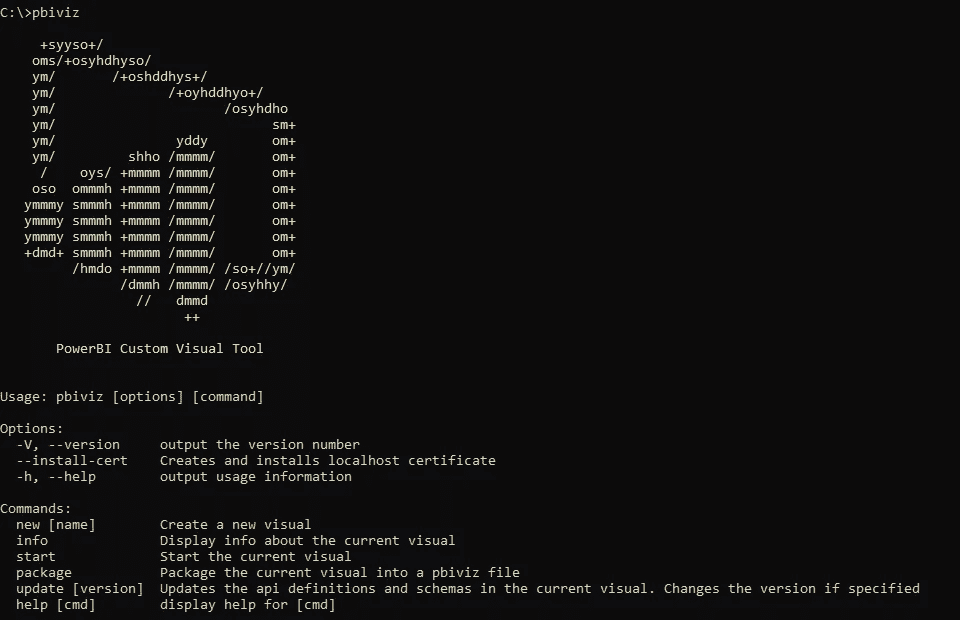
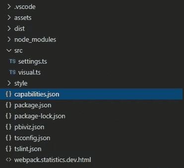
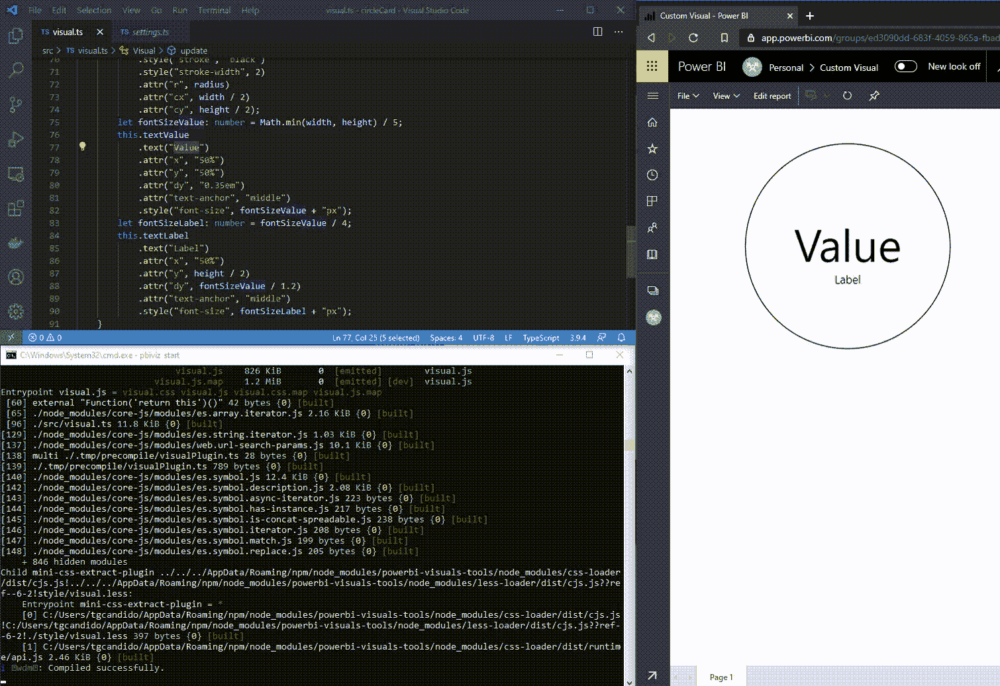

# 使用 React、Angular 或任何 web 框架真正定制 Power BI

> 原文：<https://towardsdatascience.com/truly-customizing-power-bi-with-react-angular-or-any-web-framework-5652b86a723e?source=collection_archive---------42----------------------->

## 通过开发“定制视觉”


凯利·西克玛在 [Unsplash](https://unsplash.com/s/photos/draw?utm_source=unsplash&utm_medium=referral&utm_content=creditCopyText) 上的照片

**随着组织中可用数据量的增长，以清晰直接的方式呈现数据变得越来越重要。**在这种背景下，[Power BI](https://powerbi.microsoft.com/)——微软的商业分析工具——获得了突出地位。

即使依靠足以满足大多数常规企业需求的集成组件和导航机制，该平台仍因其定制可能性而脱颖而出。

> 除了能够定制平台的内置组件之外，利用一些前端工程技术，还可以从头开始开发新的组件。

# 开发 Power BI 定制视觉效果

使用 [PowerBI 可视化工具](https://www.npmjs.com/package/powerbi-visuals-tools)包，或 *pbiviz* ，通过[自定义可视化工具](https://powerbi.microsoft.com/en-us/custom-visuals/)的编程来进行新组件的开发过程，可以使用[节点包管理器](https://www.npmjs.com/) — NPM 来安装。



Pbiviz 命令行界面

定制可视化的开发只需要传统 web 技术的知识，如 [Typescript](https://www.typescriptlang.org/) 、HTML 和 CSS，并且可以通过使用框架来增强，如 [React](https://reactjs.org/) 、 [Angular](https://angular.io/) 或 [D3.js](https://d3js.org/) 。

自定义视觉效果的设计是通过 CLI 工具生成的，该工具由上述 NPM 软件包提供。



基本上，web 开发人员只需要编写很少的代码——只有两个方法:构造函数和实现`IVisual`的类的更新。此外，同样由 CLI 工具生成的文件`capabilities.json`允许用户定义属性，例如颜色和字体，最终用户可以在 Power BI 中使用这些属性进行定制。

```
export class Visual implements IVisual {
 constructor(options: VisualConstructorOptions) {
   // code here 
 }
 public update(options: VisualUpdateOptions) {
    // ... and here
 }
}
```

由 ***pbiviz*** 提供的工具允许 web 开发人员对他的工作进行即时反馈，并通过热重新加载进行更新。全部由 Power BI 服务提供支持。



**pbviz** 客户端处理热重载并与 Power BI 服务轻松集成——不，WebUI 不是在 localhost 上运行的！

除了能够从您的报告和仪表板上所做的工作中受益，还可以在[应用程序源](https://appsource.microsoft.com/en-US/) —微软公司的应用程序商店中共享创作。在撰写本文时，已经有超过 260 种免费的自定义视觉效果可供使用。

我希望你喜欢阅读这篇文章。

*如果你有，可以考虑在*[*Twitter*](https://twitter.com/ogaihtcandido)*上关注我。*

谢谢你的时间。

保重，继续编码！