# 川普 VS 特鲁多:新冠肺炎危机期间谁更好地利用了推特

> 原文：<https://towardsdatascience.com/trump-vs-trudeau-who-makes-better-use-of-twitter-during-covid-19-crisis-16b360131e22?source=collection_archive---------68----------------------->

在新冠肺炎疫情期间，人们将他们的担忧、担忧、沮丧和爱带到社交媒体上与世界其他地方分享。Twitter 已经成为世界领导人与其支持者和追随者交流的官方渠道之一。

为了了解他们在忙什么，我们摘录了两位世界领导人唐纳德·川普(美国总统)和贾斯廷·特鲁多(加拿大总理)的推特。通过应用自然语言处理技术和潜在狄利克雷分配(LDA)算法，可以学习他们推文的主题。因此，我们可以看到危机期间他们在想什么。


由[克里斯·罗伯特](https://unsplash.com/@chris_robert)上[的 Unsplash](https://unsplash.com/license)

我们使用 Python 3.6 和以下软件包:

*   [TwitterScraper](https://github.com/taspinar/twitterscraper) ，一个抓取推文的 Python 脚本
*   NLTK(自然语言工具包)，一个用于文本处理的 NLP 包，例如停用词、标点符号、标记化、词条化等。
*   Gensim ，“生成相似”，一个流行的用于主题建模的 NLP 包
*   [潜在狄利克雷分配](https://en.wikipedia.org/wiki/Latent_Dirichlet_allocation) (LDA)，一种用于主题聚类/建模的生成式概率模型
*   [pyLDAvis](https://github.com/bmabey/pyLDAvis) ，一个交互式 LDA 可视化软件包，旨在帮助解释在文本数据语料库上训练的主题模型中的主题

# 数据采集

我们使用 [TwitterScraper](https://github.com/taspinar/twitterscraper) 从 Twitter handle @realDonaldTrump 和@JustineTrudeau 收集推文。仅收集 2020 年 3 月 1 日至 4 月 27 日发布的原创推文，不转发他人推文。只有英语。

```
**from** **twitterscraper** **import** query_tweets
**import** **datetime** 
**import** **pandas** **as** **pd**
**import** **re**, **pickle**, **os**
**import** **matplotlib.pyplot** **as** **plt**KEYWORD = 'realDonaldTrump'   *#Twitter handle* 
BEGINDATE = datetime.date(2020, 3, 1)
ENDDATE = datetime.date(2020, 4, 27)       
LANG = 'en'
TWEET_QUERY = 'from:'+ KEYWORD
ORIG_TWEET_FILE = r'./data/'+ KEYWORD+'/' + 'all_tweets'**if** os.path.isfile(ORIG_TWEET_FILE):        
    **with** open (ORIG_TWEET_FILE, 'rb') **as** fp:
        all_tweets_df = pickle.load(fp)
    print('Loaded tweet extracts from file**\n**')
**else**:
    print('Start scraping tweets from twitter.com...**\n**')
    *# https://twitter.com/search-advanced*
    list_of_tweets = query_tweets(TWEET_QUERY, 
                                  begindate=BEGINDATE, 
                                  enddate=ENDDATE, 
                                  lang=LANG)
    *# Convert list of tweets to DataFrame*
    all_tweets_df = pd.DataFrame([vars(x) **for** x **in** list_of_tweets])
    all_tweets_df.drop_duplicates(subset=['id'], inplace=**True**)
    all_tweets_df.reset_index(drop=**True**, inplace=**True**)
    *# Save tweet extracts to file*
    save_data_to_pickle(ORIG_TWEET_FILE, all_tweets_df)
    print ('Tweet extracts saved**\n**')
```

# 按周、日和小时统计的推文数量

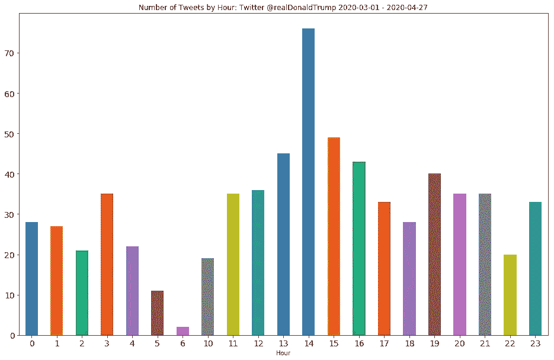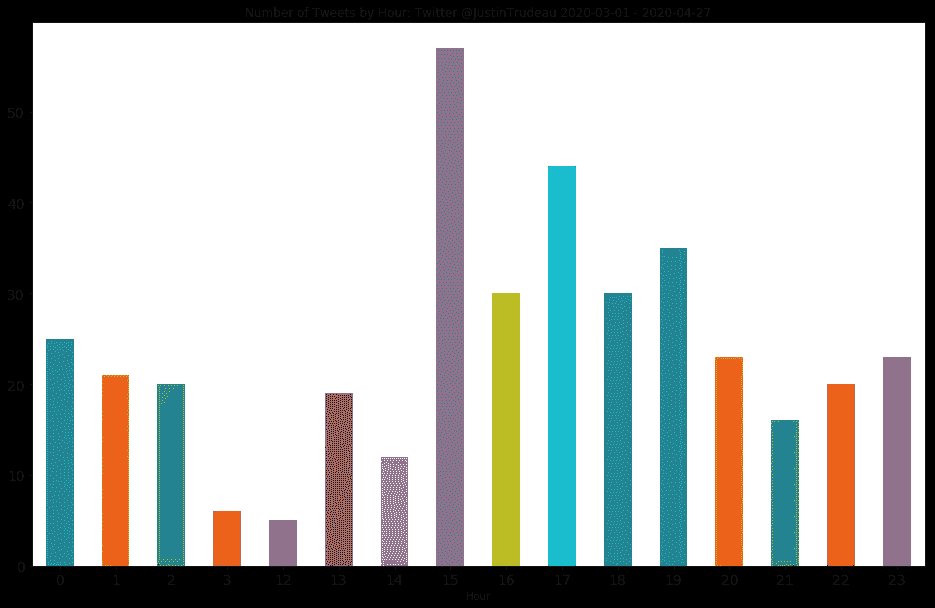

似乎特朗普喜欢在下午 1 点到 4 点发推文，而特鲁多喜欢在下午 3 点左右发推文。

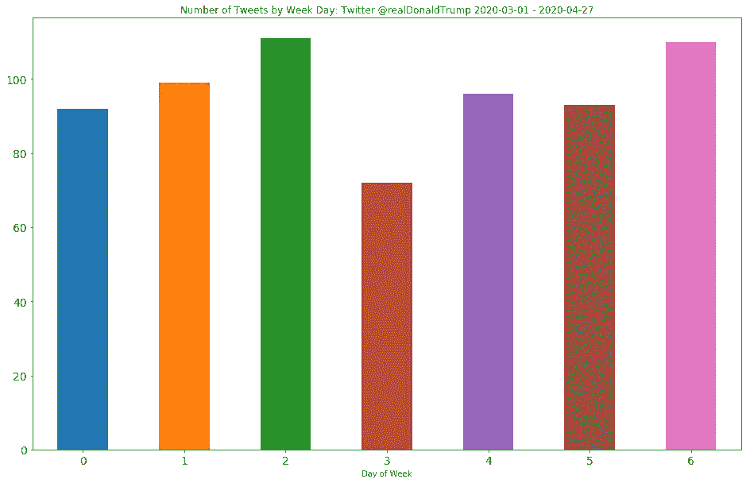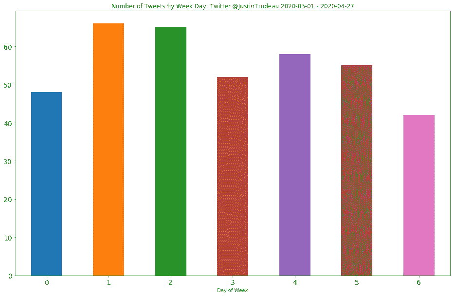

特朗普和特鲁多都在一周内定期发推特。特朗普似乎更喜欢在周日发推特！

# 推文长度

2020 年 3 月 1 日至 4 月 27 日，特朗普发了 673 条推文，平均一条推文 27 个字，特鲁多发了 386 条推文，平均一条推文 41 个字。特朗普有许多短推文(不到 10 个字)，也有一些长推文(超过 40 个字)。特鲁多的推文最多，有 40 到 50 个单词。

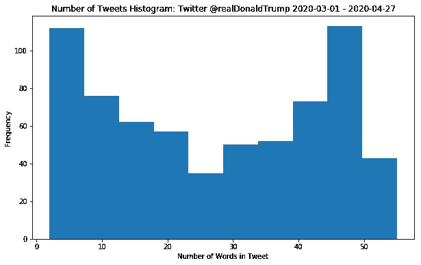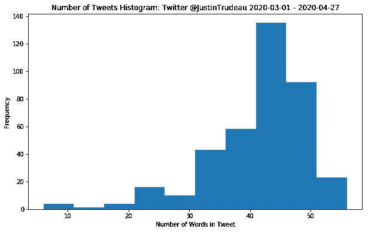

# 数据预处理

文本预处理是将文本从人类语言转换成机器可读格式以便进一步处理的过程。以下预处理步骤适用于我们的 Twitter 文本。

1.  将所有单词转换成小写
2.  删除非字母字符
3.  删除短单词(长度小于 3)
4.  标记化:将句子分解成单词
5.  词性标注:将单词按其语法类别分类的过程，目的是理解它们在句子中的作用，如动词、名词、形容词等。词性标注为词汇化提供了语法环境。
6.  词汇化:将一个单词转换成它的基本形式，例如`car, cars, car’s` 到`car`
7.  去掉常见的英语单词，如 a，the，of 等。，并删除对我们的分析没有什么价值的常用词，如 com、twitter、pic 等。

```
**import** **nltk**
**from** **nltk.corpus** **import** stopwords, wordnet 
**from** **nltk.stem** **import** WordNetLemmatizer

*# Additional stop words to be removed from text*
additional_stop_words=['twitter','com','pic','rt','via']

**def** get_wordnet_pos(word):
    *"""*
 *Map POS tag to first character lemmatize() accepts*
 *"""*
    tag = nltk.pos_tag([word])[0][1][0].upper()
    tag_dict = {"J": wordnet.ADJ,
                "N": wordnet.NOUN,
                "V": wordnet.VERB,
                "R": wordnet.ADV}

    **return** tag_dict.get(tag, wordnet.NOUN)

**def** text_cleanup(text): 
    *# Convert to lowercase*
    text_clean = text.lower()
    *# Remove non-alphabet*
    text_clean = re.sub(r'[^a-zA-Z]|(\w+:\/\/\S+)',' ', text_clean).split()    
    *# Remove short words (length < 3)*
    text_clean = [w **for** w **in** text_clean **if** len(w)>2]
    *# Lemmatize text with the appropriate POS tag*
    lemmatizer = WordNetLemmatizer()
    text_clean = [lemmatizer.lemmatize(w, get_wordnet_pos(w)) **for** w **in** text_clean]
    *# Filter out stop words in English* 
    stops = set(stopwords.words('english')).union(additional_stop_words)
    text_clean = [w **for** w **in** text_clean **if** w **not** **in** stops]

    **return** text_clean

cleaned_tweets_df = all_tweets_df.copy(deep=**True**)
*# parsing tweets* 
cleaned_tweets_df['token'] = [text_cleanup(x) **for** x **in** all_tweets_df['text']]     

print ('Tweets cleanup done')
```

我们还从文本中提取二元模型(成对的连续单词)。

```
**from** **nltk.util** **import** ngrams

**def** word_grams(words, min=1, max=2):
    word_list = []
    **for** n **in** range(min, max):
        **for** ngram **in** ngrams(words, n):
            word_list.append(' '.join(str(i) **for** i **in** ngram))
    **return** word_list

*# Generate bigram tokens*
cleaned_tweets_df['bigram_token'] = [word_grams(x, min=2, max=3) **for** 
                     x **in** cleaned_tweets_df['token']]
```

经过预处理后，我们的推文看起来像这样:

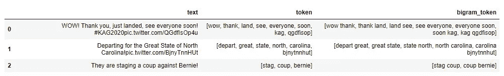

# 单词计数和单词云

我们使用二元模型进行单词计数和单词云，因为二元模型比单个单词提供了更有意义的见解。

```
# Convert series to list for word count
tweets_text = [word for one_tweet in cleaned_tweets_df['token'] for word in one_tweet]from collections import Countern_grams = list(ngrams(tweets_text, 2))
common_words = Counter(n_grams).most_common()
word_count = pd.DataFrame(data = common_words, columns=['word','frequency']) 
# Convert list to string
word_count['word'] = word_count['word'].apply(' '.join)# Plot word count graph
title = "Word Frequency: Twitter @{} {} - {}".format(KEYWORD, BEGINDATE, ENDDATE)
word_count.head(20).sort_values('frequency').plot.barh(x='word', y='frequency', title=title,figsize=(16,10), fontsize=16)
```

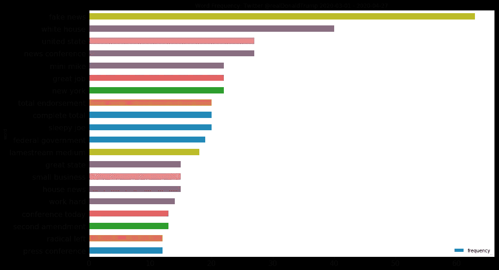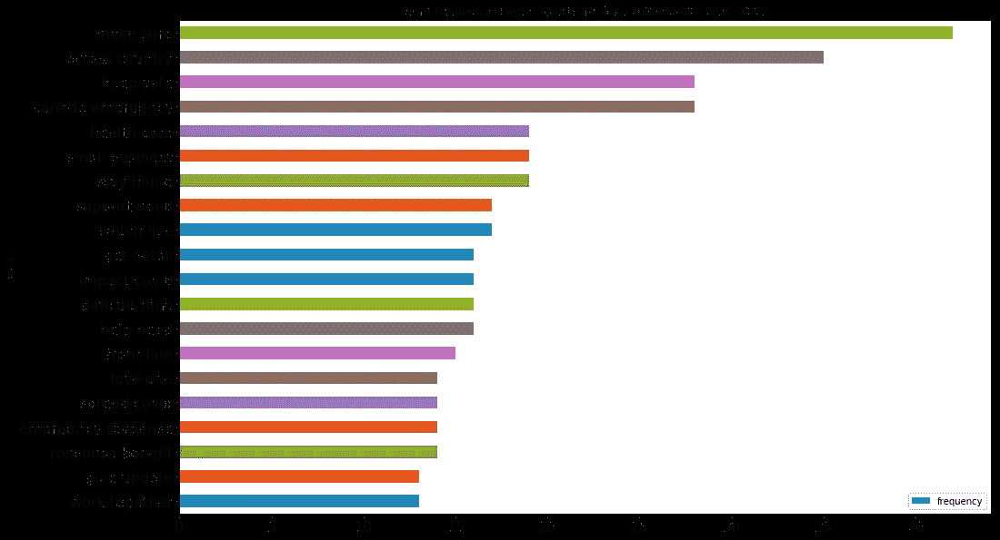

```
word_count.head(20)
```

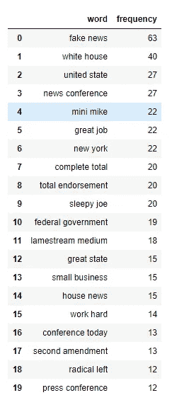

特朗普推文中最常见的前 5 个词是:
`**fake news
white house
united state
news conference
mini mik**e`

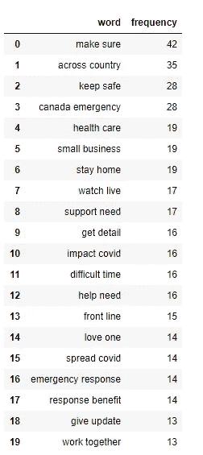

特鲁多推文中最常见的前 5 个词是:
`**make sure
across country
keep safe
canada emergency
health car**e`

以下是特朗普推文的词云:

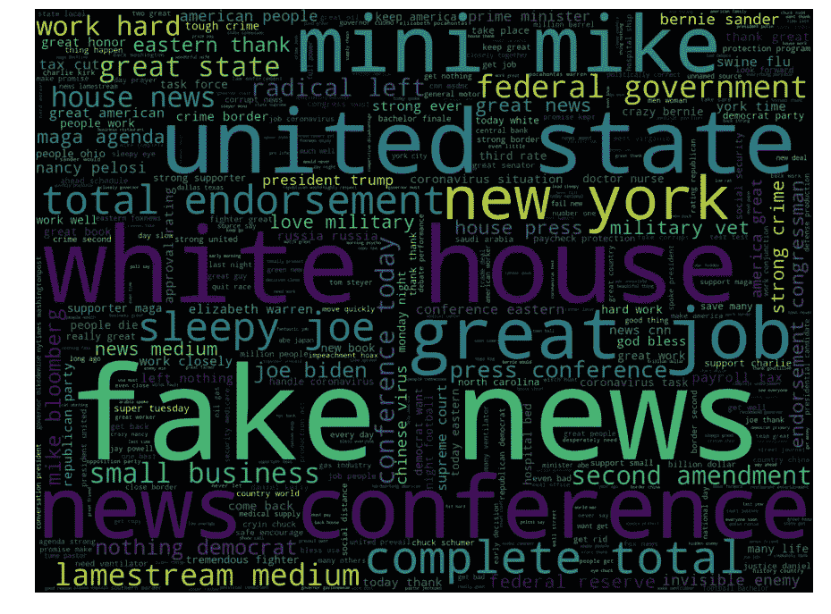

以下是特鲁多推文的词云:

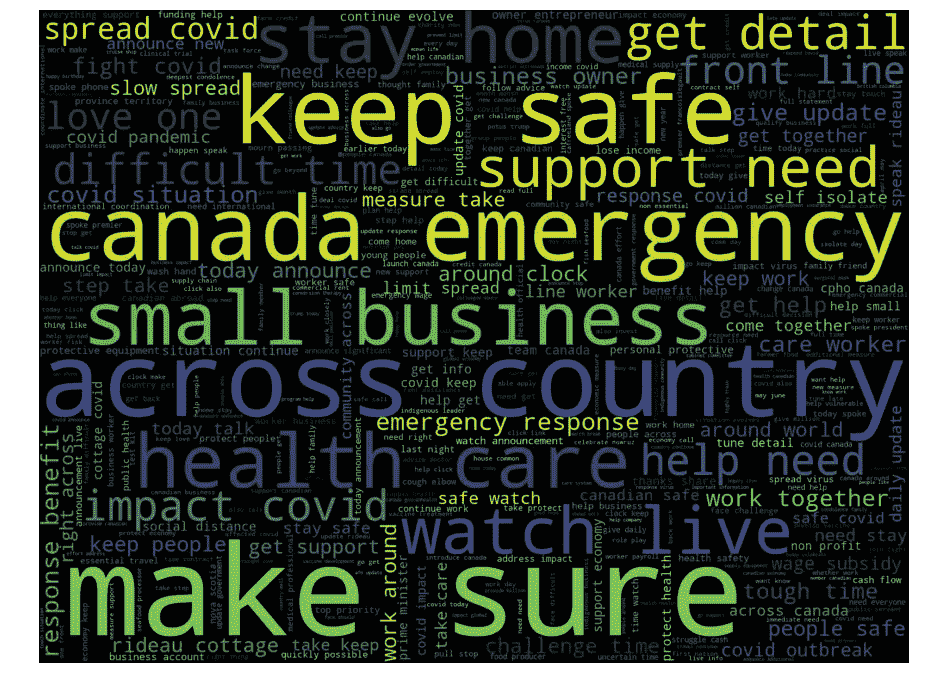

# 主题建模

主题建模是一种无监督的机器学习技术，广泛用于发现文档集合中的抽象主题。它认为每个文档由几个主题表示，每个主题由一组频繁出现的单词表示。例如，对于`cloud, rain, wind`的群集，我们可以知道相关联的主题可能与`weather`相关。

对于主题建模，我们使用 [LDA 算法](http://blog.echen.me/2011/08/22/introduction-to-latent-dirichlet-allocation/)，使用从我们的[预处理](https://ai-journey.com/2020/05/trump-and-trudeau-twitter-analysis-during-covid-19-crisis-part-1/)中获得的 unigrams 为每个 tweet 创建 TF-IDF 向量。

如何知道我们所学的题目是否最能代表原文？我们计算和测量一致性分数。

> 话题连贯性——意思是语义连贯性——是一种人类判断的质量，它取决于单词的语义。[ [用正则化的话题模型提高话题连贯性](https://papers.nips.cc/paper/4291-improving-topic-coherence-with-regularized-topic-models)

连贯性评分根据主题本身内高评分单词之间的语义相似度来衡量主题的可解释性。为了找出我们推文中的最佳主题数量，我们计算了不同数量主题的一致性分数。分数越高，主题的数量越符合文本。

选择大量能产生较高连贯分数的话题可以提供有意义和可解释的话题。更多的主题通常会提供更高的连贯分数，但意义却相当零散。

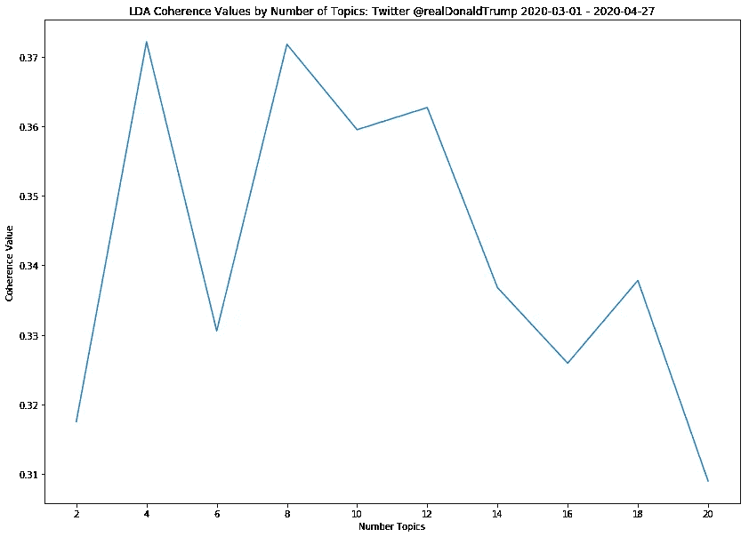

对于特朗普的推文，具有 8 个主题的 LDA 模型产生最高的一致性值。

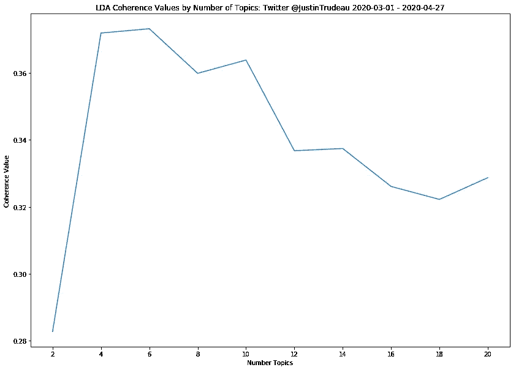

对于特鲁多的推文，具有 6 个主题的 LDA 模型产生最高的一致性值。

# 话题生成

```
top_n_keywords = 4
topics_pd = pd.DataFrame() 
# Label topics using top 4 keywords of the topic
for idx, topic in lda_model.print_topics():
 topic_desc = ‘-’.join([x[0] for x in lda_model.show_topic(idx,top_n_keywords)])
 topics_pd = topics_pd.append(pd.Series([idx,topic_desc, topic]), ignore_index=True) 
topics_pd.columns = [‘topic_num’,’topic_desc’,’topic_keywords’]
topics_pd
```

我们为特朗普的推文生成以下 8 个主题。`topic_keywords`显示热门关键词及其对主题的重要性(权重)值。我们将前 4 个单词连接起来作为主题的标签，希望它能代表主题的含义。例如，`conference-white-news-house`可以解释为与白宫新闻发布会相关的话题。`thank-deal-great-call`可能与向某人道谢、打了一个很棒的电话或做了一笔大生意有关。

```
topic_num                    topic_desc   topic_keywords0.0        federal-government-full-test    0.066*"federal" + 0.059*"government" + 0.037*"full" + 0.033*"test" + 0.030*"general" + 0.026*"bill" + 0.023*"hospital" + 0.022*"low" + 0.022*"know" + 0.021*"continue"  

1.0        conference-white-news-house     0.089*"conference" + 0.085*"white" + 0.082*"news" + 0.081*"house" + 0.072*"eastern" + 0.056*"today" + 0.039*"press" + 0.036*"million" + 0.032*"thank" + 0.031*"world"       

2.0        thank-deal-great-call           0.285*"thank" + 0.053*"deal" + 0.052*"great" + 0.038*"call" + 0.035*"company" + 0.026*"act" + 0.025*"leader" + 0.024*"together" + 0.021*"go" + 0.021*"work"       

3.0        joe-bernie-mike-sleepy          0.060*"joe" + 0.057*"bernie" + 0.056*"mike" + 0.053*"sleepy" + 0.049*"mini" + 0.036*"biden" + 0.033*"long" + 0.032*"democrat" + 0.030*"foxnews" + 0.027*"also"    

4.0        fake-news-state-people          0.022*"fake" + 0.020*"news" + 0.017*"state" + 0.017*"people" + 0.017*"get" + 0.017*"country" + 0.017*"united" + 0.017*"say" + 0.016*"time" + 0.015*"medium"    

5.0        keep-total-complete-safe        0.035*"keep" + 0.034*"total" + 0.034*"complete" + 0.031*"safe" + 0.029*"endorsement" + 0.029*"small" + 0.026*"strong" + 0.026*"business" + 0.025*"great" + 0.024*"amendment" 6.0        great-day-book-history          0.107*"great" + 0.043*"day" + 0.039*"book" + 0.038*"history" + 0.032*"wonderful" + 0.031*"hard" + 0.031*"end" + 0.029*"national" + 0.028*"american" + 0.027*"situation"  

7.0        kag-thank-ventilator-need       0.162*"kag" + 0.093*"thank" + 0.067*"ventilator" + 0.042*"need" + 0.038*"spoke" + 0.032*"good" + 0.032*"help" + 0.028*"every" + 0.022*"deliver" + 0.018*"work"
```

以下是从特鲁多的推文中了解到的 6 个话题。例如，`business-small-help-owner`很可能与向小企业主提供帮助有关。

```
topic_num topic_desc topic_keywords0 0.0 business-small-help-owner 0.054*"business" + 0.034*"small" + 0.026*"help" + 0.025*"owner" + 0.024*"support" + 0.023*"announce" + 0.020*"non" + 0.020*"detail" + 0.019*"announcement" + 0.019*"emergency"1 1.0 spoke-international-talk-spread 0.040*"spoke" + 0.034*"international" + 0.031*"talk" + 0.030*"spread" + 0.029*"call" + 0.029*"impact" + 0.029*"today" + 0.028*"covid" + 0.026*"leader" + 0.025*"economy"2 2.0 benefit-test-lose-apply 0.051*"benefit" + 0.036*"test" + 0.034*"lose" + 0.033*"apply" + 0.033*"emergency" + 0.029*"month" + 0.028*"receive" + 0.025*"response" + 0.025*"year" + 0.023*"invest"3 3.0 make-work-need-sure 0.024*"make" + 0.022*"work" + 0.020*"need" + 0.018*"sure" + 0.018*"continue" + 0.018*"country" + 0.018*"keep" + 0.017*"health" + 0.016*"home" + 0.016*"safe"4 4.0 celebrate-hope-life-around 0.053*"celebrate" + 0.042*"hope" + 0.038*"life" + 0.037*"around" + 0.036*"clock" + 0.031*"please" + 0.030*"full" + 0.026*"year" + 0.022*"late" + 0.022*"world"5 5.0 one-update-watch-family 0.026*"one" + 0.024*"update" + 0.023*"watch" + 0.023*"family" + 0.022*"time" + 0.021*"friend" + 0.021*"kid" + 0.019*"give" + 0.019*"great" + 0.018*"live"
```

我们将这些主题应用到推文中，并分配概率最高的主题。以下是特朗普的一些可能的话题。

> 他们正在对伯尼发动政变！

```
Topic: joe-bernie-mike-sleepy
Probability: 0.544840
Token: [stag, coup, bernie]
```

> 米歇尔正在明尼苏达州竞选国会议员。米歇尔将保护未出生的孩子，坚决打击犯罪&边境，减税，你的#2A，热爱我们的军队，退伍军人，&将支持我们伟大的农民。米歇尔得到了我的全力支持！[https://secure . winred . com/MichelleFischbach/website-捐赠](https://secure.winred.com/MichelleFischbach/website-donations) …

```
Topic: keep-total-complete-safe
Probability: 0.808480
Token: [michelle, fischbachmn, run, congress, minnesota, michelle, protect, unborn, strong, crime, border, cut, tax, love, military, vet, stand, great, farmer, michelle, complete, total, endorsement]
```

> 正文: [@FoxNews](http://twitter.com/FoxNews) 正在努力推动激进左派，无为民主党。不像他们的竞争对手， [@CNN](http://twitter.com/CNN) & MSDNC(康卡斯特)，公平&平衡。他们什么时候才能明白？激进左派甚至从未允许@FoxNews 参与他们的低收视率辩论！

```
Topic: fake-news-state-people
Probability: 0.802032
Token: [foxnews, work, hard, push, radical, left, nothing, democrat, want, unlike, competitor, cnn, msdnc, comcast, fair, balance, ever, learn, radical, left, never, even, give, foxnews, permission, partake, low, rat, debate]
```

以下是特鲁多的一些可能的话题。

> 长期以来，矿业一直是加拿大经济的基石。现在，在我们向更清洁的未来过渡的过程中，它比以往任何时候都更加重要。今天在#PDAC2020 上，我们谈到了加拿大成为世界上最清洁的金属和 minerals.pic.twitter.com/cs27PXMMmD 供应商的机会

```
Topic: make-work-need-sure
Probability: 0.876077
Token: [mining, long, building, block, canadian, economy, ever, important, role, play, transition, cleaner, future, today, pdac, spoke, opportunity, canada, world, cleanest, supplier, metal, mineral, pxmmmd]
```

> 哈维尔·佩雷斯·德奎利亚尔一生致力于促进普遍人权&建设一个更加和平的世界，他的遗产将代代相传。我向他的家人和所有那些其生活受到他杰出工作影响的人致以最深切的慰问。

```
Topic: celebrate-hope-life-around
Probability: 0.791011
Token: [javier, rez, llar, dedicate, life, promote, universal, human, right, building, peaceful, world, legacy, live, generation, deepest, condolence, family, whose, life, touch, remarkable, work]
```

> 我们的首要任务是保证加拿大人的安全。随着新冠肺炎病毒在世界各地的传播，我们正在建立一个新的内阁委员会，以我们一直在做的工作为基础，预防和限制病毒在加拿大的传播，并监测其经济影响。https://pm . GC . ca/en/news/news-releases/2020/03/04/prime-minister-creates-Committee-新冠肺炎…

```
Topic: spoke-international-talk-spread
Probability: 0.612871
Token: [top, priority, keep, canadian, safe, covid, spread, around, world, create, new, cabinet, committee, build, work, prevent, limit, spread, virus, canada, monitor, economic, impact]
```

下图是 2020 年 3 月 1 日至 4 月 27 日，特朗普不同话题的推文比例。话题`fake-news-state-people`的推文占 46%。

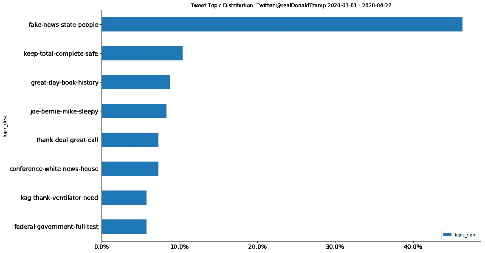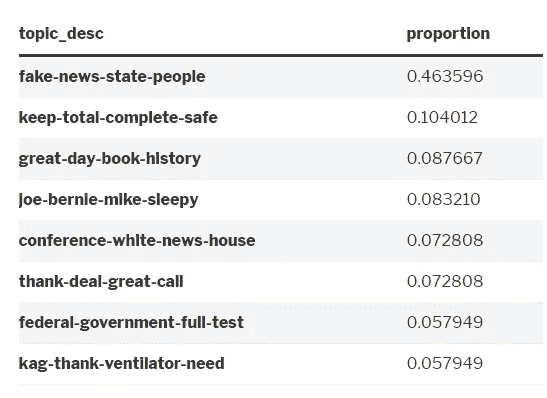

下图显示了特鲁多不同话题的推文比例。话题`make-work-need-sure`的推文占 38%。

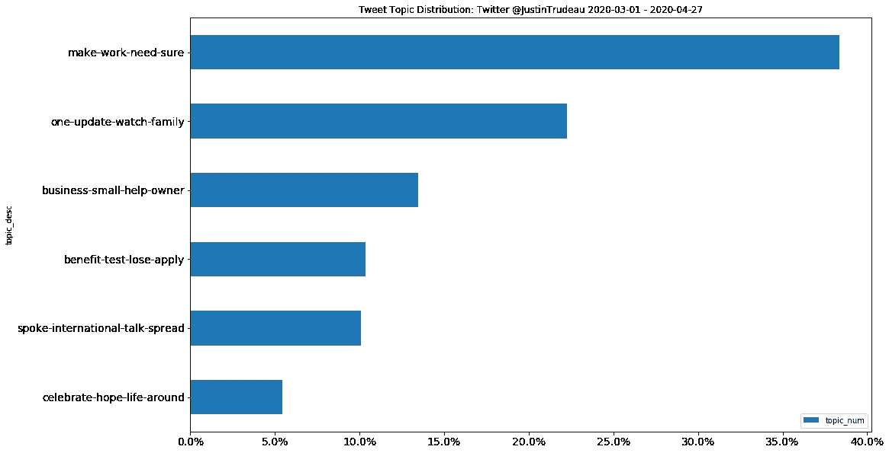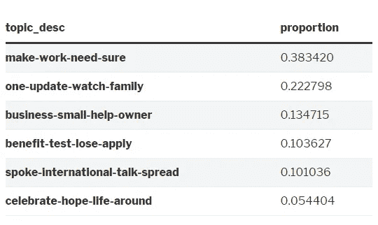

# 主题可视化

我们使用 [pyLDAvis](https://github.com/bmabey/pyLDAvis) ，一个交互式 LDA 可视化包，来绘制所有生成的主题及其关键字。这里是[特朗普推文话题](https://ai-journey.com/wp-content/uploads/2020/05/lda_Trump.html)的链接，以及[特鲁多推文话题](https://ai-journey.com/wp-content/uploads/2020/05/lda_Trudeau.html)的链接。

左边的每个气泡代表一个主题。气泡的大小代表主题的流行程度。气泡之间的距离反映了主题之间的相似性。两个圈越近，话题越相似。

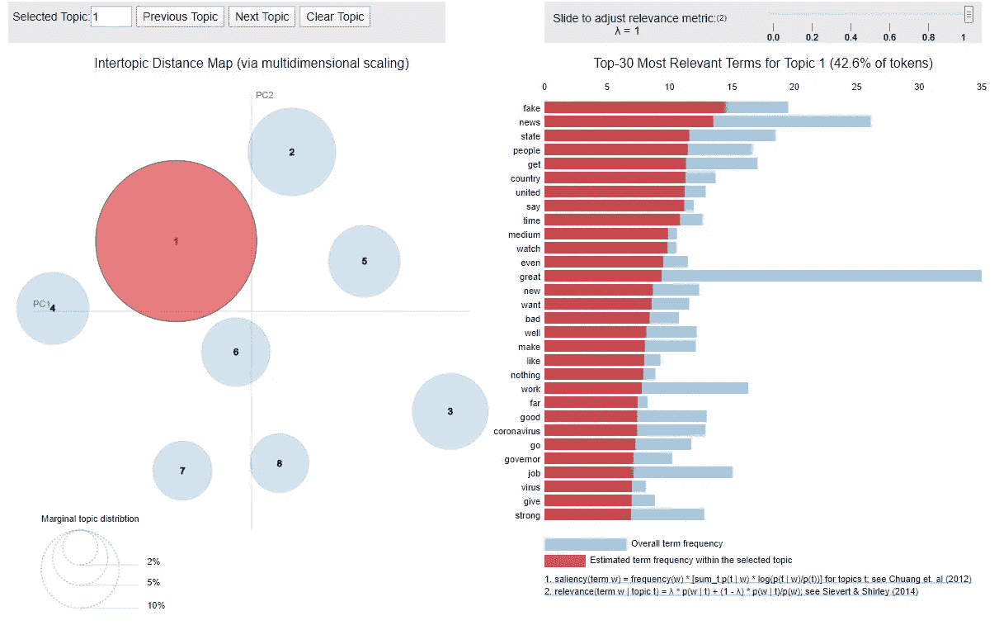

# 结束语

为了了解我们的世界领导人如何处理新冠肺炎危机，并与他们的追随者沟通，我们转向 Twitter，搜集了过去两个月唐纳德·特朗普和贾斯廷·特鲁多的推文。我们生成了词云来显示出现最多的词，通过开发不同主题数量的 LDA 模型来学习他们推文的主题。

在危机时刻，你认为谁能更好地利用 Twitter 并与他的人民沟通？

所有代码都可以在 [GitHub](https://github.com/wangpengcn/Trump-And-Trudeau-Twitter-Analysis-During-COVID-19-Crisis) 上找到。

感谢阅读。如果您有任何反馈，请在下面留言，通过我的博客【https://ai-journey.com/[联系我](https://ai-journey.com/)，或者通过 [LinkedIn](https://www.linkedin.com/in/peng-wang-cpa/) 给我发消息。