# 信任欧盟始于国内

> 原文：<https://towardsdatascience.com/trusting-the-eu-beings-at-home-bf49c022be83?source=collection_archive---------73----------------------->

## 建立分类模型预测哪些选民信任欧盟议会

马库斯·斯皮斯克在 [Unsplash](https://unsplash.com/) 上的照片

# 介绍

在这篇文章中，我将使用 2019 年欧洲选举研究(EES)选民研究数据和调查是否有可能建立一个可以准确预测一个选民是否信任欧盟议会的机器学习模型。

我的分析将按以下方式组织。首先，我将介绍我的数据来源——EES 2019 选民研究。接下来，我将描述在给定信息的情况下，问题可以被公式化的各种方式。选择了最合适的策略后，我将讨论优化的 XGBoost 模型预测结果的能力。为了理解是哪些特征在驱动它的决策，我将应用 TreeSHAP。最后，我将执行特征选择和规则提取，以得到一个更简单，但仍然大致准确的框架。

# 主要亮点

如果我们把选民分成两类:

*   推动者(当被问及对欧盟议会的信任程度时，回答“信任”或“非常信任”的人；第 1 组)
*   怀疑者(回答“既不信任也不不信任”、“不信任”、“不信任很多”的人)；第 0 组)

可以得出以下结论:

*   一个经过训练和调整的 XGBoost **算法可以以 83%的准确率将投票者正确分组。**
*   驱动模型决策的最重要因素是选民是否信任他们自己的国会。这甚至比受访者对欧洲一体化的看法或他们对自己国家成为欧盟成员的好处的看法更重要。
*   一条**规则**规定**如果有人公开** **不信任他们的国民议会，他们应该被归类为怀疑者，在 76%** **的情况下都是对的。**

# 数据

EES 2019 年选民研究(Schmitt 等人，2019 年)是一项大规模调查，该调查在 2019 年 5 月询问了所有 27 个欧盟成员国以及英国的公民关于他们的政治偏好。该调查包括诸如“在欧洲议会选举中，你投了哪个政党的票？”或者“你怎么看待国家对经济的调控？”混合了人口统计信息。总的来说，我用 Python 清理和处理的原始 Stata 数据文件包含 115 列和 26000 多行。

该表是一个非常丰富的资源，但是，对于建模来说，并不容易使用。它缺乏详细的数据字典，包含希腊语或俄语等语言所需的利基编码，以及以大多数机器学习方法难以使用的形式保存一些信息。

例如，关于最后一点，在同一个单列中，人们可以找到德国、荷兰和意大利选民对本国政党的评分。这是一个主要障碍，因为将这种数据输入基于树的模型或逻辑回归会导致模型隐含地认为与法国人关联的值 3 与西班牙人分配的值 3 相同，而实际上它们指的是不同的当事人。

为了解决我的研究问题，接下来的问题被选为我的目标变量——“你在多大程度上信任欧洲议会？”。它允许受访者从 1 到 5 中选择数字作为答案，其中 1 代表“是的，完全”，5 表示“不，一点也不”。选民可以选择“我不知道”，这也反映在数据中。

关于数据管理的更多细节，请查看我在 GitHub 上的代码，链接在文章底部。这里值得一提的最后一点是，在这个过程中，任何丢失的值都不会被修改，除非下面另有说明。

# **建模方法**

我决定对数据应用 XGBoost，这是一种最先进的基于树的算法，被从业者和数据科学爱好者广泛使用。我的结果是在谷歌实验室用 Python 生成的。

作为研究的基础，我训练了 4 个不同的模型。

*   模型 A: 5 点量表结果——多类分类(将目标变量作为给定变量)
*   模型 B: 3 点量表结果——多类分类(“我不信任”和“我根本不信任”回答被合并到一个桶中；“我信任”和“我非常信任”回答也成为一个类别)
*   模型 C:二元分类——“我相信”和“我非常相信”的回答成为一类，其余的回答被分配到另一类
*   模型 D:二元分类——“我不信任”和“我根本不信任”的回答被视为一类，其余的回答被视为另一组

这些分类器的混淆矩阵如下。

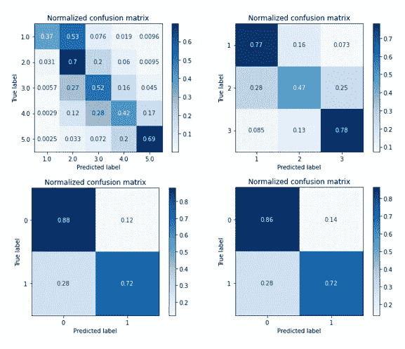

混淆矩阵:模型 A(左上)、模型 B(右上)、模型 C(左下)、模型 D(右下)

首先，正如人们注意到的，A 和 B 必须处理非二进制结果，结果表现不佳。例如，模型 B 试图分配“既不信任，也不不信任”的条目比随机投掷硬币更糟糕。此外，只有 37%的 1s 被模型 a 正确预测。

鉴于这样的结果，我决定放弃这些，把注意力放在模型 C 和 d 上。对它们来说，结果看起来很有希望。再次考虑了问题陈述的核心，我最终选择了模型 C 作为合适的方法。

这一模型让我们能够区分两个群体，我将称之为倡导者(1 类)和怀疑者(0 类)，后者包括那些“既不信任也不不信任”欧盟议会的人。由于这一点，我们可以将分类定义为在那些公开、明确信任泛欧机构的人和那些不信任泛欧机构的人之间划定界限，这比模型 d 更好地反映了问题陈述的意图。

此外，我还调查了模型 c 的精度、召回率或准确度等其他指标。如下图所示，它们看起来也不错。例如，如果算法预测 a 投票是发起人，它将在四分之三的情况下是正确的。总体绩效指标，如宏观 F1 分数接近 80%，显示了更好的前景。

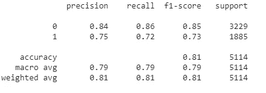

型号 C 的分类报告

下一步，我使用 hyperopt 对模型 C 进行了调优，hyperopt 是一个 Python 库，可以用来帮助选择最佳的超参数。这导致了接下来两张图中所显示的性能。

模型 C 调优后的混淆矩阵

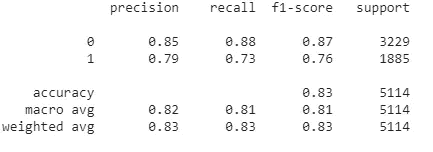

C 型调优后的分类报告

总结我这部分的分析，确实有可能建立一个好的预测模型，能够正确地发现信任欧盟议会的选民。该分类器对怀疑者的准确率和召回率都可以达到 85%以上，对促进者的准确率和召回率可以达到 73%以上。

# 模型解释

作为下一步，有人可能会问——“那么，哪些因素对我们的模型最重要？”。我们可以使用 TreeSHAP (Lundberg 等人，2020 年)来发现这一点，这是一种解释基于树的模型的博弈论方法。接下来的两张图表将为我们解答这个问题。

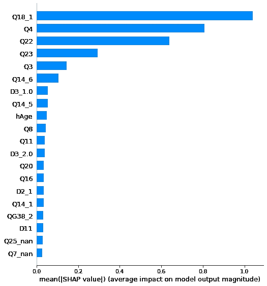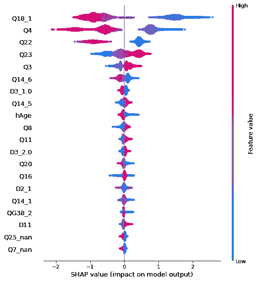

左图:模型所用要素的平均重要性，右图:SHAP 值在整个数据集中的分布

根据左图，我们可以清楚地看到，有 4 个特征主要驱动模型的预测。它们是 Q18_1、Q4、Q22 和 Q23，其含义如下。

*   Q18_1 —“你信任[国家议会]吗？” *(5 分制，从“是，完全— 1”到“不是，完全不是—5”)*
*   问题 4——“您对欧盟的民主运作方式非常满意、相当满意、不太满意还是完全不满意？”*(非常/一般/不太/完全不知道)*
*   问题 22——“一般而言，您认为[国家]欧盟成员资格..?"*(好/坏/都不是/不知道)*
*   问题 23——“有人说欧洲统一应该进一步推进。其他人说它已经走得太远了。你有什么看法？” *(11 分制，从“统一已经走得太远— 0”到“统一应该再推进一步—10”)*

如果我们看看上面给出的 SHAP 值，看右边的图表，很有趣地看到，对于上面提到的前 3 个变量，两组之间的差异如此明显。那些不信任本国议会、对欧盟的民主不满意、并声称本国的欧盟成员资格对自己有负面影响的人，属于怀疑者之列。促销员则相反。关于欧洲统一的最后一个问题解释力较弱，集群也不那么明显。

虽然 Q4、Q22、Q23 和结果之间的关系似乎很直观，但对国家机构的信任程度是关键预测因素的事实是一个相当令人惊讶的见解。它强调了信任地方政府和中央政府之间的紧密联系。可以假设，对欧盟议会缺乏信心的问题是某些人对政治和公共部门普遍缺乏信心的结果，而不是一个独立的问题，因为问题源于欧盟的性质或其政策。

除此之外，如下图所示，Q18_1 和其他变量之间的相互作用似乎很小。例如，SHAP 值的大小表明了模型的输出是如何被推动的，并没有揭示出对国家机构缺乏信心会影响“脱离者”/“留在者”与信任欧盟议会之间的联系。

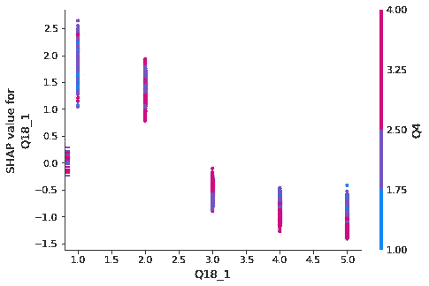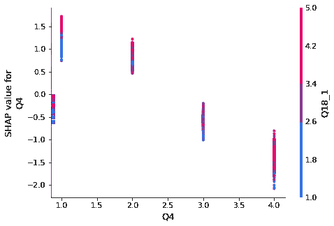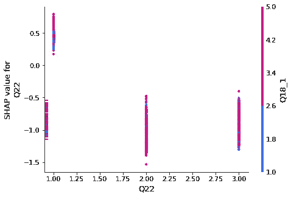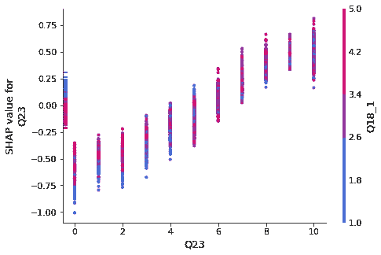

突出顶部特征之间关系的 SHAP 依赖图

XGBoost 提供的基尼系数重要性细节通常被用作衡量不同重要性的指标，也与 SHAP 产出大体一致。

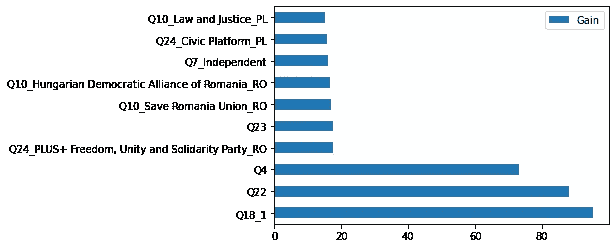

与我们的模型处理的不同特征相关的增益

类似地，我们可以用 scikit-learn 的部分相关性图(PDP)验证 SHAP 相关性图显示的关系。比较两者，我们看不出有任何重大分歧。

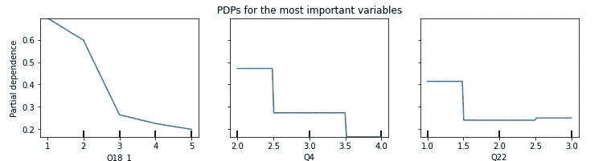

3 个最重要功能的 PDP

当地的解释怎么样？总体重要性分数告诉我们的故事和我们在单个预测中看到的故事是一样的吗？为了仔细研究这一点，让我们来看看 3 个任意挑选的选民，以及专门用 SHAP 为他们做出的预测。

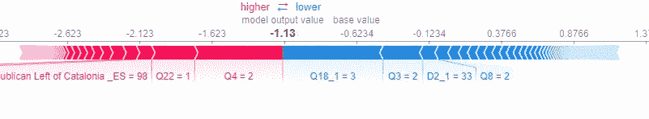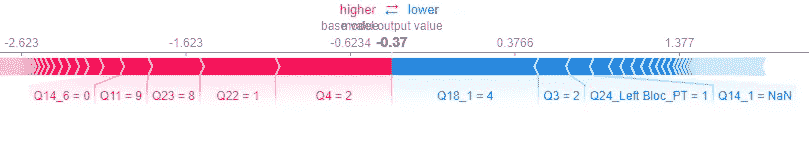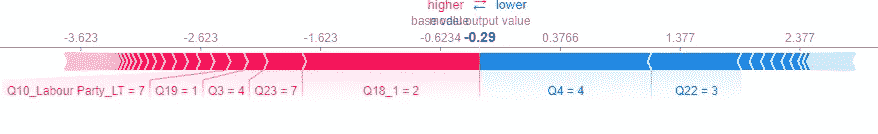

针对个人选民的 SHAP 势力阴谋

如我们所见，对于所有 3 个人，Q18_1、Q4、Q22 和 Q23 是最有影响力的因素。例如，在第一个图中，回答者对 Q18_1 的回答(在他们的例子中，“既不信任也不不不信任”)使模型的输出下降最多，而对欧盟的民主状况相当满意使其上升。给定这些信息，以及我们所知道的关于投票者的其他一切，该模型的输出值(以对数优势为单位)为-1.13，这可以转换为成为推动者的大约概率为 24%。

# 模型简化

作为我分析的最后一步，我将尝试制作一个更简单的模型，它只需要几个独立变量就可以提供令人满意的性能。

让我们假设我们的目标是得到一个达到 80%准确率的东西。

在进行特征选择之后，事实证明，仅考虑前 4 个特征(即 Q18_1、Q4、Q22、Q23)的模型可以表现得非常好！它尤其擅长预测持怀疑态度的选民，详情如下。

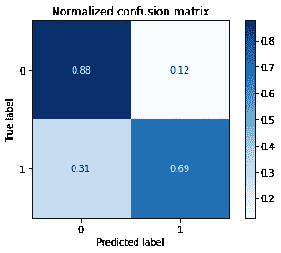

简单模型的混淆矩阵

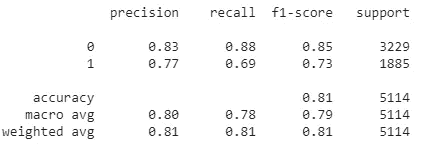

简单模型的分类报告

我们能再简化一下吗？应用一种称为 defragTrees (Hara 和 Hayashito，2018)的规则提取方法，我们的模型揭示了我们确实可以进一步提取它！

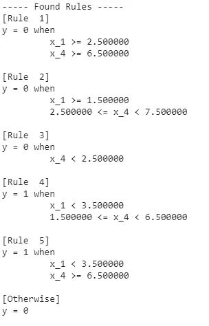

运行可解释性算法产生了大量的规则，如左图所示，这些规则可以总结如下。

*   如果被调查者在 Q23 中的得分大于 1，在 Q18_1 中的得分小于 4，他们就是推广者。
*   否则，他们就是怀疑者。

如果这个系统被应用到整个测试集，缺失值被特征的中间值代替，我们将在 77%的情况下是正确的。

此外，额外的分析表明，在整个数据集中，将 Q18_1 的答案小于 4 的每个人分类为促进者，而将其余的回答者分类为怀疑者，会导致惊人准确的结果。使用这个基于信任级别的简单规则，我们可以正确地检测 76%的启动子。此外，当这个原则预测到一个怀疑者时，它有 79%的几率是正确的。

# 限制

和所有数据驱动的研究一样，我们需要非常小心我们的方法建立在什么样的假设之上。

首先，正如 Gosiewska 和 Biecek (2019)所解释的，使用 SHAP 评估全球重要性可能会导致虚假的结果，因为分析中完全忽略了相互作用的影响。换句话说，我们可能高估了一些特征的重要性，因为它们与真正重要的特征相关。

其次，考虑到用于模型估计和测试预测的数据比例，精确的性能数据可能会略有变化。所报告的精度或召回分数应该被视为在数据集的上下文中保持的相当准确但不完美的估计。

第三，我们必须记住，相关性并不意味着因果关系。揭示驱动我们模型的关系可以带来有趣的见解。然而，这些只能在预测的背景下理解，而不是黄金标准的统计推断。

最后，我对“我不知道”答案的编码处理只是在调查数据中处理这种回答的一种方法。更有力的研究将考虑其他方法的利弊，选择最合适的方法。

# 参考

南 Hara，K. Hayashi，[使树集合可解释:贝叶斯模型选择方法](http://proceedings.mlr.press/v84/hara18a.html)。《第 21 届人工智能与统计国际会议论文集》(AISTATS'18)，第 77–85 页，2018 年。

Gosiewska，a .和 Biecek，p .，[不要相信加法解释](https://arxiv.org/abs/1903.11420)，arXiv，2019。

Lundberg，S.M .，Erion，g .，Chen，h .等【从局部解释到全球理解用可解释的人工智能研究树木】。*自然机器智能* **2，**56–67(2020)。[https://doi.org/10.1038/s42256-019-0138-9](https://doi.org/10.1038/s42256-019-0138-9)

施米特、赫尔曼、霍波特、萨拉 B、范德布鲁格、沃特和波帕、塞巴斯蒂安 A (2019) [*欧洲议会选举研究 2019，选民研究*](http://europeanelectionstudies.net/european-election-studies/ees-2019-study/voter-study-2019) *。*

**GitHub 链接—代码和更多解释:**

[https://github.com/DawidGalarowicz/EUParlTrust](https://github.com/DawidGalarowicz/EUParlTrust)