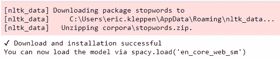
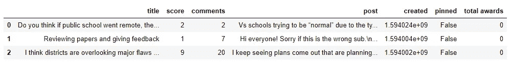
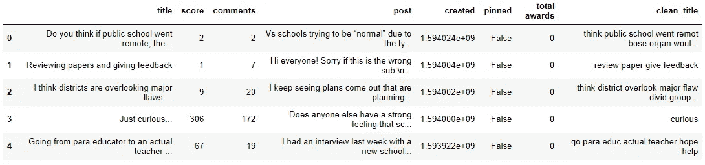
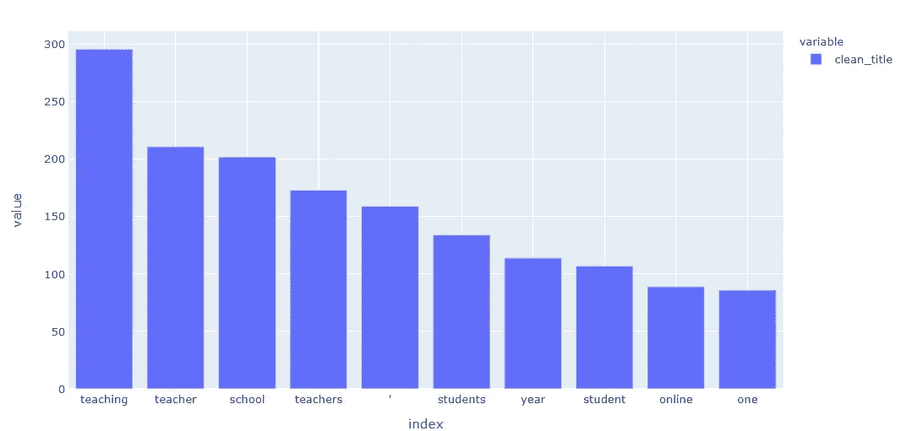
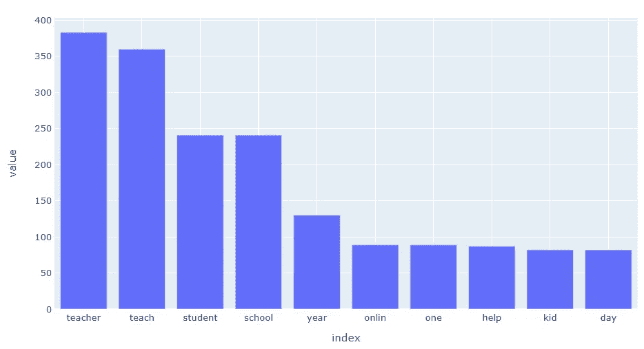
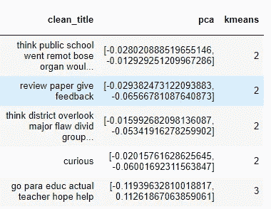
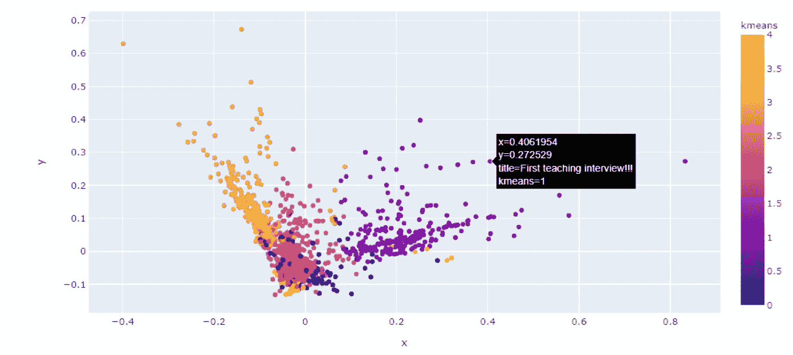

# 试试 TextHero:清理和分析 Pandas 中文本的绝对最简单的方法

> 原文：<https://towardsdatascience.com/try-texthero-the-absolute-simplest-way-to-clean-and-analyze-text-in-pandas-6db86ed14272?source=collection_archive---------16----------------------->

## 自然语言处理(NLP)让 Python 变得简单


加布里埃尔·巴西诺在 [Unsplash](https://unsplash.com?utm_source=medium&utm_medium=referral) 上的照片

# 简化的自然语言处理

我一直在寻找新的工具来帮助我简化自然语言处理管道，所以当我偶然发现一个展示 Texthero 功能的视频短片时，我知道我必须马上尝试一下。Texthero 被设计成一个 Pandas 包装器，因此它使得预处理和分析基于文本的 Pandas 系列变得前所未有的容易。我立即调出文档，打开笔记本，下载了几千条 Reddit 线程进行分析，以测试新的 lib。

**注**:text hero 库还在测试中！可能会有错误，管道可能会改变。我发现了 wordcloud 功能中的一个 bug，并报告了它。它应该在即将到来的更新中得到修复！

# Texthero 概述

在处理代码时，我会更仔细地研究这些，但为了快速概述，Texthero 分为四个功能模块:

## [预处理](https://texthero.org/docs/api-preprocessing)

*预处理*模块是关于高效清理基于文本的熊猫系列。它主要是在幕后使用[正则表达式(regex)](https://docs.python.org/3/library/re.html) 。

## [NLP](https://texthero.org/docs/api-nlp)

NLP 模块包含一些常见的 NLP 任务，比如命名实体识别和名词块。它正在使用引擎盖下的[空间](https://spacy.io/)。

## [代表权](https://texthero.org/docs/api-representation)

*表示*模块用于使用不同的算法创建单词向量。它包括像主成分分析和 kMeans 这样的东西。它使用 [scikit-learn for TF-IDF 和 Count](https://scikit-learn.org/stable/user_guide.html) ，并从语言模型预先计算加载嵌入。

## [可视化](https://texthero.org/docs/api-visualization)

*可视化*模块用于可视化散点图或生成文字云。这个模块目前只有几个功能，并在引擎盖下使用了 [Plotly](https://plotly.com/python/plotly-fundamentals/) 和 WordCloud。

查看文档以获得完整的特性列表！

[](https://texthero.org/) [## Texthero 文本预处理，从零到英雄的表示和可视化。

### 从零到英雄的文本预处理、表示和可视化。

从零到 hero.texthero.org 的文本预处理、表示和可视化](https://texthero.org/) 

# 依赖性和数据

尽管使用 pip 安装很容易，但由于熊猫版本的问题，当我试图在我的有 [Apache Airflow](https://github.com/nitred/airflow-pandas) 的环境中安装它时，我遇到了一个冲突。此外，它需要一段时间来安装在一个新的环境中，因为它在后端使用了如此多的其他库。第一次导入后，它还会下载一些额外的东西。

对于数据集，我使用 [PRAW](https://praw.readthedocs.io/en/latest/) 从 [Reddit](http://www.reddit.com) 中提取数据。检查这篇文章，如果你需要一个 PRAW 复习。

[](/ultimate-beginners-guide-to-collecting-text-for-natural-language-processing-nlp-with-python-256d113e6184) [## 用 Python 收集自然语言处理(NLP)文本的入门指南

### 通过 API 和 Web 抓取收集文本

towardsdatascience.com](/ultimate-beginners-guide-to-collecting-text-for-natural-language-processing-nlp-with-python-256d113e6184) 

```
!pip install textheroimport praw
import pandas as pd 
import texthero as herofrom config import cid, csec, ua #PRAW credentials
```

注意当你第一次导入 Texthero 时，你会看到它从 [NLTK](https://www.nltk.org/) 和 [Spacy](https://spacy.io/) 下载了一些东西:



初次导入时下载 Texthero

## 获取一些数据

我正在从**教学**子编辑中提取数据，看看我们是否能找出任何与 COVID heavy America 秋季开学有关的主题。

```
#create a reddit connection
reddit = praw.Reddit(client_id= cid,
                     client_secret= csec,
                     user_agent= ua)#list for df conversion
posts = []#return 1000 new posts from teaching
new = reddit.subreddit('teaching').new(limit=1000)#return the important attributes
for post in new:
    posts.append([post.title, post.score, post.num_comments, post.selftext, post.created, post.pinned, post.total_awards_received])#create a dataframe
df = pd.DataFrame(posts,columns=['title', 'score', 'comments', 'post', 'created', 'pinned', 'total awards'])#return top 3 df rows
df.head(3)
```

**PRAW** 使得从 Reddit 提取数据并将其加载到熊猫数据框架中变得非常容易。
注意我从**教学**拉了 1000 个新岗位。使用 **df.head(3)** ，dataframe 的输出看起来会像这样:



数据帧的前 3 行

# 用 Texthero 预处理

texthero 库的真正卖点是它简化的预处理管道。记不住正则表达式语法？Texthero 为您报道！只需调用。 **clean()** 方法并通过 dataframe 系列:

```
df['clean_title'] = hero.clean(df['title'])
```

使用 clean()时，它默认运行以下七个函数

1.  `fillna(s)`用空格替换未赋值的值。
2.  `lowercase(s)`小写所有文本。
3.  `remove_digits()`删除所有数字块。
4.  `remove_punctuation()`删除所有字符串.标点(！" #$% & '()*+，-。/:;< = >？@[\]^_`{|}~).
5.  `remove_diacritics()`去除琴弦上的所有重音。
6.  `remove_stopwords()`删除所有停用词。
7.  `remove_whitespace()`去掉单词之间的所有空格。

## 定制清洗

如果缺省设置不能满足需要，那么创建一个定制的清理管道就非常简单了。例如，如果我想保留[停用词](https://en.wikipedia.org/wiki/Stop_words)并阻止包含的词，我可以注释掉 **remove_stopwords** 并将**text hero . preprocessing . stem()**添加到管道中:

```
from texthero import preprocessing#create a custom cleaning pipeline
custom_pipeline = [preprocessing.fillna
                   , preprocessing.lowercase
                   , preprocessing.remove_digits
                   , preprocessing.remove_punctuation
                   , preprocessing.remove_diacritics
                   #, preprocessing.remove_stopwords
                   , preprocessing.remove_whitespace
                   , **preprocessing.stem**]#pass the custom_pipeline to the pipeline argument
df['clean_title'] = hero.clean(df['title'], pipeline = custom_pipeline)df.head()
```

注意 **custom_pipeline** 是一个预处理函数列表。查看文档以获得预处理特性的完整列表！



Clean_title 添加到数据帧

## 检查热门词汇

检查顶部单词只有一行代码，这是我喜欢做的事情，看看是否有额外的单词我应该考虑添加到停用单词列表中。Texthero 还没有内置条形图，它只有散点图，所以我将使用[**Plotly express**](https://plotly.com/python/plotly-express/)来可视化条形图中的顶部单词。

```
tw = hero.visualization.top_words(df['clean_title']).head(10)import plotly.express as pxfig = px.bar(tw)
fig.show()
tw.head()
```



热门词汇图

## 添加新的停用字词

[***词干***](https://en.wikipedia.org/wiki/Stemming) 这些词加上“**’**”(老师和学生之间注意一下)这些停用词应该给我更多独特的词。词干已经添加到自定义管道中，但需要添加停止词。使用两个列表上的**联合**可将停用词添加到停用词列表中:

```
from texthero import stopwordsdefault_stopwords = stopwords.DEFAULT#add a list of stopwords to the stopwords
custom_stopwords = default_stopwords.union(set(["'"]))#Call remove_stopwords and pass the custom_stopwords list
df['clean_title'] = hero.remove_stopwords(df['clean_title'], custom_stopwords)
```

注意，custom_stopwords 列表被传递到 **hero.remove_stopwords()中。我将重新可视化它并检查结果！**



阻止结果

在使用词干和额外的停用词后，结果看起来好一点了！

# 建造管道

感谢[熊猫的**。pipe()**](https://pandas.pydata.org/pandas-docs/stable/reference/api/pandas.DataFrame.pipe.html) ，把 Texthero 模块组件链接在一起超级简单。为了形象化题目，我准备用 [*主成分分析*](https://scikit-learn.org/stable/modules/generated/sklearn.decomposition.PCA.html?highlight=pca#sklearn.decomposition.PCA) 来压缩向量空间。我也准备运行 [*K-means*](https://scikit-learn.org/stable/modules/generated/sklearn.cluster.KMeans.html?highlight=kmeans#sklearn.cluster.KMeans) 聚类来增色。记住，Texthero 将一个*系列*作为输入，将*系列*作为输出，这样我可以将输出设置为 dataframe 中的一个新列。

```
#Add pca value to dataframe to use as visualization coordinates
df['pca'] = (
            df['clean_title']
            .pipe(hero.tfidf)
            .pipe(hero.pca)
   )#Add k-means cluster to dataframe 
df['kmeans'] = (
            df['clean_title']
            .pipe(hero.tfidf)
            .pipe(hero.kmeans)
   )df.head()
```



只用几行代码就应用了 PCA 和 K-means 聚类！现在可以使用 **hero.scatterplot()** 将数据可视化

```
#generate scatter plot
hero.scatterplot(df, 'pca', color = 'kmeans', hover_data=['title'] )
```

因为它在引擎盖下使用了 Plotly，散点图就像你所期望的那样具有交互性！可以根据需要放大。现在是时候探索视觉化的结果，看看可以获得什么样的洞见了！



标题散点图

# 最后的想法

虽然该库仍处于测试阶段，但我看到了 Texthero 充满希望的未来，并希望它得到应有的爱。它使得清理和准备熊猫数据框中的文本变得轻而易举。我希望增加一些可视化选项，但是散点图是一个很好的开始。如果您有兴趣了解更多关于自然语言处理的知识，请查看我的其他文章，这些文章涵盖了一些基础和高级主题。

[](/the-simple-approach-to-word-embedding-for-natural-language-processing-using-python-ae028c8dbfd2) [## 用 Python 实现自然语言处理中单词嵌入的简单方法

### 使用 Gensim 和 Plotly 探索单词嵌入

towardsdatascience.com](/the-simple-approach-to-word-embedding-for-natural-language-processing-using-python-ae028c8dbfd2) [](/3-super-simple-projects-to-learn-natural-language-processing-using-python-8ef74c757cd9) [## 使用 Python 学习自然语言处理的 3 个超级简单的项目

### 单词云、垃圾邮件检测和情感分析的简单代码示例

towardsdatascience.com](/3-super-simple-projects-to-learn-natural-language-processing-using-python-8ef74c757cd9) [](/using-python-to-analyze-the-brutal-lyrics-of-the-black-dahlia-murder-with-genius-api-spacy-bfc7e0e8577f) [## 用 Python 分析《黑色大丽花谋杀案》的残暴歌词用 Genius API，SpaCy…

### 利用自然语言处理和词性标注发现《死亡金属》中的主题

towardsdatascience.com](/using-python-to-analyze-the-brutal-lyrics-of-the-black-dahlia-murder-with-genius-api-spacy-bfc7e0e8577f) 

## 完全码

感谢阅读。以下是完整的代码:

```
#create a reddit connection
reddit = praw.Reddit(client_id= cid,
                     client_secret= csec,
                     user_agent= ua)
#list for df conversion
posts = []#return 1000 new posts from teaching
new = reddit.subreddit('teaching').new(limit=1000)#return the important attributes
for post in new:
    posts.append([post.title, post.score, post.num_comments, post.selftext, post.created, post.pinned, post.total_awards_received])#create a dataframe
df = pd.DataFrame(posts,columns=['title', 'score', 'comments', 'post', 'created', 'pinned', 'total awards'])#return top 3 df rows
df.head(3)from texthero import preprocessingcustom_pipeline = [preprocessing.fillna
                   , preprocessing.lowercase
                   , preprocessing.remove_digits
                   , preprocessing.remove_punctuation
                   , preprocessing.remove_diacritics
                   , preprocessing.remove_stopwords
                   , preprocessing.remove_whitespace
                   , preprocessing.stem]df['clean_title'] = hero.clean(df['title'], pipeline = custom_pipeline)
df.head()from texthero import stopwordsdefault_stopwords = stopwords.DEFAULT
custom_stopwords = default_stopwords.union(set(["'"]))df['clean_title'] = hero.remove_stopwords(df['clean_title'], custom_stopwords)hero.visualization.top_words(df['clean_title'])tw = hero.visualization.top_words(df['clean_title']).head(10)import plotly.express as pxfig = px.bar(tw)
fig.show()df['pca'] = (
            df['clean_title']
            .pipe(hero.tfidf)
            .pipe(hero.pca)
   )df['kmeans'] = (
            df['clean_title']
            .pipe(hero.tfidf)
            .pipe(hero.kmeans)
   )hero.scatterplot(df, 'pca', color = 'kmeans', hover_data=['title'] )
```

# 谢谢大家！

*   *如果你喜欢这个，* [*跟我上媒*](https://medium.com/@erickleppen) *了解更多*
*   [*通过订阅*](https://erickleppen.medium.com/membership) 获得完全访问权限并帮助支持我的内容
*   *我们连线上*[*LinkedIn*](https://www.linkedin.com/in/erickleppen01/)
*   *用 Python 分析数据？查看我的* [*网站*](https://pythondashboards.com/)

[**—埃里克·克莱彭**](http://pythondashboards.com/)