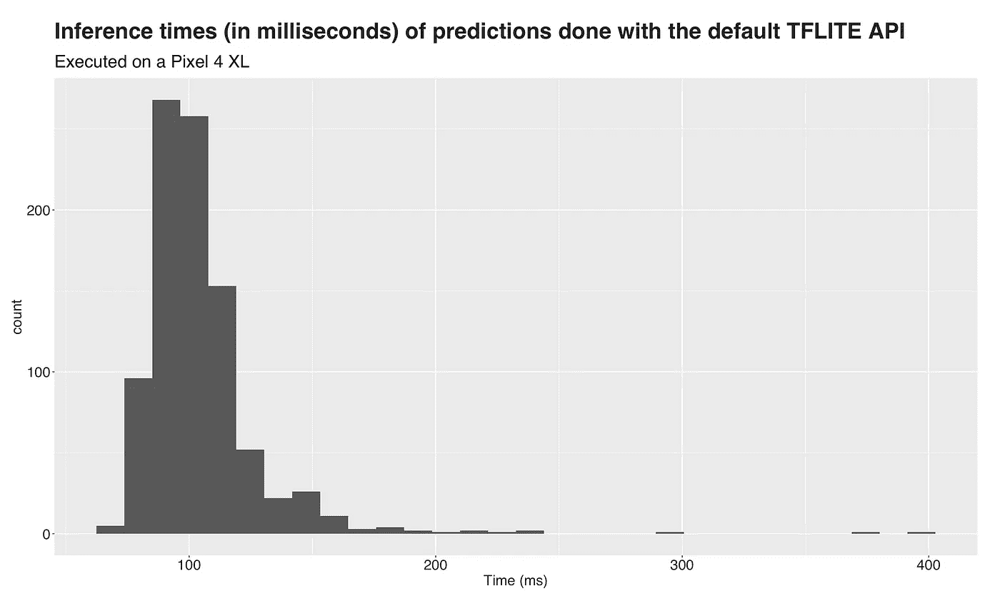
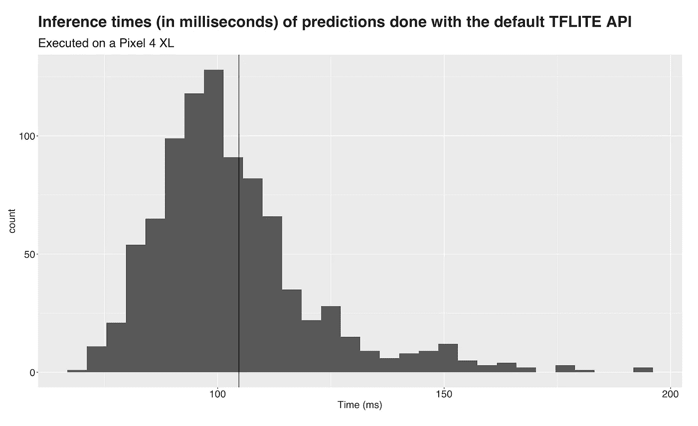

# 在 Pixel 4 XL 上尝试 Android 的 NNAPI ML 加速器和对象检测

> 原文：<https://towardsdatascience.com/trying-androids-nnapi-ml-accelerator-with-object-detection-on-a-pixel-4-xl-5217caea64d4?source=collection_archive---------25----------------------->

## 测试和比较 Android 的 ML 加速和 MobileDet 模型

随着对更私密、更快速、低延迟的机器学习的需求增加，对能够在所谓的“边缘”上良好运行的更易访问的设备上解决方案的需求也在增加其中两个解决方案是目前在谷歌 Pixel 4 手机上可用的 **Pixel 神经核心** (PNC)硬件及其**边缘 TPU** 架构，以及**Android 神经网络 API** (NNAPI)，这是一个为在 Android 设备上执行机器学习操作而设计的 API。

在本文中，我将展示我如何修改面向 Android 的 TensorFlow Lite 对象检测演示，以使用在像素 4 XL 上的 NNAPI 下运行的边缘 TPU 优化模型。此外，我想展示我为记录预测延迟所做的更改，并比较使用默认 TensorFlow Lite API 和 NNAPI 所做的更改。但在此之前，让我简要概述一下我到目前为止介绍的术语。

应用程序检测我最喜欢的书之一。Pic by [me](http://juandes.me/) 。

# 像素神经核心、边缘 TPU 和 NNAPI

Pixel 神经核心是之前 Pixel 视觉核心的继任者，是 Pixel 4 硬件的一部分的特定领域芯片。它的架构遵循边缘 TPU(张量处理单元)的架构，这是谷歌用于边缘计算设备的机器学习加速器。作为一款专为“边缘”设计的芯片，意味着它比谷歌云平台上的大型芯片更小、更节能([它每秒可以执行 4 万亿次运算，而只消耗 2W](https://coral.ai/docs/edgetpu/benchmarks/) )。

然而，边缘 TPU 并不是所有机器学习的全面加速器。该硬件旨在改进正向传递操作，这意味着它擅长作为推理引擎，而不是作为训练工具。这就是为什么你会发现在设备上使用的模型在其他地方被训练的应用。

在软件方面，我们有 NNAPI。这个用 C 编写的 Android API 在采用硬件加速器(如 Pixel Visual Core 和 GPU)的设备上为 TensorFlow Lite 模型提供加速。用于 Android 的 TensorFlow Lite 框架包括一个 NNAPI 委托，所以不用担心，我们不会编写任何 C 代码。

图一。Android 神经网络 API 的系统架构。来源:[https://developer.android.com/ndk/guides/neuralnetworks](https://developer.android.com/ndk/guides/neuralnetworks)

# 模型

我们将在这个项目中使用的模型是 MobileDet 对象检测模型的 float32 版本，该模型针对边缘 TPU 进行了优化，并在 COCO 数据集上进行了训练([链接](http://download.tensorflow.org/models/object_detection/ssdlite_mobiledet_edgetpu_320x320_coco_2020_05_19.tar.gz))。让我快速解释一下这些术语的意思。 [MobileDet](https://arxiv.org/abs/2004.14525) (熊等)是一个最新的轻量级对象检测模型系列，适用于手机等低计算能力设备。这种 float32 变体意味着它不是一个量化的模型，一个经过转换以降低模型精度为代价的模型。另一方面，完全量化的模型使用基于 8 位整数的小权重([源](https://www.tensorflow.org/lite/performance/post_training_quantization#dynamic_range_quantization))。然后，我们有了 COCO 数据集，它是“上下文中的公共对象”的缩写( [Lin et al.](https://arxiv.org/pdf/1405.0312.pdf) )。这个图片集有超过 200，000 张图片，分为 90 类，包括“鸟”、“猫”、“人”和“车”。"

现在，在那一点理论之后，让我们看看应用程序。

# 该应用程序

我使用的应用程序基于 TensorFlow 存储库中提供的 Android 对象检测示例应用程序。但是，我对它进行了修改，使用了 NNAPI 并将推理时间记录到一个文件中，这些数据是我用来比较 NNAPI 和默认 TFLITE API 的预测时间的。下面是*DetectorActivity.java*文件，负责生成检测结果——完整的源代码在我的 GitHub 上；我只是显示这个文件，因为它有最多的变化。在这个文件中，我更改了模型的名称(在将 MobileDet 模型添加到 assets 目录之后)，更改了变量`TF_OD_API_INPUT_SIZE`以反映 MobileDet 的输入大小，并将`TF_OD_API_IS_QUANTIZED`设置为`false`，因为模型没有被量化。除此之外，我添加了两个列表来收集预测的推断时间(每个 API 一个列表)，并添加了一个 override `onStop`方法来在用户关闭应用程序时将列表转储到一个文件中。我必须做的其他小改动是将 TFLiteObjectDetectionAPIModel.java 的 T4 从 10 改为 100，并在 Android 清单中添加 T5 权限，这样应用程序就可以将文件写入文档目录。

我做的另一个重要改变是注释掉——从而启用——允许我们使用 NNAPI 运行应用程序的切换按钮。默认情况下，那部分代码是有注释的，所以不可能从应用内部激活 API 不过，我可能错了(如果你发现其他情况，请纠正我)。

你可以在 https://github.com/juandes/mobiledet-tflite-nnapi 的我的 GitHub repo 中找到这个应用的完整源代码。要运行它，请打开 Android Studio，选择“打开现有的 Android Studio 项目”，然后选择项目的根目录。项目打开后，单击绿色小锤子图标构建它。然后，单击播放图标，在虚拟设备或实际设备(如果已连接)上运行它。如果可能的话，使用真实的设备。

# 测量延迟

那么，这款应用检测物体的速度有多快呢？为了测量延迟，我添加了一个小功能，将使用普通 TFLITE 和 NNAPI 做出的推断的预测时间(以毫秒为单位)写入文件。之后，我拿起文件，在 R 中执行了一点分析，以从数据中获得洞察力。下面是结果。

图 2:用 TFLITE API 完成预测的推断时间

图 3:用 TFLITE API 完成预测的推断时间

图 2 和图 3 是每个 API 下推理时间的直方图。第一个(n=909)对应于默认的 TFLITE API，在 100(毫秒)左右有一个峰值，在可视化的高端有几个极端的异常值。图 3 (n=1169)对应于使用 NNAPI 完成的预测，其峰值约为 50 毫秒。然而，这些极端异常值会使平均值和分布向右移动。因此，为了更好地可视化时间，我删除了这些值，并绘制了没有它们的相同的可视化效果。现在，它们看起来如下:

图 4:用 TFLITE API 完成的预测的推断时间(没有异常值)

图 5:用 NNAPI 完成的预测的推断时间(没有异常值)

更好，对吗？两个图上的黑色垂直线表示平均值。对于 TFLITE 图，平均推断时间为 103 毫秒，中位数为 100 毫秒。在 NNAPI 方面，平均预测时间为 55 毫秒，中位数为 54 毫秒。几乎快了一倍。

下面的视频展示了应用程序的运行。在这里，我只是将手机指向我的电脑，从视频中检测对象:

# 总结和结论

机器学习和人工智能的进步确实令人着迷。首先，他们接管了我们的电脑和云，现在他们正在向我们的移动设备进军。然而，后者和我们传统上用来部署机器学习平台的平台之间有很大的区别。更小的处理器和电池依赖性就是其中的一些。因此，专门针对这类设备的框架和硬件的开发正在迅速增加。

这些工具中的几个是像素神经核心，边缘 TPU 和 NNAPI。这种硬件和软件的结合旨在为我们的移动设备带来高效准确的人工智能。在本文中，我对这些进行了概述。然后，我展示了如何更新用于 Android 的 TensorFlow Lite 对象检测示例，以启用 NNAPI 并写入推理时间文件。使用这些文件，我用 R 做了一个小分析，将它们可视化，发现用 NNAPI 做的预测比用默认 API 做的预测花费了大约一半的时间。

感谢阅读:)

 [## juandes/mobiledet-tflite-nnapi

### 注意:该项目最初取自(并修改)官方 TensorFlow 示例库，网址为…

github.com](https://github.com/juandes/mobiledet-tflite-nnapi)