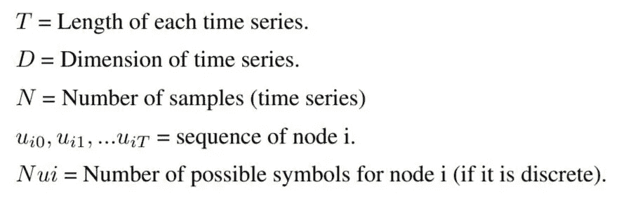
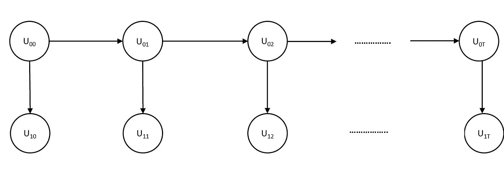
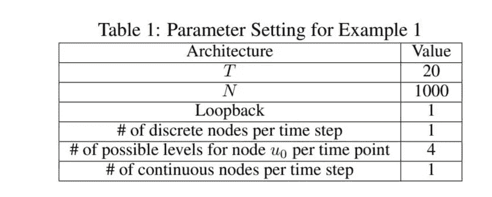
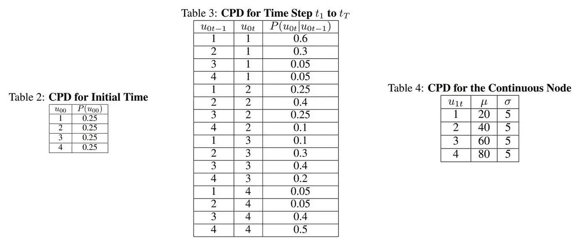
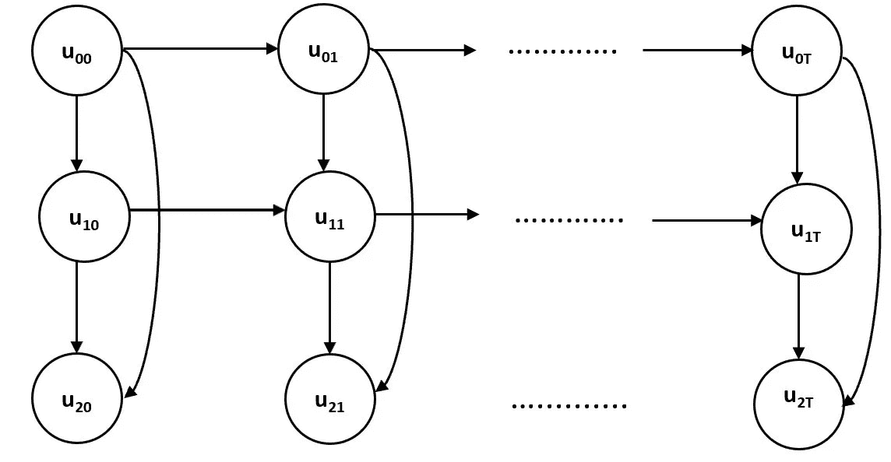
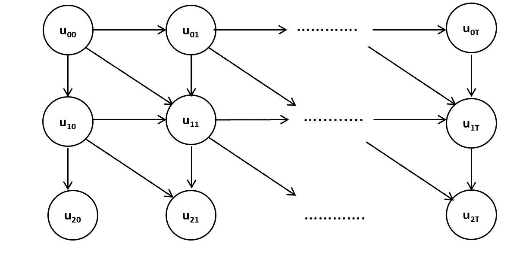

# 生成合成时间序列数据的 Python 库

> 原文：<https://towardsdatascience.com/tsbngen-a-python-library-to-generate-time-series-data-from-an-arbitrary-dynamic-bayesian-network-4b46e178cd9f?source=collection_archive---------11----------------------->

## tsBNgen:一个 Python 库，用于从任意动态贝叶斯网络结构中生成时间序列数据


由 [Unsplash](https://unsplash.com?utm_source=medium&utm_medium=referral) 上的 [Behzad Ghaffarian](https://unsplash.com/@behz?utm_source=medium&utm_medium=referral) 拍摄的照片

合成数据广泛应用于各个领域。这是因为许多现代算法需要大量数据来进行有效的训练，而数据收集和标记通常是一个耗时的过程，并且容易出错。此外，一些真实世界的数据，由于其性质，是保密的，不能共享。

提出了生成对抗网络等方法来生成时间序列数据。然而，GAN 难以训练并且可能不稳定；此外，它需要大量的数据来进行有效的训练。

本文将介绍一个 python 库 **tsBNgen** ，它基于任意的动态贝叶斯网络结构生成合成时间序列数据。

虽然 **tsBNgen** 主要用于生成时间序列，但是通过将时间序列的长度设置为 1，它也可以生成横截面数据。

以下是本文中讨论的主题列表。

*   **简介**
*   **特性**
*   **指令**
*   **示例**
*   **结论**


[米洛丝拉娃](https://unsplash.com/@miroslava?utm_source=medium&utm_medium=referral)在 [Unsplash](https://unsplash.com?utm_source=medium&utm_medium=referral) 上的照片

# **简介**

tsBNgen 是在 MIT 许可下发布的 python 包，用于从任意贝叶斯网络结构中生成时间序列数据。贝叶斯网络是一种广泛用于对现实世界过程中的不确定性建模的概率图形模型。动态贝叶斯网络(DBNs)是一类特殊的贝叶斯网络，用于对时间和时间序列数据进行建模。

贝叶斯网络在教育和医学等领域受到了广泛的关注。例如，在中，作者使用 HMM(DBN 的一种变体)来预测学生在教育视频游戏中的表现。有向图模型(贝叶斯网络)的一个显著优点是，它们可以表示图中节点之间的因果关系；因此，它们提供了一种直观的方法来模拟现实世界的过程。一旦专家确定了图形结构，这种说法使得 **tsBNgen** 成为生成数据的非常有用的软件。从某种意义上说，与 GAN 等数据驱动的方法不同，tsBNgen 是一种基于模型的方法。

要了解关于这个包、文档和例子的更多信息，请访问下面的 GitHub 资源库。

[](https://github.com/manitadayon/tsBNgen) [## 马尼塔代翁/茨布恩根

### 描述说明 tsBNgen 是一个 Python 包，基于任意贝叶斯网络生成时间序列数据…

github.com](https://github.com/manitadayon/tsBNgen) 

我最近在 YouTube 上制作了一系列视频来使用这个包。这些视频也在我的 GitHub 页面上，你可以在这里观看:

我尝试详细检查贝叶斯网络和 tsBNgen 包。如果你有任何问题或意见，你可以在我的 YouTube 频道问我。

# 特征

以下是 **tsBNgen** 支持的特性和功能列表:

1.  简单易用的界面。
2.  支持离散、连续和混合网络(离散和连续节点的混合)。
3.  对连续节点使用多项式分布和高斯分布支持离散节点。
4.  支持任意环回(时间连接)值的时间依赖性。
5.  易于修改和扩展代码以支持新的结构。
6.  基于模型的方法，一旦知道了因果结构，就可以生成综合数据。

# **指令**

要使用 **tsBNgen** ，要么克隆上述存储库，要么使用以下命令安装软件:

```
pip install tsBNgen
```

软件成功安装后，发出以下命令导入所有函数和变量。

```
from tsBNgen import * 
from tsBNgen.tsBNgen import *
```

这就是你利用软件中存在的所有功能所需要的。

# **例子**

在查看一些示例之前，让我定义以下参数，这些参数将在本节中使用。
**注**:以下描述、表格(作为图像的一种形式)、图像均由作者从本文中获得。



***例 1***

假设您想要为图 1 中的以下架构生成数据，这是一个 HMM 结构。



图一。(作者供图)

顶层节点被称为状态，下面的节点被称为观察。在 HMM 中，状态是离散的，而观察值可以是连续的，也可以是离散的。下表总结了图 1 的参数设置和概率分布。



t 时刻所有节点的条件概率分布(作者供图)

在表 1 中，T 是指时间序列的长度，N 是指样本数，loopback 决定了时间连接的长度。例如，loopback 值为 1 意味着一个节点在以前连接到一些其他节点。

**注** : **tsBNgen** 可以通过设置 T=1 来模拟标准贝叶斯网络(横截面数据)。

具有上述 CPD 和参数的架构 1 可以轻松实现如下:

```
import time
START=time.time()
T=20
N=1000
N_level=[4]
Mat=pd.DataFrame(np.array(([0,1],[0,0]))) # HMM
Node_Type=['D','C']CPD={'0':[0.25,0.25,0.25,0.25],'01':
{'mu0':20,'sigma0':5,'mu1':40,'sigma1':5,
'mu2':60,'sigma2':5,'mu3':80,'sigma3':5}}Parent={'0':[],'1':[0]}CPD2={'00':[[0.6,0.3,0.05,0.05],[0.25,0.4,0.25,0.1],[0.1,0.3,0.4,0.2],
[0.05,0.05,0.4,0.5]],'01':{'mu0':20,'sigma0':5,'mu1':40,'sigma1':5,
'mu2':60,'sigma2':5,'mu3':80,'sigma3':5
}}loopbacks={'00':[1]}
Parent2={'0':[0],'1':[0]}
Time_series1=tsBNgen(T,N,N_level,Mat,Node_Type,CPD,Parent,CPD2,Parent2,loopbacks)
Time_series1.BN_data_gen()
FINISH=time.time()
print('Total Time is',FINISH-START)
```

上面的代码生成 1000 个长度为 20 的时间序列，对应于状态和观察值。观察值正态分布，具有特定的平均值和标准偏差。这些状态是离散的(因此是“D”)，并采用由 *N_level* 变量确定的四个可能的级别。 *loopbacks* 是一个字典，其中每个键都有以下形式:node+它的 parent。因为在架构 1 中，只有状态，即节点 0(根据图的拓扑排序)跨时间连接，并且在时间 t 时节点 0 的父节点是在时间 t-1 时的节点 0；因此，*回环*的键值是‘00 ’,并且由于时间连接仅跨越一个时间单位，所以其值是 1。Node_Type 确定图中节点的类别。例如，在本例中，第一个节点是离散的(“D”)，第二个节点是连续的(“C”)。Mat 表示网络的邻接矩阵。

生成上述数据的总时间为 2.06 秒，通过 HMM 算法运行该模型，即使是五个样本，我们的准确率也超过 93.00 %。
现在让我们看一个更复杂的例子。从现在开始，为了节省空间，我避免显示 CPD 表，只显示用于生成数据的架构和 python 代码。

***例 2***

示例 2 参考图 2 中的架构，其中前两层中的节点是离散的，而最后一层 nodes(u₂是连续的。



图 2(作者照片)

根据图的拓扑排序，可以将每个时间点的节点命名为 0、1 和 2。假设您希望在以下情况下生成数据:节点 0(顶部节点)取两个可能值(二进制)，节点 1(中间节点)取四个可能值，最后一个节点是连续的，并且对于其父节点的每个可能值将根据高斯分布进行分布。以下 python 代码模拟了 2000 个样本的场景，每个样本的长度为 20。

```
T=20
N=2000
N_level=[2,4]
Mat=pd.DataFrame(np.array(([0,1,1],[0,0,1],[0,0,0])))
Node_Type=['D','D','C']CPD={'0':[0.6,0.4],'01':[[0.5,0.3,0.15,0.05],[0.1,0.15,0.3,0.45]],'012':{'mu0':10,'sigma0':2,'mu1':30,'sigma1':5,
 'mu2':50,'sigma2':5,'mu3':70,'sigma3':5,'mu4':15,'sigma4':5,'mu5':50,'sigma5':5,'mu6':70,'sigma6':5,'mu7':90,'sigma7':3
}}Parent={'0':[],'1':[0],'2':[0,1]}CPD2={'00':[[0.7,0.3],[0.2,0.8]],'011':[[0.7,0.2,0.1,0],[0.6,0.3,0.05,0.05],[0.35,0.5,0.15,0],
[0.2,0.3,0.4,0.1],[0.3,0.3,0.2,0.2],[0.1,0.2,0.3,0.4],[0.05,0.15,0.3,0.5],[0,0.05,0.25,0.7]],'012':{'mu0':10,'sigma0':2,'mu1':30,'sigma1':5,
  'mu2':50,'sigma2':5,'mu3':70,'sigma3':5,'mu4':15,'sigma4':5,'mu5':50,'sigma5':5,'mu6':70,'sigma6':5,'mu7':90,'sigma7':3
}}
Parent2={'0':[0],'1':[0,1],'2':[0,1]}
loopbacks={'00':[1],'11':[1]}
Time_series2=tsBNgen(T,N,N_level,Mat,Node_Type,CPD,Parent,CPD2,Parent2,loopbacks)
Time_series2.BN_data_gen()
```

如上面的代码所示，节点 0(顶部节点)在第一个时间步中没有父节点(这是变量 parent 所代表的)。在因果或贝叶斯网络中，这有时被称为根或外生变量。节点 1 连接到节点 0，节点 2 连接到节点 0 和 1。为了表示时间 0 之后的其他时间步长的结构，使用变量 Parent2。这表示节点 0 跨时间连接到自身(因为在环回中‘00’是[1]，所以时间 t 仅连接到 t-1)。节点 1 同时连接到节点 0，并在之前连接到节点 1(这也可以从 loopback 变量中看出)。

由于 **tsBNgen** 是基于模型的数据生成，因此您需要提供每个节点的分布(对于外部节点)或条件分布。如果您想要生成与任意分布的架构相对应的合成数据，那么您可以选择 CPD 和 CPD2 为您喜欢的任何值，只要每个离散分布的条目之和为 1。例如，节点 0 的 CPD 为[0.6，0.4]。你可以把这些值改成你喜欢的任何值，只要它们加到 1 上。

***例 3***

示例 3 参考图 3 中的架构，其中前两层中的节点是离散的，而最后一层 nodes(u₂是连续的。



图 3(作者照片)

假设您希望在以下情况下生成数据:节点 0(顶部节点)是二进制的，节点 1(中间节点)取四个可能值，节点 2 是连续的，并且将根据其父节点的每个可能值的高斯分布进行分布。以下 python 代码模拟了 1000 个样本的场景，每个样本的长度为 10。

```
T=10
N=1000
N_level=[2,4]
Mat=pd.DataFrame(np.array(([0,1,0],[0,0,1],[0,0,0])))
Node_Type=['D','D','C']
CPD={'0':[0.5,0.5],'01':[[0.6,0.3,0.05,0.05],[0.1,0.2,0.3,0.4]],'12':{'mu0':10,'sigma0':5,'mu1':30,'sigma1':5,
    'mu2':60,'sigma2':5,'mu3':80,'sigma3':5}}
Parent={'0':[],'1':[0],'2':[1]}CPD2={'00':[[0.7,0.3],[0.3,0.7]],'0011':[[0.7,0.2,0.1,0],[0.5,0.4,0.1,0],[0.45,0.45,0.1,0],
[0.3,0.4,0.2,0.1],[0.4,0.4,0.1,0.1],[0.2,0.3,0.3,0.2],[0.2,0.3,0.3,0.2],[0.1,0.2,0.3,0.4],[0.3,0.4,0.2,0.1],[0.2,0.2,0.4,0.2],
 [0.2,0.1,0.4,0.3],[0.05,0.15,0.3,0.5],[0.1,0.3,0.3,0.3],[0,0.1,0.3,0.6],[0,0.1,0.2,0.7],[0,0,0.3,0.7]],'112':{'mu0':10,'sigma0':2,'mu1':30,'sigma1':2,
    'mu2':50,'sigma2':2,'mu3':60,'sigma3':5,'mu4':20,'sigma4':2,'mu5':25,'sigma5':5,'mu6':50,'sigma6':5,'mu7':60,'sigma7':5,
   'mu8':40,'sigma8':5,'mu9':50,'sigma9':5,'mu10':70,'sigma10':5,'mu11':85,'sigma11':2,'mu12':60,'sigma12':5, 
    'mu13':60,'sigma13':5,'mu14':80,'sigma14':3,'mu15':90,'sigma15':3}}Parent2={'0':[0],'1':[0,0,1],'2':[1,1]}
loopbacks={'00':[1], '01':[1],'11':[1],'12':[1]}Time_series2=tsBNgen(T,N,N_level,Mat,Node_Type,CPD,Parent,CPD2,Parent2,loopbacks)
Time_series2.BN_data_gen()
```

同样，您可以为任何想要的图形模型生成时间序列数据。这是一个非常好的工具，因为许多现实世界的问题都可以建模为贝叶斯和因果网络。

有关更多示例和最新文档，请访问下面的 GitHub 页面。

[](https://github.com/manitadayon/tsBNgen) [## 马尼塔代翁/茨布恩根

### 描述说明 tsBNgen 是一个 Python 包，基于任意贝叶斯网络生成时间序列数据…

github.com](https://github.com/manitadayon/tsBNgen) 

如果你想了解更多，请务必在我的 YouTube 频道上观看我最近的视频。

**奖励**:如果你想看 HMM 等图形建模算法和 LSTM 等深度学习方法在合成生成的时间序列上的对比分析，请看看这个 paper⁴.

# 结论

在本文中，我介绍了 **tsBNgen** ，这是一个从任意 BN 生成合成数据的 python 库。使用两个示例解释了该软件的特性和功能。有关该软件的更多最新信息，请访问上面提到的 GitHub 页面。

# **参考**

[1] M. Frid-Adar，E. Klangand，M. Amitai，J. Goldberger，H. Greenspan，使用 gan 的合成数据增强用于改进肝脏病变分类(2018)，IEEE 2018 第 15 届生物医学成像国际研讨会
。

[2] M. Tadayon，G. Pottie，[利用隐马尔可夫模型预测教育游戏中的学生表现](https://ieeexplore.ieee.org/abstract/document/9084102/) (2020)，IEEE 2020 IEEE 教育汇刊。

[3] M. Tadayon，G. Pottie， [tsBNgen:一个从任意动态贝叶斯网络结构生成时间序列数据的 Python 库](https://arxiv.org/abs/2009.04595) (2020)，arXiv 2020，arXiv 预印本 arXiv:2009.04595。

[4] M. Tadayon，G. Pottie，[隐马尔可夫模型与 LSTM 的比较分析:一种模拟方法](https://arxiv.org/abs/2008.03825) (2020)，arXiv 2020，arXiv 预印本 arXiv:2008.03825。