# 三氯甲烷降解为五氯苯甲醚

> 原文：<https://towardsdatascience.com/tsne-degrades-to-pca-d4abf9ef51d3?source=collection_archive---------21----------------------->

## [生命科学的数理统计和机器学习](https://towardsdatascience.com/tagged/stats-ml-life-sciences)

## 茫然不知所措

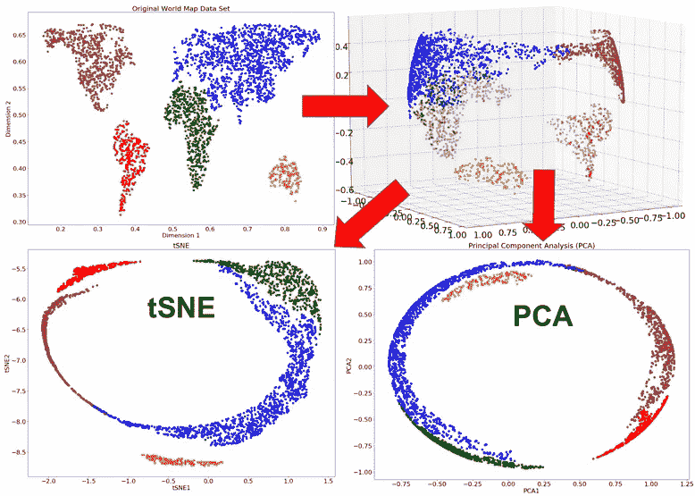

这是来自专栏 [**生命科学的数理统计和机器学习**](https://towardsdatascience.com/tagged/stats-ml-life-sciences?source=post_page---------------------------) 的第十六篇文章，在这里我试图以简单的方式解释生物信息学和计算生物学中使用的一些神秘的分析技术。在我的上一篇文章[中，tSNE vs. UMAP:全局结构](/tsne-vs-umap-global-structure-4d8045acba17)，我触及了**大困惑**的极限，作为 [tSNE](https://en.wikipedia.org/wiki/T-distributed_stochastic_neighbor_embedding) 保留更多**全局数据结构**的一种潜在方式，当试图使用 tSNE 超越可视化来处理数据点簇之间的层次关系(聚类)时，这变得很重要。在这里，我将更详细地描述在使用 tSNE 时出现的一些陷阱，比如将**非线性 tSNE 转换为线性** [**PCA**](https://en.wikipedia.org/wiki/Principal_component_analysis) 降维。

# 为什么使用 tSNE 有很大的困惑

随着**数据集大小的增长**，例如在 [scRNAseq](https://en.wikipedia.org/wiki/Single_cell_sequencing) 字段中，处理数十万甚至数百万个单元几乎是一种惯例，在大型数据集上使用具有超过[推荐值(5 到 50)](https://lvdmaaten.github.io/tsne/#faq) 的巨大复杂性的 tSNE 变得越来越常见，以实现数据结构的稳健发现。事实上，在大型数据集上使用默认困惑可能没有什么意义，因为它经常导致数据点的**不太明显的聚类**，就像在几篇出版物中显示的那样，例如在这篇[伟大的文章中，](https://blog.cytobank.org/2017/01/17/fine-tune-visne-to-get-the-most-of-your-single-cell-data-analysis/)也可以在这里看到[很好的讨论](https://stats.stackexchange.com/questions/399868/why-does-larger-perplexity-tend-to-produce-clearer-clusters-in-t-sne)。

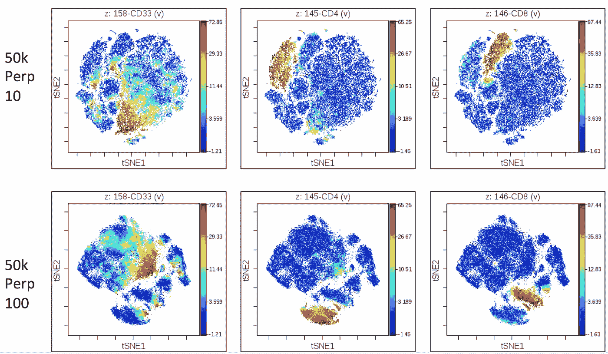

小的困惑值不允许解析数据结构，[图像源](https://blog.cytobank.org/2017/01/17/fine-tune-visne-to-get-the-most-of-your-single-cell-data-analysis/)

即使对于一个表现良好的 [MNIST](https://en.wikipedia.org/wiki/MNIST_database) 基准数据集，大小困惑之间的差异也是显而易见的:更大的困惑导致 tSNE 降维图中更明显的聚类。

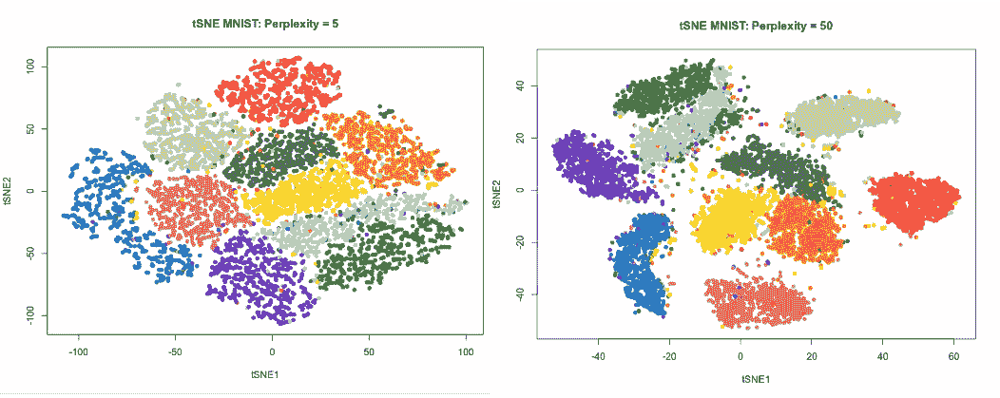

当增加 tSNE 混淆值时，MNIST 手写数字图像簇变得更加清晰

随着数据集规模的增长，这变得越来越重要。你可能想要在大型数据集上使用 tSNE 来增加困惑值的**第二个原因**是一个长期存在的假设(例如参见这里的[这里的](https://stats.stackexchange.com/questions/263539/clustering-on-the-output-of-t-sne)和这里的[这里的](https://distill.pub/2016/misread-tsne/)),即 **tSNE 可以在大困惑时保留更多的全局数据结构**，在这方面与 [UMAP](https://arxiv.org/abs/1802.03426) 相当。为了证明这一点，让我们模拟 2D 数据点的 3 个高斯斑点(每个 1000 个点):两个斑点彼此靠近并且远离第三个斑点。

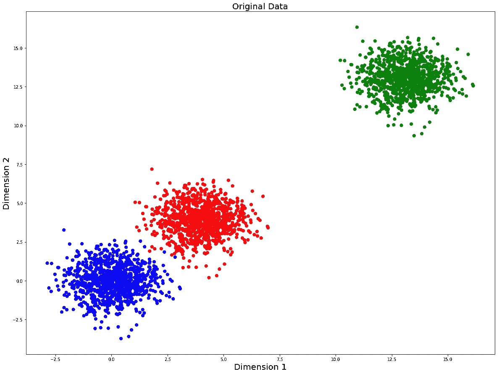

现在我们将尝试使用不同的困惑值来重建运行 tSNE 的原始数据:10、30、100 和 1000。

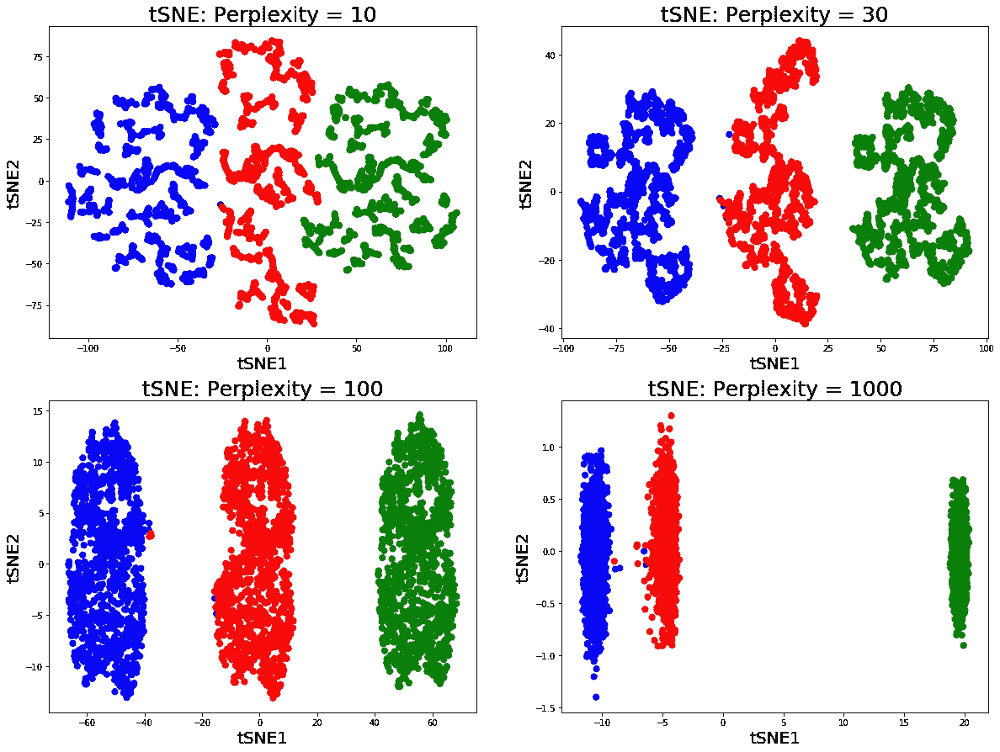

这里我们可以做两个重要的观察。首先，在低困惑值 10 甚至 30 时，数据结构不明显。事实上，如果我不对这些点着色，甚至很难猜测我们在困惑 10 和 30 的 tSNE 图中看到多少斑点，因为数据点似乎形成了某种程度上的**哑铃**簇。因此，为了解析所有三个聚类，我们需要将困惑值增加到 100。第二，注意，在困惑度等于 10、30 和 100 时，三个集群似乎是等距的，尽管我们知道它们中的两个应该位于一起并且与第三个分开。正确的**群集**(全局数据结构)的相对位置只有在我们**将困惑度增加到 1000** 时才能实现，即远远超过 5 到 50 之间的推荐值。因此，大的困惑极限对于从 scRNAseq 数据的 tSNE 图中得到的细胞群体的接近度的**生物学解释**变得至关重要。

# tSNE 类似于五氯苯甲醚，令人困惑

现在，在我们认识到大困惑极限对于 tSNE 的重要性之后，让我们在我在[上一篇](/tsne-vs-umap-global-structure-4d8045acba17)中介绍的世界地图数据集(3023 点)的**2D**T2【线性流形】T3 上评估 tSNE 的大困惑。生成世界地图数据集的完整代码可以在我的 [github](https://github.com/NikolayOskolkov/tSNELargePerplexityLimit) 上找到。

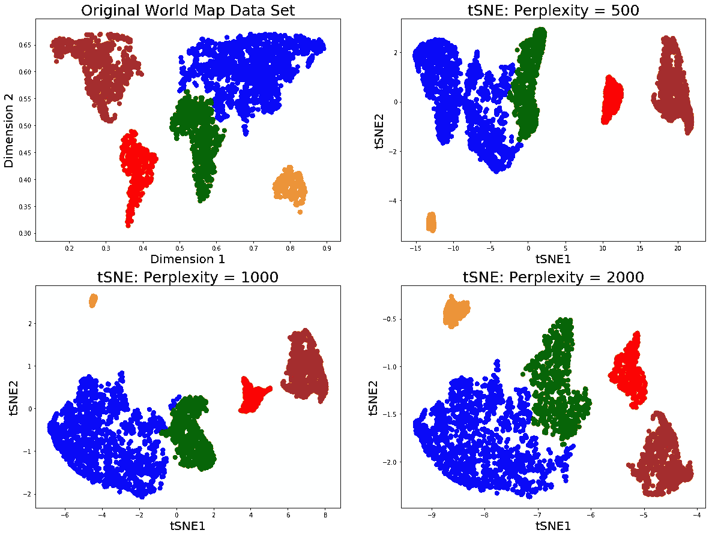

用 tSNE 和大困惑值重建的 2D 世界地图数据集

在这里，我们可以观察到 tSNE **错误地将南美洲**放置在困惑 500 和 1000 处的非洲和北美洲之间。然而，当困惑度达到 2000 时，我们得到了原始世界地图数据集的**几乎完美的重建**，其中各大洲之间的所有**相对距离**似乎都保留得很好。这似乎令人放心，并表明如果想用 tSNE 在数据中保留更多的全局结构，只需增加困惑值就足够了。然而，如果我们将原始的线性 2D 世界地图数据集投影到非线性流形(如球体)上，就可以清楚地看到**捕捉**，以这种方式，我们模拟了具有映射到球体表面的大陆的 3D 球体。让我们在非线性 **3D globe** /sphere 数据集上运行具有大困惑值的 tSNE，并将其输出与 PCA 和 UMAP 进行比较。此外，我们还会将 2D 数据集投影到其他著名的非线性流形上，如 **S 形**曲面和 [**瑞士卷**](https://en.wikipedia.org/wiki/Nonlinear_dimensionality_reduction) 上，并运行 PCA 和 tSNE / UMAP 大困惑/ n_neighbor。注意，tSNE 和 UMAP 都用 PCA 进行了[相同的初始化](https://www.biorxiv.org/content/10.1101/2019.12.19.877522v1)。

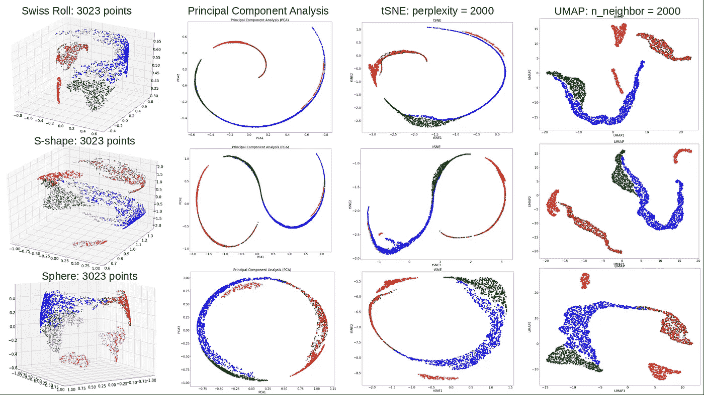

PCA，tSNE / UMAP 逍遥法外困惑/世界地图上的 n_neighbor 投影到球面，S 形和瑞士卷

这里我们观察到 PCA 和 tSNE 图之间有显著的相似性。发生了什么事？由于 3D 非线性流形(球体、S 形和瑞士卷)**的**内部维数**仍然是两个**，人们会期望适当的降维方法可以恢复原始的 2D 世界地图数据。PCA 未能实现的原因是 PCA 通过仿射变换(如旋转、翻转、平移、拉伸等)来搜索数据中变化最大的轴。然而，通过旋转非线性流形，人们将找不到恰当地捕捉到感兴趣的**变化**的轴，即世界地图中各大洲的位置。相反，主成分分析揭示的螺旋、S 曲线和圆确实捕捉到了通过线性变换可以检测到的大部分变化。PCA 在非线性流形上失败是可以理解的，但是**为什么 tSNE 没有表现得更好呢？**这对于嵌入到非线性 3D 流形中的世界地图来说不是唯一的，但是甚至可以在表现良好的基准 MNIST 数据集上检测到，即对于等于 500 和 3000 的大困惑值的 tSNE 图类似于 PCA 图。

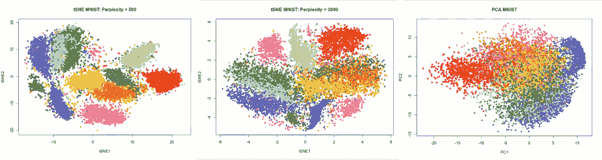

在非常大的 tSNE 困惑值下，MNIST 手写数字的簇变得不太明显

这是怎么回事？难道 tSNE at launch performance 不应该用正确保留的全局结构来重建原始数据吗，就像本节开始时显示的 2D 线性世界地图 performance = 2000 那样？为了回答这个问题，我们需要研究 tSNE 算法，并认识到由于梯度下降中的梯度消失，tSNE 退化为 PCA。

# 检查 tSNE 梯度的大困惑

为了理解 tSNE 在自由困惑时会发生什么，我们需要回忆一下，tSNE 是基于以下四个等式的，参见我的[帖子](/how-exactly-umap-works-13e3040e1668)以了解更多关于 tSNE 的优点和缺点的信息:

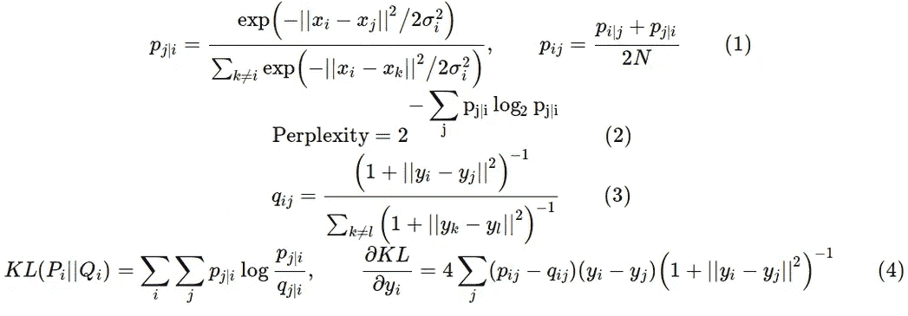

并检查一些重要的概念，如数据的成对欧几里得距离的分布、西格玛值的分布(等式中高斯核的带宽。1)，高维概率的分布以在一定距离上找到数据点(等式。1)、低维概率的分布(等式。3)，最后是 KL 散度梯度值的分布(等式。4).可悲的是，如果不破解代码，所有这些指标都不容易从 tSNE 的当前实现中提取(例如 [scikitlearn](https://scikit-learn.org/stable/) 或 [Rtsne](https://cran.r-project.org/web/packages/Rtsne/index.html) ) **。特别是，我们需要检查 KL-散度的梯度是否在大混乱时消失，因为这将意味着 tSNE **内的梯度下降在用例如 PCA 初始化后从未正确开始**。**

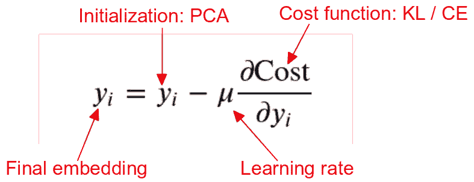

原则上，查看 scikitlearn 的 tSNE 代码，我们可以找到函数 **_joint_probabilities** 和 **_kl_divergence** ，它们可以提供以下信息:

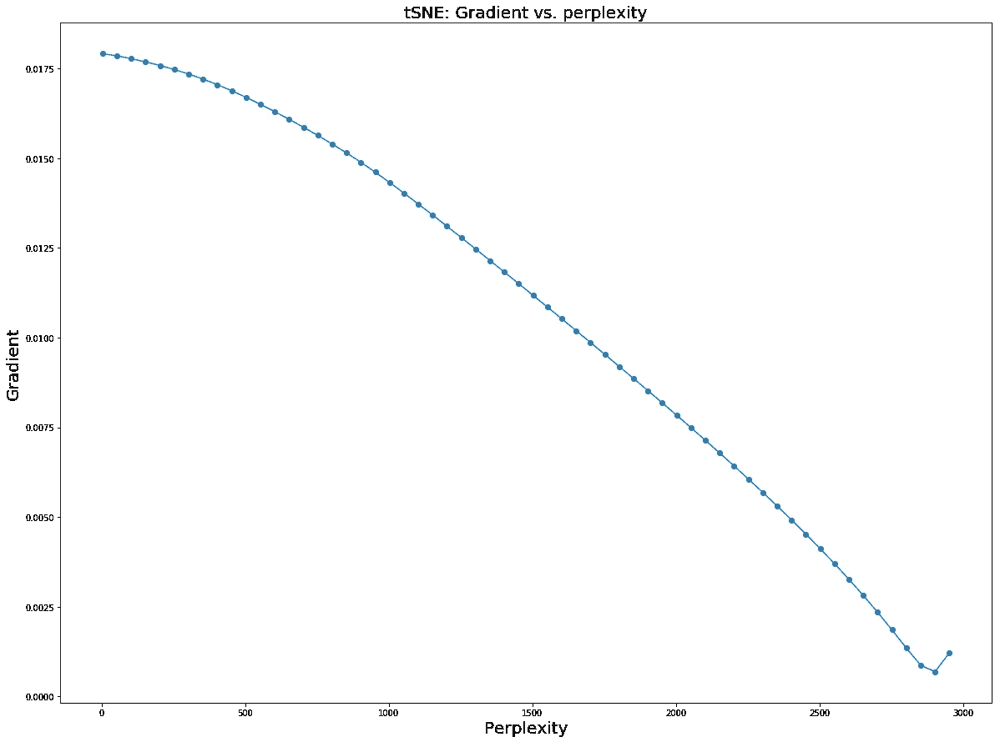

这里我们可以看到，随着困惑参数的增长，KL 梯度下降到几乎为零。对于未来更全面的信息，从头开始实施 tSNE**是有意义的**。下面的代码以数字形式再现了 scikitlearn tSNE 实现的输出，但是更加简洁，希望更容易理解。

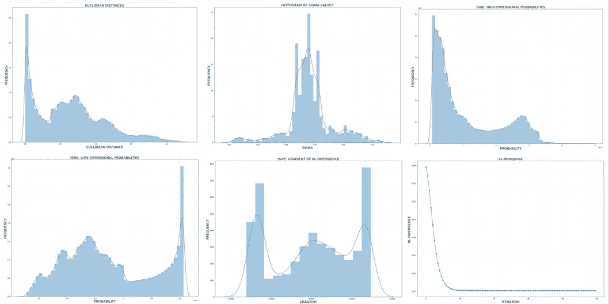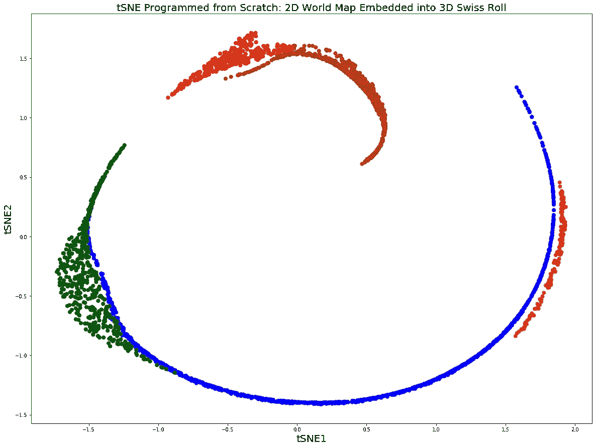

从头开始编程 tSNE 的优点是，我们可以提取我们想要的任何信息，例如在不同的困惑值下 KL 梯度的演变。我们可以立即看到，KL-gradient very **很快将**下降到零，因此嵌入的 **的**坐标停止更新**，并且我们最终只有初始化时的坐标。**

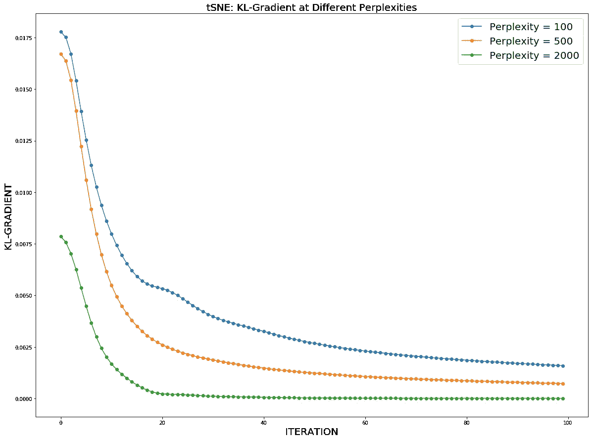

因此，如果我们用 PCA 初始化 tSNE 并增加困惑，我们就有风险**以 PCA 图而不是 tSNE** 结束。注意，为简单起见，我使用术语 PCA，尽管更正确的说法是 tSNE 退化到[多维标度(MDS)](https://en.wikipedia.org/wiki/Multidimensional_scaling) 图。PCA 和 MDS 在很多方面是相似的，我指的是 PCA(不是 MDS)作为一种更流行和已知的技术。

但是为什么 KL 梯度在大混乱中消失了呢？仔细观察会发现 **P 和 Q** 之间有趣的相互作用，即在特定距离观察数据点的高维和低维概率。两个概率在大混乱时变得可比较，即 P/Q 接近 1，并且从等式 4 得出，KL 梯度消失并且 tSNE 恶化。

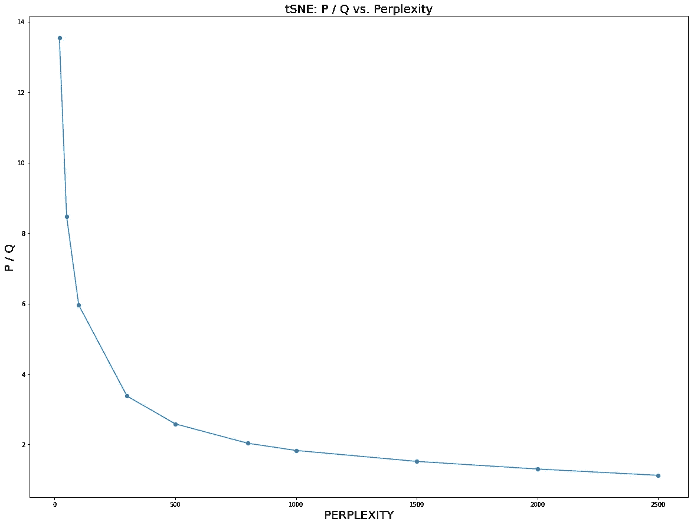

在草率的符号中，回顾 tSNE 有一个重要的超参数，**早期的夸张**，它是高维概率 P 的倍增因子，可以将 tSNE 恶化条件写为:

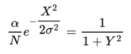

其中α是早期夸张，N 是样本大小，σ与困惑度相关，X 和 Y 是高维度和低维度中数据点之间的平均欧几里德距离。因此，上面的等式连接了 tSNE 的最重要的超参数，除了当 P = Q 条件在很大的困惑下被满足时无关紧要的学习速率。

# 摘要

在这篇文章中，我们了解到需要在大型数据集上使用 tSNE 来**增加**困惑值，以便获得**更多不同的聚类**并在数据中保留更多的**全局结构**，这对于不同聚类之间距离的生物学解释变得非常重要。然而，当 KL 梯度**消失**时，增加的复杂度可能导致非线性 tSNE 的**退化**到线性 PCA / MDS 维数减少，因此算法永远不会正确开始。如果对线性数据运行 tSNE **，这有时会被**错误地解释为**是“原始数据的完美重建”，但是当对**非线性数据**运行 tSNE 时，这显然是错误的。**

在下面的评论中，让我知道哪些来自生命科学的分析技术对你来说似乎是特别神秘的，我会在以后的文章中介绍。在我的 [Github](https://github.com/NikolayOskolkov/tSNELargePerplexityLimit) 上查看帖子中的代码。在 Medium [关注我，在 Twitter @NikolayOskolkov 关注我，在 Linkedin](https://medium.com/u/8570b484f56c?source=post_page-----d4abf9ef51d3--------------------------------) 关注我。下一次我将转向进化生物学，并解释如何利用古代 DNA 来估算种群数量，敬请关注。