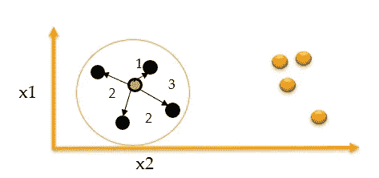
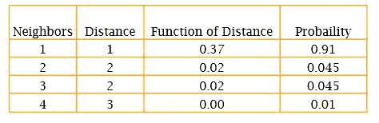
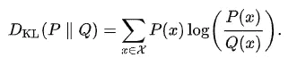
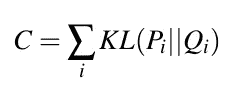
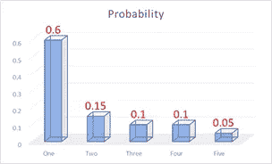
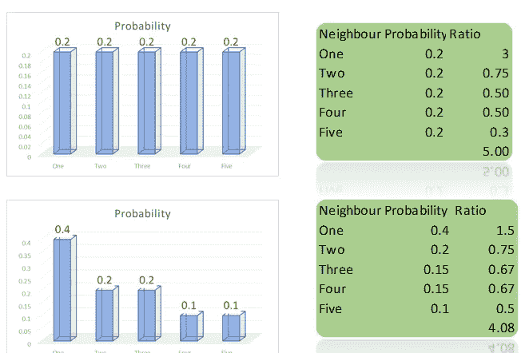
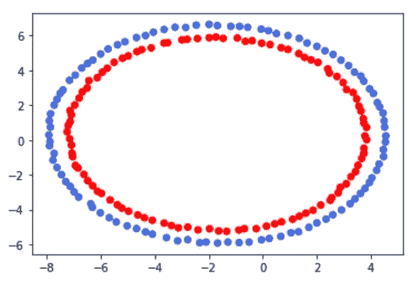
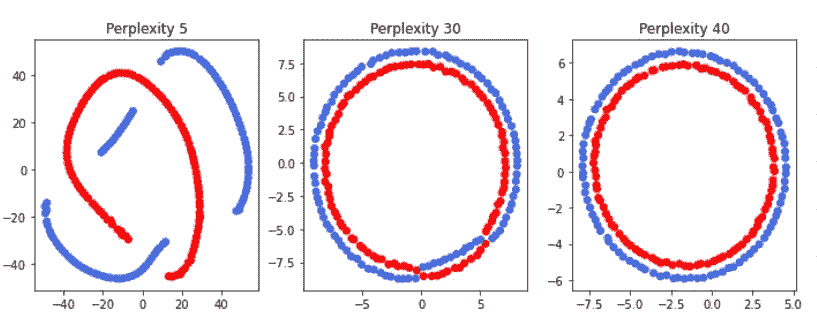
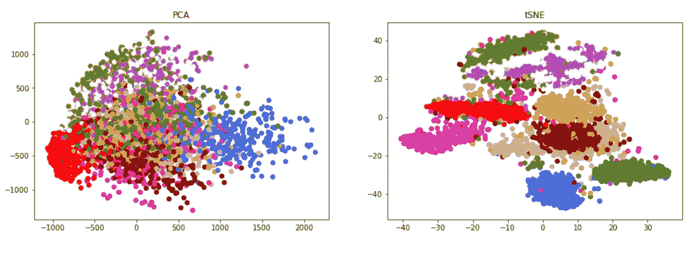

# tSNE 简化版

> 原文：<https://towardsdatascience.com/tsne-simplified-cf1837349302?source=collection_archive---------25----------------------->

## 使用 tSNE 减少尺寸

伙计们，说实话当我听到 tSNE 这个名字和完整形式是 t 分布随机邻域嵌入时，我很害怕。渐渐地，我可以在报纸、各种博客中找到自己的路，并意识到它并不像名字所暗示的那样不祥。我只是想分享一下我收集的直觉。让我把它写在一个问题里，就像我想到的那样回答。

**什么是降维？**

属性数量越少，管理就越简单。模型易于训练、存储，也易于可视化。从技术上来说，你可以消除一些原有的功能或属性。这被称为**特征选择**。还有另一类技术，其中从原始特征集创建**新特征。举个典型的例子，有一群顾客，他们的身高和体重被收集起来。如果我们想要创建一个能够代表这两种属性的特征，我们可以使用身体质量指数(身体质量指数)，它是以千克为单位的体重和以平方米为单位的身高来计算的。这就是降维的简单动机。**

从技术角度来看，我们构建新特征的第二套方法被称为降维技术。

这可以任意实现吗？还是总能给出有意义的真实世界特征？

当然不是任意的。像任何最大似然算法一样，必须有一个目标函数。让我们将原始数据集称为 D，将具有缩减的或新的特征集的数据集称为 r。让有一个函数‘f’来度量包含在任何数据集中的信息。损失函数/目标函数会在一个抽象的层次上，f(D) — f(R)，我们姑且称之为 J(D，R)。我们应该尝试最小化这个 j。如果有几种可能的减少，即 R1，R2，Rn，我们应该选择那个版本的新构建的功能最小化 j

大多数时候，没有像身体质量指数那样的真实世界即领域含义可以附加到新构造的特征上，这是这些方法的弱点。

**为什么需要降维？**

*   这样我们就可以形象化(为此我们需要减少到二维或三维)并且它是可解释的
*   模型轻便高效，训练和应用速度更快

**现在什么是 tSNE？**

tSNE 是 t-分布随机邻域嵌入

让我们从随机**邻域嵌入开始。**嗯，一个城市阿格拉可以用它的‘纬度、经度’来表示，或者，它可以用它离新德里的距离来表示。

这类似于单词嵌入的概念，一个单词由周围的单词表示。**一个载体被它所保持的公司所知。**

图 1:邻居代表(来源:作者)

在上图中，有 9 个点，有两个属性 x1 和 x2。用绿色标记的点可以用 x1 和 x2 这两个值来表示。

或者，它可以用它与 k 个最近邻(k = 4)的距离或相似性来表示，这些最近邻用黑色标记。相似度与距离成反比。为了标准化，我们可以用 0 到 1 之间的数字来衡量这些相似性。

如果我们以稍微不同的方式思考，我们可以认为这是选择邻居的概率，假设已经选择了绿点。让我们用下面的简单例子来理解这一点。

图 2:点的邻域(来源:作者)

直觉很简单，

*   邻居越近，概率越高
*   所有四个邻居的概率之和是 1。

任何时候，当我们处理概率时，我们都在处理随机性，在更正式的术语中，随机性被称为随机的。

所以不用坐标来表示绿点，我们可以表示为(0.91，0.045，0.045，0.01)。这被称为**随机邻域嵌入。**

这还没做到，你的问题当然会是，维度是怎么降的？现在让我们把原始空间中的概率分布称为 p，让我们假设原始向量没有两个特征，而是总共有 50 个特征。

让我们进一步假设，通过一些魔法，我们已经将这些向量转换成二维向量，然后我们再次通过它的随机邻域嵌入来表示这些点，这只不过是一个概率分布 q。当我们计算概率时，假设像正态分布这样的标准概率密度函数。

我们来重述一下，所以同一个点用原始维度上一个叫做 p 的概率分布和另一个缩减空间上的概率分布 q 来表示。不需要太多思考，我们就可以得出结论，p 和 q 应该尽可能相似。

我们如何度量两个概率分布之间的相似性？我们通过使用 KL 散度的**来实现。**

等式 1:单点的 KL 散度

等式 2:所有点的 KL 散度

我们所说的 J 就是上面的等式。

**KL 发散的直觉**

假设原始分布如下所示

图 3:嵌入原始特征空间(p)(图片来源:作者)

现在让我们使用 KL 散度的概念，它是 p 和 q 之比的函数。让我们在约化空间中评估以下两组分布。

图 4:两个目标概率分布 q1 和 q2

从视觉上，我们可以看到第二个更类似于图 3 中的原始分布，当我们计算每个点的 p/q 并求和时，我们确实看到第二个备选方案的值更小(4.08 而不是 5)。

t 分布呢？

同样，我们不会在这里处理数学，我们的想法是当我们嵌入或转换到较低的维度时，我们试图保持邻域(通常称为局部结构)。在第一篇论文中，称为随机邻域嵌入，这种邻域保持足够好。在改进中，作者希望原始空间中的远点在缩减空间中进一步移动。

比方说，我们知道某个特定邻居的概率是 0.05，使用标准正态表，我们可以说它离平均值(参考点)的距离是 1.65。如果我们使用 t 分布(自由度为 20)转换 0.05 的相同概率，则为 1.725。底线是，对于相同的概率，t 分布将较低维度中的邻居推离参考点更远。

这就是 t 分布随机邻域嵌入的故事。

**tSNE 的参数是什么？**

最简单的参数是在低维空间中我们需要多少特征。这通常是两个。

另一个重要的参数是困惑度，它决定了当我们进行随机嵌入时，需要考虑多少个邻居。如果我们保持一个高的困惑值，它会考虑所有的点(全局)，如果我们保持一个小的值，它会考虑几个邻居(局部)。同心圆的例子说明了这一点。

图 5:原始特征空间散点图中的同心圆(来源:作者的笔记本)

图 tSNE 空间的散点图，同心圆的不同困惑度(来源:作者笔记本)

图 5 是原始数据。在这里，我们不是在减少维度，而是在说明困惑的影响

很明显，随着复杂度的降低，红点仍然彼此接近，但是全局结构丢失了。在论文中，作者建议值在 5 到 50 之间。

**为什么不是 PCA？**

说到降维，主成分分析的回忆最多。PCA 通过保持数据的可变性来工作。对可变性贡献最大的点是离中心最远的点。因此，PCA 更多地受到这些点的影响，这给出了数据的一种全局结构。此外，PCA 有一个线性假设，而 tSNE 没有。

图 7:MNIST 数据集的 2D 表示(作者笔记本)

我敢肯定，你知道 MNIST 数据集有 10 个类和 784 个特征。在上面的散点图中，使用 tSNE 和 PCA 构建了 2 个新特征，并且在图 7 中每个类别由不同的颜色表示。这是非常明显的，在 tSNE 减少的空间，类更好地分开。请记住，这两个都是无监督的方法，因此不使用类信息。

**PCA，tSNE 对峙**

*   PCA 关注全局结构而非局部，tSNE 关注局部
*   PCA 是线性的，tSNE 是非线性的
*   PCA 直觉比 tSNE 更简单，参数更少，因此具有更广泛的适用性
*   tSNE 在计算上比 PCA 更昂贵

请查看笔记本和视频了解更多详情

**我们的资源来自加尔各答大学(CU)数据科学实验室(A.K.Chouhdury 学院 IT 和统计系)**

**动手**:【https://www.youtube.com/watch?v=su6amJTXnto】T4

**理论**:[https://youtu.be/KvbuJ0daXd4](https://youtu.be/KvbuJ0daXd4)

**Kaggle 笔记本:**https://www.kaggle.com/saptarsi/tsne-with-python

**结论**:

如果原始特征很重要，就不能使用降维。PCA 可以是一个很好的起点，如果我们没有得到一个好的结果，我们可以选择 tSNE。如果在整个数据集上运行的成本很高，可以采用一些采样方法。

**参考文献**:

[1] Hinton GE，Roweis ST .随机邻域嵌入。神经信息处理系统进展 2003(857-864 页)。

[2] Géron A .使用 Scikit-Learn、Keras 和 TensorFlow 进行机器学习:构建智能系统的概念、工具和技术。奥莱利媒体；2019 年 9 月 5 日。

[3][https://towards data science . com/an-introduction-to-t-SNE-with-python-example-5a3a 293108 D1](/an-introduction-to-t-sne-with-python-example-5a3a293108d1)

[4] YouTube。(2013 年 11 月 6 日)。使用 t-SNE[视频文件]可视化数据。从 https://www.youtube.com/watch?v=RJVL80Gg3lA 取回