# 多伦多证交所与 UMAP:全球结构

> 原文：<https://towardsdatascience.com/tsne-vs-umap-global-structure-4d8045acba17?source=collection_archive---------1----------------------->

## [生命科学的数理统计和机器学习](https://towardsdatascience.com/tagged/stats-ml-life-sciences)

## 为什么保护全球结构很重要

[图片来源](http://mathworld.wolfram.com/Gyroid.html)

这是来自专栏 [**生命科学的数理统计和机器学习**](https://towardsdatascience.com/tagged/stats-ml-life-sciences?source=post_page---------------------------) 的第十五篇文章，我试图以简单的方式解释生物信息学和计算生物学中使用的一些神秘的分析技术。诸如 [**tSNE**](https://en.wikipedia.org/wiki/T-distributed_stochastic_neighbor_embedding) **和**[**UMAP**](https://umap-learn.readthedocs.io/en/latest/)**之类的降维技术对于许多类型的数据分析来说绝对是核心**，然而令人惊讶的是，人们对它们到底是如何工作的却知之甚少。之前，我开始在我的文章[中比较 tSNE 和 UMAP,](/how-exactly-umap-works-13e3040e1668)[UMAP 到底是如何工作的](/how-to-program-umap-from-scratch-e6eff67f55fe),如何从零开始为 UMAP 编程[以及](/why-umap-is-superior-over-tsne-faa039c28e99)[为什么 UMAP 优于 tSNE](/why-umap-is-superior-over-tsne-faa039c28e99) 。今天，我将分享我对 tSNE 和 UMAP 在多大程度上能够保持你的数据中的全局结构的看法，以及为什么它很重要。我将尝试使用真实世界的 scRNAseq 数据以及已知基本事实的合成数据，展示 UMAP 更好地保存全球结构的 T28 数学原因。我将特别提出**大困惑/ n_neighbors 的限制**，其中两种算法大概都可以保留全局结构信息。

# UMAP 组件上的聚类

如果你只把 tSNE 和 UMAP 用于高维数据的可视化，你可能从来没有想过它们能保留多少全局结构。事实上，tSNE 和 UMAP 都被设计为主要保留**局部结构**，即将相邻的数据点组合在一起，这确实为数据中的**异质性**提供了非常丰富的可视化信息。数据可视化的质量，即保留局部结构，在 tSNE 和 UMAP 之间是**可比的**，前提是您正确地 [**调整了它们的超参数**](/how-to-tune-hyperparameters-of-tsne-7c0596a18868) 。

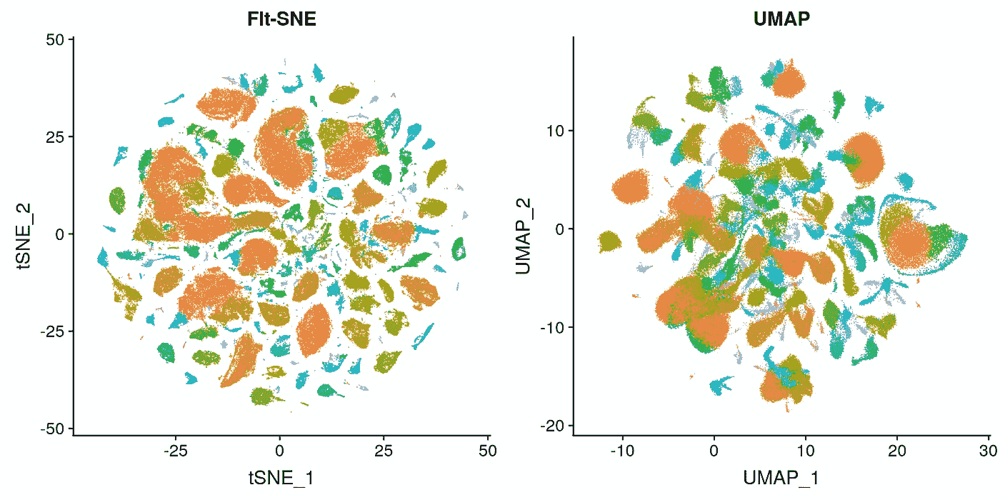

tSNE 和 UMAP 同样很好地可视化细胞群体(保留局部结构)，[图像来源](https://satijalab.org/seurat/v3.0/mca.html)

然而，如果您想进行下一步并了解数据点聚类之间的**相关性**，这可能会很麻烦，因为 tSNE 和 UMAP 作为邻居图算法**不能保证聚类间的距离被正确保留**。评估聚类之间的相关性实质上意味着在聚类之间建立**层次和边界**，以便查看聚类的起点和终点。因此，我们到达了**集群**问题。由于[维数灾难](https://en.wikipedia.org/wiki/Curse_of_dimensionality)和选择适当的距离度量，在原始数据上运行聚类不是一个好主意。取而代之的是**在降维上的聚类** **(使用 PCA、tSNE 或 UMAP)** 可以更健壮。降低聚类的维度正是你开始看到 tSNE 和 UMAP 之间差异的地方。

为了证明这一点，我使用来自[bjrklund 等人](https://www.ncbi.nlm.nih.gov/pubmed/26878113)的 scRNAseq 数据，并在 1)原始表达数据、2)显著的 30 个 PCA 主成分(PCs)、3) tSNE 2D 投影和 4) 30 个 UMAP 成分上比较 K 均值聚类。

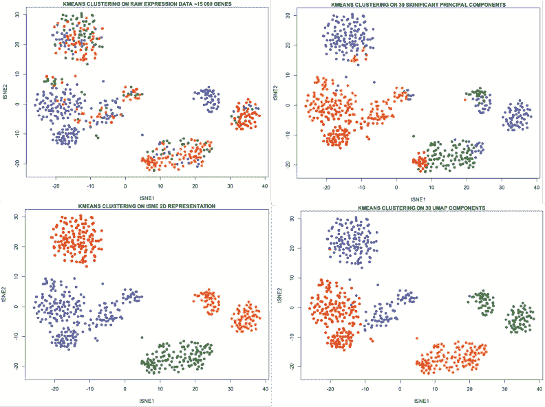

如我们所见，由于 scRNAseq 数据的维数灾难和非线性，当在原始表达数据(~15 000 个基因)上进行聚类时，K-means **与降维图像**不一致，并且 30 个 PC 显然也是 K-means 难以成功的高维空间。相反，仅在 2 个 tSNE 分量和 30 个 UMAP 分量上的聚类导致聚类和 tSNE 降维图像之间几乎完美的一致。tSNE 上的聚类应该与 tSNE 图一致，这并不奇怪，但是 2D tSNE 表示可能没有捕捉到数据中的大量变化，因此 tSNE 上的聚类被广泛认为是一个糟糕的想法。然而，由于算法的限制，增加 tSNE 组件的数量几乎是不可能的。相比之下，UMAP 提供 2 个以上的分量，例如，在我们的例子中是 30 个，与 30 个 PCA 分量相比，它可以捕获数据中更多的**变化**。总之，虽然使用 tSNE 的 2D 降维过于极端，但使用 PCA 的 30D 降维可能无法捕捉到数据中的足够多的变化，因此在数量为 **的 UMAP 组件**上的**聚类在极端降维的聚类(例如 2D tSNE)和使用 PCA 的非最优降维(过于线性或仍然过于高维)的聚类之间给出了一个很好的折衷。**

> 30 个 UMAP 分量比 30 个 PCA 分量在数据中保留更多的变化，因此更适于聚类

# 量化全局结构保存

在上一节中，我解释了 UMAP 组件上的集群如何比 tSNE 或 PCA 组件上的集群更有益。然而，如果我们决定在 UMAP 组件上进行聚类，我们需要确保 UMAP 正确地保留了聚类内(局部结构)和聚类之间(全局结构)的数据点之间的距离**，因此我们将花费一些时间来尝试理解如何通过 PCA、tSNE 和 UMAP 来观察和量化全局结构保留。通过使用真实世界的 scRNAseq 数据集的算法来量化全局结构保留可能不太容易，因为一般来说**基本事实**是未知的。这就是具有已知原始结构**的**合成数据** **非常方便的地方，这里我们将使用具有 5 个集群/大陆(不包括南极洲)的点的 2D 世界地图集合，有关如何从头构建数据集的详细信息，请参见我的 [github](https://github.com/NikolayOskolkov/tSNE_vs_UMAP_GlobalStructure) 上的完整笔记本。**

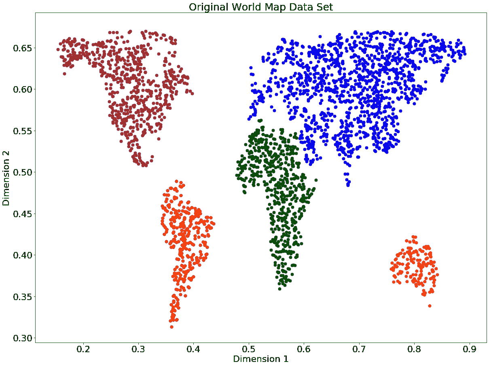

合成 2D 数据集(世界地图),包含 5 个集群/大洲

由于我们对大陆之间的距离以及它们的 T2 形状有一些感觉，这就是我们可以直观地称之为“全球结构”，我们可以通过运行 PCA、tSNE 和 UMAP 降维算法来尝试重建原始数据。由于原始数据集是线性/平面流形，我们可以预期线性降维比非线性降维做得更好。

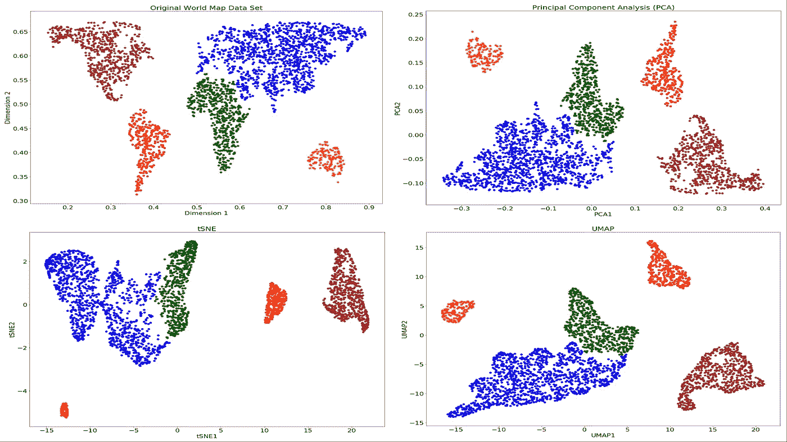

用 PCA、tSNE(困惑= 500)和 UMAP (n_neighbor = 500)重建世界地图

不出所料， **PCA 能够完美地重建原始数据集**，除了翻转极点，这很好，因为 PCA 对数据的仿射变换是不变的，如翻转、旋转、平移等。tSNE 和 UMAP 的表现比 PCA 差，但方式不同，尽管我对它们使用了相同的 PCA 初始化。我们可以立即观察到，tSNE 将南美洲置于非洲和北美洲之间，而当 UMAP 重建时，它或多或少地保持了原来的距离。为了量化所有点对之间的原始距离保持得有多好，我们可以计算原始和重建的成对欧几里德距离之间的 [**斯皮尔曼相关系数**](https://en.wikipedia.org/wiki/Spearman%27s_rank_correlation_coefficient) 。

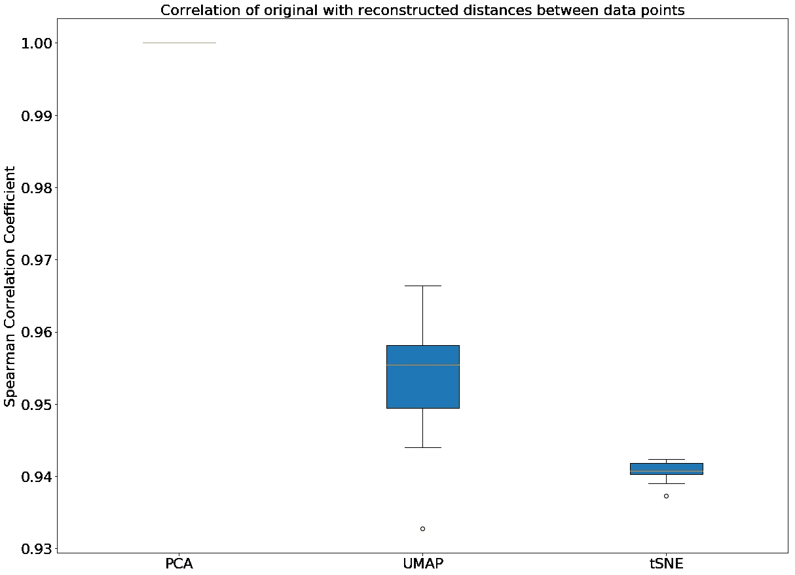

通过降维算法量化成对距离保持

执行 [Mann-Whitney U 检验](https://en.wikipedia.org/wiki/Mann%E2%80%93Whitney_U_test)，我们可以得出结论 **UMAP 比 tSNE** 更好地保持了成对欧几里德距离(p 值= 0.001)。箱线图中的置信区间是通过自举程序建立的，详见我的 [Github](https://github.com/NikolayOskolkov/tSNE_vs_UMAP_GlobalStructure) 上的代码。现在让我们计算原始的和重建的大陆间距离之间的 Spearman 相关性。测量聚类的质心之间的距离，即忽略数据中的变化，可能不是一个很好的主意，因为聚类被拉长了。因此，一个更好的想法是计算所有聚类对之间的**马氏距离**。 [Mahalanobis 距离](https://en.wikipedia.org/wiki/Mahalanobis_distance)首先计算一个聚类的每个点到第二个聚类的质心之间的距离，并通过第二个聚类中变化的“厚度”(假设该聚类具有椭球对称性)来归一化这些距离。

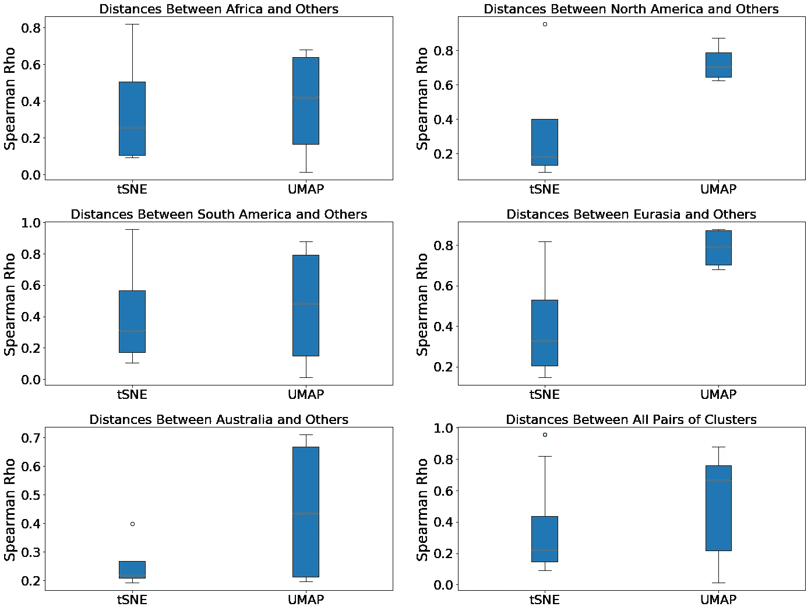

世界地图中各大洲/星团之间成对马氏距离的保持

在这里，我们观察到，虽然对于南美、澳洲和非洲不清楚，至少对于北美和欧亚大陆，UMAP 比 tSNE 更好地保留了这些集群和其他集群之间的原始 Mahalanobis 距离。对所有聚类进行平均(上图中的最后一个图)并执行 Mann-Whitney U 检验，我们证明了 **UMAP 确实更好地保留了大陆/聚类之间的原始马氏距离** (p 值= 0.034)。最后，让我们将聚类的**形状**的保持作为数据的全局结构的另一种度量。为此，我们将使用聚类周围边界框的大小。

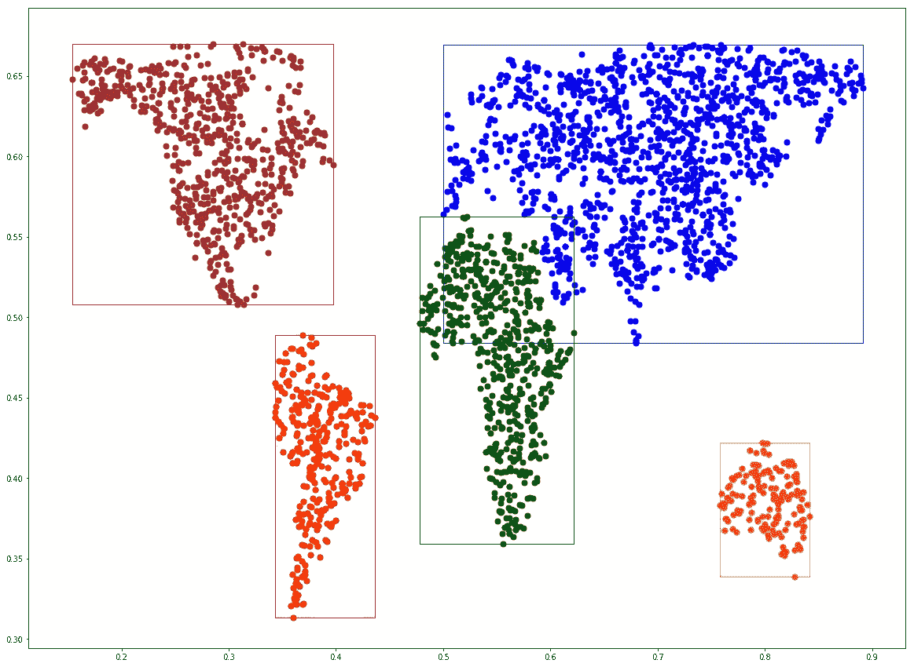

环绕世界地图各大洲的边界框作为聚类形状的度量

再次计算原始大陆和重建大陆周围的边界框大小(高度和宽度)之间的 Spearman 相关系数，我们可以观察到，尽管有很多变化**，UMAP 明显比 tSNE**(Mann-Whitney U 检验 p 值= 0.021)更好地保留了集群的形状，见下图。

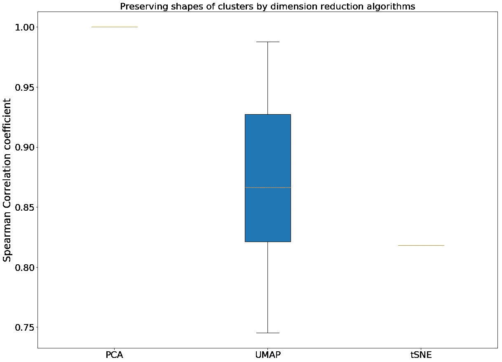

世界地图各大陆原始形状和重建形状之间的相关性

这里我特意省略了自举过程，以表明 tSNE 著名的**随机性仅仅来源于默认随机初始化**的 **。用 PCA 或图拉普拉斯算子初始化，tSNE 成为一个**确定性**方法。相比之下， **UMAP 由于通过[随机梯度下降(SGD)](https://en.wikipedia.org/wiki/Stochastic_gradient_descent) 对其代价函数(交叉熵)进行优化，即使用 PCA 或图拉普拉斯算子进行非随机初始化也能保持其随机性。绝对清楚的是，上面所有的 tSNE 与 UMAP 的定量比较都是用**相同的 PCA 初始化**对两种方法进行的，因此初始化不能成为解释它们在全局结构保留方面差异的因素。****

# 初始化与成本函数

为 tSNE 和 UMAP 指定相同的 PCA 初始化，我们避免了文献中关于仅由不同初始化场景驱动的 tSNE 与 UMAP 的比较的[混淆。记住，两种算法都利用梯度下降来计算最佳嵌入。根据定义，梯度下降规则从一些**随机或非随机(PCA)初始化**开始，并通过计算成本函数的梯度来优化**成本函数**。](https://www.biorxiv.org/content/10.1101/2019.12.19.877522v1)

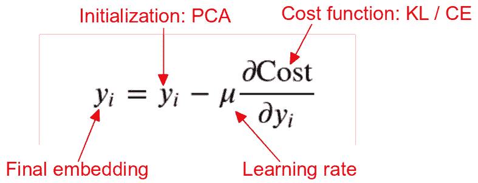

梯度下降规则:最终嵌入依赖于初始化和成本函数

假设 tSNE 和 UMAP 都已经用 PCA 进行了非随机初始化，我们观察和量化的输出中的所有差异都源于**内在的算法特性，例如成本函数**。我在这里[和](/how-exactly-umap-works-13e3040e1668)[展示了 UMAP 对成本函数的更明智选择促进了更好的全局结构保存。](/why-umap-is-superior-over-tsne-faa039c28e99)

# 非线性流形的 tSNE 与 UMAP

以前，我们在线性平面(世界地图)上使用合成的 2D 数据点集合。现在让我们将 2D 数据点嵌入到 **3D 非线性流形**中。例如，这可以是球体/地球仪，然而，事实证明，这种嵌入[不是无足轻重的，因为它导致数据的**严重** **失真**。因此，我们将把世界地图嵌入到经典的**瑞士卷**非线性流形中，它代表了 3D 空间中的一种阿基米德螺旋。我们将再次运行 PCA，tSNE 和 UMAP 降维，试图重建原始的世界地图。请注意，数据的固有维度仍然是 2D，因此良好的降维应该**展开瑞士卷**。](https://en.wikipedia.org/wiki/Mercator_projection)

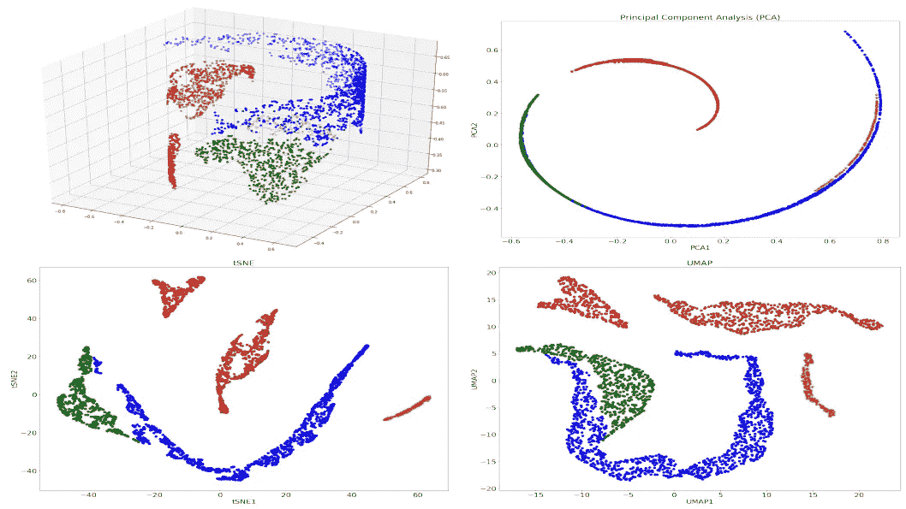

用 PCA、tSNE(困惑=50)和 UMAP (n_neighbor=50)重建投影在三维瑞士卷上的世界地图

我们首先看到的是 PCA 未能解开瑞士卷，即重建原始的 2D 世界地图。这是因为 PCA 作为线性算法为所有成对距离分配相等的权重，而相比之下，非线性流形学习器如 tSNE 和 UMAP 优先考虑邻居之间的距离，这种策略允许他们计算出数据的内在 2D 维度。

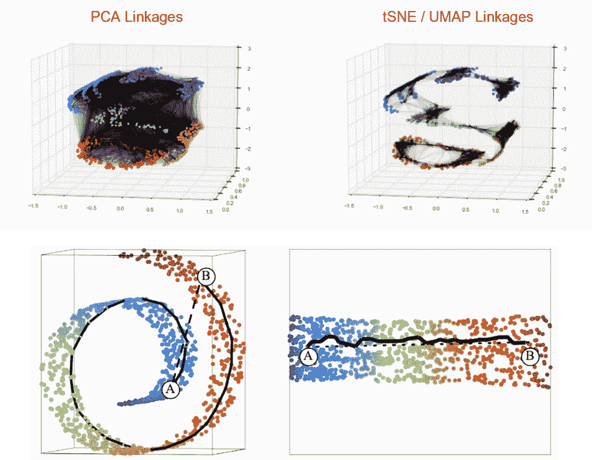

通过非线性流形上的 PCA、tSNE 和 UMAP 保持成对距离，[图像源](https://jakevdp.github.io/PythonDataScienceHandbook/05.10-manifold-learning.html)

此外，查看 tSNE 世界地图重建，我们可以立即注意到，如果一个人沿着从南美洲到非洲的路线，他会经过**欧亚大陆，因为某种原因 tSNE 将它放置在南美洲和非洲**之间。相比之下， **UMAP 正确地将非洲置于南美洲和欧亚大陆之间**。

有一个 [**假设**](https://stats.stackexchange.com/questions/263539/clustering-on-the-output-of-t-sne)tSNE 和 UMAP 能够在非常大的困惑/ n 邻居超参数值下重建原始数据。让我们用嵌入到 3D 中的世界地图来检验它是否正确。

tSNE 在瑞士卷上投影世界地图的大困惑极限

这里我们观察到一个有趣的效应。**在较大的困惑值下，tSNE 的数据重建质量没有提高而是下降**。困惑= 2000 的 tSNE 可视化没有提醒你什么吗？正确，这看起来像上面的 PCA 重建。增加学习率和迭代次数并不能解决问题，欢迎大家来查。但是发生了什么？显然，tSNE 在大的困惑值下存在收敛问题，[查看轴](/how-to-tune-hyperparameters-of-tsne-7c0596a18868)。仔细观察 tSNE 在大困惑值时的梯度，发现**非常接近 0** 。

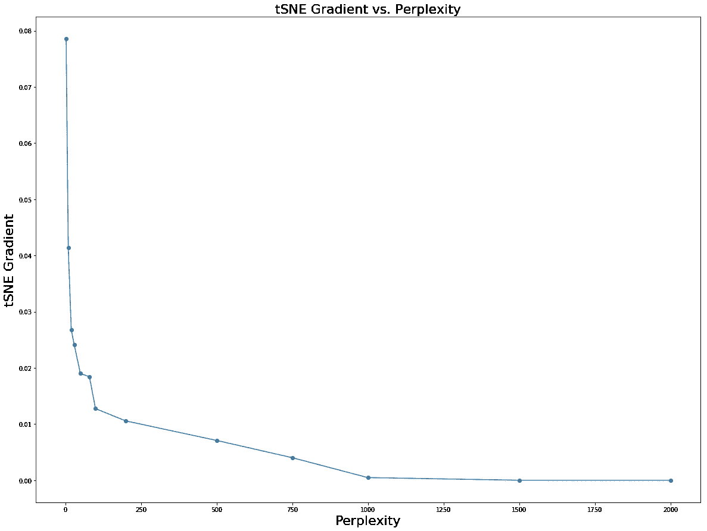

tSNE 梯度在大的困惑值处消失

根据上面的梯度下降规则，当成本函数的梯度接近零时， **tSNE 不更新初始 PCA 初始化**。因此它看起来像

> 如果您用 PCA 初始化 tSNE 并增加困惑值，您将面临最终只使用 PCA 的风险

在下一节中，我们将展示这个结论是如何从 tSNE 的梯度方程中得出的。到目前为止，让我们看看**UMAP 在 n_neighbor** 的表现，这是 UMAP 对 tSNE 困惑的模拟。

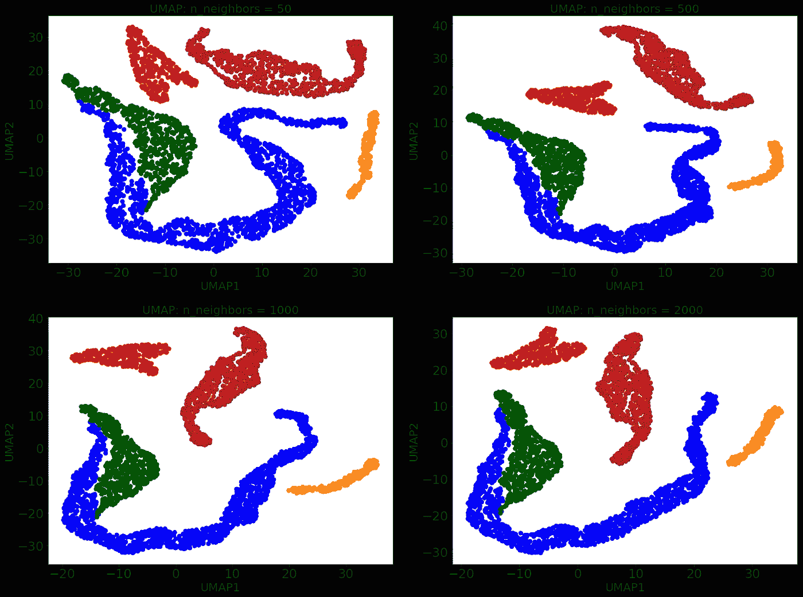

瑞士卷上世界地图投影的 UMAP 大近邻限制

这非常有趣， **UMAP 似乎对 n_neighbor** 超参数不太敏感。在下一节中，我们将再次理解这种行为背后的数学原理。

# 全局结构保存背后的数学

假设 tSNE 和 UMAP 都用 PCA 相同地初始化，UMAP 保留更多全局结构的一个原因是成本函数 的 [**更好选择。然而，在这里，我将试图从不同的角度来看 UMAP 的更好的全球结构保存，暂时忽略 tSNE 和 UMAP 之间的成本函数的差异。tSNE 和 UMAP 都定义了高维度的**概率，以观察某个距离**处的点，这些点属于以下指数族:**](/why-umap-is-superior-over-tsne-faa039c28e99)

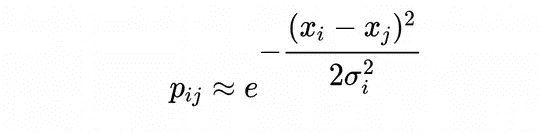

这里 *σ* 是一个参数，负责**细胞/样品能够在多大程度上相互“感觉”**。由于 *σ* 是一个**有限值，即不趋向于无穷大**，每个数据点只能“感觉”到其**最近邻居**的存在，而不能感觉到远点的存在，因此 tSNE 和 UMAP 都是**邻居图**算法，因此保留了数据的**局部结构**。然而，在极限 *σ* →∞中，每个点都有机会“记住”其他每个点，因此在这个极限**中，理论上 tSNE 和 UMAP 都可以保留全局结构**。然而，不是 *σ* 本身才是 tSNE 和 UMAP 的实际超参数，而是分别为**困惑度**和**最近邻数 n_neigbor** 。让我们检查什么样的困惑和 n_neighbors 值导致极限 *σ* →∞。为此，我们将采用真实世界的 scRNAseq 数据集，即[癌症相关成纤维细胞(CAFs)](https://www.nature.com/articles/s41467-018-07582-3) 基因表达，并计算均值 *σ* 如何依赖于困惑和 n_neighbor 超参数。

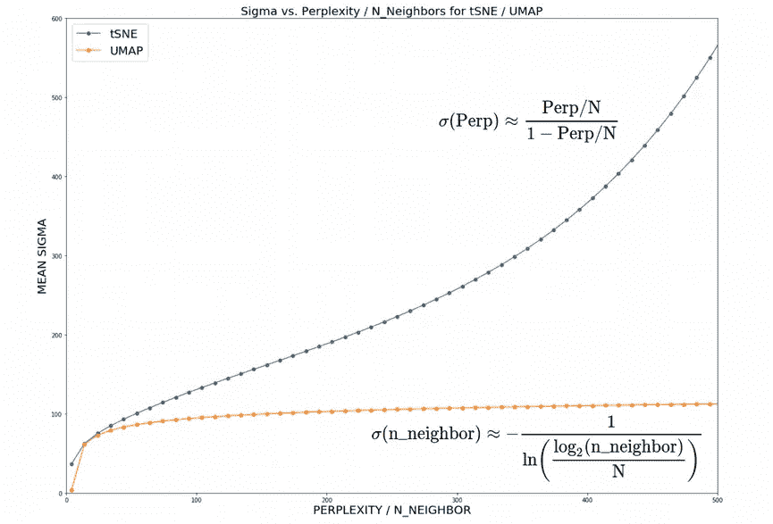

对于 tSNE / UMAP，作为困惑度/ n_neighbor 的函数的平均 sigma 的行为

事实证明，当增加 n_neighbor 超参数时， **UMAP 的均值 sigma 非常快地达到平稳状态**，而 tSNE 似乎对困惑更敏感，因为 **tSNE 的均值 sigma 在接近数据集大小的困惑处双曲线发散**。请查看我的 [github](https://github.com/NikolayOskolkov/tSNE_vs_UMAP_GlobalStructure) 上的笔记本了解计算的细节。请注意，UMAP 平均西格玛(平台水平)的绝对值可以由两个附加的 UMAP 超参数调节:**带宽和 local_connectivity** ，然而，相关性平均西格玛对 n_neighbor 将具有相同的缓慢对数增长。因此，我们证实了我们之前的经验观察，即 **tSNE 对困惑比 UMAP 对 n_neighbor** 更敏感。tSNE 的均值 sigma 在大范围内的近似双曲线散度对 tSNE 成本函数(KL-散度)的梯度有**的显著影响。在极限 *σ* →∞中，上述方程中的高维概率变为 1，这导致 KL-散度梯度的退化。**

这就是为什么对于大困惑，我们有一个 tSNE 嵌入，看起来类似于瑞士卷的 PCA 图像。因此，当在大的困惑极限中使用 tSNE 时需要小心，并且**监控 KL-散度**的梯度**，以便 tSNE 不会退化到类似 PCA / MDS** 的线性。最后，请注意，合成世界地图 2D 和 3D 数据集的相关性均值 sigma 与困惑度/ n_neighbor 看起来非常类似于上面为 CAFs scRNAseq 数据计算的值，可以在我的 [github](https://github.com/NikolayOskolkov/tSNE_vs_UMAP_GlobalStructure) 上的 Jupyter 笔记本中找到。

# 摘要

在这篇文章中，我们已经了解到当使用 tSNE 和 UMAP 超越数据可视化时，全局结构保持是非常重要的。使用线性和非线性流形，我们从不同的角度展示了 **UMAP 保存了更多的数据全局结构**。这与成本函数的**选择和相对于 n_neighbor** UMAP 超参数的 **均值 sigma 的** **非常慢的对数** **依赖性有关。相比之下，tSNE 在较大的困惑值下显示出平均 sigma 的近似**双曲线发散**，这可能会导致 tSNE 成本函数**的梯度**消失以及算法收敛的严重问题。**

在下面的评论中让我知道生命科学中的哪些分析技术对你来说似乎特别神秘，我会在以后的文章中尽量介绍它们。在我的 [Github](https://github.com/NikolayOskolkov/tSNE_vs_UMAP_GlobalStructure) 上查看帖子中的代码。在媒体[关注我，在 Twitter @NikolayOskolkov 关注我，在 Linkedin](https://medium.com/u/8570b484f56c?source=post_page-----4d8045acba17--------------------------------) 关注我。下一次，我将转向进化生物学，并展示如何利用古代 DNA 来估算种群数量，敬请关注。