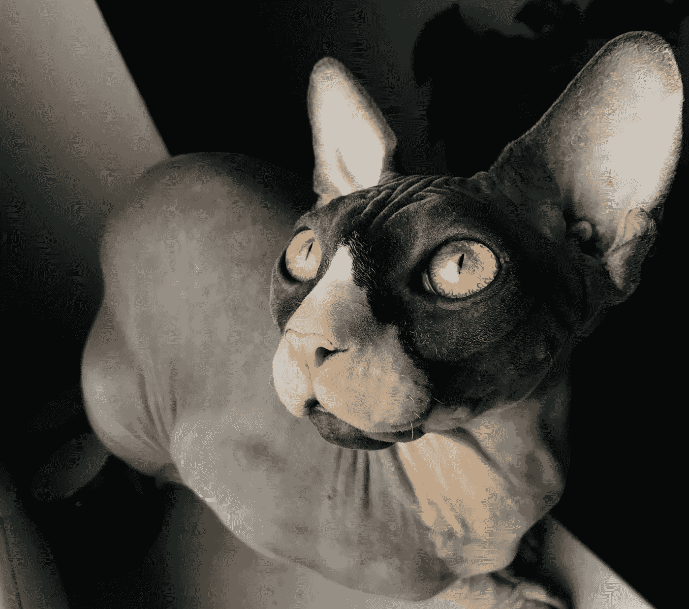
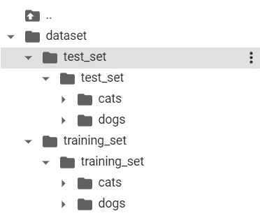
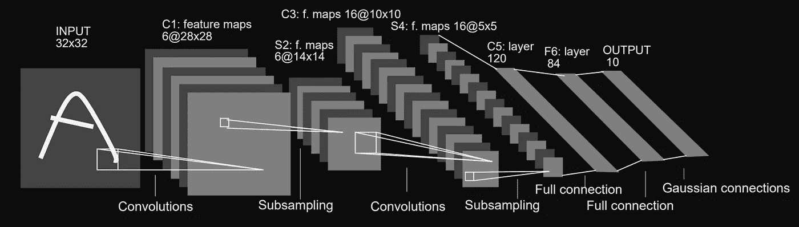
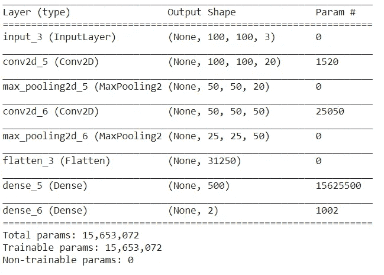
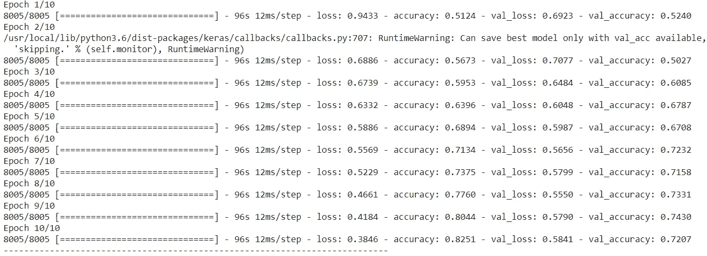
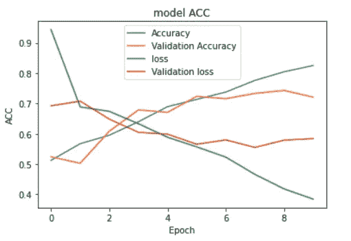
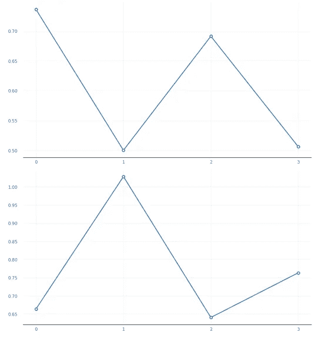

# 使用 Keras 和 Talos 在 Python 中调整深度学习网络的超参数

> 原文：<https://towardsdatascience.com/tune-the-hyperparameters-of-your-deep-learning-networks-in-python-using-keras-and-talos-2a2a38c5ac31?source=collection_archive---------21----------------------->

## 使用 Talos 在 CNN 中网格搜索超参数，例如狗-猫 CNN 分类器


马里奥·高在 Unsplash 上拍摄的照片

随着深度学习框架的发展，许多人设计人工神经网络的架构变得更加方便和容易。Tensorflow、Keras 和 Pytorch 这 3 个最流行的框架使用得更频繁。为了改善我们的神经网络的性能，有许多方法，例如，使用数据扩充来改善数据质量。然而，数据质量是数据科学的源泉。为了获得更好的数据质量，通常需要额外的费用、时间和人力资源。因此，我们更喜欢处理模型的超参数🏄🏼。

开始吧！

# 1.参数或超参数

模型参数是模型内部的配置变量。它依赖于模型的训练数据。模型的参数可以通过给定数据与模型拟合来估计。

模型超参数是模型外部的配置。超参数是为了帮助我们找到不依赖于训练数据的模型参数。

相反，我们通过适当设置一系列超参数来寻找模型的参数，优化了训练过程，充分利用了数据。这意味着我们可以手动给定超参数值，并且它们不能在训练期间更新。但是参数是模型的本能，在训练过程中不断更新。

一个不恰当的比喻，如果我们把一个学生看作一个模型，他的知识、性格、技能更像是模型的参数。我们训练他获得这些能力和特征的方式可以被视为超参数。

由于超参数是模型参数的关键，我们应该对它们给予足够的重视。如何选择模型的超参数？处理这个问题需要足够的知识和耐心。

# 2.调整超参数的策略

**通常有 5 种不同的优化技术:**

1.  **手动搜索**:我们根据自己的判断/经验选择一些模型超参数。然后，我们训练该模型，评估其准确性，并再次开始该过程。重复这一循环，直到达到令人满意的精确度。
2.  **网格搜索**:超参数网格，在训练算法的超参数空间的给定子集上，在每个可能的组合上训练/测试我们的模型。这是超参数优化的传统方法。
3.  **随机搜索**:通过随机选择覆盖所有组合的全部选择。因此，它可以通过选择这些超参数的一些随机组合来减少搜索迭代的次数。
4.  **贝叶斯优化:**是一种针对黑盒功能全局优化的顺序设计策略。它通过牢记过去的结果来选择输入值，从而减少了搜索迭代的次数。
5.  **进化算法**:用一些预定义的超参数创建 N 个机器学习模型的群体。它生成一些子代，这些子代具有与最佳模型相似的超参数，从而再次得到 N 个模型的群体。通过使用类似于生物进化的机制顺序地选择、组合和改变参数，只有最好的模型会在过程结束时存活下来。它模拟了自然选择的过程，这意味着那些能够适应环境变化的物种能够生存和繁殖，并延续到下一代。

# 3.我们自己的方法:网格搜索

在我们的工作中，我们经常使用网格搜索。网格搜索受到高维空间的影响，但通常可以很容易地并行化，因为算法使用的超参数值通常是相互独立的。此外，我们在 Colab 平台上编写代码，这允许我们在您的浏览器中编写和执行 Python:

*   不需要配置
*   免费访问 GPU
*   轻松分享

# 4.喀拉斯和塔罗斯

如果你想用最少的代码快速构建和测试一个神经网络，那么 Keras 就是你需要的。Keras 是一个用 Python 编写的开源神经网络库，是一个为人类而不是机器设计的 API。由于 Tensorflow 2 提供了 Keras 和直观的高级 API tf 的紧密集成。keras，有 2 种方式使用 Keras，要么直接导入 Keras，要么从 tf 导入 Keras。

Talos 于 2018 年 5 月 11 日发布，此后进行了七次升级。当在 scan-command 中使用 Talos 运行代码时，所有可能的组合都会在实验中进行测试。

> 重要提示: [Talos](https://pypi.org/project/talos/) 通过完全自动化超参数调整和模型评估，彻底改变了普通的 Keras 工作流程。Talos 完全公开了 Keras 功能，不需要学习新的语法或模板。

我们可以用一行命令行安装 talos:

`pip install talos`

# 5.CNN 的狗与猫分类器

为了使我们的结果可见和直观，我们用一个简单的例子来分类图像是包含一只狗还是一只猫，这是计算机视觉中的一个古老问题😆。我从 [Kaggle](https://www.kaggle.com/tongpython/cat-and-dog) 下载了图像数据集。从链接下载数据集后，它是 ZIP 文件格式。



由[汉娜·利斯塔克](https://unsplash.com/@hanialistek?utm_source=unsplash&utm_medium=referral&utm_content=creditCopyText)在 [Unsplash](https://unsplash.com/s/photos/cat-and-dog?utm_source=unsplash&utm_medium=referral&utm_content=creditCopyText) 上拍摄



Colab 中解压缩的数据集

```
from google.colab import drivedrive.mount('/content/gdrive/')!mkdir -p dataset!unzip /content/gdrive/My\ Drive/Colab\ Notebooks/blogs_medium/cat_dog.zip -d dataset/
```

我们可以用几行代码直接在 Google Colab 中解压文件。

这里我们使用 LeNet-5，这是一个 22 岁的神经网络，通常作为教学样本。



[LeNet-5 架构](http://vision.stanford.edu/cs598_spring07/papers/Lecun98.pdf)

现在我们开始用 Keras 构建 LeNet-5 的代码。要在 Keras 中获得可重复的结果，设置随机种子是必要的。

```
import osimport tensorflow as tfimport numpy as npimport random as python_randomnp.random.seed(42)python_random.seed(42)tf.random.set_random_seed(42)
```

然后我们可以专注于图像数据。我们需要用**keras . preparation . image**将它们读入训练和验证数组，稍后流入 CNN 进行训练和验证。所有图片必须有统一的大小，例如(100，100，3)。虽然数据集中的狗或猫的图像大小不同，有些大，有些小，但我们可以通过调整大小使它们大小相等。

```
import kerasimport globimport osfrom keras.preprocessing.image import ImageDataGenerator,load_img,img_to_array,  array_to_imgfrom keras.layers import Dense, Conv2D, MaxPool2D, Flatten,Dropoutfrom keras import optimizersfrom keras.models import Sequentialimport numpy as npimage_size=(100,100)train_cats = glob.glob('dataset/training_set/training_set/cats/*.jpg')train_dogs = glob.glob('dataset/training_set/training_set/dogs/*.jpg')train_files = [fn for fn in train_cats]+[fn for fn in train_dogs]print(len(train_files))train_imgs = [img_to_array(load_img(img, target_size=image_size)) for img in train_files]train_imgs = np.array(train_imgs)print(train_imgs.shape)train_labels= [0 for i in range(len(train_cats))]+[1 for i in range(len(train_dogs))]val_cats = glob.glob('dataset/test_set/test_set/cats/*.jpg')val_dogs = glob.glob('dataset/test_set/test_set/dogs/*.jpg')val_files = [fn for fn in val_cats]+[fn for fn in val_dogs]val_imgs = [img_to_array(load_img(img, target_size=image_size)) for img in val_files]val_imgs = np.array(val_imgs)print(val_imgs.shape)val_labels= [0 for i in range(len(val_cats))]+[1 for i in range(len(val_dogs))]
```

在上面的代码中，所有的“狗”和“猫”都在数组中，要么是训练集，要么是验证集。此外，我们用数字 1 标记狗，用数字 0 标记猫。

接下来，我们使用一次热编码对分类整数特征 0 和 1 进行编码。

```
num_classes = 2epochs = 10input_shape = (100,100,3)# encode text category labelsfrom sklearn.preprocessing import OneHotEncoder, LabelEncodertrain_labels_array = np.array(train_labels)le = LabelEncoder()train_integer_encoded = le.fit_transform(train_labels_array)ohe = OneHotEncoder(sparse=False)train_integer_encoded = train_integer_encoded.reshape(len(train_integer_encoded), 1)train_labels_ohe = ohe.fit_transform(train_integer_encoded)validation_labels_array = np.array(val_labels)validation_integer_encoded = le.fit_transform(validation_labels_array)ohe = OneHotEncoder(sparse=False)validation_integer_encoded = validation_integer_encoded.reshape(len(validation_integer_encoded), 1)validation_labels_ohe = ohe.fit_transform(validation_integer_encoded)
```

数据必须标准化，以便模型可以更快地收敛。

```
train_imgs_scaled = train_imgs.astype('float32')validation_imgs_scaled  = val_imgs.astype('float32')train_imgs_scaled /= 255validation_imgs_scaled /= 255
```

然后建立一个模型结构

```
from keras import layersfrom keras.layers import Conv2D, MaxPooling2D, Flatten, Dense, Dropoutfrom keras.models import Modelfrom keras import optimizersdef lenet_5(in_shape=(100,100,3), n_classes=2):in_layer = layers.Input(in_shape)conv1 = layers.Conv2D(filters=20, kernel_size=5,padding='same', activation='relu')(in_layer)pool1 = layers.MaxPool2D()(conv1)conv2 = layers.Conv2D(filters=50, kernel_size=5,padding='same', activation='relu')(pool1)pool2 = layers.MaxPool2D()(conv2)flatten = layers.Flatten()(pool2)dense1 = layers.Dense(500, activation='relu',kernel_initializer='glorot_uniform')(flatten)preds = layers.Dense(2, activation='softmax',kernel_initializer='glorot_uniform')(dense1)opt = keras.optimizers.Adam(lr=0.001, beta_1=0.9, beta_2=0.999, amsgrad=False)model = Model(in_layer, preds)model.compile(loss="categorical_crossentropy", optimizer=opt, metrics=["accuracy"])return modelif __name__ == '__main__':model = lenet_5()print(model.summary())
```



模型摘要

在这里，我们为 10 个时期训练模型，并将 batch_size 定义为 200。

```
from keras.callbacks import ModelCheckpointcheckpoint = ModelCheckpoint("lenet.h5",monitor='val_acc',verbose=1,save_best_only=True, save_weights_only= False, mode ='auto',period=1)history = model.fit(x=train_imgs_scaled, y=train_labels_ohe, validation_data=(validation_imgs_scaled, validation_labels_ohe), batch_size=200, epochs=10, callbacks=[checkpoint], shuffle=True)
```

经过长时间的等待，我们可以得到一个训练/验证图。



10 个时期后，val_acc 为 0.7207，val_loss 为 0.5841



模型 acc 和 loss

上图显示，经过 5 个时期后，模型改善不多。但它并没有过度适应。因此，我们仍然可以使用获得的模型。

我们想做更多的努力来为我们的狗-猫分类器训练一个更好的 LeNet-5 模型，所以我们专注于模型的超参数来改进模型🎑。

# 6.LetNet-5 中的 Talos，带代码

这里我们定义了一个新的函数，它具有与 LeNet-5 相同的结构，但是模型中的一些超参数是可变的。我们将这些可变超参数保存在字典“p”中。

```
p = {'first_hidden_layer': [500],'opt': [Adam, sgd],'dropout': [0,0.5],'weight_regulizer':[None],'lr': [1],'emb_output_dims': [None],'kernel_initializer':["glorot_uniform"]}
```

为了减少计算机计算和程序运行时间，在字典中我们只设置了' opt '和' dropout '变量，optimizer 有两个选项(Adam 或 SGD ), dropout 有两个可能的值。总共有 4 种组合。

```
from keras.optimizers import Adam,sgd
from keras.models import load_modelfrom keras.utils import CustomObjectScopefrom keras.initializers import glorot_uniformimport talosfrom talos.model.normalizers import lr_normalizerdef lenet_model(x_train, y_train,x_val, y_val, params):in_layer = layers.Input((100,100,3))conv1 = layers.Conv2D(filters=20, kernel_size=5,padding='same', activation='relu')(in_layer)pool1 = layers.MaxPool2D()(conv1)conv2 = layers.Conv2D(filters=50, kernel_size=5,padding='same', activation='relu')(pool1)pool2 = layers.MaxPool2D()(conv2)flatten = layers.Flatten()(pool2)dense1 = layers.Dense(params['first_hidden_layer'], activation='relu')(flatten)dropout1 = layers.Dropout(params['dropout'])(dense1)preds = layers.Dense(2, activation='softmax')(dropout1)model = Model(in_layer, preds)model.compile(loss="categorical_crossentropy", optimizer=params['opt'](lr=lr_normalizer(params['lr'],params['opt'])), metrics=["acc"])steps_per_epoch = int(np.ceil(train_imgs.shape[0] / 20)) - 1history = model.fit(x=train_imgs_scaled, y=train_labels_ohe, validation_data=(validation_imgs_scaled, validation_labels_ohe), batch_size=200, epochs=10, callbacks=[talos.utils.ExperimentLogCallback('kgt', params)], verbose=1)return history, modelt = talos.Scan(x=train_imgs_scaled, y=train_labels_ohe, model=lenet_model, experiment_name= 'kgt', params=p)
```

借助于扫描命令(talos。扫描)，我们开始配置实验。它将比训练最后一个基本 LeNet-5 模型持续更长的时间。


训练实验过程中的进度条

实验报告以 csv 格式保存。文件格式。我们可以阅读 csv。文件在表中显示结果。


表中的实验报告



上图:val_acc 图。下图:val_loss 图

通过绘制 validation_accuracy(上图)和 validation_loss(下图)，我们可以得出结论，第 0 次和第 3 次实验的训练模型比第 2 次和第 4 次实验的模型好得多。对比实验参数信息，我们发现 adam 模型具有更好的性能。辍学方法在培训 LeNet-5 中发挥了一点作用。

综合考虑，模型 0 的性能最好，它使用了 Adam，但没有辍学。

# 7.结论

在这个故事中，我们介绍了如何使用 talos 通过 Keras 构建的 CNN 来调整 a 的超参数。首先，有一些参数和超参数的基础知识，并回顾了优化超参数的常用方法。在故事的其余部分，我们构建了一个基于 LeNet-5 的猫狗分类器，并扫描了所有感兴趣的超参数组合。通过观察验证的度量，我们可以知道哪个超参数影响最大，哪个组合给出了最好的结果🏁。

**代码在我的 GitHub 里**😬

[https://github . com/Kopfgeldjaeger/Medium _ blogs _ code/tree/master/2 _ talos _ grid _ search](https://github.com/Kopfgeldjaeger/Medium_blogs_code/tree/master/2_talos_grid_search)

# 8.参考

Liashchynskyi，p .，& Liashchynskyi，P. (2019)。网格搜索、随机搜索、遗传算法:NAS 的一大对比。 *arXiv 预印本 arXiv:1912.06059*

范里恩，J. N .，&胡特，F. (2018，7 月)。跨数据集的超参数重要性。在*第 24 届 ACM SIGKDD 知识发现国际会议论文集&数据挖掘*(第 2367–2376 页)。

f .哈特、j .吕克和 l .施密特-蒂梅(2015 年)。超越超参数的手动调整。 *KI-Künstliche Intelligenz* ， *29* (4)，329–337。

[](https://autonomio.github.io/docs_talos) [## Talos 用户手册

### 欢迎来到塔罗斯！您可以使用 Talos 对 Keras 模型进行超参数优化。Talos 允许您使用 Keras…

autonomio.github.io](https://autonomio.github.io/docs_talos) [](https://keras.io/) [## keras:Python 深度学习 API

### Keras 是为人类设计的 API，不是为机器设计的。Keras 遵循减少认知负荷的最佳实践:it…

keras.io](https://keras.io/)