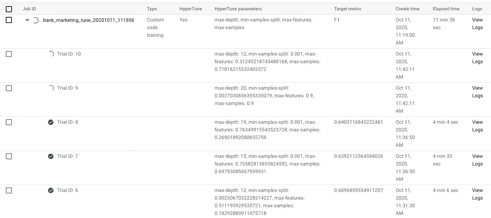
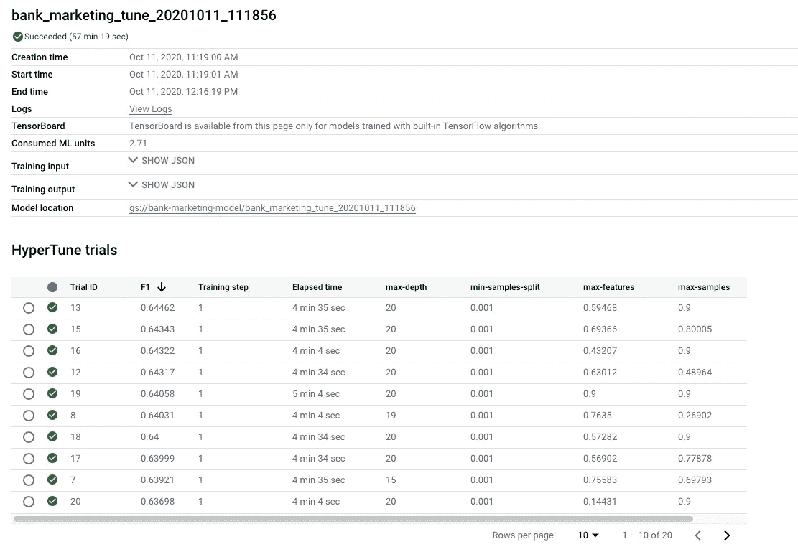

# 在 Google AI 平台上用贝叶斯优化调整模型

> 原文：<https://towardsdatascience.com/tuning-a-model-with-bayesian-optimization-on-google-ai-platform-d9fe63b78576?source=collection_archive---------33----------------------->


伊利亚·巴甫洛夫在 [Unsplash](https://unsplash.com?utm_source=medium&utm_medium=referral) 上的照片

## 谷歌 ML 教程

## 如何使用 Google 云服务为您的机器学习模型找到最佳超参数

在 [Google ML 教程](https://towardsdatascience.com/tagged/google-ml-tutorials)系列的这篇文章中，我们将讨论如何使用 [AI 平台](https://cloud.google.com/ai-platform)内置工具来调优你的机器学习模型的超参数！我们将使用一种叫做**贝叶斯优化**的方法来导航超参数空间，然后找到一个比缺省值更好的集合。

在上一篇[文章](/training-a-model-on-google-ai-platform-84ceff87b5f3)中，我们在一个[银行营销数据集](https://archive.ics.uci.edu/ml/datasets/Bank+Marketing)上训练了一个`RandomForestClassifier` 。我们使用了算法的默认超参数，取得了很好的效果。但是，如果我想调整这个模型，试图找到一个更好的超参数集呢？例如，我想调整:

*   `max_depth`:森林中每棵树的最大深度
*   `min_samples_split`:拆分树节点的最小样本数(或分数)
*   `max_features`:用于每棵树的
    训练的输入特征的数量(或分数)
*   `max_samples`:与`max_features`相同，但针对行

搜索最佳超参数的最常见方法是**网格搜索**和**随机搜索**方法。

*   在网格搜索中，该算法为给定超参数的每个单一组合训练一个模型，然后返回具有最佳性能的集合。这种方法非常耗时，尤其是当您希望一次调整 2–3 个以上的超参数时，因为要训练的模型数量呈指数级增长。
*   在随机搜索中，该算法改为随机挑选超参数的 *n* 个组合，并为每个组合训练一个模型。这里问题出在*随机*字上:算法可能会跳过最有效的超参数集，尤其是当我们设置一个低的 *n* 时。

在本教程中，我们将在 Google AI 平台的一点帮助下使用贝叶斯优化方法！但首先，什么是贝叶斯优化？

尽管在本文中，我们将更多地关注代码部分，而不是方法背后的理论，但我将尝试给出一个快速的概述。为了更全面和完整的介绍，我建议看看这些文章( [1](/a-conceptual-explanation-of-bayesian-model-based-hyperparameter-optimization-for-machine-learning-b8172278050f)
和 [2](https://cloud.google.com/blog/products/gcp/hyperparameter-tuning-cloud-machine-learning-engine-using-bayesian-optimization) )。

在某种程度上，贝叶斯优化从上述两种
方法中获益:它确实从所有可能的超参数组合中挑选了一个子样本，但是挑选是以一种更明智的方式进行的。该算法用代理函数模拟目标函数的分布(比如我们模型的平均精度);这个函数的定义域是给定的超参数空间。然后，它探索这种分布，尝试不同的超参数集。在每一次尝试中，它获得了更多关于目标函数实际分布的信息(以 Bayes 方式),因此它可以移动到更“有希望”的域空间子集。

出于这个特定的原因，请记住，我们不能完全并行化贝叶斯优化的过程(与网格和随机搜索相反)，因为每次迭代都会从上一次迭代中学习。

现在我们来训练一些模型！对于本教程，我们将遵循与
[培训教程](/training-a-model-on-google-ai-platform-84ceff87b5f3)相同的步骤:

*   将数据存储在谷歌存储器上
*   编写一个 Python 应用程序来训练模型
*   在人工智能平台上开展培训工作

最大的区别在于 Python 应用程序本身:我们需要添加一个框架来将模型的性能结果与贝叶斯优化联系起来。这个框架叫做 [Hypertune](https://github.com/GoogleCloudPlatform/cloudml-hypertune) :用`pip install cloudml-hypertune`简单安装即可。

# 更改 Python 应用程序

首先要做的是定义我们想要优化的超参数列表。
我们必须训练这样的管道

```
pipeline = Pipeline([
    ('data_prep',
     ColumnTransformer([
        ('num_prep', StandardScaler(), num_features),
        ('cat_prep', OneHotEncoder(handle_unknown='ignore'),
         cat_features)
     ])),
    # ML model
    ('model',
     RandomForestClassifier(
         random_state=42,
         n_estimators=500,
         class_weight='balanced'
     ))
])
```

为了将这些超参数传递给应用程序(和管道)，我们必须用`argparse`库定义一个参数列表，如下所示

```
import argparse…# Instantiate an argument parser
parser = argparse.ArgumentParser()# Define the list of input arguments
parser.add_argument('--max-depth', type=int, default=10,
                    help='Maximum depth of each tree in Random 
                          Forest model'
                         ' (integer, default 10)')
```

然后我们解析参数，并将它们输入管道

```
# Parse arguments
args = parser.parse_args()…pipeline = Pipeline([
    ('data_prep',
     ColumnTransformer([
        ('num_prep', StandardScaler(), num_features),
        ('cat_prep', OneHotEncoder(handle_unknown='ignore'),
         cat_features)
     ])),
    # ML model
    ('model',
     RandomForestClassifier(
         random_state=42,
         n_jobs=args.n_jobs,
         n_estimators=args.n_estimators,
         max_depth=args.max_depth,
         max_features=args.max_features,
         min_samples_split=args.min_samples_split,
         class_weight='balanced',
         max_samples=args.max_samples
     ))
])
```

之后，我们需要一个策略来评估每个给定超参数集的性能。我们使用**交叉验证**方法:
1。你把你的数据分成 *n* 份
2 份。选择一个分割作为*验证*3。连接剩余的 *n-1 个*分割，并在这个新的
数据集
4 上训练模型。计算保持分离
5 的性能。每次分割重复 2-4 次

如果你想稳健地评估一个模型，这种方法是合适的，因为你在 *n* 潜在不同的场景中训练和验证它。

我们可以使用 scikit-learn 中预置的`cross_validate` [函数](https://scikit-learn.org/stable/modules/generated/sklearn.model_selection.cross_validate.html#sklearn.model_selection.cross_validate)。

```
from sklearn.model_selection import cross_validate…scores = cross_validate(pipeline, train, y_train,
                        scoring=['accuracy', 'precision', 'recall',
                                 'f1'],
                        cv=5)
```

我们提供:

*   一个有效的分类器(我们可以使用像`GradientBoostingClassifier`这样的模型，或者像我们的例子中的
    整个管道)
*   输入数据和目标
*   要计算的一个或多个度量(如准确度和精确度)；[这里是](https://scikit-learn.org/stable/modules/model_evaluation.html#scoring-parameter)
    可用指标的完整列表
*   *n*(`cv`参数)的一个值

`scores`结果是一个字典，其中包含每个给定指标的条目。例如，`scores['test_accuracy']`将是一个在 5 次迭代中具有 5 个计算精度的向量。

最后，我们必须使用`hyperopt`框架。由于整个优化基于单个值，我们必须选择一个特定的指标( *F1-score* )并计算平均值。

```
# Instantiate a hypertune object
hpt = hypertune.HyperTune()# Compute the average metric
avg_f1 = scores[‘test_f1’].mean()# Pass the value to hyperopt
hpt.report_hyperparameter_tuning_metric(
    hyperparameter_metric_tag='F1',
    metric_value=avg_f1,
    global_step=1
)
```

这就是 Python 应用程序的全部内容！你可以在我的 [Github repo](https://github.com/MatteoFelici/medium/blob/master/ai-platform-tuning/src/tune.py) 上找到整个应用程序

但是嘿！我们已经定义了要优化的超参数，但没有定义应用程序必须尝试使用贝叶斯优化的值(或值的范围)。我们如何做到这一点？

# 指定超参数:配置文件

我们创建一个新的配置文件，其中包含要优化的超参数列表。对于其中的每一个，我们指定:

*   类型，如分类或整数
*   如果是绝对的，它可以作为值的类别
*   如果是数字，则为要应用的数字范围和缩放类型

例如，对于**最大深度**超参数，我们指定:

*   整数类型
*   介于 4 和 20 之间的值
*   线性缩放，因此可能值的空间线性缩放为(0，1)

对于**最小样本分割**，我们可以指定:

*   浮动(双)型
*   介于 0.001 和 0.1 之间的值
*   因为我们想更多地取最左边的值而不是最右边的值，所以我们使用了一个*对数*标度

所有这些定义都放在一个`config.yaml`文件中:

```
trainingInput:
  hyperparameters:
    goal: MAXIMIZE
    hyperparameterMetricTag: F1
    maxTrials: 20
    maxParallelTrials: 2
    params:
    - parameterName: max-depth
      type: INTEGER
      minValue: 4
      maxValue: 20
      scaleType: UNIT_LINEAR_SCALE
    - parameterName: min-samples-split
      type: DOUBLE
      minValue: 0.001
      maxValue: 0.1
      scaleType: UNIT_LOG_SCALE
    - parameterName: max-features
      type: DOUBLE
      minValue: 0.1
      maxValue: 0.9
      scaleType: UNIT_LINEAR_SCALE
    - parameterName: max-samples
      type: DOUBLE
      minValue: 0.1
      maxValue: 0.9
      scaleType: UNIT_LINEAR_SCALE
```

让我们看看这个文件。

*   在顶部，我们确定哪个是调优作业的`goal`。我们想用标签`F1`来`MAXIMIZE`一个度量。请记住，这个标签应该与 Python 应用程序中的`hpt.report_hyperparameter_tuning_metric`相同。
*   然后，我们定义调优工作必须进行的试验(轮次)。我们说
    “总共 20 次试验，每次平行 2 次”。在时间和性能之间有一个折衷:我们指定的并行作业越多，花费的时间就越少。
    但是请记住，贝叶斯过程从前面的步骤中学习:学习步骤是`total trials / number of parallel trials`(在我们的例子中，是 10)，所以如果我们“过多地”并行化，该过程将没有多少步骤要学习。
*   最后，我们逐一列出具有上述特征的超参数。再次提醒，记住`parameterName`必须与 Python 应用程序的`argparse`部分中定义的
    相同。[在这里](https://cloud.google.com/ai-platform/training/docs/reference/rest/v1/projects.jobs#ParameterSpec)您可以找到超参数定义的完整文档。

# 在 AI 平台上运行调优作业

我们将使用应用于[培训](/training-a-model-on-google-ai-platform-84ceff87b5f3)的相同命令，添加`config`文件的规范:

```
gcloud ai-platform jobs submit training "$JOB_NAME" \
    --module-name=src.tune \
    --package-path=./src \
    --job-dir=gs://bank-marketing-model/"$JOB_NAME" \
    --region=$REGION \
    --scale-tier=CUSTOM \
    --master-machine-type=n1-standard-8 \
    --python-version=3.7 \
    --runtime-version=2.2 \
    --config=./config.yaml \
    -- \
    --n-jobs=8
```

当你提交代码时，一个新条目将出现在你的[谷歌人工智能平台作业控制台](https://console.cloud.google.com/ai-platform/jobs)中:



作者图片

你可以弹出这个条目，查看 20 个试验中的每一个:一些将会完成，
其他的将会运行。对于每个试验，都有所选择的超参数列表和 F1 指标的最终值。

当所有的试验都完成后，如果我们点击“母亲”工作，我们会看到一个从最好到最差排序的试验结果的
摘要。



作者图片

在本例中，我们可以看到**最大深度**和**最小样本分割**超参数非常稳定，最佳性能值分别为 20 和 0.001。其他两个超参数尚未确定，但我们可以看到一个向区间的上半部分发展的趋势。

为了证明过程已经及时学习的事实，我们计算试验的次数和“到达”顺序之间的相关性。我们发现了一个
-0.71 的相关性！这意味着更高的试验编号(因此试验具有更多的
“学习”过程)具有更低的到达点。

当我们[在相同的数据上使用默认的超参数训练](/training-a-model-on-google-ai-platform-84ceff87b5f3)相同的模型时，我们在训练中达到了 52.44%的 F1，在测试中达到了 51.22%的 F1。现在交叉验证+贝叶斯优化，我们达到了 64.46%！接下来的步骤可能是:

*   运行另一个优化作业，修复最大深度和最小样本分割，并关注其他超参数
*   调整其他超参数，如`criterion`或`min_impurity_split`
*   使用找到的最佳超参数集运行训练作业，以
    部署模型

再次感谢您阅读这篇文章！我真的希望你能设法使用这个强大的工具来增强你的机器学习模型。请留下您的经验或反馈的评论！